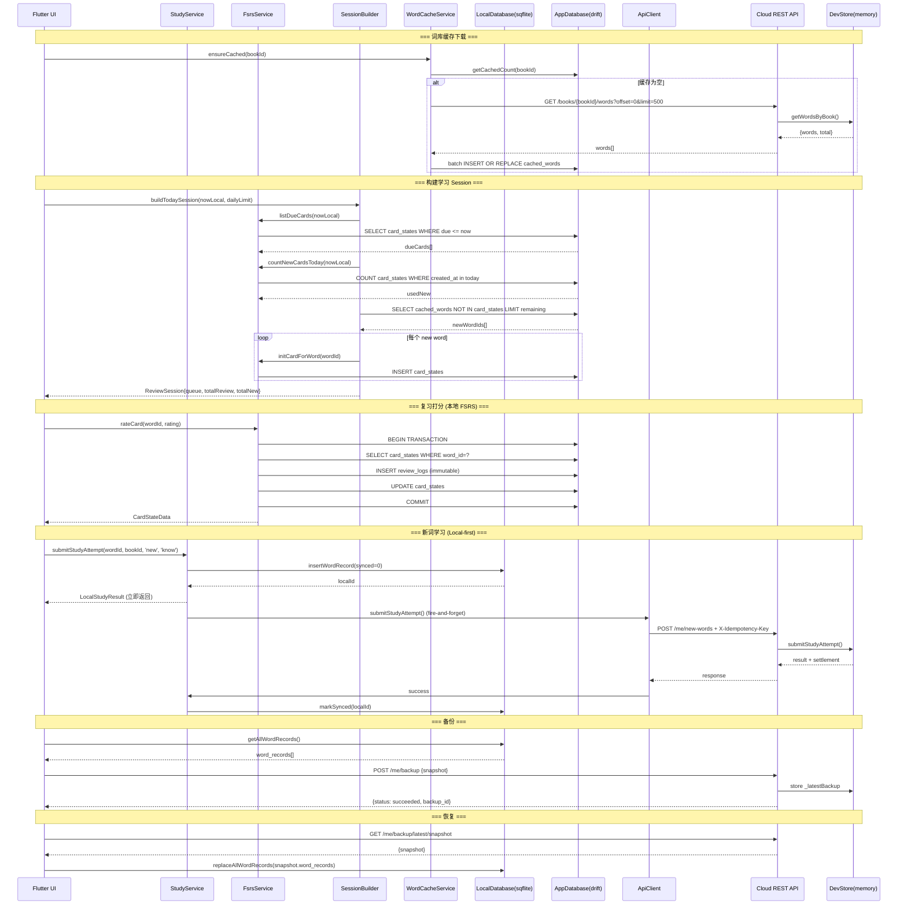
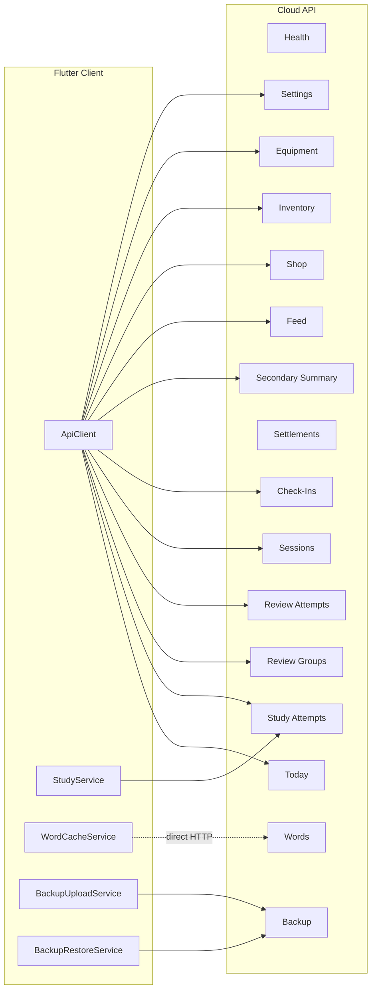

# API / 接口现状（代码反推）

> Phase 1 产出。完全从代码提取，未参考旧文档。
> 基准 commit: bface75

---

## API 形态综述

### 1. 本项目存在的接口类型

| 类型 | 数量 | 位置 | 运行时 |
|------|------|------|--------|
| 云端 REST API | 26 endpoints | `apps/api/src/controllers/` | NestJS (Node.js) |
| 本地端 Service 层 | 8 services | `apps/mobile/lib/core/services/` + `lib/core/memory/` + `lib/core/storage/` | Flutter (Dart) |
| 同步接口 | 3 flows | 跨端：Flutter client → Cloud REST | 混合 |

### 2. 调用方向

```
Flutter UI
  ├─→ ApiClient (HTTP) ──→ Cloud REST API (NestJS)
  ├─→ StudyService (本地 SQLite 优先, 后台同步 API)
  ├─→ FsrsService (纯本地 drift/SQLite)
  ├─→ SessionBuilder (纯本地 drift/SQLite)
  ├─→ WordCacheService (从 Cloud 下载 → 本地 drift/SQLite)
  ├─→ LocalSettingsService (SharedPreferences)
  ├─→ LocalProgressRepository (SharedPreferences)
  ├─→ BackupUploadService (本地导出 → Cloud upload)
  └─→ BackupRestoreService (Cloud download → 本地覆写)
```

### 3. 数据走云端/本地的划分

| 数据类型 | 权威源 | 说明 |
|----------|--------|------|
| 词库 (word pool) | 云端 dev-store | Flutter 通过 WordCacheService 缓存到本地 cached_words |
| 新词学习记录 | 本地优先 | SQLite 先写 → 后台异步同步到 API |
| 复习记录 (FSRS) | 纯本地 | card_states + review_logs 仅存于 drift/SQLite |
| 复习分组 (review_group) | 云端 | 云端生成和持有 review_group，Flutter 调 API |
| 今日状态聚合 | 云端 | GET /me/today 返回聚合数据 |
| 奖励/结算/商店/装备 | 云端 | 所有写操作由 API 处理 |
| 备份/恢复 | 混合 | 本地导出 snapshot → 上传云端容器 → 下载恢复 |
| 用户设置 | 双写 | 本地 SharedPreferences + 云端 PUT /me/settings/daily-goal |
| FSRS 调度参数 | 纯本地 | desired_retention 仅存 SharedPreferences |

### 4. 鉴权机制

**当前无鉴权。** Dev mode，单用户 `dev-user-001`。所有 API 均无 Authorization header。CORS 设为 `*`。

---

## 云端 API [云端]

### 全局设置

| 项目 | 值 |
|------|-----|
| Base URL | `/api/v1` (NestJS `setGlobalPrefix`) |
| 默认端口 | 3000 |
| CORS | enabled, origin=`*`, methods=GET/POST/PUT/PATCH/DELETE/OPTIONS |
| Allowed Headers | Content-Type, Authorization, X-Idempotency-Key |
| 中间件 | `loggingMiddleware`, `MaintenanceGuardMiddleware`, `PersistenceFailureFilter`, `errorFilter` |
| 幂等 | `X-Idempotency-Key` header on write endpoints |
| 鉴权 | 无 (dev mode, 硬编码 `dev-user-001`) |
| 降级模式 | MAINTENANCE_MODE / READ_ONLY_MODE / TEMPORARILY_UNAVAILABLE env vars → 503 |
| 持久化 | dev-store (内存) + 可选 pg backend (`PERSISTENCE_BACKEND` env) |

---

### 系统模块

#### 1. GET /api/v1/health [云端]

- **用途**: 健康检查，返回系统状态
- **请求参数**: 无
- **Controller**: `HealthController`
- **响应**:

| 字段 | 类型 | 说明 |
|------|------|------|
| status | string | `ok` / `maintenance` / `read_only` / `temporarily_unavailable` |
| persistence_backend | string | `pg` (default) |
| write_blocked | boolean | 写操作是否被阻止 |
| degraded_state.maintenance | boolean | |
| degraded_state.read_only | boolean | |
| degraded_state.temporarily_unavailable | boolean | |
| timestamp | string (ISO 8601) | |

- **涉及 DB 表**: 无
- **调用者**: 运维/监控

---

### 学习模块 (New Words)

#### 2. GET /api/v1/me/new-words/next [云端]

- **用途**: 获取下一个待学新词
- **请求参数**: 无
- **Controller**: `StudyAttemptsController`
- **响应**: Word object 或 `{ message: 'No more new words available' }`

| 字段 | 类型 | 说明 |
|------|------|------|
| word_id | string | |
| word_text | string | |
| meaning | string | |
| phonetic | string? | |
| book_id | string | |
| translation | string? | |
| definition | string? | |
| difficulty_level | int? | |
| is_core | boolean? | |
| tags | string? | |
| frequency_rank | int? | |
| word_forms | string? | |

- **涉及 DB 表**: dev-store 内存词库
- **调用者**: `ApiClient.getNextNewWord()` → `StudyService.getNextWord()`

---

#### 3. POST /api/v1/me/new-words [云端]

- **用途**: 提交新词学习结果
- **幂等**: X-Idempotency-Key
- **请求体**:

| 字段 | 类型 | 必填 | 说明 |
|------|------|------|------|
| word_id | string | Y | |
| book_id | string | Y | |
| study_type | `'new'` | Y | 固定值 |
| action_result | `'know'` \| `'forgot'` | Y | |

- **响应**:

| 字段 | 类型 | 说明 |
|------|------|------|
| submit_status | `'accepted'` | |
| today_new_completed | int | |
| daily_goal_status | string | |
| already_exists | boolean | 幂等重放标记 |
| settlement | object? | 当 action_result=know 时触发结算 |
| settlement.source_event_id | string | |
| settlement.reward_settlement_status | string | |
| settlement.reward_items | array | [{reward_type, amount, reward_status}] |

- **副作用**: 当 action_result=know → 创建 source_event(effective_new_word) → 创建 settlement → 更新 learning_day
- **涉及 DB 表**: study_attempts, idempotency_keys, reward_source_events, settlements, reward_ledger, check_in (learning_day)
- **调用者**: `ApiClient.submitStudyAttempt()` → `StudyService._syncToApiInBackground()`

---

### 复习模块 (Review)

#### 4. GET /api/v1/me/review-groups/next [云端]

- **用途**: 获取或创建当前活跃复习分组
- **请求参数**: 无
- **Controller**: `ReviewGroupsController`
- **响应**:

| 字段 | 类型 | 说明 |
|------|------|------|
| review_group_id | string | |
| group_status | string | |
| group_completed | boolean | |
| remaining_count | int | 未完成项数量 |
| items | array | |
| items[].word_id | string | |
| items[].word_text | string | |
| items[].meaning | string | |
| items[].completed | boolean | |

- **Frozen rules**: 后端生成并持有 review_group；每用户同时只有一个活跃 group；group 完成不等于今日复习完成；同一 group 可跨 session
- **涉及 DB 表**: review_groups, review_group_items (dev-store 内存)
- **调用者**: `ApiClient.getNextReviewGroup()`

---

#### 5. POST /api/v1/review-attempts [云端]

- **用途**: 提交复习答题结果
- **幂等**: X-Idempotency-Key
- **请求体**:

| 字段 | 类型 | 必填 | 说明 |
|------|------|------|------|
| review_group_id | string | Y | |
| word_id | string | Y | |
| action_result | `'correct'` \| `'incorrect'` | Y | |

- **响应**:

| 字段 | 类型 | 说明 |
|------|------|------|
| submit_status | `'accepted'` \| `'rejected'` | |
| group_completed | boolean | |
| group_remaining | int | |
| today_review_completed | int | |
| daily_goal_status | string | |
| already_exists | boolean | |
| settlement | object? | 当 group 完成时触发结算 |

- **副作用**: 当 group 完成 → 创建 source_event(review_group_completed) → 创建 settlement；当 correct → 更新 learning_day
- **涉及 DB 表**: review_attempts, review_groups, idempotency_keys, reward_source_events, settlements, check_in (learning_day)
- **调用者**: `ApiClient.submitReviewAttempt()`

---

### 今日聚合

#### 6. GET /api/v1/me/today [云端]

- **用途**: "今日页"主聚合接口，返回今日学习/复习/签到/连续/session 全部状态
- **请求参数**: 无
- **Controller**: `TodayController`
- **副作用**: 调用时会 `updateLearningDay(today)`
- **响应**:

| 字段 | 类型 | 说明 |
|------|------|------|
| current_book_name | string | |
| today_new_target | int | |
| today_new_completed | int | |
| today_review_target | int | |
| today_review_pending | int | |
| today_review_completed | int | |
| daily_goal_status | string | `not_started` / `in_progress` / `completed` |
| active_review_group_id | string? | |
| active_review_group_status | string? | |
| active_review_group_remaining | int | |
| sync_status | string | |
| last_reward_settlement | object? | |
| has_checked_in_today | boolean | |
| current_streak | int | |
| streak_basis_type | string | |
| learning_day_today | boolean | |
| session_started_today | boolean | |
| session_valid_today | boolean | |
| today_primary_action | object? | CTA decision-support (P3 Phase 1) |
| today_primary_action.action | string | `continue_review_group` / `go_review` / `go_new_words` / `go_session` |
| today_primary_action.reason | string | `active_review_group` / `review_due_priority` / `new_words_remaining` / `session_pending` |
| review_summary | object? | Review deeper summary (P3 Phase 2) |

- **涉及 DB 表**: today_state, check_ins, streaks, learning_days (dev-store 聚合)
- **调用者**: `ApiClient.getToday()`

---

### Session 模块

#### 7. POST /api/v1/sessions [云端]

- **用途**: 开始一个新 session
- **幂等**: X-Idempotency-Key (必填)
- **请求体**:

| 字段 | 类型 | 必填 | 说明 |
|------|------|------|------|
| session_minutes_target | int | N | 默认 15 分钟 |

- **响应**:

| 字段 | 类型 | 说明 |
|------|------|------|
| session_id | string | |
| session_status | string | |
| session_validation_status | string | |
| session_minutes_target | int | |
| started_at | string (ISO 8601) | |
| already_exists | boolean | |

- **Frozen rules**: session_status 和 session_validation_status 分离；started/ended != valid
- **涉及 DB 表**: sessions (dev-store)
- **调用者**: `ApiClient.startSession()`

---

#### 8. POST /api/v1/sessions/:sessionId/finish [云端]

- **用途**: 结束一个 session，进入 validation state chain
- **幂等**: X-Idempotency-Key (必填)
- **请求参数**: path param `sessionId`
- **响应**:

| 字段 | 类型 | 说明 |
|------|------|------|
| session_id | string | |
| session_status | string | |
| session_validation_status | string | |
| effective_learning_count | int | |
| effective_review_count | int | |
| session_minutes_target | int | |
| started_at | string | |
| ended_at | string | |
| already_exists | boolean | |

- **涉及 DB 表**: sessions (dev-store)
- **调用者**: `ApiClient.finishSession()`

---

#### 9. GET /api/v1/sessions/:sessionId [云端]

- **用途**: 查询 session 状态
- **请求参数**: path param `sessionId`
- **响应**:

| 字段 | 类型 | 说明 |
|------|------|------|
| session_id | string | |
| session_status | string | |
| session_validation_status | string | |
| session_minutes_target | int | |
| started_at | string | |
| ended_at | string? | |
| effective_learning_count | int | |
| effective_review_count | int | |

- **错误**: 404 `Session not found: {sessionId}`
- **涉及 DB 表**: sessions (dev-store)
- **调用者**: `ApiClient.getSession()`

---

### 签到 / 连续模块

#### 10. POST /api/v1/check-ins [云端]

- **用途**: 执行今日签到
- **幂等**: X-Idempotency-Key (必填)
- **请求体**: 无
- **响应**:

| 字段 | 类型 | 说明 |
|------|------|------|
| check_in.local_date | string | |
| check_in.check_in_status | string | |
| streak.current_streak | int | |
| streak.streak_basis_type | string | |
| learning_day.learning_day_today | boolean | |
| already_exists | boolean | |

- **涉及 DB 表**: check_ins, streaks, learning_days (dev-store)
- **调用者**: `ApiClient.checkIn()`

---

#### 11. GET /api/v1/check-ins/today [云端]

- **用途**: 查询今日签到状态
- **请求参数**: 无
- **响应**:

| 字段 | 类型 | 说明 |
|------|------|------|
| check_in | object? | null 表示今日未签到 |
| check_in.local_date | string | |
| check_in.check_in_status | string | |
| streak.current_streak | int | |
| streak.streak_basis_type | string | |
| learning_day.learning_day_today | boolean | |

- **涉及 DB 表**: check_ins, streaks, today_state (dev-store)
- **调用者**: Flutter 直接调用 (未在 ApiClient 中封装) ⚠️ TODO(待确认)

---

### 结算模块 (Settlements / Rewards)

#### 12. POST /api/v1/settlements/learning-rounds [云端]

- **用途**: 创建奖励结算（学习/复习 round 触发）
- **幂等**: X-Idempotency-Key (必填)
- **请求体**:

| 字段 | 类型 | 必填 | 说明 |
|------|------|------|------|
| source_event_type | `'effective_new_word'` \| `'review_group_completed'` | Y | |
| source_ref_id | string | Y | |

- **响应**:

| 字段 | 类型 | 说明 |
|------|------|------|
| settlement_id | string | |
| source_event_id | string | |
| source_event_type | string | |
| source_ref_id | string | |
| reward_settlement_status | string | |
| reward_items | array | [{reward_item_id, reward_type, amount, reward_status}] |
| already_exists | boolean | |

- **涉及 DB 表**: reward_source_events, settlements, reward_ledger (dev-store)
- **调用者**: 一般由 study-attempts / review-attempts 内部自动触发；也可独立调用

---

#### 13. GET /api/v1/settlements/:sourceEventId [云端]

- **用途**: 查询指定 source event 的结算详情
- **请求参数**: path param `sourceEventId`
- **响应**:

| 字段 | 类型 | 说明 |
|------|------|------|
| settlement_id | string | |
| source_event_id | string | |
| source_event_type | string | |
| source_ref_id | string | |
| reward_settlement_status | string | |
| reward_items | array | [{reward_item_id, reward_type, amount, reward_status}] |
| created_at | string | |
| updated_at | string | |

- **错误**: 404 `Settlement not found for source event: {sourceEventId}`
- **涉及 DB 表**: reward_source_events, settlements (dev-store)
- **调用者**: ⚠️ TODO(待确认) — 未在 ApiClient 中发现对应方法

---

### 二级激励模块 (Secondary Motivation)

#### 14. GET /api/v1/me/secondary-summary [云端]

- **用途**: 获取二级激励聚合（coins/fish_treats/exp/cat/companion/equipped/stats 等）
- **请求参数**: 无
- **Controller**: `SecondarySummaryController`
- **响应**:

| 字段 | 类型 | 说明 |
|------|------|------|
| coins | int | |
| fish_treats | int | |
| exp | int | |
| cat_summary | object | {nickname, mood, level, exp_to_next_level, mood_display_text} |
| companion_response | object? | P2 Phase 2C |
| equipped_preview | map<string, string?> | slot → item_id |
| change_highlights | array | [{highlight_type, description, ...}] |
| stats_summary | object? | |

- **涉及 DB 表**: balance_snapshot, cat_summary, equipped_snapshot, stats (dev-store 聚合)
- **调用者**: `ApiClient.getSecondarySummary()`

---

### 喂食模块 (Feed)

#### 15. POST /api/v1/me/feed [云端]

- **用途**: 喂猫。消耗 1 fish_treat。
- **幂等**: X-Idempotency-Key (必填)
- **请求体**:

| 字段 | 类型 | 必填 | 说明 |
|------|------|------|------|
| feed_item_type | `'fish_treat'` | Y | 当前仅支持此值 |

- **响应 (成功)**:

| 字段 | 类型 | 说明 |
|------|------|------|
| feed_result.status | `'succeeded'` | |
| feed_result.consumed_item | string | |
| feed_result.consumed_amount | int | |
| feed_result.mood_delta | int | +4 (当前规则) |
| feed_result.exp_delta | int | +2 (当前规则) |
| feed_result.already_exists | boolean | |
| growth_feedback.leveled_up | boolean | |
| growth_feedback.previous_level | int | |
| growth_feedback.current_level | int | |
| secondary_summary | object | 完整 secondary summary |

- **响应 (余额不足)**:

| 字段 | 类型 | 说明 |
|------|------|------|
| feed_result.status | `'insufficient_resource'` | |
| feed_result.error_code | `'FISH_TREATS_NOT_ENOUGH'` | |
| growth_feedback | null | |
| secondary_summary | object | |

- **Frozen rules**: fish_treats 扣减为后端 truth；幂等 key 防重复扣减；不可扣到负数；前端不可本地预扣
- **涉及 DB 表**: feed_records, balance_snapshot, cat_summary (dev-store)
- **调用者**: `ApiClient.feedCat()`

---

### 商店模块 (Shop)

#### 16. GET /api/v1/shop/catalog [云端]

- **用途**: 获取商店商品目录
- **请求参数**: 无
- **Controller**: `ShopController`
- **响应**:

| 字段 | 类型 | 说明 |
|------|------|------|
| items | array | CatalogItem[] |

- **涉及 DB 表**: catalog (dev-store)
- **调用者**: `ApiClient.getShopCatalog()`

---

#### 17. POST /api/v1/shop/purchases [云端]

- **用途**: 购买商品
- **幂等**: X-Idempotency-Key (必填)
- **请求体**:

| 字段 | 类型 | 必填 | 说明 |
|------|------|------|------|
| item_id | string | Y | |

- **响应 (成功)**:

| 字段 | 类型 | 说明 |
|------|------|------|
| purchase_result.status | `'succeeded'` | |
| purchase_result.item_id | string | |
| purchase_result.coins_spent | int | |
| purchase_result.already_exists | boolean | |
| inventory | object | 更新后的完整 inventory |

- **响应 (失败)**:

| 字段 | 类型 | 说明 |
|------|------|------|
| purchase_result.status | `'failed'` | |
| purchase_result.error_code | string | |
| inventory | object | |

- **涉及 DB 表**: owned_items, balance_snapshot, idempotency_keys (dev-store)
- **调用者**: `ApiClient.purchaseItem()`

---

### 背包模块 (Inventory)

#### 18. GET /api/v1/me/inventory [云端]

- **用途**: 获取用户拥有物品和当前 coins 余额
- **请求参数**: 无
- **Controller**: `InventoryController`
- **响应**: InventoryState object (coins, fish_treats, owned_items 等)
- **涉及 DB 表**: inventory_state (dev-store)
- **调用者**: `ApiClient.getInventory()`

---

### 装备模块 (Equipment)

#### 19. GET /api/v1/me/equipment [云端]

- **用途**: 获取当前装备快照
- **请求参数**: 无
- **Controller**: `EquipmentController`
- **响应**:

| 字段 | 类型 | 说明 |
|------|------|------|
| equipped_snapshot | object | slot → item 映射 |

- **Frozen rules**: 装备状态为后端 truth；只有拥有的物品可装备；每 slot 一件
- **涉及 DB 表**: equipped_snapshot (dev-store)
- **调用者**: `ApiClient.getEquipment()`

---

#### 20. POST /api/v1/me/equipment/equip [云端]

- **用途**: 装备一件已拥有的物品（替换同 slot 已有装备）
- **幂等**: X-Idempotency-Key (必填)
- **请求体**:

| 字段 | 类型 | 必填 | 说明 |
|------|------|------|------|
| item_id | string | Y | |

- **响应 (成功)**:

| 字段 | 类型 | 说明 |
|------|------|------|
| equip_result.status | `'succeeded'` | |
| equip_result.item_id | string | |
| equip_result.slot | string | |
| equip_result.item_type | string | |
| equip_result.already_exists | boolean | |
| equipped_snapshot | object | |

- **响应 (失败)**:

| 字段 | 类型 | 说明 |
|------|------|------|
| equip_result.status | `'failed'` | |
| equip_result.error_code | string | |
| equipped_snapshot | object | |

- **涉及 DB 表**: equipped_snapshot, owned_items (dev-store)
- **调用者**: `ApiClient.equipItem()`

---

#### 21. POST /api/v1/me/equipment/unequip [云端]

- **用途**: 卸下装备
- **幂等**: X-Idempotency-Key (必填)
- **请求体**:

| 字段 | 类型 | 必填 | 说明 |
|------|------|------|------|
| item_id | string | Y | |

- **响应 (成功)**:

| 字段 | 类型 | 说明 |
|------|------|------|
| unequip_result.status | `'succeeded'` | |
| unequip_result.item_id | string | |
| unequip_result.already_exists | boolean | |
| equipped_snapshot | object | |

- **响应 (失败)**:

| 字段 | 类型 | 说明 |
|------|------|------|
| unequip_result.status | `'failed'` | |
| unequip_result.error_code | string | |
| equipped_snapshot | object | |

- **涉及 DB 表**: equipped_snapshot (dev-store)
- **调用者**: Flutter 直接调用 (未在 ApiClient 中发现 unequip 方法) ⚠️ TODO(待确认)

---

### 设置模块

#### 22. PUT /api/v1/me/settings/daily-goal [云端]

- **用途**: 更新每日新词目标
- **请求体**:

| 字段 | 类型 | 必填 | 说明 |
|------|------|------|------|
| daily_new_target | int | Y | 服务端 clamp 到 [1, 100] |

- **响应**:

| 字段 | 类型 | 说明 |
|------|------|------|
| daily_new_target | int | 实际设置的值 |
| updated | boolean | |

- **涉及 DB 表**: today_state (dev-store)
- **调用者**: `ApiClient.updateDailyGoal()`

---

### 备份/恢复模块 (Backup)

#### 23. POST /api/v1/me/backup [云端]

- **用途**: 上传 snapshot 到云端备份容器
- **请求体**:

| 字段 | 类型 | 必填 | 说明 |
|------|------|------|------|
| snapshot | object | Y | 完整 snapshot JSON |
| schema_version | string | N | |

- **响应 (成功)**:

| 字段 | 类型 | 说明 |
|------|------|------|
| status | `'succeeded'` | |
| backup_id | string | `backup-{timestamp}` |
| uploaded_at | string (ISO 8601) | |
| schema_version | string | |

- **响应 (失败)**:

| 字段 | 类型 | 说明 |
|------|------|------|
| status | `'failed'` | |
| error_code | `'INVALID_PAYLOAD'` | |
| message | string | |

- **语义边界**: upload success != sync success；这是备份容器，不是同步系统
- **涉及 DB 表**: dev-store 内存 `_latestBackup`, `_backupSnapshot`
- **调用者**: `BackupUploadService.upload()`

---

#### 24. GET /api/v1/me/backup/latest [云端]

- **用途**: 获取最近一次备份的元数据
- **请求参数**: 无
- **响应**:

| 字段 | 类型 | 说明 |
|------|------|------|
| status | `'succeeded'` \| `'no_backup_yet'` | |
| backup_id | string? | |
| uploaded_at | string? | |
| schema_version | string? | |
| snapshot_size | int? | 仅 succeeded 时存在 |

- **涉及 DB 表**: dev-store 内存 `_latestBackup`
- **调用者**: ⚠️ TODO(待确认) — 未在 Flutter 侧发现直接调用

---

#### 25. GET /api/v1/me/backup/latest/snapshot [云端]

- **用途**: 获取最近一次备份的完整 snapshot（用于 restore）
- **请求参数**: 无
- **响应 (有备份)**:

| 字段 | 类型 | 说明 |
|------|------|------|
| status | `'available'` | |
| schema_version | string | |
| uploaded_at | string | |
| snapshot | object | 完整 snapshot JSON |

- **响应 (无备份)**:

| 字段 | 类型 | 说明 |
|------|------|------|
| status | `'no_backup_found'` | |
| snapshot | null | |

- **涉及 DB 表**: dev-store 内存 `_backupSnapshot`
- **调用者**: `BackupRestoreService.preCheck()`, `BackupRestoreService.restore()`

---

### 词库模块

#### 26. GET /api/v1/books/:bookId/words [云端]

- **用途**: 批量获取词库单词列表（用于 Flutter 端缓存下载）
- **Controller**: `WordsController`
- **请求参数**:

| 参数 | 位置 | 类型 | 必填 | 说明 |
|------|------|------|------|------|
| bookId | path | string | Y | |
| offset | query | int | N | 默认 0 |
| limit | query | int | N | 默认 500, 最大 1000 |

- **响应**:

| 字段 | 类型 | 说明 |
|------|------|------|
| book_id | string | |
| offset | int | |
| limit | int | |
| total | int | 该书总词数 |
| words | array | Word[] |

- **涉及 DB 表**: dev-store 内存词库 (CET-4 数据)
- **调用者**: `WordCacheService.downloadAndCacheBook()` (直接 HTTP，不经 ApiClient)

---

## 本地端接口 [本地端]

### StudyService [本地端]

- **文件**: `apps/mobile/lib/core/services/study_service.dart`
- **依赖**: `ApiClient`, `LocalDatabase`
- **模式**: Local-first — SQLite 先写，后台异步 API 同步

| 方法 | 签名 | 行为 | 读写 |
|------|------|------|------|
| `getNextWord()` | `Future<Word?>` | 调 API `getNextNewWord()`；从本地获取 mastered IDs 做过滤；API 失败返回 null | 读: API + SQLite `word_records` |
| `submitStudyAttempt()` | `Future<LocalStudyResult>` | 1) SQLite `insertWordRecord` 2) 立即返回 `LocalStudyResult` 3) 后台 fire-and-forget 调 API | 写: SQLite `word_records`; 后台写: API |
| `syncPendingAttempts()` | `Future<int>` | 批量同步所有 `synced=0` 的记录到 API；首次失败即停止 | 读: SQLite `word_records(synced=0)`; 写: API + SQLite(markSynced) |
| `dispose()` | `void` | 关闭 HTTP client | - |

- **返回类型**: `LocalStudyResult { success, wordId, actionResult, localId }`

---

### FsrsService [本地端]

- **文件**: `apps/mobile/lib/core/memory/fsrs_service.dart`
- **依赖**: `AppDatabase` (drift), `fsrs` pub.dev 库
- **模式**: 纯本地。FSRS library types 不外泄，UI 仅见 `ReviewRating`/`CardStateData`
- **默认参数**: `desiredRetention=0.9`, `learningSteps=[1min, 10min]`, `relearningSteps=[10min]`

| 方法 | 签名 | 行为 | 读写 |
|------|------|------|------|
| `initCardForWord()` | `Future<CardStateData> initCardForWord(String wordId, {DateTime? nowUtc})` | 幂等创建 FSRS card（state=Learning, due=now）；已存在则返回现有 | 读/写: drift `card_states` |
| `rateCard()` | `Future<CardStateData> rateCard(String wordId, ReviewRating rating, {DateTime? nowUtc})` | 原子事务: 读 card → snapshot → FSRS compute → INSERT review_log → UPDATE card_states | 读/写: drift `card_states`, `review_logs` (INSERT-ONLY) |
| `listDueCards()` | `Future<List<CardStateData>> listDueCards({required DateTime nowLocal, int? limit})` | 查询 due <= now 的所有 card，按 due ASC 排序 | 读: drift `card_states` |
| `countNewCardsToday()` | `Future<int> countNewCardsToday({required DateTime nowLocal})` | 统计今日 created_at 在 [todayStart, todayEnd) 的 card 数量 | 读: drift `card_states` |
| `previewSchedule()` | `Future<Map<ReviewRating, Duration>> previewSchedule(String wordId, {DateTime? nowUtc})` | 对 4 个 rating 分别模拟计算下次复习间隔（不持久化） | 读: drift `card_states` |
| `exportReviewLogsAsJsonl()` | `Future<String>` | 导出 review_logs 为 JSONL 格式（给 fsrs-optimizer 用） | 读: drift `review_logs` |
| `updateDesiredRetention()` | `void updateDesiredRetention(double value)` | 运行时重建 Scheduler | 无 DB 操作 |

- **外部 DTO**: `CardStateData { id, wordId, stability, difficulty, dueUtc, lastReviewUtc, state(1/2/3), step, reps, lapses, createdAtUtc }`
- **review_logs 表规则**: INSERT-ONLY，永不 update/delete

---

### SessionBuilder [本地端]

- **文件**: `apps/mobile/lib/core/memory/session_builder.dart`
- **依赖**: `FsrsService`, `AppDatabase`
- **模式**: 纯本地。从本地 drift 表构建 study session

| 方法 | 签名 | 行为 | 读写 |
|------|------|------|------|
| `buildTodaySession()` | `Future<ReviewSession> buildTodaySession({required DateTime nowLocal, required int newCardsDailyLimit, int? reviewCardsDailyLimit})` | 1) 收集到期 review cards 2) 计算今日剩余 new card 配额 3) 从 cached_words 找 new word 候选 4) initCardForWord 5) 交叉排列 3:1 | 读: drift `card_states`, `cached_words`; 写: drift `card_states` (init) |

- **返回类型**: `ReviewSession { queue: List<SessionItem>, totalReview, totalNew, dailyNewLimit, newCardsRemainingToday }`
- **SessionItem**: `{ wordId, isNew }`
- **Pinned contract**: newCardsDailyLimit 仅控制 NEW words；review cards 不受此限；initCardForWord 使 word 永久变为 non-new；同日幂等

---

### WordCacheService [本地端]

- **文件**: `apps/mobile/lib/core/memory/word_cache_service.dart`
- **依赖**: `AppDatabase`, HTTP (直接，不走 ApiClient)
- **模式**: 从云端下载词库 → 缓存到本地 drift/SQLite

| 方法 | 签名 | 行为 | 读写 |
|------|------|------|------|
| `getCachedCount()` | `Future<int> getCachedCount(String bookId)` | 查询指定 book 的本地缓存词数 | 读: drift `cached_words` |
| `downloadAndCacheBook()` | `Future<int> downloadAndCacheBook(String bookId)` | 分页下载 (pageSize=500) GET `/api/v1/books/{bookId}/words` → INSERT OR REPLACE 到 `cached_words` | 读: Cloud API; 写: drift `cached_words` |
| `ensureCached()` | `Future<int> ensureCached(String bookId)` | 如果已有缓存则跳过，否则调 `downloadAndCacheBook` | 条件读写 |

- **默认 baseUrl**: `http://10.0.2.2:3000/api/v1` (Android 模拟器)

---

### LocalSettingsService [本地端]

- **文件**: `apps/mobile/lib/core/storage/local_settings_service.dart`
- **依赖**: `SharedPreferences`
- **模式**: 纯本地 key-value 设置

| 属性/方法 | 签名 | 默认值 | 说明 |
|-----------|------|--------|------|
| `dailyGoal` | `int get` / `Future<bool> setDailyGoal(int)` | 20 | |
| `soundEnabled` | `bool get` / `Future<bool> setSoundEnabled(bool)` | true | |
| `theme` | `String get` / `Future<bool> setTheme(String)` | `'light'` | |
| `desiredRetention` | `double get` / `Future<bool> setDesiredRetention(double)` | 0.9 | FSRS 参数, clamp [0.85, 0.95] |
| `notificationTime` | `String get` / `Future<bool> setNotificationTime(String)` | `'09:00'` | HH:mm 格式 |
| `clearAll()` | `Future<bool>` | - | 清除所有设置 (debug) |

---

### LocalProgressRepository [本地端]

- **文件**: `apps/mobile/lib/core/storage/local_progress_repository.dart`
- **依赖**: `SharedPreferences`
- **模式**: 纯本地 JSON 编码存储

| 方法 | 签名 | 说明 |
|------|------|------|
| `getWordRecords()` | `List<Map<String, dynamic>>` | 获取所有学习记录 |
| `addWordRecord()` | `Future<bool> addWordRecord(Map)` | 追加一条 |
| `setWordRecords()` | `Future<bool> setWordRecords(List<Map>)` | 全量替换 (restore) |
| `getWordbookProgress()` | `Map<String, dynamic>?` | 获取词书进度 |
| `setWordbookProgress()` | `Future<bool>` | 设置词书进度 |
| `getDailyCheckins()` | `List<Map<String, dynamic>>` | 获取签到记录 |
| `addDailyCheckin()` | `Future<bool>` | 追加签到 |
| `setDailyCheckins()` | `Future<bool>` | 全量替换 |
| `getCustomWordbooks()` | `List<Map<String, dynamic>>` | 自定义词书列表 |
| `setCustomWordbooks()` | `Future<bool>` | 全量替换 |
| `getVocabularyNotebook()` | `List<Map<String, dynamic>>` | 生词本 |
| `addVocabularyEntry()` | `Future<bool>` | 追加 |
| `setVocabularyNotebook()` | `Future<bool>` | 全量替换 |
| `hasAnyData` | `bool get` | 是否有任何本地数据 |
| `clearAll()` | `Future<void>` | 清除所有 (debug) |

---

### LocalDatabase [本地端]

- **文件**: `apps/mobile/lib/core/storage/local_database.dart`
- **依赖**: `sqflite`
- **数据库文件**: `meow_progress.db`
- **模式**: SQLite-first 学习数据存储（v1 legacy，现与 drift AppDatabase 共存于同一文件）

| 方法 | 签名 | 说明 |
|------|------|------|
| `initialize()` | `static Future<LocalDatabase>` | 单例初始化 |
| `insertWordRecord()` | `Future<int>` | 插入/更新学习记录 (upsert by word_id + study_type)；synced=0 |
| `getMasteredWordIds()` | `Future<Set<String>>` | action_result='know' AND study_type='new' 的 word_id 集合 |
| `getUnsyncedRecords()` | `Future<List<Map>>` | synced=0 的所有记录 |
| `markSynced()` | `Future<void> markSynced(int id)` | synced=1 |
| `getAllWordRecords()` | `Future<List<Map>>` | 全量导出 (for snapshot) |
| `replaceAllWordRecords()` | `Future<void>` | 事务全量替换 (for restore) |
| `countRows()` | `Future<int>` | 表行数统计 |
| `close()` | `Future<void>` | 关闭数据库 |

**v1 表 (sqflite)**: word_records, wordbook_progress, daily_checkins, custom_wordbooks, vocabulary_notebook

---

### AppDatabase (drift) [本地端]

- **文件**: `apps/mobile/lib/core/storage/drift/app_database.dart`
- **Schema version**: 2
- **数据库文件**: `meow_progress.db` (与 LocalDatabase 共用)

**v2 新增表 (drift)**:

| 表 | 用途 | 主要字段 |
|-----|------|----------|
| `card_states` | FSRS card 调度状态，每 word 一行 | word_id(UNIQUE), stability, difficulty, due(UTC ms), last_review, state(1/2/3), step, reps, lapses, created_at |
| `review_logs` | 复习日志，INSERT-ONLY | card_state_id(FK), word_id, rating(1-4), review_time_utc, elapsed_days, scheduled_days, state_before, stability_before, difficulty_before, client_version |
| `cached_words` | 本地词库缓存 | word_id(PK), book_id, word_text, meaning, phonetic, translation, frequency_rank, sort_order, cached_at |

**v1 legacy 表 (保持不变)**: WordRecords, WordbookProgress, DailyCheckins, CustomWordbooks, VocabularyNotebook

---

## 同步接口 [同步]

### 学习记录同步 [同步]

- **方向**: Flutter (SQLite) → Cloud (API)
- **触发方式**: 1) 每次 `submitStudyAttempt` 后后台 fire-and-forget 2) `syncPendingAttempts()` 批量同步（app 启动或手动调用）
- **实现**: `StudyService`

| 步骤 | 详情 |
|------|------|
| 1. 本地写入 | `LocalDatabase.insertWordRecord()` → synced=0 |
| 2. 立即返回 | UI 立即获得 `LocalStudyResult` 反馈 |
| 3. 后台同步 | `ApiClient.submitStudyAttempt()` + `X-Idempotency-Key` |
| 4. 标记已同步 | 成功后 `LocalDatabase.markSynced(localId)` |
| 5. 失败处理 | synced=0 保留，下次 `syncPendingAttempts()` 重试；或包含在 backup 中 |

- **幂等**: 每次同步生成 `study-local-{localId}-{timestamp}` 或 `study-sync-{id}-{timestamp}` 作为 idempotency key
- **限制**: 批量同步遇到首个失败即停止 (stop-on-first-failure)

---

### 备份/恢复 [同步]

#### 备份流程

- **方向**: Flutter (本地) → Cloud (备份容器)
- **实现**: `SnapshotExportService` + `BackupUploadService`

| 步骤 | 详情 |
|------|------|
| 1. 导出 snapshot | `SnapshotExportService.export()` — 读取 SQLite(word_records) + SharedPreferences(settings, progress) → JSON |
| 2. 上传 | `BackupUploadService.upload()` → POST /api/v1/me/backup |
| 3. 记录状态 | 本地 SharedPreferences 记录 latest_status, backup_id, uploaded_at |

- **Snapshot schema**: `p3_1_snapshot_v2`
- **Snapshot 内容**:
  - `settings`: daily_goal, sound_enabled, theme, notification_time
  - `progress`: word_records (SQLite), wordbook_progress, daily_checkins, custom_wordbooks, vocabulary_notebook (SharedPreferences)
- **Upload 状态机**: noBackupYet → uploadInProgress → uploadSucceeded / uploadFailed

#### 恢复流程

- **方向**: Cloud (备份容器) → Flutter (本地)
- **实现**: `BackupRestoreService`

| 步骤 | 详情 |
|------|------|
| 1. Pre-check | GET /api/v1/me/backup/latest/snapshot → 检查有无备份、schema 版本兼容性 |
| 2. 用户确认 | ⚠️ 高风险操作，必须用户手动确认 |
| 3. 下载 | GET /api/v1/me/backup/latest/snapshot |
| 4. Schema 验证 | 检查 schema_version == `p3_1_snapshot_v2` |
| 5. Apply | 全量覆写 (no merge): settings → SharedPreferences; word_records → SQLite + SharedPreferences; other progress → SharedPreferences |

- **Pre-check 状态**: `restorable` / `noBackupFound` / `versionNotSupported` / `temporarilyUnavailable`
- **Restore 状态**: `restoreAvailable` / `restoring` / `restoreSucceeded` / `restoreFailed` / `versionNotSupported` / `noBackupFound` / `temporarilyUnavailable`
- **语义边界**: restore success = 本设备数据已更新；restore success != 同步成功；restore success != 所有设备一致

---

### 词库缓存下载 [同步]

- **方向**: Cloud (API) → Flutter (本地 drift/SQLite)
- **实现**: `WordCacheService`
- **触发**: app 启动或 book 切换时 `ensureCached(bookId)`

| 步骤 | 详情 |
|------|------|
| 1. 检查缓存 | `getCachedCount(bookId)` — 已有则跳过 |
| 2. 分页下载 | GET /api/v1/books/{bookId}/words?offset=0&limit=500 循环 |
| 3. 批量写入 | drift batch INSERT OR REPLACE → `cached_words` 表 |
| 4. 使用 | `SessionBuilder` 从 `cached_words` 查询 new word 候选 |

- **分页大小**: 500
- **幂等**: INSERT OR REPLACE on word_id PK
- **直接 HTTP**: 不走 ApiClient，直接用 `http.Client`

---

## API 调用流程图 (Mermaid)

### 主数据流



### 云端 API 模块关系



---

## 端点总览表

| # | 方法 | 路径 | 模块 | 幂等 Key | Controller | ApiClient 方法 |
|---|------|------|------|----------|------------|----------------|
| 1 | GET | /health | 系统 | - | HealthController | - |
| 2 | GET | /me/new-words/next | 学习 | - | StudyAttemptsController | getNextNewWord() |
| 3 | POST | /me/new-words | 学习 | Y | StudyAttemptsController | submitStudyAttempt() |
| 4 | GET | /me/review-groups/next | 复习 | - | ReviewGroupsController | getNextReviewGroup() |
| 5 | POST | /review-attempts | 复习 | Y | ReviewAttemptsController | submitReviewAttempt() |
| 6 | GET | /me/today | 聚合 | - | TodayController | getToday() |
| 7 | POST | /sessions | Session | Y (必填) | SessionsController | startSession() |
| 8 | POST | /sessions/:id/finish | Session | Y (必填) | SessionsController | finishSession() |
| 9 | GET | /sessions/:id | Session | - | SessionsController | getSession() |
| 10 | POST | /check-ins | 签到 | Y (必填) | CheckInsController | checkIn() |
| 11 | GET | /check-ins/today | 签到 | - | CheckInsController | ⚠️ 无封装 |
| 12 | POST | /settlements/learning-rounds | 结算 | Y (必填) | SettlementsController | ⚠️ 无封装 |
| 13 | GET | /settlements/:sourceEventId | 结算 | - | SettlementsController | ⚠️ 无封装 |
| 14 | GET | /me/secondary-summary | 二级激励 | - | SecondarySummaryController | getSecondarySummary() |
| 15 | POST | /me/feed | 喂食 | Y (必填) | FeedController | feedCat() |
| 16 | GET | /shop/catalog | 商店 | - | ShopController | getShopCatalog() |
| 17 | POST | /shop/purchases | 商店 | Y (必填) | ShopController | purchaseItem() |
| 18 | GET | /me/inventory | 背包 | - | InventoryController | getInventory() |
| 19 | GET | /me/equipment | 装备 | - | EquipmentController | getEquipment() |
| 20 | POST | /me/equipment/equip | 装备 | Y (必填) | EquipmentController | equipItem() |
| 21 | POST | /me/equipment/unequip | 装备 | Y (必填) | EquipmentController | ⚠️ 无封装 |
| 22 | PUT | /me/settings/daily-goal | 设置 | - | SettingsController | updateDailyGoal() |
| 23 | POST | /me/backup | 备份 | - | BackupController | (BackupUploadService) |
| 24 | GET | /me/backup/latest | 备份 | - | BackupController | ⚠️ 无封装 |
| 25 | GET | /me/backup/latest/snapshot | 备份 | - | BackupController | (BackupRestoreService) |
| 26 | GET | /books/:bookId/words | 词库 | - | WordsController | (WordCacheService 直接 HTTP) |

---

## 待确认项汇总

| 编号 | 内容 | 位置 |
|------|------|------|
| T1 | GET /check-ins/today 是否有 Flutter 端调用？ApiClient 未封装此方法 | check-ins.controller.ts |
| T2 | GET/POST /settlements/* 的 Flutter 端独立调用场景？ApiClient 未封装 | settlements.controller.ts |
| T3 | POST /me/equipment/unequip 在 ApiClient 中未封装 | equipment.controller.ts |
| T4 | GET /me/backup/latest 的 Flutter 端调用场景？ | backup.controller.ts |
| T5 | LocalDatabase (sqflite v1) 与 AppDatabase (drift v2) 共存于同一 `meow_progress.db`，运行时是否可能产生锁冲突？ | local_database.dart + app_database.dart |
| T6 | FSRS review_logs 和 card_states 目前无云端同步路径 — 备份 snapshot 仅含 v1 表数据 | fsrs_service.dart + snapshot_export_service.dart |
| T7 | dev-store 为纯内存，重启丢失 — production 持久化方案 | dev-store.ts |
