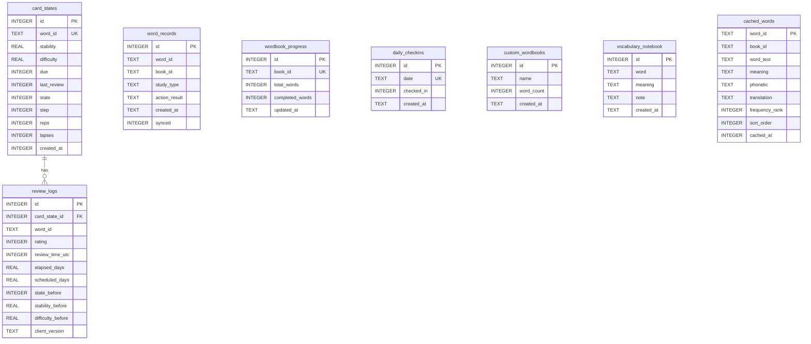

# 数据库现状（代码反推）

> Phase 1 产出。完全从代码提取，未参考旧文档。
> 基准 commit: bface75

---

## 云端数据库 [云端]

### 技术信息

- **DBMS**: PostgreSQL，使用 `pg` driver（无 ORM）
- **Migration 文件**: `001_initial_schema.sql`, `002_word_restructure.sql`
- **表总数**: 25 张
- **路径**: `apps/api/src/infrastructure/postgres/migrations/`

### 模块划分

| 模块 | 包含表 |
|------|--------|
| 用户与设置 | users, word_books, user_book_settings |
| 词库 | words |
| 主机制：学习 | study_attempts, user_word_progress |
| 主机制：复习 | review_groups, review_group_items, review_attempts |
| 主机制：日常/Session/签到 | daily_goal_progress, session_records, check_in_records, learning_day_facts, streak_records |
| 奖励与结算 | reward_source_events, reward_ledger, settlements |
| 幂等 | idempotency_keys |
| 副机制：宠物与钱包 | secondary_wallets, pet_profiles, feed_events |
| 副机制：商店与装备 | shop_catalog_items, inventory_items, equipment_slots, purchase_records |

---

### Table: users [云端]

> 来源: 001_initial_schema.sql

| 字段 | 类型 | Nullable | 默认值 | 说明 |
|------|------|----------|--------|------|
| id | VARCHAR(64) | NOT NULL | - | 主键 |
| nickname | VARCHAR(100) | NOT NULL | 'Learner' | 昵称 |
| timezone | VARCHAR(64) | NOT NULL | 'UTC' | 时区 |
| locale | VARCHAR(16) | NOT NULL | 'zh-CN' | 语言区域 |
| created_at | TIMESTAMPTZ | NOT NULL | NOW() | 创建时间 |
| updated_at | TIMESTAMPTZ | NOT NULL | NOW() | 更新时间 |

**约束**: PK(id)

---

### Table: word_books [云端]

> 来源: 001_initial_schema.sql

| 字段 | 类型 | Nullable | 默认值 | 说明 |
|------|------|----------|--------|------|
| id | VARCHAR(64) | NOT NULL | - | 主键 |
| name | VARCHAR(200) | NOT NULL | - | 词书名称 |
| description | TEXT | NULLABLE | - | 描述 |
| word_count | INT | NOT NULL | 0 | 单词总数 |
| is_active | BOOLEAN | NOT NULL | TRUE | 是否启用 |
| created_at | TIMESTAMPTZ | NOT NULL | NOW() | 创建时间 |

**约束**: PK(id)

---

### Table: user_book_settings [云端]

> 来源: 001_initial_schema.sql

| 字段 | 类型 | Nullable | 默认值 | 说明 |
|------|------|----------|--------|------|
| id | SERIAL | NOT NULL | auto | 自增主键 |
| user_id | VARCHAR(64) | NOT NULL | - | FK -> users(id) |
| book_id | VARCHAR(64) | NOT NULL | - | FK -> word_books(id) |
| daily_new_target | INT | NOT NULL | 20 | 每日新词目标 |
| is_active | BOOLEAN | NOT NULL | TRUE | 是否激活 |
| created_at | TIMESTAMPTZ | NOT NULL | NOW() | 创建时间 |
| updated_at | TIMESTAMPTZ | NOT NULL | NOW() | 更新时间 |

**约束**: PK(id), UNIQUE(user_id, book_id), FK(user_id -> users), FK(book_id -> word_books)
**索引**: idx_user_book_settings_user(user_id)

---

### Table: words [云端]

> 来源: 001_initial_schema.sql + 002_word_restructure.sql

| 字段 | 类型 | Nullable | 默认值 | 说明 | 来源 |
|------|------|----------|--------|------|------|
| id | VARCHAR(64) | NOT NULL | - | 主键 | 001 |
| book_id | VARCHAR(64) | NOT NULL | - | FK -> word_books(id) | 001 |
| word_text | VARCHAR(200) | NOT NULL | - | 单词文本 | 001 |
| meaning | TEXT | NOT NULL | - | 释义 | 001 |
| phonetic | VARCHAR(200) | NULLABLE | - | 音标 | 001 |
| word_type | VARCHAR(32) | NOT NULL | 'new' | 单词类型 | 001 |
| sort_order | INT | NOT NULL | 0 | 排序 | 001 |
| created_at | TIMESTAMPTZ | NOT NULL | NOW() | 创建时间 | 001 |
| translation | TEXT | NULLABLE | - | 中文翻译（多词性） | 002 |
| definition | TEXT | NULLABLE | - | 英文释义 | 002 |
| difficulty_level | INT | NOT NULL | 0 | 难度等级 | 002 |
| is_core | BOOLEAN | NOT NULL | FALSE | 是否核心词 | 002 |
| tags | TEXT | NULLABLE | - | 标签 | 002 |
| frequency_rank | INT | NOT NULL | 0 | 词频排名 | 002 |
| word_forms | TEXT | NULLABLE | - | 词形变化 | 002 |

**约束**: PK(id), FK(book_id -> word_books)
**索引**: idx_words_book(book_id), idx_words_type(word_type), idx_words_frequency(frequency_rank)

---

### Table: study_attempts [云端]

> 来源: 001_initial_schema.sql

| 字段 | 类型 | Nullable | 默认值 | 说明 |
|------|------|----------|--------|------|
| id | VARCHAR(64) | NOT NULL | - | 主键 |
| user_id | VARCHAR(64) | NOT NULL | - | FK -> users(id) |
| word_id | VARCHAR(64) | NOT NULL | - | FK -> words(id) |
| book_id | VARCHAR(64) | NOT NULL | - | FK -> word_books(id) |
| study_type | VARCHAR(16) | NOT NULL | - | 学习类型 |
| action_result | VARCHAR(16) | NOT NULL | - | 操作结果 |
| created_at | TIMESTAMPTZ | NOT NULL | NOW() | 创建时间 |

**约束**: PK(id), FK(user_id -> users), FK(word_id -> words), FK(book_id -> word_books)
**索引**: idx_study_attempts_user(user_id), idx_study_attempts_user_word(user_id, word_id), idx_study_attempts_created(created_at)

---

### Table: user_word_progress [云端]

> 来源: 001_initial_schema.sql

| 字段 | 类型 | Nullable | 默认值 | 说明 |
|------|------|----------|--------|------|
| id | SERIAL | NOT NULL | auto | 自增主键 |
| user_id | VARCHAR(64) | NOT NULL | - | FK -> users(id) |
| word_id | VARCHAR(64) | NOT NULL | - | FK -> words(id) |
| familiarity | INT | NOT NULL | 0 | 熟悉度 |
| last_studied_at | TIMESTAMPTZ | NULLABLE | - | 最后学习时间 |
| next_review_at | TIMESTAMPTZ | NULLABLE | - | 下次复习时间 |
| created_at | TIMESTAMPTZ | NOT NULL | NOW() | 创建时间 |
| updated_at | TIMESTAMPTZ | NOT NULL | NOW() | 更新时间 |

**约束**: PK(id), UNIQUE(user_id, word_id), FK(user_id -> users), FK(word_id -> words)
**索引**: idx_user_word_progress_user(user_id)

---

### Table: review_groups [云端]

> 来源: 001_initial_schema.sql

| 字段 | 类型 | Nullable | 默认值 | 说明 |
|------|------|----------|--------|------|
| id | VARCHAR(64) | NOT NULL | - | 主键 |
| user_id | VARCHAR(64) | NOT NULL | - | FK -> users(id) |
| group_status | VARCHAR(16) | NOT NULL | 'active' | 组状态 |
| group_completed | BOOLEAN | NOT NULL | FALSE | 是否完成 |
| created_at | TIMESTAMPTZ | NOT NULL | NOW() | 创建时间 |
| completed_at | TIMESTAMPTZ | NULLABLE | - | 完成时间 |

**约束**: PK(id), FK(user_id -> users)
**索引**: idx_review_groups_user(user_id), idx_review_groups_status(user_id, group_status)

---

### Table: review_group_items [云端]

> 来源: 001_initial_schema.sql

| 字段 | 类型 | Nullable | 默认值 | 说明 |
|------|------|----------|--------|------|
| id | SERIAL | NOT NULL | auto | 自增主键 |
| review_group_id | VARCHAR(64) | NOT NULL | - | FK -> review_groups(id) |
| word_id | VARCHAR(64) | NOT NULL | - | FK -> words(id) |
| word_text | VARCHAR(200) | NOT NULL | - | 单词文本（冗余） |
| meaning | TEXT | NOT NULL | - | 释义（冗余） |
| completed | BOOLEAN | NOT NULL | FALSE | 是否已完成 |

**约束**: PK(id), UNIQUE(review_group_id, word_id), FK(review_group_id -> review_groups), FK(word_id -> words)
**索引**: idx_review_group_items_group(review_group_id)

---

### Table: review_attempts [云端]

> 来源: 001_initial_schema.sql

| 字段 | 类型 | Nullable | 默认值 | 说明 |
|------|------|----------|--------|------|
| id | VARCHAR(64) | NOT NULL | - | 主键 |
| user_id | VARCHAR(64) | NOT NULL | - | FK -> users(id) |
| review_group_id | VARCHAR(64) | NOT NULL | - | FK -> review_groups(id) |
| word_id | VARCHAR(64) | NOT NULL | - | FK -> words(id) |
| action_result | VARCHAR(16) | NOT NULL | - | 操作结果 |
| created_at | TIMESTAMPTZ | NOT NULL | NOW() | 创建时间 |

**约束**: PK(id), FK(user_id -> users), FK(review_group_id -> review_groups), FK(word_id -> words)
**索引**: idx_review_attempts_user(user_id), idx_review_attempts_group(review_group_id)

---

### Table: daily_goal_progress [云端]

> 来源: 001_initial_schema.sql

| 字段 | 类型 | Nullable | 默认值 | 说明 |
|------|------|----------|--------|------|
| id | SERIAL | NOT NULL | auto | 自增主键 |
| user_id | VARCHAR(64) | NOT NULL | - | FK -> users(id) |
| local_date | DATE | NOT NULL | - | 本地日期 |
| new_target | INT | NOT NULL | 20 | 新词目标 |
| new_completed | INT | NOT NULL | 0 | 新词已完成 |
| review_target | INT | NOT NULL | 0 | 复习目标 |
| review_pending | INT | NOT NULL | 0 | 待复习 |
| review_completed | INT | NOT NULL | 0 | 复习已完成 |
| goal_status | VARCHAR(32) | NOT NULL | 'not_started' | 目标状态 |
| active_review_group_id | VARCHAR(64) | NULLABLE | - | 当前活跃的复习组 ID |
| created_at | TIMESTAMPTZ | NOT NULL | NOW() | 创建时间 |
| updated_at | TIMESTAMPTZ | NOT NULL | NOW() | 更新时间 |

**约束**: PK(id), UNIQUE(user_id, local_date), FK(user_id -> users)
**索引**: idx_daily_goal_user_date(user_id, local_date)

---

### Table: session_records [云端]

> 来源: 001_initial_schema.sql

| 字段 | 类型 | Nullable | 默认值 | 说明 |
|------|------|----------|--------|------|
| id | VARCHAR(64) | NOT NULL | - | 主键 |
| user_id | VARCHAR(64) | NOT NULL | - | FK -> users(id) |
| session_status | VARCHAR(16) | NOT NULL | 'started' | Session 状态 |
| validation_status | VARCHAR(16) | NOT NULL | 'pending' | 验证状态 |
| minutes_target | INT | NOT NULL | 15 | 目标分钟数 |
| started_at | TIMESTAMPTZ | NOT NULL | - | 开始时间 |
| ended_at | TIMESTAMPTZ | NULLABLE | - | 结束时间 |
| actual_minutes | INT | NULLABLE | - | 实际分钟数 |
| effective_learning_count | INT | NOT NULL | 0 | 有效学习数 |
| effective_review_count | INT | NOT NULL | 0 | 有效复习数 |
| created_at | TIMESTAMPTZ | NOT NULL | NOW() | 创建时间 |

**约束**: PK(id), FK(user_id -> users)
**索引**: idx_sessions_user(user_id), idx_sessions_status(user_id, session_status)

---

### Table: check_in_records [云端]

> 来源: 001_initial_schema.sql

| 字段 | 类型 | Nullable | 默认值 | 说明 |
|------|------|----------|--------|------|
| id | VARCHAR(64) | NOT NULL | - | 主键 |
| user_id | VARCHAR(64) | NOT NULL | - | FK -> users(id) |
| local_date | DATE | NOT NULL | - | 签到日期 |
| status | VARCHAR(16) | NOT NULL | 'succeeded' | 签到状态 |
| created_at | TIMESTAMPTZ | NOT NULL | NOW() | 创建时间 |

**约束**: PK(id), UNIQUE(user_id, local_date), FK(user_id -> users)
**索引**: idx_checkins_user_date(user_id, local_date)

---

### Table: learning_day_facts [云端]

> 来源: 001_initial_schema.sql

| 字段 | 类型 | Nullable | 默认值 | 说明 |
|------|------|----------|--------|------|
| id | SERIAL | NOT NULL | auto | 自增主键 |
| user_id | VARCHAR(64) | NOT NULL | - | FK -> users(id) |
| local_date | DATE | NOT NULL | - | 本地日期 |
| is_learning_day | BOOLEAN | NOT NULL | FALSE | 是否学习日 |
| effective_learning_count | INT | NOT NULL | 0 | 有效学习数 |
| effective_review_count | INT | NOT NULL | 0 | 有效复习数 |
| updated_at | TIMESTAMPTZ | NOT NULL | NOW() | 更新时间 |

**约束**: PK(id), UNIQUE(user_id, local_date), FK(user_id -> users)
**索引**: idx_learning_day_user_date(user_id, local_date)

---

### Table: streak_records [云端]

> 来源: 001_initial_schema.sql

| 字段 | 类型 | Nullable | 默认值 | 说明 |
|------|------|----------|--------|------|
| id | SERIAL | NOT NULL | auto | 自增主键 |
| user_id | VARCHAR(64) | NOT NULL | - | FK -> users(id), UNIQUE |
| current_streak | INT | NOT NULL | 0 | 当前连续天数 |
| streak_basis_type | VARCHAR(16) | NOT NULL | 'check_in' | 连续类型基准 |
| last_check_in_date | DATE | NULLABLE | - | 最后签到日期 |
| updated_at | TIMESTAMPTZ | NOT NULL | NOW() | 更新时间 |

**约束**: PK(id), UNIQUE(user_id), FK(user_id -> users)

---

### Table: reward_source_events [云端]

> 来源: 001_initial_schema.sql

| 字段 | 类型 | Nullable | 默认值 | 说明 |
|------|------|----------|--------|------|
| id | VARCHAR(64) | NOT NULL | - | 主键 |
| user_id | VARCHAR(64) | NOT NULL | - | FK -> users(id) |
| event_type | VARCHAR(64) | NOT NULL | - | 事件类型 |
| source_ref_id | VARCHAR(128) | NOT NULL | - | 来源引用 ID |
| created_at | TIMESTAMPTZ | NOT NULL | NOW() | 创建时间 |

**约束**: PK(id), UNIQUE(event_type, source_ref_id), FK(user_id -> users)
**索引**: idx_reward_source_user(user_id)

---

### Table: reward_ledger [云端]

> 来源: 001_initial_schema.sql

| 字段 | 类型 | Nullable | 默认值 | 说明 |
|------|------|----------|--------|------|
| id | VARCHAR(64) | NOT NULL | - | 主键 |
| source_event_id | VARCHAR(64) | NOT NULL | - | FK -> reward_source_events(id) |
| user_id | VARCHAR(64) | NOT NULL | - | FK -> users(id) |
| reward_type | VARCHAR(32) | NOT NULL | - | 奖励类型 |
| amount | INT | NOT NULL | - | 数量 |
| reward_status | VARCHAR(16) | NOT NULL | 'succeeded' | 奖励状态 |
| created_at | TIMESTAMPTZ | NOT NULL | NOW() | 创建时间 |

**约束**: PK(id), FK(source_event_id -> reward_source_events), FK(user_id -> users)
**索引**: idx_reward_ledger_user(user_id), idx_reward_ledger_source(source_event_id), idx_reward_ledger_type(user_id, reward_type)

---

### Table: settlements [云端]

> 来源: 001_initial_schema.sql

| 字段 | 类型 | Nullable | 默认值 | 说明 |
|------|------|----------|--------|------|
| id | VARCHAR(64) | NOT NULL | - | 主键 |
| source_event_id | VARCHAR(64) | NOT NULL | - | FK -> reward_source_events(id), UNIQUE |
| user_id | VARCHAR(64) | NOT NULL | - | FK -> users(id) |
| settlement_status | VARCHAR(16) | NOT NULL | 'succeeded' | 结算状态 |
| created_at | TIMESTAMPTZ | NOT NULL | NOW() | 创建时间 |
| updated_at | TIMESTAMPTZ | NOT NULL | NOW() | 更新时间 |

**约束**: PK(id), UNIQUE(source_event_id), FK(source_event_id -> reward_source_events), FK(user_id -> users)
**索引**: idx_settlements_user(user_id)

---

### Table: idempotency_keys [云端]

> 来源: 001_initial_schema.sql

| 字段 | 类型 | Nullable | 默认值 | 说明 |
|------|------|----------|--------|------|
| key | VARCHAR(255) | NOT NULL | - | 主键 |
| user_id | VARCHAR(64) | NOT NULL | - | FK -> users(id) |
| path | VARCHAR(255) | NOT NULL | - | API 路径 |
| response | JSONB | NOT NULL | '{}' | 缓存的响应 |
| created_at | TIMESTAMPTZ | NOT NULL | NOW() | 创建时间 |

**约束**: PK(key), FK(user_id -> users)
**索引**: idx_idempotency_user(user_id)

---

### Table: secondary_wallets [云端]

> 来源: 001_initial_schema.sql

| 字段 | 类型 | Nullable | 默认值 | 说明 |
|------|------|----------|--------|------|
| id | SERIAL | NOT NULL | auto | 自增主键 |
| user_id | VARCHAR(64) | NOT NULL | - | FK -> users(id), UNIQUE |
| coins_spent | INT | NOT NULL | 0 | 已消费金币 |
| feed_mood_accumulated | INT | NOT NULL | 0 | 累计心情增量 |
| feed_exp_accumulated | INT | NOT NULL | 0 | 累计经验增量 |
| feed_bond_accumulated | INT | NOT NULL | 0 | 累计亲密度增量 |
| updated_at | TIMESTAMPTZ | NOT NULL | NOW() | 更新时间 |

**约束**: PK(id), UNIQUE(user_id), FK(user_id -> users)

---

### Table: pet_profiles [云端]

> 来源: 001_initial_schema.sql

| 字段 | 类型 | Nullable | 默认值 | 说明 |
|------|------|----------|--------|------|
| id | SERIAL | NOT NULL | auto | 自增主键 |
| user_id | VARCHAR(64) | NOT NULL | - | FK -> users(id), UNIQUE |
| nickname | VARCHAR(100) | NOT NULL | 'Mimi' | 宠物昵称 |
| base_mood | INT | NOT NULL | 60 | 基础心情值 |
| base_bond | INT | NOT NULL | 0 | 基础亲密度 |
| created_at | TIMESTAMPTZ | NOT NULL | NOW() | 创建时间 |
| updated_at | TIMESTAMPTZ | NOT NULL | NOW() | 更新时间 |

**约束**: PK(id), UNIQUE(user_id), FK(user_id -> users)

---

### Table: feed_events [云端]

> 来源: 001_initial_schema.sql

| 字段 | 类型 | Nullable | 默认值 | 说明 |
|------|------|----------|--------|------|
| id | VARCHAR(64) | NOT NULL | - | 主键 |
| user_id | VARCHAR(64) | NOT NULL | - | FK -> users(id) |
| feed_item_type | VARCHAR(32) | NOT NULL | - | 投喂物类型 |
| consumed_amount | INT | NOT NULL | 1 | 消耗数量 |
| mood_delta | INT | NOT NULL | 0 | 心情变化量 |
| exp_delta | INT | NOT NULL | 0 | 经验变化量 |
| bond_delta | INT | NOT NULL | 0 | 亲密度变化量 |
| local_date | DATE | NOT NULL | - | 本地日期 |
| created_at | TIMESTAMPTZ | NOT NULL | NOW() | 创建时间 |

**约束**: PK(id), FK(user_id -> users)
**索引**: idx_feed_events_user(user_id), idx_feed_events_date(user_id, local_date)

---

### Table: shop_catalog_items [云端]

> 来源: 001_initial_schema.sql

| 字段 | 类型 | Nullable | 默认值 | 说明 |
|------|------|----------|--------|------|
| id | VARCHAR(64) | NOT NULL | - | 主键 |
| item_type | VARCHAR(32) | NOT NULL | - | 物品类型 |
| slot | VARCHAR(32) | NOT NULL | - | 装备槽位 |
| name | VARCHAR(200) | NOT NULL | - | 物品名称 |
| coin_price | INT | NOT NULL | - | 金币价格 |
| required_level | INT | NOT NULL | 1 | 需要等级 |
| is_active | BOOLEAN | NOT NULL | TRUE | 是否上架 |
| created_at | TIMESTAMPTZ | NOT NULL | NOW() | 创建时间 |

**约束**: PK(id)

---

### Table: inventory_items [云端]

> 来源: 001_initial_schema.sql

| 字段 | 类型 | Nullable | 默认值 | 说明 |
|------|------|----------|--------|------|
| id | SERIAL | NOT NULL | auto | 自增主键 |
| user_id | VARCHAR(64) | NOT NULL | - | FK -> users(id) |
| item_id | VARCHAR(64) | NOT NULL | - | FK -> shop_catalog_items(id) |
| item_type | VARCHAR(32) | NOT NULL | - | 物品类型 |
| slot | VARCHAR(32) | NOT NULL | - | 装备槽位 |
| equipped | BOOLEAN | NOT NULL | FALSE | 是否已装备 |
| owned_at | TIMESTAMPTZ | NOT NULL | NOW() | 获得时间 |

**约束**: PK(id), UNIQUE(user_id, item_id), FK(user_id -> users), FK(item_id -> shop_catalog_items)
**索引**: idx_inventory_user(user_id)

---

### Table: equipment_slots [云端]

> 来源: 001_initial_schema.sql

| 字段 | 类型 | Nullable | 默认值 | 说明 |
|------|------|----------|--------|------|
| id | SERIAL | NOT NULL | auto | 自增主键 |
| user_id | VARCHAR(64) | NOT NULL | - | FK -> users(id) |
| slot | VARCHAR(32) | NOT NULL | - | 槽位名称 |
| item_type | VARCHAR(32) | NOT NULL | - | 物品类型 |
| item_id | VARCHAR(64) | NULLABLE | - | FK -> shop_catalog_items(id) |
| updated_at | TIMESTAMPTZ | NOT NULL | NOW() | 更新时间 |

**约束**: PK(id), UNIQUE(user_id, slot, item_type), FK(user_id -> users), FK(item_id -> shop_catalog_items)
**索引**: idx_equipment_user(user_id)

---

### Table: purchase_records [云端]

> 来源: 001_initial_schema.sql

| 字段 | 类型 | Nullable | 默认值 | 说明 |
|------|------|----------|--------|------|
| id | SERIAL | NOT NULL | auto | 自增主键 |
| user_id | VARCHAR(64) | NOT NULL | - | FK -> users(id) |
| item_id | VARCHAR(64) | NOT NULL | - | FK -> shop_catalog_items(id) |
| coins_spent | INT | NOT NULL | - | 消费金币 |
| idempotency_key | VARCHAR(255) | NULLABLE | - | 幂等键 |
| created_at | TIMESTAMPTZ | NOT NULL | NOW() | 创建时间 |

**约束**: PK(id), FK(user_id -> users), FK(item_id -> shop_catalog_items)
**索引**: idx_purchases_user(user_id)

---

## 本地端数据库 [本地端]

### 技术信息

- **引擎**: SQLite
- **ORM/Driver**: sqflite（legacy v1）+ drift（v2）
- **数据库文件**: `meow_progress.db`
- **Schema 版本**: 2（drift `schemaVersion => 2`）
- **表总数**: 8 张（5 legacy + 3 FSRS）
- **代码路径**:
  - Legacy: `apps/mobile/lib/core/storage/local_database.dart`
  - Legacy drift 定义: `apps/mobile/lib/core/storage/drift/tables/legacy_tables.dart`
  - FSRS drift 定义: `apps/mobile/lib/core/storage/drift/tables/fsrs_tables.dart`
  - Database 入口: `apps/mobile/lib/core/storage/drift/app_database.dart`

### 版本历史

| 版本 | 来源 | 表 |
|------|------|-----|
| v1 | raw sqflite `_createTables()` | word_records, wordbook_progress, daily_checkins, custom_wordbooks, vocabulary_notebook |
| v2 | drift `AppDatabase` | v1 全部 + card_states, review_logs, cached_words |

---

### Table: word_records [本地端] (Legacy)

> 来源: local_database.dart + legacy_tables.dart

| 字段 | 类型 | Nullable | 默认值 | 说明 |
|------|------|----------|--------|------|
| id | INTEGER | NOT NULL | AUTOINCREMENT | 主键 |
| word_id | TEXT | NOT NULL | - | 单词 ID |
| book_id | TEXT | NOT NULL | - | 词书 ID |
| study_type | TEXT | NOT NULL | 'new' | 学习类型 |
| action_result | TEXT | NOT NULL | - | 操作结果 |
| created_at | TEXT | NOT NULL | - | 创建时间 (ISO 8601) |
| synced | INTEGER | NOT NULL | 0 | 同步状态 (0=未同步, 1=已同步) |

**约束**: PK(id)
**索引**: idx_wr_word_id(word_id), idx_wr_synced(synced)

---

### Table: wordbook_progress [本地端] (Legacy)

> 来源: local_database.dart + legacy_tables.dart

| 字段 | 类型 | Nullable | 默认值 | 说明 |
|------|------|----------|--------|------|
| id | INTEGER | NOT NULL | AUTOINCREMENT | 主键 |
| book_id | TEXT | NOT NULL | - | 词书 ID, UNIQUE |
| total_words | INTEGER | NOT NULL | 0 | 总词数 |
| completed_words | INTEGER | NOT NULL | 0 | 已完成词数 |
| updated_at | TEXT | NOT NULL | - | 更新时间 (ISO 8601) |

**约束**: PK(id), UNIQUE(book_id)

---

### Table: daily_checkins [本地端] (Legacy)

> 来源: local_database.dart + legacy_tables.dart

| 字段 | 类型 | Nullable | 默认值 | 说明 |
|------|------|----------|--------|------|
| id | INTEGER | NOT NULL | AUTOINCREMENT | 主键 |
| date | TEXT | NOT NULL | - | 签到日期, UNIQUE |
| checked_in | INTEGER | NOT NULL | 1 | 是否签到 |
| created_at | TEXT | NOT NULL | - | 创建时间 (ISO 8601) |

**约束**: PK(id), UNIQUE(date)

---

### Table: custom_wordbooks [本地端] (Legacy)

> 来源: local_database.dart + legacy_tables.dart

| 字段 | 类型 | Nullable | 默认值 | 说明 |
|------|------|----------|--------|------|
| id | INTEGER | NOT NULL | AUTOINCREMENT | 主键 |
| name | TEXT | NOT NULL | - | 自定义词书名称 |
| word_count | INTEGER | NOT NULL | 0 | 词数 |
| created_at | TEXT | NOT NULL | - | 创建时间 (ISO 8601) |

**约束**: PK(id)

---

### Table: vocabulary_notebook [本地端] (Legacy)

> 来源: local_database.dart + legacy_tables.dart

| 字段 | 类型 | Nullable | 默认值 | 说明 |
|------|------|----------|--------|------|
| id | INTEGER | NOT NULL | AUTOINCREMENT | 主键 |
| word | TEXT | NOT NULL | - | 单词 |
| meaning | TEXT | NULLABLE | - | 释义 |
| note | TEXT | NULLABLE | - | 笔记 |
| created_at | TEXT | NOT NULL | - | 创建时间 (ISO 8601) |

**约束**: PK(id)

---

### Table: card_states [本地端] (FSRS v2)

> 来源: fsrs_tables.dart

| 字段 | 类型 | Nullable | 默认值 | 说明 |
|------|------|----------|--------|------|
| id | INTEGER | NOT NULL | AUTOINCREMENT | 主键 |
| word_id | TEXT | NOT NULL | - | 单词 ID, UNIQUE |
| stability | REAL | NULLABLE | - | FSRS 稳定性参数 |
| difficulty | REAL | NULLABLE | - | FSRS 难度参数 |
| due | INTEGER | NOT NULL | - | 下次到期 (UTC epoch ms) |
| last_review | INTEGER | NULLABLE | - | 最后复习时间 (UTC epoch ms) |
| state | INTEGER | NOT NULL | 1 | 卡片状态: 1=Learning, 2=Review, 3=Relearning |
| step | INTEGER | NULLABLE | - | 学习/再学习步骤索引 |
| reps | INTEGER | NOT NULL | 0 | 连续成功复习次数 |
| lapses | INTEGER | NOT NULL | 0 | 遗忘次数 |
| created_at | INTEGER | NOT NULL | - | 创建时间 (UTC epoch ms) |

**约束**: PK(id), UNIQUE(word_id)
**索引**: idx_card_states_due(due), idx_card_states_state(state)

---

### Table: review_logs [本地端] (FSRS v2)

> 来源: fsrs_tables.dart

| 字段 | 类型 | Nullable | 默认值 | 说明 |
|------|------|----------|--------|------|
| id | INTEGER | NOT NULL | AUTOINCREMENT | 主键 |
| card_state_id | INTEGER | NOT NULL | - | FK -> card_states(id) |
| word_id | TEXT | NOT NULL | - | 单词 ID（冗余，便于查询） |
| rating | INTEGER | NOT NULL | - | 评分: 1=Again, 2=Hard, 3=Good, 4=Easy |
| review_time_utc | INTEGER | NOT NULL | - | 复习时间 (UTC epoch ms) |
| elapsed_days | REAL | NOT NULL | - | 距上次复习的天数 |
| scheduled_days | REAL | NOT NULL | - | FSRS 计划的间隔天数 |
| state_before | INTEGER | NOT NULL | - | 复习前的卡片状态 (1/2/3) |
| stability_before | REAL | NULLABLE | - | 复习前的稳定性 |
| difficulty_before | REAL | NULLABLE | - | 复习前的难度 |
| client_version | TEXT | NULLABLE | - | 客户端版本号 |

**约束**: PK(id), FK(card_state_id -> card_states.id)
**索引**: idx_review_logs_word_id(word_id), idx_review_logs_review_time(review_time_utc)

---

### Table: cached_words [本地端] (FSRS v2)

> 来源: fsrs_tables.dart

| 字段 | 类型 | Nullable | 默认值 | 说明 |
|------|------|----------|--------|------|
| word_id | TEXT | NOT NULL | - | 主键，单词 ID |
| book_id | TEXT | NOT NULL | - | 词书 ID |
| word_text | TEXT | NOT NULL | - | 单词文本 |
| meaning | TEXT | NOT NULL | - | 释义 |
| phonetic | TEXT | NULLABLE | - | 音标 |
| translation | TEXT | NULLABLE | - | 中文翻译（多词性） |
| frequency_rank | INTEGER | NOT NULL | 0 | 词频排名 |
| sort_order | INTEGER | NOT NULL | 0 | 排序顺序 |
| cached_at | INTEGER | NOT NULL | - | 缓存时间 (UTC epoch ms) |

**约束**: PK(word_id)

---

## SharedPreferences [本地端]

> 来源: `local_settings_service.dart`, `backup_upload_service.dart`, `local_progress_repository.dart`

### 设置类 (LocalSettingsService)

| Key | 类型 | 默认值 | 用途 |
|-----|------|--------|------|
| settings_daily_goal | int | 20 | 每日新词目标 |
| settings_sound_enabled | bool | true | 音效开关 |
| settings_theme | String | 'light' | 主题模式 |
| settings_notification_time | String | '09:00' | 通知时间 (HH:mm) |
| settings_desired_retention | double | 0.9 | FSRS 目标保留率 [0.85, 0.95] |

### 备份状态类 (BackupUploadService)

| Key | 类型 | 默认值 | 用途 |
|-----|------|--------|------|
| backup_latest_status | String | (无) | 最近备份状态枚举名称 |
| backup_latest_id | String | (无) | 最近备份 ID |
| backup_latest_uploaded_at | String | (无) | 最近备份上传时间 (ISO 8601) |
| backup_latest_schema_version | String | (无) | 最近备份 schema 版本 |

### 进度缓存类 (LocalProgressRepository)

> 以 JSON 字符串存储，作为 SQLite 的冗余层/运行时缓存

| Key | 类型 | 默认值 | 用途 |
|-----|------|--------|------|
| progress_word_records | String (JSON Array) | (无) | 学习记录 JSON 缓存 |
| progress_wordbook_progress | String (JSON Map) | (无) | 词书进度 JSON 缓存 |
| progress_daily_checkins | String (JSON Array) | (无) | 签到记录 JSON 缓存 |
| progress_custom_wordbooks | String (JSON Array) | (无) | 自定义词书 JSON 缓存 |
| progress_vocabulary_notebook | String (JSON Array) | (无) | 生词本 JSON 缓存 |

---

## 双端对比

### 对比 1: 学习记录 — cloud `study_attempts` vs local `word_records`

| 维度 | 云端 study_attempts | 本地端 word_records |
|------|---------------------|---------------------|
| 主键 | VARCHAR(64) UUID | INTEGER AUTOINCREMENT |
| user_id | 有 (FK) | 无 (单用户设备) |
| word_id | 有 (FK -> words) | 有 (TEXT, 无 FK) |
| book_id | 有 (FK -> word_books) | 有 (TEXT, 无 FK) |
| study_type | VARCHAR(16) | TEXT, DEFAULT 'new' |
| action_result | VARCHAR(16) | TEXT |
| created_at | TIMESTAMPTZ (服务器时间) | TEXT (ISO 8601, 客户端时间) |
| synced 标记 | 无 (云端即真相) | INTEGER (0/1) |
| 时间格式 | PostgreSQL TIMESTAMPTZ | ISO 8601 字符串 |
| 写入语义 | 每次 attempt 追加 | 同一 word_id+study_type 会覆盖更新 |

### 对比 2: 签到记录 — cloud `check_in_records` vs local `daily_checkins`

| 维度 | 云端 check_in_records | 本地端 daily_checkins |
|------|----------------------|----------------------|
| 主键 | VARCHAR(64) UUID | INTEGER AUTOINCREMENT |
| user_id | 有 (FK) | 无 |
| 日期字段 | local_date DATE | date TEXT |
| 状态字段 | status VARCHAR(16) DEFAULT 'succeeded' | checked_in INTEGER DEFAULT 1 |
| 唯一约束 | UNIQUE(user_id, local_date) | UNIQUE(date) |
| created_at | TIMESTAMPTZ | TEXT (ISO 8601) |

### 对比 3: 词书/词库 — cloud `word_books` + `words` vs local `cached_words`

| 维度 | 云端 word_books / words | 本地端 cached_words |
|------|------------------------|---------------------|
| 定位 | 权威数据源 | 离线缓存副本 |
| 字段完整度 | 完整 (15 字段含 002 扩展) | 精简 (9 字段) |
| phonetic | VARCHAR(200) | TEXT |
| translation | TEXT (002 新增) | TEXT |
| difficulty_level, is_core, tags, word_forms | 有 | 无 |
| frequency_rank | INT | INTEGER |
| sort_order | INT | INTEGER |
| cached_at | 无 | INTEGER (UTC epoch ms) |

### 对比 4: 复习机制 — cloud `review_groups/items/attempts` vs local `card_states` + `review_logs`

| 维度 | 云端复习体系 | 本地端 FSRS 体系 |
|------|------------|-----------------|
| 架构 | 分组式复习 (review_groups -> items -> attempts) | FSRS 卡片调度 (card_states + review_logs) |
| 调度算法 | 服务端业务逻辑 | FSRS 算法 (本地) |
| 状态模型 | group_status / group_completed / completed | state (1=Learning, 2=Review, 3=Relearning) |
| 评分 | action_result VARCHAR(16) | rating INTEGER (1-4: Again/Hard/Good/Easy) |
| 兼容性 | 两套体系当前独立运行，无直接映射 | 两套体系当前独立运行，无直接映射 |

### 对比 5: 自定义词书 — cloud 无 vs local `custom_wordbooks`

| 维度 | 云端 | 本地端 custom_wordbooks |
|------|------|------------------------|
| 是否存在 | 无对应表 | 有 |
| 说明 | 云端仅有 word_books（系统词书） | 本地独有，用户自建词书 |

### 对比 6: 生词本 — cloud 无 vs local `vocabulary_notebook`

| 维度 | 云端 | 本地端 vocabulary_notebook |
|------|------|--------------------------|
| 是否存在 | 无对应表 | 有 |
| 说明 | 云端无生词本概念 | 本地独有 |

### 对比 7: 词书进度 — cloud 无直接对应 vs local `wordbook_progress`

| 维度 | 云端 | 本地端 wordbook_progress |
|------|------|-------------------------|
| 是否存在 | 无直接对应表（通过 user_word_progress 聚合计算） | 有，直接存储 |
| 字段 | - | book_id, total_words, completed_words |

---

## 同步元数据

### 直接同步标记字段

| 端 | 表 | 字段 | 类型 | 说明 |
|----|----|------|------|------|
| 本地端 | word_records | synced | INTEGER (0/1) | 0=未同步, 1=已同步；唯一有 synced 标记的表 |

### 时间戳字段 (可用于同步冲突检测)

#### 云端 created_at 字段

| 表 | 字段 | 类型 |
|----|------|------|
| users | created_at, updated_at | TIMESTAMPTZ |
| word_books | created_at | TIMESTAMPTZ |
| user_book_settings | created_at, updated_at | TIMESTAMPTZ |
| words | created_at | TIMESTAMPTZ |
| study_attempts | created_at | TIMESTAMPTZ |
| user_word_progress | created_at, updated_at | TIMESTAMPTZ |
| review_groups | created_at, completed_at | TIMESTAMPTZ |
| review_attempts | created_at | TIMESTAMPTZ |
| daily_goal_progress | created_at, updated_at | TIMESTAMPTZ |
| session_records | created_at, started_at, ended_at | TIMESTAMPTZ |
| check_in_records | created_at | TIMESTAMPTZ |
| learning_day_facts | updated_at | TIMESTAMPTZ |
| streak_records | updated_at | TIMESTAMPTZ |
| reward_source_events | created_at | TIMESTAMPTZ |
| reward_ledger | created_at | TIMESTAMPTZ |
| settlements | created_at, updated_at | TIMESTAMPTZ |
| idempotency_keys | created_at | TIMESTAMPTZ |
| secondary_wallets | updated_at | TIMESTAMPTZ |
| pet_profiles | created_at, updated_at | TIMESTAMPTZ |
| feed_events | created_at | TIMESTAMPTZ |
| shop_catalog_items | created_at | TIMESTAMPTZ |
| inventory_items | owned_at | TIMESTAMPTZ |
| equipment_slots | updated_at | TIMESTAMPTZ |
| purchase_records | created_at | TIMESTAMPTZ |

#### 本地端时间戳字段

| 表 | 字段 | 类型 | 格式 |
|----|------|------|------|
| word_records | created_at | TEXT | ISO 8601 |
| wordbook_progress | updated_at | TEXT | ISO 8601 |
| daily_checkins | created_at | TEXT | ISO 8601 |
| custom_wordbooks | created_at | TEXT | ISO 8601 |
| vocabulary_notebook | created_at | TEXT | ISO 8601 |
| card_states | created_at, due, last_review | INTEGER | UTC epoch ms |
| review_logs | review_time_utc | INTEGER | UTC epoch ms |
| cached_words | cached_at | INTEGER | UTC epoch ms |

### 同步现状总结

- 仅 `word_records.synced` 是唯一的显式同步标记
- 本地端 legacy 表使用 TEXT ISO 8601 时间戳，FSRS 表使用 INTEGER epoch ms
- 云端统一使用 TIMESTAMPTZ
- 当前无增量同步机制，仅有快照式备份/恢复
- 本地 `LocalProgressRepository` (SharedPreferences) 作为 SQLite 的运行时冗余层存在

---

## ER 关系图 (Mermaid)

### 云端 ER 图

```mermaid
erDiagram
    users ||--o{ user_book_settings : "has"
    users ||--o{ study_attempts : "makes"
    users ||--o{ user_word_progress : "tracks"
    users ||--o{ review_groups : "creates"
    users ||--o{ review_attempts : "submits"
    users ||--o{ daily_goal_progress : "has"
    users ||--o{ session_records : "starts"
    users ||--o{ check_in_records : "checks_in"
    users ||--o{ learning_day_facts : "has"
    users ||--|| streak_records : "has"
    users ||--o{ reward_source_events : "triggers"
    users ||--o{ reward_ledger : "receives"
    users ||--o{ settlements : "settles"
    users ||--o{ idempotency_keys : "uses"
    users ||--|| secondary_wallets : "has"
    users ||--|| pet_profiles : "has"
    users ||--o{ feed_events : "feeds"
    users ||--o{ inventory_items : "owns"
    users ||--o{ equipment_slots : "equips"
    users ||--o{ purchase_records : "purchases"

    word_books ||--o{ user_book_settings : "configured_by"
    word_books ||--o{ words : "contains"
    word_books ||--o{ study_attempts : "studied_from"

    words ||--o{ study_attempts : "studied"
    words ||--o{ user_word_progress : "tracked"
    words ||--o{ review_group_items : "reviewed"
    words ||--o{ review_attempts : "attempted"

    review_groups ||--o{ review_group_items : "contains"
    review_groups ||--o{ review_attempts : "has"

    reward_source_events ||--o{ reward_ledger : "produces"
    reward_source_events ||--|| settlements : "settled_by"

    shop_catalog_items ||--o{ inventory_items : "purchased_as"
    shop_catalog_items ||--o{ equipment_slots : "equipped_in"
    shop_catalog_items ||--o{ purchase_records : "bought_via"

    users {
        VARCHAR64 id PK
        VARCHAR100 nickname
        VARCHAR64 timezone
        VARCHAR16 locale
        TIMESTAMPTZ created_at
        TIMESTAMPTZ updated_at
    }

    word_books {
        VARCHAR64 id PK
        VARCHAR200 name
        TEXT description
        INT word_count
        BOOLEAN is_active
        TIMESTAMPTZ created_at
    }

    user_book_settings {
        SERIAL id PK
        VARCHAR64 user_id FK
        VARCHAR64 book_id FK
        INT daily_new_target
        BOOLEAN is_active
        TIMESTAMPTZ created_at
        TIMESTAMPTZ updated_at
    }

    words {
        VARCHAR64 id PK
        VARCHAR64 book_id FK
        VARCHAR200 word_text
        TEXT meaning
        VARCHAR200 phonetic
        VARCHAR32 word_type
        INT sort_order
        TIMESTAMPTZ created_at
        TEXT translation
        TEXT definition
        INT difficulty_level
        BOOLEAN is_core
        TEXT tags
        INT frequency_rank
        TEXT word_forms
    }

    study_attempts {
        VARCHAR64 id PK
        VARCHAR64 user_id FK
        VARCHAR64 word_id FK
        VARCHAR64 book_id FK
        VARCHAR16 study_type
        VARCHAR16 action_result
        TIMESTAMPTZ created_at
    }

    user_word_progress {
        SERIAL id PK
        VARCHAR64 user_id FK
        VARCHAR64 word_id FK
        INT familiarity
        TIMESTAMPTZ last_studied_at
        TIMESTAMPTZ next_review_at
        TIMESTAMPTZ created_at
        TIMESTAMPTZ updated_at
    }

    review_groups {
        VARCHAR64 id PK
        VARCHAR64 user_id FK
        VARCHAR16 group_status
        BOOLEAN group_completed
        TIMESTAMPTZ created_at
        TIMESTAMPTZ completed_at
    }

    review_group_items {
        SERIAL id PK
        VARCHAR64 review_group_id FK
        VARCHAR64 word_id FK
        VARCHAR200 word_text
        TEXT meaning
        BOOLEAN completed
    }

    review_attempts {
        VARCHAR64 id PK
        VARCHAR64 user_id FK
        VARCHAR64 review_group_id FK
        VARCHAR64 word_id FK
        VARCHAR16 action_result
        TIMESTAMPTZ created_at
    }

    daily_goal_progress {
        SERIAL id PK
        VARCHAR64 user_id FK
        DATE local_date
        INT new_target
        INT new_completed
        INT review_target
        INT review_pending
        INT review_completed
        VARCHAR32 goal_status
        VARCHAR64 active_review_group_id
        TIMESTAMPTZ created_at
        TIMESTAMPTZ updated_at
    }

    session_records {
        VARCHAR64 id PK
        VARCHAR64 user_id FK
        VARCHAR16 session_status
        VARCHAR16 validation_status
        INT minutes_target
        TIMESTAMPTZ started_at
        TIMESTAMPTZ ended_at
        INT actual_minutes
        INT effective_learning_count
        INT effective_review_count
        TIMESTAMPTZ created_at
    }

    check_in_records {
        VARCHAR64 id PK
        VARCHAR64 user_id FK
        DATE local_date
        VARCHAR16 status
        TIMESTAMPTZ created_at
    }

    learning_day_facts {
        SERIAL id PK
        VARCHAR64 user_id FK
        DATE local_date
        BOOLEAN is_learning_day
        INT effective_learning_count
        INT effective_review_count
        TIMESTAMPTZ updated_at
    }

    streak_records {
        SERIAL id PK
        VARCHAR64 user_id FK
        INT current_streak
        VARCHAR16 streak_basis_type
        DATE last_check_in_date
        TIMESTAMPTZ updated_at
    }

    reward_source_events {
        VARCHAR64 id PK
        VARCHAR64 user_id FK
        VARCHAR64 event_type
        VARCHAR128 source_ref_id
        TIMESTAMPTZ created_at
    }

    reward_ledger {
        VARCHAR64 id PK
        VARCHAR64 source_event_id FK
        VARCHAR64 user_id FK
        VARCHAR32 reward_type
        INT amount
        VARCHAR16 reward_status
        TIMESTAMPTZ created_at
    }

    settlements {
        VARCHAR64 id PK
        VARCHAR64 source_event_id FK
        VARCHAR64 user_id FK
        VARCHAR16 settlement_status
        TIMESTAMPTZ created_at
        TIMESTAMPTZ updated_at
    }

    idempotency_keys {
        VARCHAR255 key PK
        VARCHAR64 user_id FK
        VARCHAR255 path
        JSONB response
        TIMESTAMPTZ created_at
    }

    secondary_wallets {
        SERIAL id PK
        VARCHAR64 user_id FK
        INT coins_spent
        INT feed_mood_accumulated
        INT feed_exp_accumulated
        INT feed_bond_accumulated
        TIMESTAMPTZ updated_at
    }

    pet_profiles {
        SERIAL id PK
        VARCHAR64 user_id FK
        VARCHAR100 nickname
        INT base_mood
        INT base_bond
        TIMESTAMPTZ created_at
        TIMESTAMPTZ updated_at
    }

    feed_events {
        VARCHAR64 id PK
        VARCHAR64 user_id FK
        VARCHAR32 feed_item_type
        INT consumed_amount
        INT mood_delta
        INT exp_delta
        INT bond_delta
        DATE local_date
        TIMESTAMPTZ created_at
    }

    shop_catalog_items {
        VARCHAR64 id PK
        VARCHAR32 item_type
        VARCHAR32 slot
        VARCHAR200 name
        INT coin_price
        INT required_level
        BOOLEAN is_active
        TIMESTAMPTZ created_at
    }

    inventory_items {
        SERIAL id PK
        VARCHAR64 user_id FK
        VARCHAR64 item_id FK
        VARCHAR32 item_type
        VARCHAR32 slot
        BOOLEAN equipped
        TIMESTAMPTZ owned_at
    }

    equipment_slots {
        SERIAL id PK
        VARCHAR64 user_id FK
        VARCHAR32 slot
        VARCHAR32 item_type
        VARCHAR64 item_id FK
        TIMESTAMPTZ updated_at
    }

    purchase_records {
        SERIAL id PK
        VARCHAR64 user_id FK
        VARCHAR64 item_id FK
        INT coins_spent
        VARCHAR255 idempotency_key
        TIMESTAMPTZ created_at
    }
```

### 本地端 ER 图

