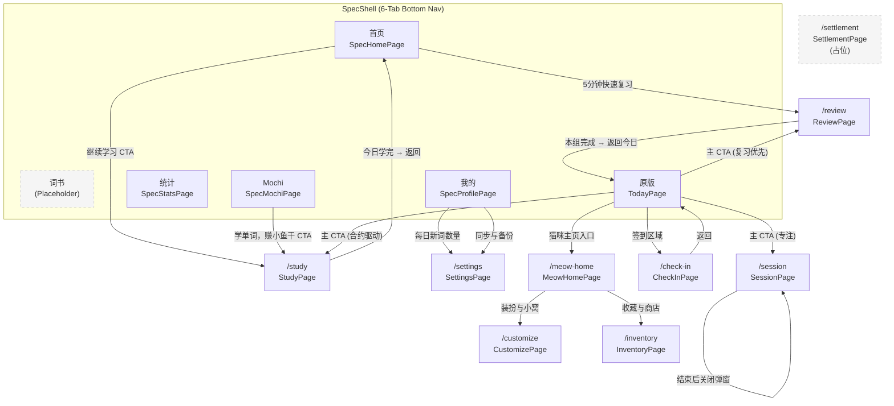

# UI 现状（代码反推）

> Phase 1 产出。完全从代码提取，未参考旧文档。
> 基准 commit: bface75

---

## 应用入口与导航结构

### 启动流程

- **入口**: `main.dart` → `WidgetsFlutterBinding.ensureInitialized()` → `LocalDatabase.initialize()` → `runApp(MeowApp())`
- **应用名**: 背单词喵喵
- **主题**: Material 3, `scaffoldBackgroundColor: #FDFBF7` (暖米色), `fontFamily: PingFang SC`, `colorSchemeSeed: #6B4FA8`
- **Home widget**: `SpecShell` (SPEC 新版 Tab Shell)
- **路由生成**: `AppRouter.generateRoute` (onGenerateRoute)
- **页面过渡**: fade + 轻微上滑 (280ms easeOutCubic)

### 导航架构

- `SpecShell` 为应用主壳，6-tab 底部导航栏直接切页（无动画，直接替换）
- 功能页面通过 `Navigator.pushNamed` 以命名路由跳转
- Tab 切换不触发路由栈变化，仅切换 Widget

### Tab 栏配置（SpecTabBar）

| Tab | 标签 | 对应页面 | 状态 |
|-----|------|----------|------|
| home | 首页 | `SpecHomePage` | 已实现 |
| books | 词书 | placeholder（"词书页尚未设计"） | 未实现 |
| mochi | Mochi | `SpecMochiPage` | 已实现 |
| stats | 统计 | `SpecStatsPage` | 已实现 |
| profile | 我的 | `SpecProfilePage` | 已实现 |
| legacy | 原版 | `TodayPage`（含 debug-only 警告 banner） | 开发参考 |

- Tab Bar 高度: 64px（含 safe area）
- 无 badge，无红点
- Legacy tab 标签始终 #B4A89A 色，选中时底部加下划线

### 路由表

| 路由 | 页面 Widget | 文件 | 用途 |
|------|-------------|------|------|
| `/` (today) | `TodayPage` | `features/today/today_page.dart` | Legacy 今日概览 |
| `/study` | `StudyPage` | `features/study/study_page.dart` | 新词学习 |
| `/review` | `ReviewPage` | `features/review/review_page.dart` | 复习 |
| `/session` | `SessionPage` | `features/session/session_page.dart` | 专注 Session |
| `/check-in` | `CheckInPage` | `features/check_in/check_in_page.dart` | 签到 |
| `/settlement` | `SettlementPage` | `features/settlement/settlement_page.dart` | 结算（占位） |
| `/meow-home` | `MeowHomePage` | `features/meow_home/meow_home_page.dart` | Legacy 猫咪主页 |
| `/inventory` | `InventoryPage` | `features/inventory/inventory_page.dart` | 收藏与商店 |
| `/customize` | `CustomizePage` | `features/customize/customize_page.dart` | 装扮与小窝 |
| `/settings` | `SettingsPage` | `features/settings/settings_page.dart` | 设置 |

---

## 页面详情

### SpecHomePage — SPEC 首页（Tab: home）

- **文件**: `lib/spec/pages/home_page.dart`
- **数据来源**:
  - [云端] `GET /me/today` → `TodayState`
  - [云端] `GET /me/secondary-summary` → `SecondarySummary`
- **主要交互**:
  - 下拉刷新 → 重新加载两个 API
  - Mochi 签到卡片 → `onTap` 空（由 tab 栏处理跳转到 Mochi tab）
  - **主 CTA "继续学习"** → `Navigator.pushNamed(context, '/study')`
  - 数字卡片（本书进度 / 错词本）→ 纯展示，无跳转
  - **快速复习入口** → `Navigator.pushNamed(context, '/review')`
  - 用户头像 → `onTap` 空（由 tab 栏处理跳转到 Profile tab）
- **信息层级**: 问候语 → Mochi 签到卡 → 主 CTA → 数字卡片 → 5 分钟快速复习
- **离线可用性**: 需要网络（两个 API 调用，无本地缓存降级）

### SpecMochiPage — Mochi 页（Tab: mochi）

- **文件**: `lib/spec/pages/mochi_page.dart`
- **数据来源**:
  - [云端] `GET /me/secondary-summary` → `SecondarySummary`
  - [云端] `GET /me/today` → `TodayState`
- **主要交互**:
  - Mochi 大图 → 可点击（隐藏新手引导提示，打印交互占位信息）
  - "+1 张新照片" 浮层 → 点击可关闭
  - **主 CTA "学单词，赚小鱼干 →"** �� `Navigator.pushNamed(context, '/study')`
  - 4 个次级入口（换装/房间/零食柜/日记）→ 均为 `debugPrint` 占位，无实际跳转（SPEC 9.2 范围外）
  - Mochi 日记预览卡 → 纯展示
- **信息层级**: 名称+天数+羁绊等级 → 大插画+对话气泡 → 进度条 → 主 CTA → 4 次级入口 → 日记预览
- **离线可用性**: 需要网络

### SpecStatsPage — 统计页（Tab: stats）

- **��件**: `lib/spec/pages/stats_page.dart`
- **数��来源**:
  - [云端] `GET /me/secondary-summary` → `SecondarySummary.statsSummary`
  - [云端] `GET /me/today` → `TodayState`
- **主要交互**:
  - 纯展示页面，无可操作按钮
  - 热力图为 mock 数据（固定种子 Random(42)，3x12 格）
  - "需要关注"列表 → 箭头符号但无实际跳转
  - Mochi 签名 → 非交互
- **信息层级**: 标题 → 已掌握 Hero 卡 → 三指标卡（连续/本周/记忆率）→ 12 周热力图 → 本周亮点 → 需要关注 → Mochi 签名
- **离线可用性**: 需要网络
- **注意**: 记忆率硬编码为 82%，未接入真实数据

### SpecProfilePage — 我的页（Tab: profile）

- **文件**: `lib/spec/pages/profile_page.dart`
- **数��来源**:
  - [云���] `GET /me/secondary-summary` → `SecondarySummary`
  - [本地端] `SharedPreferences` → `LocalSettingsService.dailyGoal`
- **主要交互**:
  - 用户身份区 → `onTap` 为 `debugPrint`（个人编辑页未设计，SPEC 9.3）
  - "切换 →" 词书 → `debugPrint`（词书切换页未设计，SPEC 9.3）
  - **"每日新词数量"** → `Navigator.pushNamed(context, '/settings')` + 返回后 reload 数据
  - "复习算法" → `debugPrint`（子页未设计）
  - "学习提醒" → `debugPrint`（子页未设计）
  - "发音" → `debugPrint`（子页未设计）
  - **"同步与备份"** → `Navigator.pushNamed(context, '/settings')`
  - "导出学习记录" → `debugPrint`（子页未设计）
  - "帮助与反馈" → `debugPrint`（子页未设计）
  - "版本 1.0.0" → 不可点击（无 chevron）
- **信息层级**: 用户身份 → 当前词书卡 → 学习设置组 → 数据设置组 → 关于设置组
- **离线可用性**: 部分可用（dailyGoal 来自本地 SharedPreferences，但 summary 需要网络）

### TodayPage — Legacy 今日页（Tab: legacy / 路由 `/`）

- **文件**: `lib/features/today/today_page.dart`
- **数据来源**:
  - [云端] `GET /me/today` → `TodayState`
  - [云端] `GET /me/secondary-summary` → `SecondarySummary`（含 `change_highlights`）
- **主要交互**:
  - AppBar 刷新按钮 → 重新加载
  - **主 CTA**（合约驱动）→ 根据 `TodayPrimaryActionData` 或 Option C 基线决定跳转:
    - `continue_review_group` → `/review`
    - `go_review` → `/review`
    - `go_session` → `/session`
    - `go_new_words` / 默认 → `/study`
  - 今日目标进度（新词/复习组）→ 纯展示
  - 复习深度块 → 纯展示（含组进度 + 今日复习进度）
  - **签到 + 连续天数区域** → 含签到按钮跳转到 `/check-in`
  - Session 卡片 → 跳转到 `/session`
  - **伴侣卡片** → 展示 `companionResponse` 每日问候 + 学习后反馈 + 连续签到反馈
  - **猫咪主页入口** → `Navigator.pushNamed(context, '/meow-home')`
  - 结算卡片 → 纯展示 `lastRewardSettlement`
- **离线可用性**: 需要网络

### StudyPage — 新词学习（路由 `/study`）

- **文件**: `lib/features/study/study_page.dart`
- **数据来源**:
  - [云端] `GET /me/new-words/next` → `Word`（通过 `StudyService`）
  - [本地端] SQLite `LocalDatabase` → 已掌握词 ID、写入学习记录
  - [云端] `POST /me/new-words` → 后台同步（fire-and-forget）
- **主要交互**:
  - 单词卡片 → 展示 wordText + phonetic + meaning
  - **"模糊" 按钮** → `_submitStudy('forgot')` → SQLite 先写 → SnackBar "已标记模糊" → 加载下一词
  - **"掌握" 按钮** → `_submitStudy('know')` → SQLite 先写 → SnackBar "已掌握 ✓" → 加载下一词
  - 全部学完 → 展示 "今日新词已学完" + **"返回" 按钮** → `Navigator.pop(context)`
  - 加载失败 → "重试" 按钮
- **架构**: Local-first（SQLite 先写入，API 后台同步），通过 `StudyService` 协调
- **离线可用性**: 部分可用（写入本地 OK，但获取下一个词需要网络）

### ReviewPage — 复习（路由 `/review`）

- **文件**: `lib/features/review/review_page.dart`
- **数据来源**:
  - [云端] `GET /me/review-groups/next` → `ReviewGroup`
  - [云端] `POST /review-attempts` → `ReviewAttemptResult`
- **主要交互**:
  - 进度条 → 展示本组完成数 / 总数
  - 单词卡片 → 展示 wordText + meaning
  - **"忘记" 按钮** → `_submitReview('incorrect')`
  - **"正确" 按钮** → `_submitReview('correct')`
  - 本组完成 → 三层边界提示（组完成 / 今日进度 / 下一组可用性）+ **"返回今日" 按钮** → `Navigator.pop(context)`
  - 组完成时如有 settlement → SnackBar 展示奖励状态
  - 加载失败 → "重试" 按钮
- **离线可用性**: 需要网络（所有操作都走 API）

### SessionPage — 专注 Session（路由 `/session`）

- **文件**: `lib/features/session/session_page.dart`
- **数据来源**:
  - [云端] `POST /sessions` → 创建 session
  - [云端] `POST /sessions/{id}/finish` → 结束 session
- **主要交互**:
  - 无 session 时:
    - **"开始 Session" 按钮** → `_startSession()` → 创建 session + 启动计时器
  - session 进行中:
    - 计时器显示 → 实时更新 (1秒/次)
    - 状态 Chip → "进行中"
    - 学习统计卡片 → 有效学习次数 / 有效复习次数
    - **"结束 Session" 按钮（红色）** → `_finishSession()` → 弹出验证结果对话框
  - session 已结束:
    - 验证结果弹窗 → valid/invalid/pending + 原因说明
    - **"开始新 Session" 按钮** → 重置状态
- **验证规则**: 需要 >= 15 分钟 + >= 5 次有效学习/复习
- **离线可用性**: 需要网络

### CheckInPage — 签到（路由 `/check-in`）

- **文件**: `lib/features/check_in/check_in_page.dart`
- **���据来源**:
  - [云端] `POST /check-ins` → `CheckInResult`
- **主要交互**:
  - 未签到时:
    - **"立即签到" 按钮** → `_checkIn()`
  - 已签到时:
    - 连续签到卡片 → 展示 `currentStreak` 天数
    - 今日学习卡片 → 展示 `learningDayToday` 状态
    - 签到说明卡片 → 签到 ≠ 学习日
    - **"返回" 按钮** → `Navigator.pop(context)`
- **离线可用性**: 需要网络

### SettlementPage — 结算（路由 `/settlement`）

- **文件**: `lib/features/settlement/settlement_page.dart`
- **数据来源**: 无
- **主要交互**: 纯占位页面，显示 "SettlementPage - Phase 1 暂不实现"
- **离线可用性**: 完全可用（无数据依赖）

### MeowHomePage — Legacy 猫咪主页（路由 `/meow-home`）

- **��件**: `lib/features/meow_home/meow_home_page.dart`
- **数据来源**:
  - [云端] `GET /me/secondary-summary` → `SecondarySummary`（含 `catSummary`, `companionResponse`, `equippedPreview`, `statsSummary`, `changeHighlights`）
  - [云端] `GET /me/today` → `TodayState`
  - [云端] `POST /me/feed` → `FeedResponse`
- **主要交互**:
  - AppBar 刷新按钮 → 重新加载
  - **猫咪头像 → 可点击**（随机互动文案 + 3 秒冷却）
  - **"喂小鱼干" 按钮** → `_feedCat()`:
    - 成功 → 随机成功文案 + Mood 变化
    - 升级 → 升级弹窗
    - 资源不足 → "小鱼干不够啦"
    - 已喂过 → "喵喵已经吃过啦~"
  - 资源栏 → 展示金币 / 小鱼干 / EXP
  - 成长卡片 → 展示等级 + EXP 进度条
  - 今日亮点区 → 展示签到/学习/新词/复习/专注/连续天数 chips
  - 变化亮点区 → 展示 `change_highlights`（最多 3 条）
  - 伴侣区 → 展示 `companionResponse`
  - 装备区 → 展示当前装扮 chips
  - 统计摘要区 → 展示学习天数/掌握词数/复习组/签到次数
  - **操作按钮区**:
    - "装扮与小窝" → `Navigator.pushNamed(context, '/customize')`
    - "收藏与商店" → `Navigator.pushNamed(context, '/inventory')`
- **离线可用性**: 需要网络

### InventoryPage — 收藏与商店（路由 `/inventory`）

- **文件**: `lib/features/inventory/inventory_page.dart`
- **数据来源**:
  - [云端] `GET /shop/catalog` → `CatalogResponse`
  - [云端] `GET /me/inventory` → `InventoryStateData`
  - [云端] `POST /shop/purchases` → `PurchaseResponse`
- **主要交互**:
  - AppBar 刷新按钮 → 重新加载
  - 余额卡片 → 展示金币余额 + 已拥有数
  - 我的收藏列表 → 展示已拥有物品
  - 商店列表 → 展示商品目录
    - 已拥有 → 显示 "已拥有"
    - 未拥有 → **"购买" 按钮** → `_purchase(item)`
      - 成功 → SnackBar "买到了「XXX」~"
      - 金币不足 → "金币不够啦，多学几个单词吧~"
      - 已拥有 → "已经拥有这个啦~"
      - 等级锁定 → "等级还不够，继续加油~"
- **离线可用性**: 需要网络

### CustomizePage — 装扮与小窝（路由 `/customize`）

- **文件**: `lib/features/customize/customize_page.dart`
- **数据来源**:
  - [云端] `GET /shop/catalog` → `CatalogResponse`
  - [云端] `GET /me/inventory` → `InventoryStateData`
  - [云端] `GET /me/equipment` → `EquipmentResponse`
  - [云端] `POST /shop/purchases` → `PurchaseResponse`
  - [云端] `POST /me/equipment/equip` → `EquipResponse`
- **主要交互**:
  - AppBar 刷新按钮 → 重新加载
  - 预览区 → 展示猫咪 + 装备槽位状态 + 空槽位提示
  - 资源栏 → 金币余额 + 拥有数/总数 + 已装备槽数/4
  - 攒钱目标提示 → 自动计算最近可攒到的未拥有物品
  - 已拥有未装备提示（最多3件）→ 每件有 **"装备" 按钮** → `_equip(item)`
  - 3 个 Tab（全部/已拥有/已装备）
  - 物品卡片:
    - 未拥有 → **"N 购买" 按钮** → `_purchase(item)` + 比较提示
    - 已拥有未装备 → **"装备" 按钮** → `_equip(item)` + 替换/空槽提示
    - 已装备 → 无操作按钮
  - 4 个装备槽位: head(头饰) / neck(颈饰) / decor(装饰) / floor(地面)
- **离线可用性**: 需要网络

### SettingsPage — 设置（路由 `/settings`）

- **文件**: `lib/features/settings/settings_page.dart`
- **数据来源**:
  - [本地端] `SharedPreferences` → `LocalSettingsService`（dailyGoal, desiredRetention）
  - [本地端] `LocalDatabase` (SQLite) → `SnapshotExportService` 导出快照
  - [云端] `BackupUploadService` → 上传备份到 `/api/v1`
  - [云端] `BackupRestoreService` → 从云端恢复备份
  - [云端] `PUT /me/settings/daily-goal` → 同步每日目标到后端
- **主要交互**:
  - **每日学习目标区**（受 `P3FeatureGuard.isDailyGoalSettingEnabled` 守卫，当前 = true）:
    - 点击 → 弹出输入对话框（范围 1-500）→ 保存到 SharedPreferences + 同步后端
  - **记忆设置区**:
    - "记忆保留率" → 点击弹出 Slider 对话框（范围 0.85-0.95，默认 0.90）→ 保存到 SharedPreferences
  - **数据备份区**:
    - 最近备份状态展示
    - **"立即备份" / "重试备份" 按钮** → 导出本地快照 + 上传到云端
    - 备份失败时显示错误信息
  - **恢复备份区**（受 `P3FeatureGuard.isRestoreEnabled` 守卫，当前 = true）:
    - **"恢复备份" 按钮** → 预检查 → 确认弹窗（高风险操作）→ 执行恢复
    - 预检查不通过时: 无备份 / 版本不支持 / 服务不可用
- **离线可用性**: 部分可用（设置读写 OK，备份/恢复需要网络）

---

## SPEC 设计系统

### Design Tokens（`lib/spec/theme/tokens.dart`）

#### 背景色 (SpecBg)
| Token | 色值 | 用途 |
|-------|------|------|
| canvas | `#FDFBF7` | 全局背景（暖米色，非纯白） |
| card | `#F5EFE6` | 主卡片背景 |
| cardDeep | `#ECE0CC` | 强调卡片背景 |
| cardOutline | `#FDFBF7` | 描边卡片背景（同 canvas） |
| mochiWarm | `#FAECE7` | Mochi 暖卡片 |
| heroPurple | `#EEEDFE` | 紫色 Hero 区域 |
| highlightGreen | `#E1F5EE` | 绿色亮点区域 |

#### 文字色 (SpecText)
| Token | 色值 | 用途 |
|-------|------|------|
| primary | `#2C2C2A` | 主文本 |
| secondary | `#888070` | 次要文本 |
| tertiary | `#B4A89A` | 提示文本 |
| purple | `#6B4FA8` | 数字/强调 |
| purpleDeep | `#26215C` | 标题 |
| coral | `#993C1D` | 连续天数/正面强调 |
| mochi | `#4A1B0C` | Mochi 卡片文本 |
| green | `#04342C` | 亮点卡片文本 |

#### 品牌色 (SpecBrand)
| Token | 色值 | 用途 |
|-------|------|------|
| purple | `#6B4FA8` | 主 CTA 紫色 |
| purpleDeep | `#534AB7` | 热力图最深色 |
| mochiRose | `#D4537E` | Mochi 页 CTA |

#### 排版 (SpecTypo)
- **字重**: 仅 400 (regular) 和 500 (medium)，全 App 禁止 600/700
- **最小字号**: 11px
- **字体族**: PingFang SC (iOS) / 系统 sans-serif (Android)
- **预设样式**: largeNumber(37px/w500), pageTitle(18px/w500), blockNumber(23px/w500), cardTitle(15px/w500), cardBody(14px/w400), cardSmall(13px/w400), label(12px/w400), labelSmall(11px/w400), tiny(10px/w400)

#### 圆角 (SpecRadius)
| Token | 值 | 用途 |
|-------|-----|------|
| small / card | 16px | 列表项/标准卡片 |
| large | 20px | 大卡片 |
| cta | 22px | 主 CTA 按钮 |
| pill | 999px | 胶囊 |
| heatmap | 3px | 热力图格 |

#### 间距 (SpecSpacing)
| Token | 值 | 用途 |
|-------|-----|------|
| pageH | 22px | 页面左右边距 |
| cardGap | 16px | 卡片间距 |
| cardPadSm | 13px | 卡片内部小间距 |
| cardPadLg | 20px | 卡片内部大间距 |
| elementGap | 10px | 元素小间距 |
| tabBarHeight | 64px | Tab Bar 高度 |
| minTouch | 44px | 最小触摸区域 |

#### 阴影 (SpecShadow)
- 全 App 零阴影，唯一例外: `floater`（"+1 新照片" 药丸浮层，offset(0,1) blur 3, black 6%）

### 组件库

#### 卡片系统（`lib/spec/widgets/spec_cards.dart`）

| 组件 | 背景 | 边框 | 圆角 | 用途 |
|------|------|------|------|------|
| `SpecCardFilled` | `#F5EFE6` | 无 | 16px | 默认数据卡片 |
| `SpecCardOutlined` | `#FDFBF7` | 0.5px `#E8DFCF` | 16px | 次要信息卡片 |
| `SpecCardHero` | `#6B4FA8` | 无 | 22px | 主 CTA / 大数字（白色文字，可选猫爪水印） |
| `SpecCardMochiWarm` | `#FAECE7` | 无 | 18px | Mochi 暖卡片 |
| `SpecCardStatsHero` | `#EEEDFE` | 无 | 22px | 统计 Hero 卡片（浅紫色，可选猫爪水印） |

#### Tab Bar（`lib/spec/widgets/spec_tab_bar.dart`）
- 6 个 tab，自定义 SVG 图标（`lib/spec/icons/tab_icons.dart`）
- 底部 0.5px `#ECE3D2` 边线
- 选中: 文字 `#2C2C2A` w500 + 图标变化; 未选中: 文字 `#888070` w400

#### 设置列表（`lib/spec/widgets/spec_settings_list.dart`）
- `SpecSettingsGroupLabel` → 组标签（11px, tertiary 色）
- `SpecSettingsGroup` → 描边容器 + 分隔线
- `SpecSettingsRow` → 单行设置项（label + value + 可选 chevron，min 44px 高度）

#### Mochi 插画（`lib/spec/icons/mochi_illustrations.dart`）
- `MochiAvatar` → 小头像（可指定 size）
- `MochiLarge` → 大插画（可指定 width）
- 使用 `CustomPainter` 绘制 SVG 风格猫咪

### FSRS 评分按钮（`lib/core/memory/widgets/rating_buttons.dart`）

- **组件**: `FsrsRatingButtons` → 4 个评分按钮的横向排列
- **默认 4 按钮配置**:
  | 按钮 | Rating | 标签 | 副标签 | 颜色 | 图标 |
  |------|--------|------|--------|------|------|
  | 不认识 | again | 不认识 | 重来 | `#E8564A` (暖红) | refresh |
  | 模糊 | hard | 模糊 | 有点印象 | `#E8A54A` (暖橙) | cloud |
  | 记得 | good | 记得 | 想了一下 | `#6B4FA8` (品牌紫) | check |
  | 秒答 | easy | 秒答 | 很简单 | `#3D9970` (沉绿) | bolt |
- **可选 interval 预览**: 显示 "下次: X天/周/月"
- **色盲友好**: 每个按钮同时有图标 + 颜色区分
- **注意**: 当前 StudyPage 和 ReviewPage 尚未集成此组件，仍使用旧版 2 按钮（掌握/模糊、正确/忘记）

---

## Feature Guards（`lib/core/guards/p3_feature_guard.dart`）

| Guard Flag | 当前值 | 用途 |
|------------|--------|------|
| `isStatisticsPageEnabled` | `false` | 统计独立页面（路由/导航/Shell） |
| `isCTADecisionSupportEnabled` | `false` | CTA 决策支持块 |
| `isStreakBasisSwitchEnabled` | `false` | 连续天数基准切换（learning_day 基准） |
| `isReviewReadinessContractEnabled` | `false` | 复习就绪合约 |
| `isStreakExplanationEnabled` | `false` | 连续天数未来规则说明 |
| `isLocalBackupEnabled` | `false` | 本地快照导出 |
| `isCloudBackupEnabled` | `false` | 云端备份上传 |
| `isRestoreEnabled` | **`true`** | 从备份恢复 |
| `isBackupSettingsEntryEnabled` | `false` | 备份设置入口可见性 |
| `isDailyGoalSettingEnabled` | **`true`** | 每日目标设置 UI |
| `isManualUploadEnabled` | **`true`** | 手动上传 |
| `isDownloadToLocalEnabled` | **`true`** | 下载云端进度到本地 |

**当前已启用的 Guard**: `isRestoreEnabled`, `isDailyGoalSettingEnabled`, `isManualUploadEnabled`, `isDownloadToLocalEnabled`

**在 UI 中的实际使用位置**:
- `SettingsPage._buildDailyGoalSection()` → 受 `isDailyGoalSettingEnabled` 守卫
- `SettingsPage._buildRestoreSection()` → 受 `isRestoreEnabled` 守卫

---

## 本地存储服务

### LocalSettingsService（SharedPreferences）

| Key | 类型 | 默认值 | 用途 |
|-----|------|--------|------|
| `settings_daily_goal` | int | 20 | 每日新词数量 |
| `settings_sound_enabled` | bool | true | 声音开关 |
| `settings_theme` | String | 'light' | 主题 |
| `settings_notification_time` | String | '09:00' | 通知时间 |
| `settings_desired_retention` | double | 0.9 | FSRS 记忆保留率 |

### LocalDatabase（SQLite via drift）

- 用于 Study local-first 写入（`word_records` 表）
- 用于 FSRS 卡片状态存储（`card_states` 表）
- 用于备份导出快照

### FsrsService

- 封装 fsrs pub.dev 库
- UI 层只看到 `ReviewRating` / `CardStateData`
- 默认参数: `desiredRetention=0.9`, `learningSteps=[1min, 10min]`, `relearningSteps=[10min]`
- ⚠️ TODO(待确认): FsrsService 当前是否被 StudyPage/ReviewPage 实际调用——代码中 StudyPage 使用旧版 2 按钮 + `StudyService`，ReviewPage 使用旧版 2 按钮 + 直接 ApiClient

---

## 页面跳转关系图 (Mermaid)

---

## 两套 UI 系统共存说明

当前应用存在两套 UI 系统并行:

1. **SPEC 设计系统**（新版）:
   - 使用 `SpecBg`, `SpecText`, `SpecTypo`, `SpecRadius`, `SpecSpacing` 等 token
   - 使用 `SpecCardFilled`, `SpecCardOutlined`, `SpecCardHero` 等卡片组件
   - 用于: `SpecHomePage`, `SpecMochiPage`, `SpecStatsPage`, `SpecProfilePage`, `SpecTabBar`

2. **Legacy 设计系统**（旧版）:
   - 使用 `MeowColors`, `MeowTextStyles`, `MeowSpacing`, `MeowRadius` 等（定义在 `shared/theme.dart`）
   - 使用 `MeowCard`, `MeowChip`, `ResourceBadge`, `PreviewContainer` 等组件
   - 用于: `TodayPage`, `MeowHomePage`, `CustomizePage`, `InventoryPage`, `SettingsPage`

3. **原生 Material 风格**（最简版）:
   - 直接使用 `Theme.of(context)` 和 Material 默认样式
   - 用于: `StudyPage`, `ReviewPage`, `SessionPage`, `CheckInPage`, `SettlementPage`
