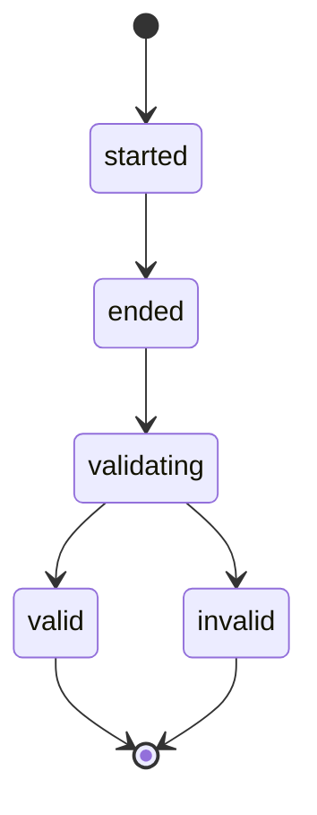
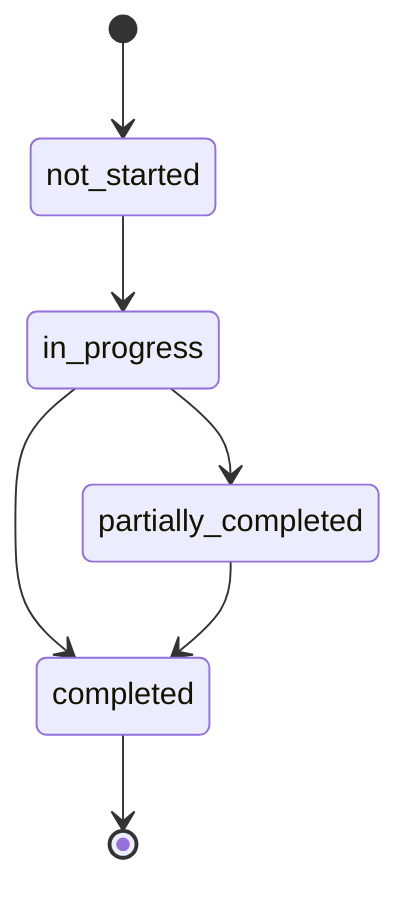
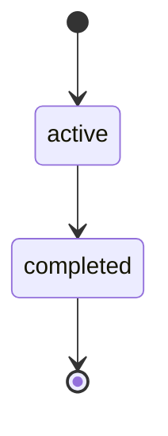
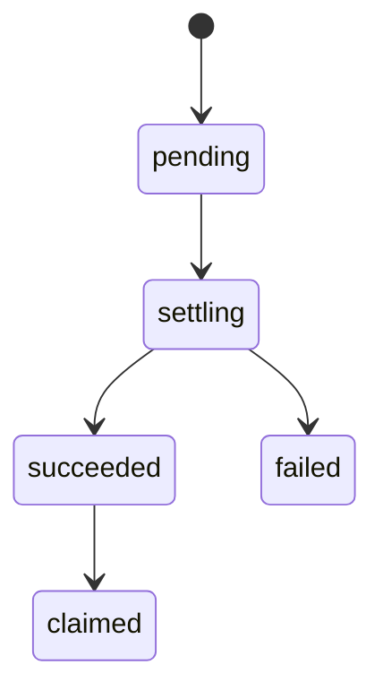
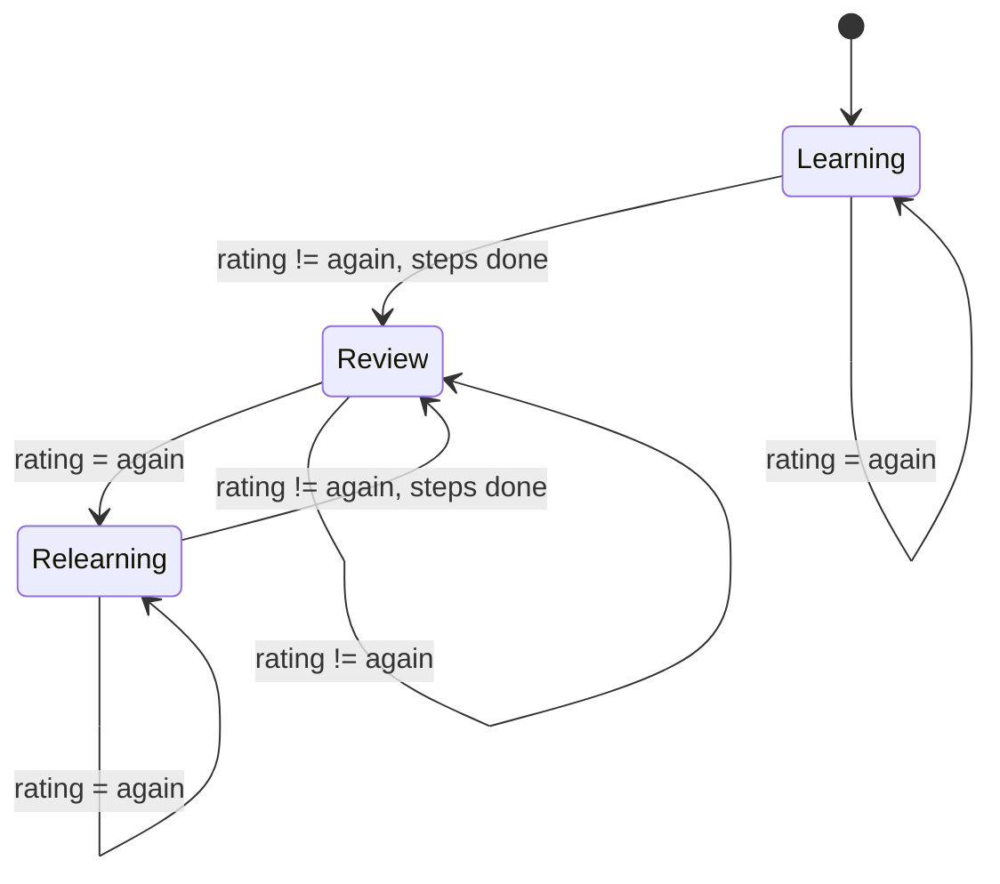

# BR-OPP-001 v0.2.0 -- 业务需求完整基线

**Project:** 背单词喵喵 App
**Version:** v0.2.0
**Date:** 2026-04-08
**Base commit:** bface75
**Previous version:** v0.1.9-full
**Reconciliation method:** 以代码（commit bface75）为 truth，对照 v0.1.9 旧文档，依据 Phase 3 差异报告合并产出

---

## 1. 变更摘要（vs v0.1.9）

本版是首次以**代码为真相源**的 BR 重写，不再以文档治理层为唯一输入。主要变更：

1. **新增 9 大业务模块完整规则**：从代码提取具体条件、数值、枚举，替代旧文档的抽象声明
2. **新增本地端 FSRS 记忆调度系统**：旧 BR 将 SRS 列为 Pending，但本地端已实现完整 FSRS（desiredRetention=0.9, 4 级评分, 卡片状态机）
3. **新增副机制完整规则**：猫养成数值（Lv.1-10 经验表）、喂食反作弊、商品目录（10 件）、购买/装备/卸装校验链、伴侣文案系统
4. **新增 Feature Guard 体系**：12 个 guard 精确对应 Pending Decision 控制
5. **新增词库批量下载**、本地 SessionBuilder 交错规则（3:1）、本地设置项 5 项
6. **标注所有云端 vs 本地端差异**：特别是复习系统（naive review group vs FSRS）和目标范围（1-100 vs 1-500）
7. **旧 BR 的 Frozen Rules 全部携带**：标注实际实现状态；Conditional Frozen guardrails 保留至 Pending 区
8. **StudyPage 评分按钮**标记为**暂定**：当前 StudyPage 使用 2 按钮（认识/不认识），FSRS 4 按钮已开发但未集成到 StudyPage
9. **将旧 BR 的回写建议、Room 治理层引用等非业务规则内容移除**：本文档聚焦业务规则本身

---

## 2. 产品概述

"背单词喵喵"是一款**学习驱动型轻养成产品**，将单词学习与虚拟猫养成结合。主机制（学习/复习/目标/Session/签到）是产品主线，副机制（猫养成/商店/装备/伙伴互动）承接学习结果作为陪伴与成长层，不得反向干扰主学习流程。

**技术架构：**
- 后端：NestJS API + 内存存储 + PostgreSQL 持久化
- 移动端：Flutter + 本地 SQLite（Drift ORM）+ FSRS 间隔重复调度
- 总定位：**local-first + simple backup**；本地运行态是真相源，云端当前只是 backup container

**当前阶段：** 单用户开发模式（dev-user-001）

---

## 3. 用户角色

| 角色 | 状态 | 说明 |
|------|------|------|
| 开发测试用户 | [已实现] | 硬编码 `DEV_USER_ID = 'dev-user-001'`，单用户模式 |
| 标准学习者 | [Pending] | 多用户认证系统未开发 |

---

## 4. 业务模块

### 4.1 单词学习 [双端]

**业务动作：** 获取新词、提交学习结果（认识/不认识）、批量下载词库

#### 4.1.1 云端逻辑 [云端] [已实现]

**`getNextNewWord()` -- 出词逻辑：**
- 前置条件：`today_new_completed < today_new_target`（且 `today_new_target > 0`）
- 排除条件：排除所有 `study_type === 'new' && action_result === 'know'` 的 word_id（已掌握词）
- `action_result === 'forgot'` 的词**不排除**，会重新出现
- 出词顺序：从 wordPool 按数组顺序（PG 中按 `sort_order ASC`），返回第一个未掌握词
- 词池来源：PG `words` 表（`book_id = 'book-001'`，按 `sort_order ASC`），PG 不可用时使用 5 个硬编码 fallback 词

**`submitStudyAttempt(wordId, bookId, studyType='new', actionResult, idempotencyKey)` -- 提交逻辑：**
- 幂等性：通过 `x-idempotency-key` 头保障
- 重复检测：同一 `word_id + study_type` 且 `action_result` 相同 -> 返回 `alreadyExists: true`
- 结果升级：同一 `word_id + study_type` 但 `action_result` 从 `forgot` -> `know` -> 允许更新，计为新完成
- 当 `action_result === 'know'` 时触发：
  1. `today_new_completed += 1`
  2. 重新计算 `daily_goal_status`
  3. 创建 `effective_new_word` 源事件 -> 触发奖励结算
  4. 更新 `learning_day`

#### 4.1.2 本地端逻辑 [本地端] [已实现]

- 新词通过 `SessionBuilder.buildTodaySession()` 混入学习队列
- 从 `cached_words` 表中选取不在 `card_states` 中的词（即从未见过的词）
- 选取数量 = `newCardsDailyLimit - countNewCardsToday()`，不超过 `newCardsDailyLimit`
- 选中的新词立即通过 `initCardForWord()` 创建 FSRS 卡片（state=Learning, due=now）
- `initCardForWord()` 是幂等的：已存在则返回现有卡片

#### 4.1.3 批量词库下载 [双端] [已实现]

- `GET /api/v1/books/:bookId/words?offset=0&limit=500`
- `offset` 默认 0，`limit` 默认 500，最大 1000
- 移动端通过 `WordCacheService.downloadAndCacheBook()` 分页下载到本地 `cached_words` 表
- 使用 `INSERT OR REPLACE` 保证幂等

#### 4.1.4 业务规则

| # | 规则 | 代码条件 | 状态 |
|---|------|---------|------|
| WL-01 | 每日新词上限 | `today_new_completed >= today_new_target` 时停止出新词 | [已实现] |
| WL-02 | 默认每日目标 | `userDailyNewTarget = 20` | [已实现] |
| WL-03 | 目标范围（云端） | `Math.max(1, Math.min(100, Math.floor(value)))` | [已实现] |
| WL-04 | 目标范围（本地端） | 设置页允许 1-500 | [已实现] |
| WL-05 | 掌握判定（云端） | `action_result === 'know'` | [已实现] |
| WL-06 | 未掌握重现 | `action_result === 'forgot'` 的词不从池中排除 | [已实现] |
| WL-07 | 结果升级 | 同一 word_id 从 forgot -> know 允许更新 | [已实现] |
| WL-08 | 幂等提交 | `x-idempotency-key` 保障 | [已实现] |
| WL-09 | 批量分页上限 | 默认 limit=500, 最大 1000 | [已实现] |
| WL-10 | 新词计数当日隔离 | `created_at` 在当日范围内，防跨日累积 | [已实现] |

> **Assumption (temporary, not frozen):** 云端与本地端目标范围不一致（1-100 vs 1-500）。旧 BR PD-006 将 `1-500` 保留为 recommendation，未升格为 frozen rule。当前两端各自独立实现。

> **Frozen Rule (from v0.1.9 BR-024):** 非法输入不得静默失败；至少需覆盖空值、非数字、小数、负数、0、超过上限、过长字符串、粘贴异常字符。`1-500` 当前仅是 recommended validation range，未自动升格为长期 frozen business rule。

---

### 4.2 FSRS 记忆调度 [本地端] [已实现]

**业务动作：** 初始化卡片、评分卡片、查询到期卡片、预览调度

> 旧 BR 将完整 SRS/复习调度算法列为 Pending (BR-014)，但本地端已实现完整 FSRS 系统。

#### 4.2.1 核心参数

| 参数 | 值 | 说明 |
|------|---|------|
| `desiredRetention` | `0.9`（默认） | 可调范围 `[0.85, 0.95]` |
| `learningSteps` | `[1 min, 10 min]` | 学习阶段步长 |
| `relearningSteps` | `[10 min]` | 重学阶段步长 |

#### 4.2.2 卡片状态（CardStateData）

| state 值 | 名称 | 说明 |
|----------|------|------|
| 1 | Learning | 学习中 |
| 2 | Review | 复习阶段 |
| 3 | Relearning | 重新学习 |

- `reps`: 连续正确次数，rating=again 时归零
- `lapses`: 遗忘次数，rating=again 时 +1

#### 4.2.3 `rateCard(wordId, rating)` 业务规则

原子事务（drift transaction）：
1. 读取当前 card_state
2. 快照 state-before（用于 review_log）
3. 计算 FSRS 调度结果
4. INSERT review_log（**不可变，永不更新/删除**）
5. UPDATE card_state

- rating=again -> `lapses++, reps=0`
- rating!=again -> `reps++`

#### 4.2.4 `listDueCards(nowLocal, limit?)` 业务规则

- 条件：`card_states.due <= nowUtcMs`
- 排序：`due ASC`（最过期优先）
- limit 可选（用于 `reviewCardsDailyLimit`）

#### 4.2.5 `countNewCardsToday(nowLocal)` 业务规则

- 统计条件：`card_states.created_at >= todayStart && < todayEnd`（本地日历日 00:00~23:59:59）

#### 4.2.6 四级评分映射（ReviewRating）

| 枚举值 | fsrs Rating | 用户文案 |
|--------|-------------|---------|
| again | Rating.again (1) | 不认识 |
| hard | Rating.hard (2) | 模糊 |
| good | Rating.good (3) | 想了一下才记起 |
| easy | Rating.easy (4) | 秒答 |

#### 4.2.7 业务规则

| # | 规则 | 代码条件 | 状态 |
|---|------|---------|------|
| FSRS-01 | 默认保留率 | `desiredRetention = 0.9` | [已实现] |
| FSRS-02 | 保留率范围 | `[0.85, 0.95]`（clamp） | [已实现] |
| FSRS-03 | review_log 不可变 | INSERT-ONLY，永不 update/delete | [已实现] |
| FSRS-04 | 到期排序 | `due ASC`（最过期优先） | [已实现] |
| FSRS-05 | rateCard 原子性 | drift transaction 内完成全部操作 | [已实现] |

#### 4.2.8 StudyPage 评分按钮 [暂定]

当前状态：
- **StudyPage** 使用 2 按钮（认识 `know` / 不认识 `forgot`），通过云端 API 提交
- **FSRS 4 按钮**（again/hard/good/easy）已完整开发（`FsrsRatingButtons` widget），但**未集成到 StudyPage**
- 4 按钮 widget 支持 interval preview（显示"下次: X"），已有完整测试
- 切换指南已写入代码注释：仅需修改 `rating_buttons.dart`、`review_rating.dart`、`fsrs_service.dart` 三个文件

---

### 4.3 复习 [双端]

**业务动作：** 获取/创建复习组、提交复习结果、本地复习队列构建

#### 4.3.1 云端逻辑 -- naive review group [云端] [已实现]

**`getOrCreateReviewGroup()`：**
- 前置条件：同一时间只允许一个 `group_status === 'active'` 的 group
- 已有 active group -> 直接返回
- 新建规则：从 wordPool 中筛选 `word_id.startsWith('word-r-')` 的词，取前 3 个
- 组大小：固定 3（临时开发规则）
- 创建后更新 today_state：`today_review_target = 1`, `today_review_pending = items.length`

**`submitReviewAttempt(reviewGroupId, wordId, actionResult, idempotencyKey)`：**
- group 不存在 -> `success: false`
- group 已完成 -> `success: false, alreadyExists: true`
- word 不在 group 中 -> `success: false`
- word 已完成 -> `alreadyExists: true`
- 正常提交 -> 标记 `item.completed = true`
- 全部完成时：`group_status = 'completed'`, `group_completed = true`, `today_review_completed += 1`
- 当 `action_result === 'correct'` 时触发 `updateLearningDay()`
- group 完成时触发 `review_group_completed` 源事件 -> 奖励结算（有 `hasReviewGroupCompletedEvent` 去重检查）

#### 4.3.2 本地端逻辑 -- FSRS 驱动 [本地端] [已实现]

**`SessionBuilder.buildTodaySession()`：**
1. 收集到期复习卡：`FsrsService.listDueCards(nowLocal, limit=reviewCardsDailyLimit)`
2. 计算剩余新词配额
3. 从 `cached_words` 选取新词候选
4. 为新词初始化 FSRS 卡片
5. 交错排列：复习:新词 = 3:1 比例 -> `[R, R, R, N, R, R, R, N, ...]`
6. 某一列表耗尽后直接追加剩余

复习评分通过 `FsrsService.rateCard()` 完成，使用 4 级评分。

#### 4.3.3 云端 vs 本地端差异汇总

| 维度 | 云端 | 本地端 |
|------|------|--------|
| 复习词选取 | `word_id.startsWith('word-r-')` 硬编码 | FSRS `due <= now` 到期队列 |
| 组大小 | 固定 3 | 无组概念，直接队列 |
| 评分系统 | 二元 correct/incorrect | 四级 again/hard/good/easy |
| 调度算法 | 无调度 | FSRS 间隔重复 |
| 交错 | 无 | 复习:新词 = 3:1 |

#### 4.3.4 业务规则

| # | 规则 | 代码条件 | 状态 |
|---|------|---------|------|
| RV-01 | 同时只一个 active group | `reviewGroups.find(g => g.group_status === 'active')` 最多一个 | [已实现] |
| RV-02 | 云端组大小 | 固定 3（临时开发规则） | [已实现] |
| RV-03 | 组完成去重 | `hasReviewGroupCompletedEvent` 防止重复发奖 | [已实现] |
| RV-04 | 组完成推进复习进度 | `today_review_completed += 1`，但不等于 daily goal completed | [已实现] |
| RV-05 | 本地交错比例 | 复习:新词 = 3:1 | [已实现] |
| RV-06 | 本地复习排序 | `due ASC`（最过期优先） | [已实现] |

> **Frozen Rule (from v0.1.9 BR-014):** `review_group` 是后端生成、后端持有的一次有限复习批次对象。同一用户同一时刻只允许一个 active group。同一 group 只能唯一完成、唯一结算、不得重复发奖。"本组完成"只推进"今日复习进度"，不自动等于"今日复习完成"或 `daily_goal_status=completed`。[已实现]

> **Frozen Rule (from v0.1.9 BR-014):** `next_group_readiness` 与 progress summary 只能由后端聚合结果判定；UI 不得凭 remaining count、自身计数、本地排序或页面状态自行推断。[Pending -- 后端未提供此聚合接口]

---

### 4.4 每日目标与签到 [双端]

**业务动作：** 目标状态计算、签到、CTA 决策、目标设置

#### 4.4.1 DailyGoalStatus 状态机 [云端] [已实现]

状态转换规则：
- `not_started` -> 初始状态，`today_new_completed === 0 && today_review_completed === 0`
- `in_progress` -> `today_new_completed > 0 || today_review_completed > 0`，但两个子目标均未达成
- `partially_completed` -> `newGoalMet XOR reviewGoalMet`（仅一个子目标达成）
- `completed` -> `newGoalMet && reviewGoalMet`

子目标判定：
- `newGoalMet = today_new_completed >= today_new_target`
- `reviewGoalMet = today_review_completed >= today_review_target`

> **Frozen Rule (from v0.1.9 BR-010):** `daily_goal_status` 只由"今日新词目标 + 今日复习要求"共同决定；不包含 Session、不包含签到。当日无待复习内容时，复习要求自然满足。[已实现]

#### 4.4.2 今日状态初始化（getTodayState）[云端] [已实现]

- 按日期键（`YYYY-MM-DD`）存储
- 新日自动创建：
  - `today_new_target` = `userDailyNewTarget`（默认 20）
  - 从历史 `studyAttempts` 重算当日 `today_new_completed`（防跨日累积）
  - 如有活跃 review group -> `today_review_target = 1`

#### 4.4.3 签到（CheckIn）[云端] [已实现]

- `POST /api/v1/check-ins`，需 `x-idempotency-key`
- 每日最多一次签到（按 `local_date` 去重）
- 签到后：`streak.current_streak += 1`
- 签到状态：`check_in_status = 'succeeded'`

> **Frozen Rule (from v0.1.9 BR-007):** `check_in` / `learning_day` / `streak` 是三类独立事实。签到 != learning_day。当前 MVP `streak` 按 `check_in` 延续（`streak_basis_type = 'check_in'`）。[已实现]

#### 4.4.4 CTA 决策支持（today_primary_action）[云端] [已开发 . 未集成]

优先级逻辑（受 `isCTADecisionSupportEnabled = false` guard 守卫）：
1. `active_review_group_id` 存在且 `remaining > 0` -> `continue_review_group`
2. `today_review_pending > 0` -> `go_review`
3. `session_started_today && !session_valid_today` -> `go_session`
4. 默认 -> `go_new_words`

> **Frozen Rule (from v0.1.9 BR-009):** Today 页永远只有一个最强主 CTA。active review_group 存在时，"继续本组复习"保持最高优先级。`today_primary_action` 是否进入 active contract 仍 Pending。[已开发 . 未集成]

#### 4.4.5 每日目标设置 [双端] [已实现]

**云端：**
- `PUT /api/v1/me/settings/daily-goal`
- 范围校验：`Math.max(1, Math.min(100, Math.floor(value || 20)))`
- 同时更新 PG `user_book_settings` 和内存 today_state
- 修改后立即重算 `daily_goal_status`

> **Frozen Rule (from v0.1.9 BR-023):** `daily_goal` 修改后本地保存即当天即时生效；不回溯重算历史 `daily_goal_status`、历史统计、或 `check_in / learning_day / streak` 事实。[已实现]

#### 4.4.6 本地设置（LocalSettingsService）[本地端] [已实现]

| 设置项 | 键名 | 默认值 | 范围 |
|--------|------|--------|------|
| 每日目标 | `settings_daily_goal` | 20 | 整数 |
| 声音开关 | `settings_sound_enabled` | true | bool |
| 主题 | `settings_theme` | `'light'` | string |
| 通知时间 | `settings_notification_time` | `'09:00'` | `'HH:mm'` |
| FSRS 记忆保留率 | `settings_desired_retention` | 0.9 | `[0.85, 0.95]` |

#### 4.4.7 learning_day 判定 [云端] [已实现]

- 判定条件：`effectiveLearningCount > 0 || effectiveReviewCount > 0`
- 即：有任何一次有效学习或有效复习即成立 learning_day

#### 4.4.8 业务规则

| # | 规则 | 代码条件 | 状态 |
|---|------|---------|------|
| DG-01 | 日目标完成判定 | `newGoalMet && reviewGoalMet` -> completed | [已实现] |
| DG-02 | 部分完成判定 | `newGoalMet XOR reviewGoalMet` -> partially_completed | [已实现] |
| DG-03 | 每日签到唯一 | 同 `local_date` 只允许一次 | [已实现] |
| DG-04 | 签到 != 学习日 | 两者独立事实 | [已实现] |
| DG-05 | 连续天数基于签到 | `streak_basis_type = 'check_in'`（当前 MVP） | [已实现] |
| DG-06 | 学习日判定 | `effectiveLearningCount > 0 \|\| effectiveReviewCount > 0` | [已实现] |
| DG-07 | 今日状态跨日隔离 | 按 `YYYY-MM-DD` 日期键存储 | [已实现] |
| DG-08 | 目标即时生效不回溯 | 修改后立即重算，不影响历史 | [已实现] |

---

### 4.5 学习会话（Session）[云端] [已实现]

**业务动作：** 开始会话、结束会话、查询会话状态

#### 4.5.1 `startSession(minutesTarget, idempotencyKey)`

- 幂等：通过 idempotency key 和 active session 检查
- 同一时间只允许一个 `session_status === 'started'` 的 session
- 默认 `session_minutes_target = 15`
- 初始状态：`session_status = 'started'`, `session_validation_status = 'pending'`

#### 4.5.2 `finishSession(sessionId, idempotencyKey)`

- 终态检查：如 session 已处于 `valid` 或 `invalid` -> 返回 `alreadyExists: true`
- 计算有效学习数：session 开始后的 `study_type === 'new' && action_result === 'know'` 数量
- 计算有效复习数：session 开始后的 `action_result === 'correct'` 数量
- 状态链：`started -> ended -> validating -> valid|invalid`

#### 4.5.3 MVP 验证规则

| 条件 | 阈值 | 状态 |
|------|------|------|
| 时长 | `actualMinutes >= 15` | [已实现] |
| 有效尝试总数 | `effectiveLearningCount + effectiveReviewCount >= 5` | [已实现] |
| 验证结果 | 两者均满足 -> `valid`；否则 -> `invalid` | [已实现] |

会话验证通过后：更新 `session_valid_today = true`

> **Frozen Rule (from v0.1.9 BR-011):** Session 必须正常启动、正常结束、达到当前配置时长（MVP 默认 15 分钟），并在该 Session 内产生至少 5 次 effective attempts 总和，才记为 `valid`。`effective attempts` 指同一 `session_id` 下被后端最终计入有效事实的原子学习提交总数。[已实现]

#### 4.5.4 业务规则

| # | 规则 | 代码条件 | 状态 |
|---|------|---------|------|
| SS-01 | 会话验证-时长 | `actualMinutes >= 15` | [已实现] |
| SS-02 | 会话验证-尝试数 | `effectiveLearning + effectiveReview >= 5` | [已实现] |
| SS-03 | 会话同时只一个 | `session_status === 'started'` 最多一个 | [已实现] |
| SS-04 | 终态不可变 | `valid`/`invalid` 为终态，不可再变 | [已实现] |

---

### 4.6 奖励结算 [云端] [已实现]

**业务动作：** 创建源事件、创建结算、计算余额

#### 4.6.1 两层结构

1. **源事件层（RewardSourceEvent）：** 记录触发奖励的主机制事件
2. **奖励账本层（RewardLedgerItem）：** 具体奖励条目

> **Frozen Rule (from v0.1.9 BR-004):** 奖励链路必须至少分成两段：来源事件成立（可进入结算）+ 奖励账本到账（最终发放）。UI 不得把第一段误写成第二段。[已实现]

#### 4.6.2 触发条件

| 源事件类型 | 触发时机 | 奖励 | 状态 |
|-----------|---------|------|------|
| `effective_new_word` | `submitStudyAttempt` 且 `action_result === 'know'` | 2 coins + 1 exp | [已实现] |
| `review_group_completed` | review group 内所有 item completed（有 `hasReviewGroupCompletedEvent` 去重） | 5 coins + 1 fish_treat | [已实现] |

#### 4.6.3 结算流程

1. `createOrGetSourceEvent(type, refId, idempotencyKey)` -> 创建或获取源事件
2. `createSettlement(sourceEventId, idempotencyKey)` -> 创建结算记录 + 奖励条目
3. `reward_settlement_status` 在 dev 模式下直接设为 `'succeeded'`

> `settling`、`failed`、`claimed` 在代码中有类型定义但无转换路径，为生产环境预留。

#### 4.6.4 余额计算（getBalanceSnapshot）

- 遍历 `rewardLedgerItems`，只累计 `reward_status === 'succeeded'` 的条目
- `fish_treats` 扣除所有 `feedRecords` 的 `consumed_amount`
- `coins` 扣除 `coinsSpent`（商店购买累计）
- 所有余额 `Math.max(0, ...)`

#### 4.6.5 独立结算入口

- `POST /api/v1/settlements/learning-rounds`：可手动创建结算（接受 `source_event_type` + `source_ref_id`）

#### 4.6.6 业务规则

| # | 规则 | 代码条件 | 状态 |
|---|------|---------|------|
| RW-01 | 有效新词奖励 | know 一个新词: +2 coins, +1 exp | [已实现] |
| RW-02 | 复习组完成奖励 | group 全完成: +5 coins, +1 fish_treat | [已实现] |
| RW-03 | 奖励去重 | `hasReviewGroupCompletedEvent` 检查 | [已实现] |
| RW-04 | 余额不低于零 | `Math.max(0, ...)` | [已实现] |
| RW-05 | 幂等结算 | 所有写操作通过 `x-idempotency-key` 保障 | [已实现] |

> **Frozen Rule (from v0.1.9 BR-005):** 所有会推进进度、创建来源事件、产生账本奖励的关键写操作必须幂等；重复请求不得重复发奖。[已实现]

---

### 4.7 虚拟猫养成 [云端] [已实现]

**业务动作：** 查看猫咪信息、喂食、获取伙伴回应

#### 4.7.1 猫咪基础信息

- `nickname = 'Mimi'`（硬编码）
- `baseMood = 60`
- `baseBond = 0`

#### 4.7.2 等级系统（computeLevelFromExp）

| 等级 | 累计 EXP 需求 |
|------|--------------|
| Lv.1 | 0 |
| Lv.2 | 20 |
| Lv.3 | 50 |
| Lv.4 | 90 |
| Lv.5 | 145 |
| Lv.6 | 215 |
| Lv.7 | 305 |
| Lv.8 | 420 |
| Lv.9 | 565 |
| Lv.10 | 745 |

- 等级上限：Lv.10
- `totalExp = balanceSnapshot.exp + feedExpAccumulated`

#### 4.7.3 属性计算规则（getCatSummary）

| 属性 | 计算公式 |
|------|---------|
| level | `computeLevelFromExp(totalExp)` |
| mood | `Math.min(100, baseMood + fish_treats * 5 + feedMoodAccumulated)` |
| bond | `balanceSnapshot.exp + feedBondAccumulated` |
| energy | `totalExp >= 20` -> 'high'; `totalExp === 0` -> 'medium'; 其余 -> 'medium' |

> 注意：energy 的 'low' 状态在当前代码中**不可达**。

#### 4.7.4 喂食（feedCat）

- 仅支持 `feed_item_type = 'fish_treat'`
- 每次消耗 1 fish_treat
- 前置条件：`balanceSnapshot.fish_treats >= 1`
- 反作弊：每日前 3 次喂食为完整收益，第 4 次及以后为衰减收益

| 喂食次序 | mood_delta | exp_delta | bond_delta |
|---------|-----------|-----------|-----------|
| 第 1-3 次 | +4 | +2 | +1 |
| 第 4+ 次 | +1 | 0 | 0 |

- 喂食后检测升级：`levelAfterFeed > levelBeforeFeed` -> `leveledUp: true`

#### 4.7.5 伙伴回应（getCompanionResponse）

- `daily_greeting`: 根据条件从文案池中随机选择
  - `learningDayToday` -> 学习相关问候（7 条）
  - `hasCheckedIn` -> 签到相关问候（5 条）
  - 默认 -> 通用问候（7 条）
- `post_learning_response`:
  - `sessionValidToday` -> 专注时间相关（5 条）
  - `learningDayToday && dailyGoalStatus === 'completed'` -> 完成相关（5 条）
  - `learningDayToday && (partially_completed || in_progress)` -> 进行中鼓励（5 条）
  - 其余 -> `null`
- `streak_node_response`:
  - 连续天数节点：`[3, 5, 7, 10, 14, 21, 30, 50]`
  - 命中节点时从对应文案池随机选择
  - 非节点天数 -> `null`

#### 4.7.6 业务规则

| # | 规则 | 代码条件 | 状态 |
|---|------|---------|------|
| CAT-01 | 等级上限 | Lv.10 = 745 cumulative exp | [已实现] |
| CAT-02 | mood 上限 | `Math.min(100, ...)` | [已实现] |
| CAT-03 | 喂食前置条件 | `balanceSnapshot.fish_treats >= 1` | [已实现] |
| CAT-04 | 喂食反作弊 | 每日前 3 次完整收益，第 4+ 次衰减 | [已实现] |
| CAT-05 | 连续天数节点 | `[3, 5, 7, 10, 14, 21, 30, 50]` | [已实现] |

---

### 4.8 商店/库存/装备 [云端] [已实现]

**业务动作：** 浏览商品、购买、装备、卸装、查看库存

#### 4.8.1 商品目录（catalog）

| item_id | item_type | slot | name | coin_price | required_level |
|---------|-----------|------|------|-----------|---------------|
| cat_hat_red | outfit | head | 红色小帽子 | 60 | 1 |
| cat_bow_blue | outfit | neck | 蓝色蝴蝶结 | 80 | 2 |
| cat_scarf_pink | outfit | neck | 粉色围巾 | 100 | 3 |
| room_lamp_warm | room_item | decor | 暖光小台灯 | 120 | 3 |
| room_rug_soft | room_item | floor | 柔软小地毯 | 150 | 4 |
| cat_hat_straw | outfit | head | 草编小草帽 | 90 | 2 |
| cat_bow_yellow | outfit | neck | 向日葵领结 | 110 | 3 |
| cat_scarf_stripe | outfit | neck | 条纹暖围巾 | 130 | 4 |
| room_plant_small | room_item | decor | 小盆栽绿植 | 100 | 2 |
| room_cushion_cloud | room_item | floor | 云朵小靠垫 | 140 | 3 |

所有商品 `is_active = true`。

#### 4.8.2 购买（purchaseItem）业务规则

| 检查顺序 | 条件 | 错误码 |
|---------|------|--------|
| 1 | 商品不存在或非 active | `ITEM_NOT_FOUND` |
| 2 | 已拥有（无堆叠） | `ITEM_ALREADY_OWNED` |
| 3 | `computeLevelFromExp(totalExp) < required_level` | `ITEM_LEVEL_LOCKED` |
| 4 | `balanceSnapshot.coins < coin_price` | `COINS_NOT_ENOUGH` |
| 通过 | `coinsSpent += coin_price`，创建 OwnedItem | succeeded |

#### 4.8.3 装备（equipItem）业务规则

| 检查顺序 | 条件 | 错误码 |
|---------|------|--------|
| 1 | 商品不在目录中 | `ITEM_NOT_FOUND` |
| 2 | 未拥有 | `ITEM_NOT_OWNED` |
| 通过 | 装备到对应 slot，替换该 slot 旧装备 | succeeded |

- 每个 slot 只能装备一件物品
- 装备时：新物品 `equipped = true`，同 slot 同 item_type 的旧物品 `equipped = false`
- 装备分类：`outfit` -> `equippedOutfit[slot]`，`room_item` -> `equippedRoom[slot]`

#### 4.8.4 卸装（unequipItem）业务规则

- 商品不在目录 -> `ITEM_NOT_FOUND`
- 未拥有 -> `ITEM_NOT_OWNED`
- 通过 -> 对应 slot 设为 `null`，`equipped = false`

#### 4.8.5 业务规则

| # | 规则 | 代码条件 | 状态 |
|---|------|---------|------|
| SHOP-01 | 购买-等级锁 | `currentLevel < required_level` -> ITEM_LEVEL_LOCKED | [已实现] |
| SHOP-02 | 购买-余额不足 | `balance.coins < coin_price` -> COINS_NOT_ENOUGH | [已实现] |
| SHOP-03 | 购买-不可堆叠 | 已拥有 -> ITEM_ALREADY_OWNED | [已实现] |
| SHOP-04 | 装备-每 slot 一件 | 同 slot 新装备替换旧装备 | [已实现] |
| SHOP-05 | 装备-须拥有 | 未拥有 -> ITEM_NOT_OWNED | [已实现] |

---

### 4.9 备份与恢复 [双端] [已实现]

**业务动作：** 导出本地快照、上传备份、查询备份、下载快照、恢复备份

#### 4.9.1 云端备份容器 [云端] [已实现]

- `POST /api/v1/me/backup` -- 上传快照
  - 接受 `{ snapshot, schema_version }` body
  - 校验：`snapshot` 必须是非空对象
  - 存储在内存（`_latestBackup`, `_backupSnapshot`），**非持久化**
  - 返回 `backup_id`, `uploaded_at`, `schema_version`

- `GET /api/v1/me/backup/latest` -- 查询最新备份状态
  - 无备份时返回 `status: 'no_backup_yet'`

- `GET /api/v1/me/backup/latest/snapshot` -- 获取完整快照（用于恢复）
  - 无备份时返回 `status: 'no_backup_found'`
  - 有备份时返回完整 snapshot JSON

> 备份是**备份容器**，不是同步系统。upload success != sync success。

#### 4.9.2 本地端服务链 [本地端] [已实现]

- `SnapshotExportService` -- 本地快照导出
- `BackupUploadService` -- 上传快照到云端
- `BackupRestoreService` -- 从云端下载并恢复
- `LocalProgressRepository` -- 本地进度数据

#### 4.9.3 业务规则

| # | 规则 | 代码条件 | 状态 |
|---|------|---------|------|
| BK-01 | 三层成功语义分离 | upload / download / restore 各自独立 | [已实现] |
| BK-02 | 备份非同步 | upload success != sync success | [已实现] |
| BK-03 | restore manual-only | 需 pre-check + warning + confirm | [已实现] |
| BK-04 | 备份容器非持久化 | 内存存储，服务重启后丢失 | [已实现]（开发阶段） |

> **Frozen Rule (from v0.1.9 BR-019A):** 系统采取 local-first + simple backup 总定位。本地运行态是真相源，云端当前只是 backup container，不是 runtime truth，不是 sync truth。[已实现]

> **Frozen Rule (from v0.1.9 BR-020):** `upload success` / `download success` / `restore success` 是三层不同业务语义，必须严格分开。[已实现]

> **Frozen Rule (from v0.1.9 BR-021):** restore 当前仍是 manual-only，必须具备 `pre-check + warning + confirm`，且不得 silent overwrite。[已实现]

> **Frozen Rule (from v0.1.9 BR-022):** restore warning 至少必须覆盖：作用对象、覆盖风险、非自动同步系统定位；覆盖风险需显式包含最小设置层（如 `daily_goal`）可能被覆盖。[已实现]

> **Frozen Rule (from v0.1.9 BR-025):** 本轮 direct-scope delta 明确继续不做：full sync、background sync、multi-device merge、partial restore、snapshot picker、delete backup、clear local、destructive actions bundle。[已实现]

---

## 5. 业务流程

### 5.1 流程 1: 每日学习完整流程（云端）

1. **打开应用** -> `GET /api/v1/me/today`
   - 调用 `updateLearningDay(today)` 刷新学习日状态
   - 返回 TodayState（含 daily_goal_status、签到状态、连续天数、CTA 建议、复习摘要）

2. **签到**（可选）-> `POST /api/v1/check-ins`
   - `streak.current_streak += 1`
   - `has_checked_in_today = true`

3. **学习新词** -> `GET /api/v1/me/new-words/next` 获取下一个新词
   - 达到 `today_new_target` 时返回空

4. **提交学习结果** -> `POST /api/v1/me/new-words`
   - `action_result = 'know'` -> 计为有效，触发奖励结算（+2 coins, +1 exp）
   - `action_result = 'forgot'` -> 不计为有效，该词后续重新出现

5. **获取复习组** -> `GET /api/v1/me/review-groups/next`
   - 返回 active group 或创建新 group（3 词）

6. **提交复习结果** -> `POST /api/v1/review-attempts`
   - 逐词提交 correct/incorrect
   - group 全部完成 -> 触发奖励结算（+5 coins, +1 fish_treat）

7. **开始会话**（可选）-> `POST /api/v1/sessions`
   - 设定 session_minutes_target（默认 15 分钟）

8. **结束会话** -> `POST /api/v1/sessions/:id/finish`
   - 验证：>= 15 分钟 AND >= 5 有效尝试 -> valid
   - valid 后 -> `session_valid_today = true`

9. **查看次要激励摘要** -> `GET /api/v1/me/secondary-summary`
   - 返回余额、猫摘要、伙伴回应、装备预览、变化高亮、统计摘要

10. **喂猫**（可选）-> `POST /api/v1/me/feed`
    - 消耗 1 fish_treat，获得 mood/exp/bond 增长

### 5.2 流程 2: 本地学习会话构建流程（移动端）

1. `WordCacheService.ensureCached(bookId)` -- 确保词库已缓存
2. `SessionBuilder.buildTodaySession(nowLocal, newCardsDailyLimit, reviewCardsDailyLimit?)`:
   a. 收集到期复习卡（FSRS `due <= now`）
   b. 计算今日剩余新词配额
   c. 从 cached_words 选取新词候选
   d. 为新词初始化 FSRS 卡片
   e. 交错排列（3:1 复习:新词比例）
3. 用户作答 -> `FsrsService.rateCard(wordId, rating)` -- 原子更新卡片 + 写入 review_log

### 5.3 流程 3: 购买与装备流程

1. `GET /api/v1/shop/catalog` -- 查看商品目录
2. `POST /api/v1/shop/purchases` -- 购买（校验 4 项条件）
3. `POST /api/v1/me/equipment/equip` -- 装备物品
4. `POST /api/v1/me/equipment/unequip` -- 卸装物品
5. `GET /api/v1/me/equipment` -- 查看装备快照

### 5.4 流程 4: 备份与恢复流程

1. 本地导出快照（SnapshotExportService）
2. `POST /api/v1/me/backup` -- 上传到云端备份容器
3. `GET /api/v1/me/backup/latest` -- 查询备份状态
4. `GET /api/v1/me/backup/latest/snapshot` -- 下载完整快照
5. 本地恢复（BackupRestoreService）-- 需 pre-check + warning + confirm

---

## 6. 业务规则汇总

| # | 规则描述 | 代码条件 | 模块 | 状态 |
|---|---------|---------|------|------|
| BR-01 | 每日新词上限 | `today_new_completed >= today_new_target` | 单词学习 | [已实现] |
| BR-02 | 默认每日目标 | `userDailyNewTarget = 20` | 目标设置 | [已实现] |
| BR-03 | 目标值范围（云端） | `Math.max(1, Math.min(100, Math.floor(value)))` | 目标设置 | [已实现] |
| BR-04 | 已掌握排除 | `study_type === 'new' && action_result === 'know'` 的词排除 | 单词学习 | [已实现] |
| BR-05 | 未掌握重现 | `action_result === 'forgot'` 的词不排除 | 单词学习 | [已实现] |
| BR-06 | 结果升级允许 | 同 word_id 从 forgot -> know 允许更新 | 单词学习 | [已实现] |
| BR-07 | 同一活跃 group | `reviewGroups.find(g => g.group_status === 'active')` 最多一个 | 复习 | [已实现] |
| BR-08 | 复习组大小 | 固定 3（临时） | 复习 | [已实现] |
| BR-09 | 日目标完成判定 | `newGoalMet && reviewGoalMet` -> completed | 每日目标 | [已实现] |
| BR-10 | 部分完成判定 | `newGoalMet XOR reviewGoalMet` -> partially_completed | 每日目标 | [已实现] |
| BR-11 | 每日签到唯一 | 同 `local_date` 只允许一次 | 签到 | [已实现] |
| BR-12 | 签到 != 学习日 | 两者独立事实 | 签到 | [已实现] |
| BR-13 | 连续天数基于签到 | `streak_basis_type = 'check_in'`（当前 MVP） | 签到 | [已实现] |
| BR-14 | 会话验证-时长 | `actualMinutes >= 15` | 会话 | [已实现] |
| BR-15 | 会话验证-尝试数 | `effectiveLearning + effectiveReview >= 5` | 会话 | [已实现] |
| BR-16 | 会话同时只一个 | `session_status === 'started'` 最多一个 | 会话 | [已实现] |
| BR-17 | 有效新词奖励 | know -> 2 coins + 1 exp | 奖励结算 | [已实现] |
| BR-18 | 复习组完成奖励 | group 全完成 -> 5 coins + 1 fish_treat | 奖励结算 | [已实现] |
| BR-19 | 奖励去重 | `hasReviewGroupCompletedEvent` 检查 | 奖励结算 | [已实现] |
| BR-20 | 余额不低于零 | `Math.max(0, ...)` | 余额 | [已实现] |
| BR-21 | 喂食前置条件 | `balanceSnapshot.fish_treats >= 1` | 喂食 | [已实现] |
| BR-22 | 喂食反作弊 | 每日前 3 次完整收益，第 4+ 次衰减 | 喂食 | [已实现] |
| BR-23 | 等级上限 | Lv.10 = 745 cumulative exp | 猫养成 | [已实现] |
| BR-24 | mood 上限 | `Math.min(100, ...)` | 猫养成 | [已实现] |
| BR-25 | 购买-等级锁 | `currentLevel < required_level` -> ITEM_LEVEL_LOCKED | 商店 | [已实现] |
| BR-26 | 购买-余额不足 | `balance.coins < coin_price` -> COINS_NOT_ENOUGH | 商店 | [已实现] |
| BR-27 | 购买-不可堆叠 | 已拥有 -> ITEM_ALREADY_OWNED | 商店 | [已实现] |
| BR-28 | 装备-每 slot 一件 | 同 slot 新装备替换旧装备 | 装备 | [已实现] |
| BR-29 | 装备-须拥有 | 未拥有 -> ITEM_NOT_OWNED | 装备 | [已实现] |
| BR-30 | 幂等性 | 所有写操作通过 `x-idempotency-key` 保障 | 全局 | [已实现] |
| BR-31 | 学习日判定 | `effectiveLearningCount > 0 \|\| effectiveReviewCount > 0` | 学习日 | [已实现] |
| BR-32 | FSRS 默认保留率 | `desiredRetention = 0.9` | FSRS | [已实现] |
| BR-33 | FSRS 保留率范围 | `[0.85, 0.95]`（clamp） | FSRS | [已实现] |
| BR-34 | review_log 不可变 | INSERT-ONLY，永不 update/delete | FSRS | [已实现] |
| BR-35 | 新词计数-当日隔离 | `created_at.startsWith(today)` 防跨日累积 | 单词学习 | [已实现] |
| BR-36 | 连续天数节点回应 | `[3, 5, 7, 10, 14, 21, 30, 50]` | 伙伴回应 | [已实现] |
| BR-37 | 本地交错比例 | 复习:新词 = 3:1 | 本地会话 | [已实现] |
| BR-38 | 批量词库分页 | 默认 limit=500, 最大 1000 | 词库下载 | [已实现] |
| BR-39 | 备份非同步 | upload success != sync success | 备份 | [已实现] |
| BR-40 | 三层成功语义 | upload/download/restore 各自独立 | 备份 | [已实现] |
| BR-41 | restore manual-only | pre-check + warning + confirm | 备份 | [已实现] |
| BR-42 | daily_goal 即时生效不回溯 | 修改后立即重算，不影响历史 | 目标设置 | [已实现] |
| BR-43 | 主机制事实后端为准 | 前端不得自行判定最终业务事实 | 全局 | [已实现] |
| BR-44 | 副机制不得自造学习收益 | 奖励来源必须可追到主机制 source event | 全局 | [已实现] |

---

## 7. 枚举值与状态机

### 7.1 状态枚举

| 枚举名称 | 允许值 |
|---------|--------|
| `DailyGoalStatus` | `'not_started'` \| `'in_progress'` \| `'partially_completed'` \| `'completed'` |
| `SessionStatus` | `'started'` \| `'ended'` \| `'validating'` \| `'valid'` \| `'invalid'` |
| `SessionValidationStatus` | `'pending'` \| `'valid'` \| `'invalid'` |
| `RewardSettlementStatus` | `'pending'` \| `'settling'` \| `'succeeded'` \| `'failed'` \| `'claimed'` |
| `RewardStatus` | `'pending'` \| `'succeeded'` \| `'failed'` |
| `CheckInStatus` | `'succeeded'` \| `'failed'` |
| `ReviewGroupStatus` | `'active'` \| `'completed'` |
| `DailyReviewProgressStatus` | `'not_started'` \| `'in_progress'` \| `'completed'` |
| `NextGroupReadiness` | `'ready'` \| `'not_ready'` |

### 7.2 业务类型枚举

| 枚举名称 | 允许值 |
|---------|--------|
| `StudyType` | `'new'` \| `'review'` |
| `StudyActionResult` | `'know'` \| `'forgot'` |
| `ReviewActionResult` | `'correct'` \| `'incorrect'` |
| `SourceEventType` | `'effective_new_word'` \| `'review_group_completed'` |
| `RewardType` | `'coins'` \| `'fish_treats'` \| `'exp'` |
| `FeedItemType` | `'fish_treat'` |
| `FeedResultStatus` | `'succeeded'` \| `'insufficient_resource'` |
| `CatalogItemType` | `'outfit'` \| `'room_item'` |
| `PurchaseResultStatus` | `'succeeded'` \| `'failed'` |
| `PurchaseErrorCode` | `'COINS_NOT_ENOUGH'` \| `'ITEM_ALREADY_OWNED'` \| `'ITEM_NOT_FOUND'` \| `'ITEM_LEVEL_LOCKED'` |
| `EquipResultStatus` | `'succeeded'` \| `'failed'` |
| `EquipErrorCode` | `'ITEM_NOT_OWNED'` \| `'ITEM_NOT_FOUND'` |
| `TodayPrimaryActionType` | `'continue_review_group'` \| `'go_review'` \| `'go_new_words'` \| `'go_session'` |
| `TodayPrimaryActionReason` | `'active_review_group'` \| `'review_due_priority'` \| `'new_words_remaining'` \| `'session_pending'` |
| `ChangeHighlightKind` | `'purchase'` \| `'equip'` \| `'growth'` \| `'streak'` \| `'post_learning'` |
| `ChangeHighlightStatus` | `'confirmed'` \| `'hinted'` |

### 7.3 本地端枚举

| 枚举名称 | 允许值 | 说明 |
|---------|--------|------|
| `ReviewRating` | `again` \| `hard` \| `good` \| `easy` | 本地 FSRS 评分 |
| `CardState (int)` | `1` = Learning \| `2` = Review \| `3` = Relearning | FSRS 卡片状态 |

### 7.4 状态转换图

#### SessionStatus 状态链

> `valid`/`invalid` 为终态，不可再变。

#### DailyGoalStatus 状态转换

> 任何学习/复习活动均可能跳过中间状态。

#### ReviewGroupStatus 状态转换

> group 内所有 `item.completed === true` 时转换。

#### RewardSettlementStatus（定义值）

> 当前 dev 模式中只使用 `succeeded`，其余状态在类型定义中保留但代码未实现转换路径。

#### FSRS CardState 状态转换

---

## 8. Feature Guards

所有 feature guard 定义于 `P3FeatureGuard`（`p3_feature_guard.dart`），均为编译时 `static const bool`。

| Guard 名称 | 当前值 | 控制范围 | 对应 BR 状态 |
|-----------|--------|---------|-------------|
| `isStatisticsPageEnabled` | **false** | 统计独立页面（路由 + 导航 + shell） | Pending (PD-005) |
| `isCTADecisionSupportEnabled` | **false** | CTA 决策支持块（today_primary_action） | [已开发 . 未集成] (PD-004) |
| `isStreakBasisSwitchEnabled` | **false** | 连续天数基准切换（learning_day-based streak） | Pending (PD-001) |
| `isReviewReadinessContractEnabled` | **false** | 复习就绪契约（deeper review_summary） | Pending (PD-002) |
| `isStreakExplanationEnabled` | **false** | 连续天数未来说明块 | Pending |
| `isLocalBackupEnabled` | **false** | 本地快照导出 | [已开发 . 未集成] |
| `isCloudBackupEnabled` | **false** | 云端备份上传 | [已开发 . 未集成] |
| `isRestoreEnabled` | **true** | 从备份恢复（含 pre-check + 确认对话框） | [已实现] |
| `isBackupSettingsEntryEnabled` | **false** | 备份设置入口可见性 | [已开发 . 未集成] |
| `isDailyGoalSettingEnabled` | **true** | 每日目标设置 UI | [已实现] |
| `isManualUploadEnabled` | **true** | 手动上传进度到云端 | [已实现] |
| `isDownloadToLocalEnabled` | **true** | 从云端下载进度到本地 | [已实现] |

---

## 9. Frozen Rules 追踪（从 v0.1.9 携带）

以下是旧 BR 中标记为 Frozen 的规则，标注其在当前代码中的实际实现状态。

### 9.1 已实现的 Frozen Rules

| 旧编号 | 规则摘要 | 代码实现状态 |
|--------|---------|-------------|
| BR-001 | 学习驱动型轻养成产品，主机制为主线 | [已实现] |
| BR-002 | 主机制事实以后端为准 | [已实现] |
| BR-003 | 副机制不得自造学习收益 | [已实现] |
| BR-004 | 奖励两段式（源事件 + 账本） | [已实现] |
| BR-005 | 关键写操作幂等防重 | [已实现] |
| BR-006 | 部分完成 != 已完成 | [已实现] |
| BR-007 | check_in / learning_day / streak 三类独立事实 | [已实现] |
| BR-008 | 主命名统一：daily_goal_status / session_validation_status / reward_settlement_status | [已实现] |
| BR-010 | daily_goal_status 严格判定口径（新词+复习，不含 Session/签到） | [已实现] |
| BR-011 | session_validation_status MVP 阈值（15min + 5 attempts） | [已实现] |
| BR-016 | 业务规则回写义务 | [已实现] |
| BR-019A | local-first + simple backup 总定位 | [已实现] |
| BR-020 | upload/download/restore 三层成功语义 | [已实现] |
| BR-021 | restore manual-only + pre-check/warning/confirm | [已实现] |
| BR-022 | restore warning 最小业务要求 | [已实现] |
| BR-023 | daily_goal 即时生效不回溯 | [已实现] |
| BR-025 | P3.1 out-of-scope reaffirmation（no full sync 等） | [已实现] |

### 9.2 已实现但有差异的 Frozen Rules

| 旧编号 | 规则摘要 | 差异说明 |
|--------|---------|---------|
| BR-009 | CTA winner 单一强按钮 | 代码已实现 4 级优先级逻辑，但受 `isCTADecisionSupportEnabled=false` guard 关闭。[已开发 . 未集成] |
| BR-012 | 主机制结算浮层边界 | 结算浮层逻辑在云端实现，但当前 StudyPage 为 local-first 模式，结算浮层交互未完整串联 |
| BR-024 | daily_goal 输入校验 | 旧 BR 要求"非法输入不得静默失败"，但云端 `Math.max/min/floor` 实际是静默 clamp。本地端有弹窗范围校验。 |

### 9.3 Conditional Frozen Guardrails（Room 1 未 pin Option A，暂未实现）

| 旧编号 | 规则摘要 | 状态 |
|--------|---------|------|
| BR-017 | post-P2 持久化切流同源一致性 | [Pending -- Conditional Frozen] |
| BR-018 | 迁移窗口写操作降级语义 | [Pending -- Conditional Frozen] |
| BR-019 | displayed snapshot != fresh backend truth != success | [Pending -- Conditional Frozen] |

> 这三条规则仅当 Room 1 正式 pin Option A 并进入 migration/cutover/degraded-state 实施窗口后生效。当前代码中 `sync_status` 硬编码为 `'healthy'`，无 maintenance/read_only/temporarily_unavailable 机制。

### 9.4 Frozen with Pending Parts

| 旧编号 | 已冻结部分 | Pending 部分 |
|--------|-----------|-------------|
| BR-007 | 三事实分离 + streak 按 check_in + runtime truth 不变 | 是否改为 learning_day、补签/宽限逻辑、basis 切换策略 |
| BR-009 | 单一强 CTA + continuation 优先 + 规则层级 | 完整优先级算法、today_primary_action 是否进入 active contract |
| BR-014 | review_group 最小契约 + 唯一完成/结算 | group size 算法、分组策略、review priority 权重、完整 SRS |
| BR-015 | statistics summary-first 基线 | 是否进入独立 minimal page、更深指标 |

### 9.5 Assumption (temporary, not frozen)

以下规则当前作为临时假设存在，非冻结业务规则：

| 假设 | 说明 | 状态 |
|------|------|------|
| 云端掌握判定 = 单次 know | 旧 BR-013 明确要求"单次认识点击不得直接等于掌握"，但云端当前以 `action_result === 'know'` 作为掌握判定 | [已实现 -- 简化版，与 BR-013 Frozen 意图有偏差] |
| 云端复习组词源 = `word-r-*` 前缀 | 硬编码筛选，临时开发规则 | [已实现 -- 临时] |
| `today_review_target = 1` | 新建 review group 时固定设为 1 | [已实现 -- 语义待确认] |
| day boundary = midnight 00:00 | 代码注释 `TODO: configurable 4:00 AM` | [已实现 -- 4AM 可配置未实现] |
| `1-500` 为 recommended validation range | 未升格为 frozen business rule | Assumption |

---

## 10. Pending（规划中，待开发）

以下内容在旧 BR 中有规划但代码中未实现，归入 Pending 待后续版本开发。

### PD-001 streak 后续演进方向

- **当前状态：** `streak_basis_type = 'check_in'`，受 `isStreakBasisSwitchEnabled = false` guard 守卫
- **待决事项：**
  1. 是否将 streak 从 check_in 改为 learning_day 或组合条件
  2. 是否允许并存多种 streak 类型
  3. 是否引入补签/宽限机制
  4. 若进入下一轮评估，最小触发条件是什么

### PD-002 review_group 分组算法细节

- **当前状态：** 云端固定 3 词、`word-r-*` 前缀筛选（临时开发规则）；本地端使用 FSRS 驱动
- **受 `isReviewReadinessContractEnabled = false` 守卫**
- **待决事项：**
  1. 一组的具体大小
  2. 分组算法与题型比例
  3. review priority 与 SRS 的后续衔接方式
  4. 是否需要 review_summary contract clarification

### PD-003 熟练度/掌握阈值

- **当前状态：** 云端仅以 `action_result === 'know'` 判定掌握（简化版）；本地端有 FSRS 状态机但无"已掌握"阈值
- **旧 BR (BR-013):** Status=Pending，要求"单次认识点击不得直接等于掌握"
- **待决事项：**
  1. `is_mastered` 的判定公式
  2. 是否与里程碑奖励直接绑定
  3. 是否允许 MVP 先用简化阈值

### PD-004 CTA winner 详细算法/contract 深度

- **当前状态：** 基础 4 级优先级已实现，受 `isCTADecisionSupportEnabled = false` guard 关闭
- **待决事项：**
  1. 完整优先级算法
  2. `reason` / `priority_band` / `blocking_condition` 的最终枚举全集
  3. loading/empty/error/fallback 下完整 CTA 文案策略
  4. `today_primary_action` 是否正式进入 active contract

### PD-005 统计页后续展开深度

- **当前状态：** 受 `isStatisticsPageEnabled = false` guard 关闭
- **summary-first 基线已 Frozen，包括：** 今日/近 7 天学习天数、新词数、复习组数、有效 Session 数、当前 streak
- **"学习天数"必须基于 `learning_day`**
- **待决事项：**
  1. 是否从 summary-first 进入独立 minimal page
  2. 若进入，最小字段与最小图表范围是什么
  3. 是否允许后续进入 retention/mastery/accuracy 等更深统计

### PD-006 daily_goal 最终上下限

- **当前状态：** 云端 1-100，本地端 1-500，两端不一致
- `1-500` 仅为 recommended validation range，未升格为 frozen business rule
- **待决事项：** 是否统一范围并升格为 frozen rule

### PD-007 latest snapshot apply first-shot 的规则级别

- **当前状态：** latest-only restore 作为推荐实现路径
- **待决事项：** 是否升格为 frozen business rule

### PD-008 destructive actions 的未来开放策略

- **当前状态：** delete backup / clear local 明确 out of scope
- **待决事项：** 是否未来开放、若开放优先哪一个

### PD-009 认证与多用户系统

- **当前状态：** 硬编码 `DEV_USER_ID = 'dev-user-001'`，单用户开发模式
- **待决事项：** 认证方案、多用户数据隔离

### PD-010 节点奖励进入 RewardLedger

- **当前状态：** 签到/streak 节点奖励未进入奖励结算系统（仅有文案回应）
- **待决事项：** 是否将 streak 节点奖励纳入 RewardLedger

### PD-011 RewardSettlementStatus 完整转换路径

- **当前状态：** dev 模式下直接设为 `'succeeded'`，`settling/failed/claimed` 无转换路径
- **待决事项：** 生产环境的完整状态转换逻辑

### PD-012 post-P2 持久化切流 guardrails

- **Conditional Frozen (from v0.1.9 BR-017/018/019):**
  - 同源一致性（不得混源 PostgreSQL/JSON）
  - 写操作降级语义（不得用 generic error 或假成功）
  - displayed snapshot != fresh backend truth != success
- **激活条件：** Room 1 正式 pin Option A 并进入 migration/cutover 实施窗口
- **当前代码：** `sync_status` 硬编码 `'healthy'`，无降级机制

---

## 11. 未决事项

| # | 事项 | 来源 | 优先级 |
|---|------|------|--------|
| TODO-01 | 云端与本地端目标范围不一致（1-100 vs 1-500） | diff BR-D005 | 高 |
| TODO-02 | 云端 review group 词源 `word-r-*` 是否有匹配 PG 数据 | diff BR-D044 | 高 |
| TODO-03 | `today_review_target = 1` 语义：1 个 group 还是 1 轮复习 | diff BR-D045 | 中 |
| TODO-04 | SessionBuilder day boundary 00:00 vs 4:00 AM | diff BR-D046 | 低 |
| TODO-05 | 备份容器持久化方案（当前内存存储，重启丢失） | diff BR-D029 | 中 |
| TODO-06 | 云端输入校验静默 clamp vs 显式报错 | diff BR-D041 | 中 |
| TODO-07 | 云端"单次 know = 掌握"是否为 MVP 可接受方案 | diff BR-D038 | 中 |
| TODO-08 | `CatSummary.energy = 'low'` 不可达，是否需要修复 | current-br | 低 |
| TODO-09 | `StudyType = 'review'` 在云端 submitStudyAttempt 中未使用 | current-br | 低 |
| TODO-10 | StudyPage 评分按钮最终方案（2 按钮 vs 4 按钮集成） | 暂定 | 中 |
| TODO-11 | 云端 vs 本地端复习系统收敛方向（naive group vs FSRS） | diff BR-D008 | 高 |

---

## 12. 变更记录

### v0.2.0 (2026-04-08)
- 首次以代码（commit bface75）为 truth，对照 v0.1.9 旧文档和 Phase 3 差异报告合并产出
- 重写全文档结构：从旧版的 governance 治理文档转型为以业务模块为中心的 BR
- 新增 9 大业务模块完整规则，每个模块包含具体代码条件和实现状态标注
- 新增 FSRS 记忆调度系统完整规则（旧 BR 将 SRS 列为 Pending）
- 新增副机制完整规则：猫养成数值、喂食反作弊、商品目录、购买/装备校验链、伙伴文案系统
- 新增 Feature Guards 体系（12 个 guard）及其与 Pending Decision 的对应关系
- 新增词库批量下载、本地 SessionBuilder 交错规则、本地设置项
- 标注所有云端 vs 本地端差异
- 携带旧 BR 的 Frozen Rules、Conditional Frozen Guardrails、Assumptions，标注实际实现状态
- StudyPage 评分按钮标记为暂定（当前 2 按钮，FSRS 4 按钮已开发未集成）
- 移除旧 BR 的 Room 治理层引用、回写建议等非业务规则内容
- 新增 44 条汇总业务规则表
- 新增 12 项 Pending Decision
- 新增 11 项未决事项

### v0.1.9 (2026-04-08)
- 以 v0.1.8 为 full BR base，吸收 P3.1 direct-scope delta
- 新增 BR-019A (local-first + simple backup)，BR-020~025 (备份/恢复/daily_goal)
- 新增 E-028~032, PD-006~008
