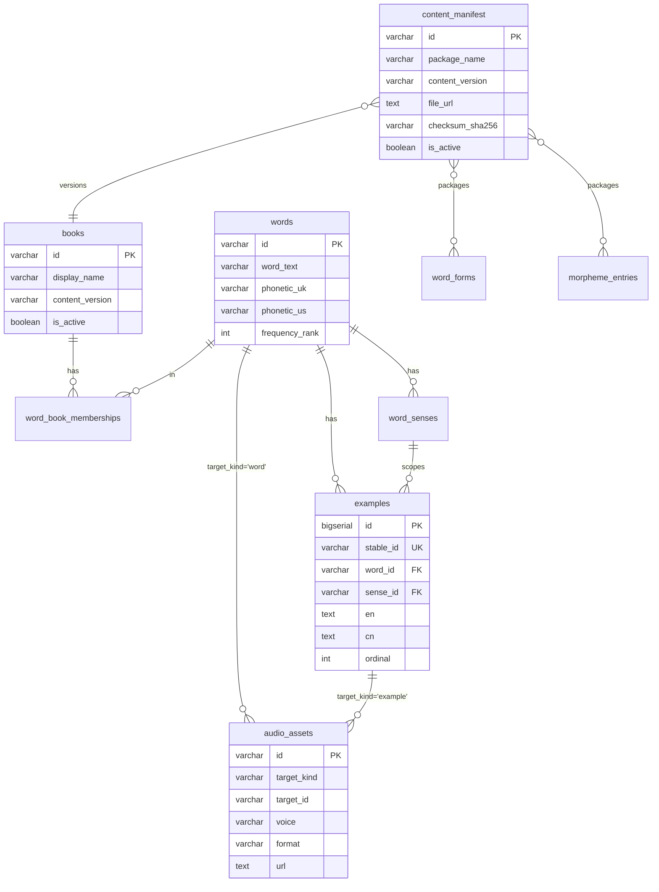
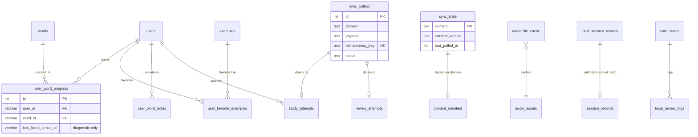

# DB Target Architecture v0.3.0 (candidate, r7)

- **Status:** candidate / long-term target architecture
- **Replaces:** none — 当前 active runtime baseline 由 Room 1 pin 决定；最新候选基线为 `docs/system_design/背单词喵喵app_DB设计草案_v0.2.1.md`（reconciled baseline candidate / ready for Room 1 review）。本文不替代任一 v0.2.x 文档。
- **Reference baseline:** DB v0.2.1 candidate（Room 2 reconciled）+ Room 1 当前 active pin。
- **Purpose:** 描述长期目标 schema 与 staged adoption roadmap，不替代当前阶段实现
- **Owner:** Room 2
- **Reviewers:** Room 1, Room 4, BR Owner
- **Out of scope:** 当前 P3.x 阶段的运行态行为（仍由 v0.2.x baseline 描述）

### Revision log
- **r7 (2026-05-04)** — 落地状态回写（不改设计，仅记账）：
  - **新增 §0.5 实现进度速查**：P0 / P1 / P2.1 / P2.2.A / P2.2.C 标 ✅；P2.2.B（words audio）标 🟡（Codex 还在补 word WAV）；P2.3 / P3 / P4 / P5 仍 🔴
  - **§9 Migration Roadmap 各 P 标项加 ✅/🟡/🔴**，注脚关键 PR / migration 编号
  - **§4.5 examples**：`UNIQUE (word_id, ordinal)` 已通过 migration 006 删除（同词跨多本书时 ordinal 会撞），表注脚补充
  - **§14 版本历史**加 r7 行
- **r1 (2026-05-03)** — 初稿
- **r2 (2026-05-03)** — 应同行评审，修正 7 项：(1) baseline 引用更准确 (2) FSRS 表述归位主机制内 (3) word_id normalization 规则补硬 (4) stable_id 长度与 hash 输入统一 (5) audio_assets 加 version + checksum 防 TTS 升级失效 (6) books.content_version 与 content_manifest 关系定义 (7) sync_outbox 与 idempotency_keys 最小契约
- **r3 (2026-05-03)** — 补 §7.4.1 客户端音频缓存驱逐策略：三触发器（容量+LRU / 内容版本双路径 / TTS 版本字段比对）；明确不使用 TTL；audio_file_cache 加 `cached_audio_version` / `cached_checksum` / `cached_content_version` 三列；明确禁止读盘重算 checksum；补用户面应有/不应有清单；划清与服务端缓存边界
- **r6 (2026-05-03)** — ID 一致性硬保护（4 道防线）：
  - **§3.4 新增** Hash 算法严格规范：所有 hash 输入改 canonical JSON array（不再字符串拼接），byte-identical 跨语言约束，三端 fixture 测试强制
  - **§4.6 audio_assets 加 `source_text_hash` 列**（不进 audio_id hash，但是 release gate 强校验字段）
  - **§4.6.2 新增** 双阶段强校验：generate 入口 + release 兜底，任一阶段 stable_id ↔ 文本失同步立即 abort
  - **§3.5 引用规约**：原 §3.4 顺移
  - 配套新建 `audio_contract.yaml`（hash spec + locale/voice/format 白名单 + audio_version 格式约束 + App 禁止硬编码声明）
  - 配套新建 `tests/fixtures/canonical_json.yaml` / `normalize_text.yaml` / `audio_id.yaml` / `stable_id.yaml`（跨语言 golden cases）
- **r5 (2026-05-03)** — 关注分离：把音频生成流水线（5 阶段、QC 规则、编码格式、jobs 协调）从本 DB 文档移出，独立成 `AUDIO_GENERATION_PIPELINE_v0.1_local_windows.md`（针对本地 Windows 脚本形态，非云端 PG worker）。本文档保留 audio 相关的 schema（§4.6 audio_assets / §4.7 manifest / §7.4 audio_file_cache）+ 客户端缓存策略（§7.4.1 / §7.4.2），删除原 §4.8 / §4.9 的实施细节，仅保留与 DB 文档的接口契约。
- **r4 (2026-05-03)** — 围绕 TTS 全量预生成 + 内容发布流水线大改：
  - **stable_id 全部升级 sha256.slice(0,24) / VARCHAR(28)**（碰撞概率从 10⁻⁵ 降至可忽略）
  - **audio_id 改为含 audio_version**（取代 r2/r3 的"stable URL + 字段比对"，CDN 长 TTL 友好、原子发布、回滚便捷）
  - 缓存触发器 3（TTS 升级）折叠进触发器 2（内容版本），两触发器即足够
  - 客户端下载校验明确为 size + checksum + decode 三项 sanity check，**禁止重做服务端 QC 项**
  - 新增 §4.8 内容发布流水线（5 阶段 + 服务端 QC 规则 + 编码格式 + 严格/宽松发布）
  - 新增 §4.6.1 audio_assets GC 策略（保留 active + 上一版本）
  - 新增 §4.9 ops 侧 `audio_generation_jobs` 表（worker 协议 + lock）
  - 新增 §7.4.2 进词书时的预下载策略（**反对 App 首包 bundle 音频**）
  - §11 Out of Scope 显式拒绝：运行时 TTS 兜底 / App 首包 bundle 音频 / AI 动态生成例句
  - P2 拆 P2.1 / P2.2 / P2.3 子阶段
  - 新增 PD-T-010~013

---

## 0. 阅读须知（当前态 vs 目标态）

本文档描述 **长期目标态**。阅读时必须区分两个时间锚点：

| 锚点 | 状态描述 | 文档来源 |
|---|---|---|
| **当前运行态（v0.2.x）** | 本地 SQLite 是设备侧 runtime truth；云端是 manual backup container；无实时 sync；FSRS 调度仅本地 | Room 1 当前 pin 的 v0.2.x 文档（最新候选 `docs/system_design/背单词喵喵app_DB设计草案_v0.2.1.md`） |
| **长期目标态（v0.3.0）** | 云端 PG 是用户写型数据的最终真相；本地通过 sync_outbox 异步同步；静态内容云端中心化 + manifest 分发 | 本文档 |

**任何"云端为真相"的表述都属于长期目标态，不描述当前阶段行为。**
**任何"本地为真相"的表述（FSRS、设备运行态）在两态下都成立。**

P0 之前任何代码不得按本文档假设的 sync 模型实现。adoption 顺序见第 9 章 Roadmap。

---

## 0.5 实现进度速查（r7 起，与 §9 Roadmap 同源）

读本文时若想知道"哪些已是运行态事实、哪些仍是设计稿"，对照下表。详细每阶段产物见 §9。

| 阶段 | 状态 | 落地内容（截至 r7） |
|---|---|---|
| **P0** stable_id | ✅ done | `examples.stable_id` 双端列就位；`tests/fixtures/*.yaml` 42 例 Python/TS/Dart byte-identical 通过；`apps/api/src/lib/stable-id.ts` + `apps/mobile/lib/core/util/stable_id.dart` 三端 reference impl |
| **P1** 词条统一 | ✅ done | PG migration 005 + 006；`words` 去 `book_id`；`word_book_memberships` 上线；`study_attempts` / `review_attempts` / `user_word_progress` 全量 word_id 改 canonical；mobile drift schema v10 删 `cached_words` + 改写 `cet4-` 前缀；`book-001/zk/gk.json` 重导出（contentVersion='3'） |
| **P2.1** 例句音频 MVP | ✅ done | PG migration 004：`examples` + `audio_assets` + `content_manifest`；`apps/api/scripts/audio_pipeline/{reference.py,partial_publish.py}` 宽松发布脚本；`apps/api/scripts/ingest-audio-assets.ts` ingest 链路；mock CDN 通过 NestJS `useStaticAssets` 在 `/cdn` 挂载；当前已摄取 10140 examples + 663 audio_assets（默认 voice af_bella） |
| **P2.2.A** word audio API | ✅ done | `audio-assets.controller.ts` 拆 `AudioAssetsExamplesController` + `AudioAssetsWordsController`，共享 `lookupAudioAsset()`；新路由 `GET /api/v1/words/:word_id/audio` |
| **P2.2.B** word audio 数据 | 🟡 partial | `partial_publish.py --kind=word` 路径完成；`audio-pipeline-staging/words.json` 已生成 5361 canonical word_ids；**Codex 仍在补 word WAV，正式发布等 Codex 出货** |
| **P2.2.C** word audio 客户端 | ✅ done | `apps/mobile/lib/core/audio/audio_cache_repository.dart` + `word_audio_service.dart` + `example_audio_service.dart` 共享 cache repo（drift schema v11 加 `audio_file_cache` + LRU + content_version orphan 触发器）；`study_page` hooked WordAudioService，PronunciationService 作 transitional fallback |
| **P2.3** 例句 4 voice | 🔴 deferred | spec 条件性跳过（PD-T-012：先用埋点决定是否做） |
| **P3** sync_outbox + 用户写上云 | 🔴 not started | 无真实多端用户，暂不优先 |
| **P4** word_senses 义项层 | 🔴 not started | 依赖 LLM re-annotation |
| **P5** schema 清理 | 🔴 not started | legacy `examples.id` autoincrement / `vocabulary_notebook` 待 P3 完后退役 |

**约定**：✅ done = 已合并、已自测通过 / 🟡 partial = 关键路径就位但等外部输入 / 🔴 = 设计稿尚未实现。**这一栏只反映本文档的设计目标 vs 实际代码差距**，不替代各 P 阶段独立的验收清单。

---

## 1. 设计原则

### 1.1 三层物理隔离
- **静态内容层** —— 词、书、例句、音频元数据、字典；版本化、只读、跨用户共享
- **用户状态层** —— progress、attempts、favorites、notes；按用户分片，需要同步
- **设备运行态层** —— FSRS 调度、文件缓存、同步队列；不出设备

三层各自独立 schema，互不污染。

### 1.2 Canonical content schema 跨端对齐（不是"完全同列"）
- 有云端对应物的静态内容实体 → **核心字段 + stable ID 对齐**
- 本地 mirror 允许有 **本地辅助列**（`imported_at` / `local_content_version` / `is_available_locally` 等）
- 设备运行态表 → **本地独有**，无云端对应

### 1.3 Stable ID 跨端引用
所有跨端、跨重装、跨内容版本必须稳定的引用对象（words / examples / audio_assets / senses）使用 **stable ID**。autoincrement 仅限纯本地、不出设备的表。

### 1.4 主机制事实归属
- `session_validation_status` / `daily_goal_status` / `reward_settlement_status` 由云端产出
- 本地表持有 **观测原始事件**，不持有 valid 判定
- **FSRS 是学习/复习主机制中的本地调度层**，负责 card_state / interval / stability / difficulty / review logs / preview candidate；**它不是 daily_goal_status / session_validation_status / reward_settlement_status 的最终事实 owner**，这些 final fact 仍由后端事实层或被后端接受的结算链路收口

### 1.5 静态内容 = 内容包 + manifest，不是裸 CDN 文件
所有 CDN 分发的静态内容（音频元数据、字典、例句包）必须通过 `content_manifest` 控制：版本、checksum、最小 App 版本、激活状态。

### 1.6 用户写型数据云端为最终真相（**长期目标态**）
- 写路径：本地 → `sync_outbox` → 云端 PG → 同步回所有设备
- 散落的 `synced` 标记被 `sync_outbox` + `sync_state` 取代
- **当前阶段仍是 manual backup 模型**

---

## 2. 三层全表清单

### 2.1 Layer A — 静态内容（云端 PG 运营写 + 本地 mirror）

```
books
words
word_book_memberships
word_senses                  -- P3 引入，先 nullable
examples
audio_assets
content_manifest
```

### 2.2 Layer B — 静态字典（云端管理 + CDN 包分发 + 本地 mirror）

```
word_forms
word_relations
word_phrases
morpheme_entries
word_morpheme_matches
```

### 2.3 Layer C — 用户状态（云端 PG + 本地 mirror，sync_outbox 同步）

```
users
user_book_settings
user_word_progress
user_word_diagnostics        -- 出现 ≥2 个诊断字段时引入
study_attempts
review_groups
review_group_items
review_attempts
daily_goal_progress
session_records
check_in_records
learning_day_facts
streak_records
reward_source_events
reward_ledger
settlements
secondary_wallets
pet_profiles
feed_events
shop_catalog_items
inventory_items
equipment_slots
purchase_records
idempotency_keys
user_favorite_examples       -- stable_id 解锁
user_word_notes              -- vocabulary_notebook 上云升级
user_example_plays           -- 可选埋点
```

### 2.4 Layer D — 设备运行态（本地独有，无云端对应）

```
card_states                  -- FSRS 调度
local_review_logs            -- FSRS rating 序列，INSERT-ONLY
local_session_records        -- 本地 Session 原始记录（非 valid 真相）
audio_file_cache             -- 文件路径 + LRU 元数据
sync_outbox                  -- 离线写队列
sync_state                   -- 每个域的同步游标 + content_version
local_settings               -- 设备级偏好
```

---

## 3. Stable ID 约定

### 3.1 ID 生成规则

所有 hash 输入在哈希前必须先经过 `normalize()`（见 §3.2）。哈希采用 **SHA-256 截取前 24 字符**（96-bit），列宽 VARCHAR(28) 预留 4 字符冗余以容纳未来扩展。

**为什么 24 字符 / 96-bit**：内容资产规模上限可能达到 100k 词 × 10 examples × 4 voices × 多 version × 多 format → 10⁷ 量级条目。64-bit space（16 hex）在此规模下生日碰撞概率约 10⁻⁵，对内容资产系统不可接受；96-bit space 碰撞概率为可忽略。

| 实体 | Stable ID 形式 | 列宽 | 示例 |
|---|---|---|---|
| `books.id` | 人类可读 slug | VARCHAR(32) | `cet4` / `zk` / `gk` |
| `words.id` | `normalize_word(word_text)` | VARCHAR(64) | `abandon` |
| `word_senses.id` | `{word_id}:{pos}:{ordinal}` | VARCHAR(80) | `abandon:v:0` |
| `examples.stable_id` | `sha256_24(canonical_json([word_id, normalize_text(en)]))` | VARCHAR(28) | `a3f9c1e4b8d720568f12c4d7` |
| `audio_assets.id` | `sha256_24(canonical_json([target_kind, target_id, locale, voice, format, audio_version]))` | VARCHAR(28) | `7f2c9a1bd3e8f450ab12d4e7` |
| `content_manifest.id` | `{package_name}@{content_version}` | VARCHAR(64) | `morphemes@v3` |

**`canonical_json()` 与 `sha256_24()` 的严格定义见 §3.4** —— 这是跨语言 byte-identical 的关键约束。r6 起 hash 输入从 r2-r5 的"冒号拼接字符串"改为 canonical JSON array，杜绝字段值含 `:` 时的歧义。

**关键**：`audio_assets.id` **包含** `audio_version`（重大改动 vs r2/r3）——
- TTS 重生成同一句话 → 新 audio_version → **新 audio_id**（自然形成新 row + 新 URL）
- 旧 audio_id 不会被新版本污染，CDN 可长 TTL 缓存
- manifest 切换 active 行做原子发布
- `user_favorite_examples` 引用的是 `examples.stable_id`（句子级），**不引用 audio_id**，故不受影响

可选调试列 `audio_assets.composite_label`（如 `sentence:ab8f93c21e2f:en-US:af_bella:k2026v1`）便于排错，**不当 PK**。

### 3.2 word_text / 例句文本规范化算法

#### 3.2.1 `normalize_word(s)` —— 用于 `words.id`

```
1. NFC 归一（避免 'naïve' 与 'naïve' 不等）
2. trim() 去首尾空白
3. lowercase()
4. 折叠内部连续空白为单个 ASCII space
5. 不去重音、不替换连字符 / 撇号 / 大小写区分词
```

**显式规则**：
- 连字符保留：`fire-proof` ≠ `fireproof`，是两条不同 `words` 行
- 撇号保留：`it's` ≠ `its`
- 重音符保留：`naïve` ≠ `naive`，按 NFC 归一后视为同一个
- 美/英拼写：`color` ≠ `colour`，是两条不同行（不做拼写映射）
- **多词短语不进 `words`**，进 `word_phrases`（如 "give up" / "look forward to"）
- 大小写默认折叠，**消歧词例外**（见 §3.3）

#### 3.2.2 `normalize_text(s)` —— 用于例句 / hash 输入

```
1. NFC 归一
2. trim()
3. 折叠内部所有空白（含 \t \n \r）为单个 ASCII space
4. 大小写保留（例句句首字母有意义）
5. [bracket] 高亮标记保留
```

**作用**：CSV 导入时多一个空格 / 换行不会让 stable_id 漂移。

### 3.3 消歧规则
- `words.id` 默认 `normalize_word(word_text)`；个别需消歧的（`polish` 动词 vs `Polish` 形容词）使用带后缀 ID（`polish:adj:poland`），走例外路径，不污染主键约定
- 消歧路径触发条件需走人工审核，不由自动管线产生（避免 ID 爆炸）
- `examples.stable_id` 内容寻址：句子改一个字 → 新 ID，旧 ID 自动失效（CDN 缓存随之过期）

### 3.4 Hash 算法严格规范（跨语言 byte-identical 约束）

**所有 stable_id / audio_id 必须用 `sha256_24(canonical_json(...))`，不许用其他形式**。规范同时约束三端实现（Python pipeline / TypeScript API / Dart App），SSOT 在 `docs/design/audio_contract.yaml`。

#### 3.4.1 `canonical_json(arr)`

```
输入：JSON array (有序、有限层级、仅含 string / int / null)
处理：
  1. 数组顺序严格按 §3.1 表中"audio_id_fields_in_order"
  2. 每个字符串元素先做对应 normalize（normalize_word / normalize_text）
  3. JSON 序列化时强制：
     - separators = (",", ":")     ← 紧凑，无空格
     - ensure_ascii = false         ← 非 ASCII 不 escape，保留原字节
     - 不允许 array 内出现 null
     - 不允许 dict / nested array（防序列化二义性）
输出：UTF-8 编码的 bytes（无 BOM）
```

**Python 参考实现**：
```python
import json
def canonical_json(arr: list[str]) -> bytes:
    assert all(isinstance(x, str) for x in arr), "only strings allowed"
    return json.dumps(arr, ensure_ascii=False, separators=(",", ":")).encode("utf-8")
```

**Dart / TypeScript 实现要求**：
- 输出必须与 Python 实现 byte-identical
- 必须跑 `tests/fixtures/canonical_json.yaml` golden cases，CI 阻塞性
- Dart `dart:convert` 默认 `jsonEncode` **不一定满足** 紧凑分隔符要求，需手写 encoder

#### 3.4.2 `sha256_24(bytes)`

```
sha256(bytes).hexdigest()[:24]   # 取前 24 个十六进制字符（96 bit）
```

输出固定 24 个 lowercase hex 字符。任何端不许用大写、不许用 base64、不许用其他 hash 算法。

#### 3.4.3 跨实现一致性强制

每次合并涉及 hash 的 PR 必须：
1. Python 实现跑 `tests/fixtures/audio_id.yaml` 全通过
2. 若 PR 改了 normalize / canonical / hash 任一项，**三端 fixture 必须同步更新并 byte-identical**
3. App 端因为不算 hash，Dart fixture 测试可降级到 P1（但 normalize fixture 仍是 P0，例句搜索等场景会用）

### 3.5 引用规约（**P0 起立即生效**）
- `examples` 表保留 autoincrement `id` 列以兼容现有数据，新增 `stable_id` UNIQUE 列
- **所有 P0 之后新增的代码（API、controller、客户端引用、跨端 payload）一律使用 `stable_id`，不准引用 autoincrement `id`**
- 自增 `id` 列在 P5 阶段退役

---

## 4. Layer A 详细设计：静态内容

### 4.1 `books`

| 字段 | 类型 | 约束 | 说明 |
|---|---|---|---|
| id | VARCHAR(32) | PK | slug，e.g. 'cet4' |
| display_name | VARCHAR(100) | NOT NULL | 展示名 |
| description | TEXT | | |
| total_words | INT | NOT NULL DEFAULT 0 | 词数 |
| content_version | VARCHAR(16) | NOT NULL | 版本指针（与 manifest 联动） |
| sort_order | INT | NOT NULL DEFAULT 0 | 列表排序 |
| is_active | BOOLEAN | NOT NULL DEFAULT TRUE | 是否上架 |
| created_at | TIMESTAMPTZ | NOT NULL DEFAULT NOW() | |
| updated_at | TIMESTAMPTZ | NOT NULL DEFAULT NOW() | |

**云端权威。本地 mirror 通过 manifest 拉取。**

### 4.2 `words`

| 字段 | 类型 | 约束 | 说明 |
|---|---|---|---|
| id | VARCHAR(64) | PK | = LOWER(word_text)，全局唯一 |
| word_text | VARCHAR(200) | NOT NULL | 展示形（保留大小写） |
| phonetic_uk | VARCHAR(64) | | 英音音标 |
| phonetic_us | VARCHAR(64) | | 美音音标 |
| frequency_rank | INT | DEFAULT 0 | BNC 全局词频 |
| pos_summary | VARCHAR(64) | | 'v. n.'，UI 用反范式字段 |
| created_at | TIMESTAMPTZ | NOT NULL DEFAULT NOW() | |
| updated_at | TIMESTAMPTZ | NOT NULL DEFAULT NOW() | |

**与 v0.2.x 的差异**：
- 当前云端 `words` 表有 `book_id` 列 → v0.3.0 拆出 `word_book_memberships`，`words` 不再绑书
- 当前本地分裂为 `cached_words`（CET-4）与 `word_entries`（ZK/GK）→ v0.3.0 统一为单张 `words`

**本地 mirror 辅助列**：`imported_at`（导入时间戳）。

### 4.3 `word_book_memberships`

| 字段 | 类型 | 约束 | 说明 |
|---|---|---|---|
| word_id | VARCHAR(64) | NOT NULL FK -> words.id | |
| book_id | VARCHAR(32) | NOT NULL FK -> books.id | |
| sort_order | INT | NOT NULL DEFAULT 0 | 词在该书内的位置 |
| source_key | VARCHAR(64) | | CSV 溯源，如 'zk-1234' |
| | | PK (word_id, book_id) | |

一个词可同时归属多本书，跨书共享 FSRS 卡片、进度、例句。

### 4.4 `word_senses` （P3 引入，**先延后**）

| 字段 | 类型 | 约束 | 说明 |
|---|---|---|---|
| id | VARCHAR(80) | PK | `{word_id}:{pos}:{ordinal}` |
| word_id | VARCHAR(64) | NOT NULL FK -> words.id | |
| pos | VARCHAR(16) | NOT NULL | 'v' / 'n' / 'adj' / ... |
| meaning_zh | VARCHAR(200) | NOT NULL | '放弃；抛弃' |
| definition_en | TEXT | | |
| ordinal | INT | NOT NULL DEFAULT 0 | 显示顺序 |
| is_primary | BOOLEAN | NOT NULL DEFAULT FALSE | |
| frequency_score | INT | | |

**约束**：
- `word_senses` 不参与 FSRS 调度单位
- `user_word_progress` 主进度仍按 word，不按 sense
- `examples.sense_id` 可空，自由文本 `sense_label` 兼容字段在 P3 之前并存

### 4.5 `examples`

| 字段 | 类型 | 约束 | 说明 |
|---|---|---|---|
| id | BIGSERIAL | PK | 兼容自增 ID（P5 退役） |
| stable_id | VARCHAR(28) | NOT NULL UNIQUE | `sha256(word_id + ":" + normalize_text(en)).slice(0,24)`；列宽预留 28 容纳未来扩展 |
| word_id | VARCHAR(64) | NOT NULL FK -> words.id | |
| sense_id | VARCHAR(80) | FK -> word_senses.id | 可空，P3 之前为 NULL |
| sense_label | VARCHAR(200) | | 自由文本兼容字段 |
| en | TEXT | NOT NULL | 含 [bracket] 高亮 |
| cn | TEXT | NOT NULL | |
| ordinal | INT | NOT NULL DEFAULT 0 | 词内排序 |
| difficulty | VARCHAR(16) | | 'high_school' / 'cet4' / ... |
| generator | VARCHAR(32) | | 'claude-sonnet-4-6' |
| generated_at | TIMESTAMPTZ | NOT NULL | |

**关键规约**：
- P0 起新代码引用 `stable_id`，不引用 `id`
- 修改例句文本 → 新 stable_id（内容寻址）→ 旧 CDN 音频自动失效
- **r1–r6 表里曾有的 `UNIQUE (word_id, ordinal)` 在 r7 删除**：同一 canonical word 出现在多本词书时（如 `a` 在 ZK + GK），各书内 ordinal 0–4 会撞 UNIQUE，拦住 ingest。已通过 migration 006 在云端落库。需要"词内例句顺序"时按 `ORDER BY word_id, ordinal, stable_id` 取，必要时由 ingest 端做去重

**本地 mirror 辅助列**：`imported_at`、`is_available_locally`（音频是否已缓存）。

### 4.6 `audio_assets`

| 字段 | 类型 | 约束 | 说明 |
|---|---|---|---|
| id | VARCHAR(28) | PK | `sha256(target_kind + ":" + target_id + ":" + locale + ":" + voice + ":" + format + ":" + audio_version).slice(0,24)` —— **包含 audio_version**，每次 TTS 重生成产生新 row + 新 URL |
| target_kind | VARCHAR(16) | NOT NULL | 'word' / 'example' |
| target_id | VARCHAR(64) | NOT NULL | words.id 或 examples.stable_id |
| locale | VARCHAR(16) | NOT NULL | 'en-US' / 'en-GB' / 'en-AU' |
| voice | VARCHAR(32) | NOT NULL | e.g. 'af_bella' / 'azure-jenny' |
| accent | VARCHAR(8) | | 'us' / 'uk' / 'au' |
| gender | VARCHAR(8) | | 'm' / 'f' / 'n' |
| format | VARCHAR(8) | NOT NULL | 'mp3' / 'opus' |
| audio_version | VARCHAR(32) | NOT NULL | e.g. 'v1' / 'kokoro-82m-v1'，**入 hash**。格式由 audio_contract.yaml 约束，App 不得硬编码具体值 |
| checksum_sha256 | VARCHAR(64) | NOT NULL | 二进制内容校验 |
| source_text_hash | VARCHAR(16) | NOT NULL | `sha256(normalize_text(en)).hexdigest()[:16]`，**不入 audio_id hash**，**是 release gate 强校验字段**（见 §4.6.2） |
| tts_provider | VARCHAR(32) | NOT NULL | 'openai' / 'azure' / 'volcengine' / 'kokoro-local' |
| tts_model | VARCHAR(64) | NOT NULL | e.g. 'tts-1-hd' / 'kokoro-82m' |
| bytes | INT | NOT NULL | |
| duration_ms | INT | NOT NULL | |
| url | TEXT | NOT NULL | CDN URL（含 audio_version 路径段，见下） |
| status | VARCHAR(16) | NOT NULL DEFAULT 'ready' | 'pending' / 'ready' / 'qc_failed' / 'superseded' |
| composite_label | VARCHAR(128) | | 调试用人类可读串，不当 PK |
| generated_at | TIMESTAMPTZ | NOT NULL | |
| | | INDEX (target_kind, target_id, status) | |

**CDN 路径规范**（`audio_version` 进入路径，URL 不复用）：

```
{cdn_origin}/audio/v1/
  words/{locale}/{voice}/{audio_version}/{a}/{abandon}.{format}
  sentences/{locale}/{voice}/{audio_version}/{ab}/{ab8f93c21e2f...}.{format}
```

`{a}` / `{ab}` 是 sharding prefix（前 1-2 字符），避免单目录文件过多。

**版本升级 / 缓存失效规则**：
1. TTS 升级、音质修复等场景：**生成新 audio_version → 新 audio_id → 新 row → 新 CDN 路径**（旧 row status 改 'superseded'，旧 binary 暂保留）
2. manifest 切换 active 行实现原子发布
3. 客户端缓存里旧 audio_id 自然变成 orphan，由 §7.4.1 触发器 2 清理
4. **r2 曾考虑过的"stable URL + 字段比对"方案已废弃**（CDN 缓存语义不友好、原子发布困难、回滚需重传 binary）

**回滚策略**：manifest active 指针指回上一版本的 audio_assets row 即可，不动 binary。

### 4.6.1 `audio_assets` GC 策略（运营侧）

`audio_assets` 旧版本不立即删，规则：
- 保留**当前 active version + 上一版本**（rollback 窗口）
- 上上版以前：cron 删除 CDN 文件 + 标记 `status = 'gc_deleted'`（保留行用作审计日志，不删 row）
- GC cron 由 ops 侧调度，不进入客户端契约

### 4.6.2 `source_text_hash` 双阶段强校验（release gate）

`source_text_hash` 不参与 `audio_id` 哈希计算，但是**强制发布门**：

| 阶段 | 检查 | 失败处理 |
|---|---|---|
| **generate（pipeline 入口）** | 对每条 example 现场重算 stable_id：`stable_id == sha256_24(canonical_json([word_id, normalize_text(examples.en)]))`；不一致说明源数据 stable_id 与文本失同步 | **abort，不生成任何音频**（避免烧 TTS 算力） |
| **release（manifest 切换前）** | 对每条 audio_assets row 重算 `source_text_hash` 与当前 `examples.en` 是否一致 | **abort 整批发布**，禁止切 manifest active=true |

**为什么必须双阶段**：
- generate 入口检查最便宜（0 TTS 成本），早抓数据漂移
- release 兜底捕获 pipeline 跑动期间发生的数据修改（如 ops 在 pipeline 跑过半夜里改了一条 example.en）
- 任何单阶段都不充分

**不变量**：`stable_id ↔ examples.en ↔ source_text_hash ↔ audio_assets.target_id` 四方在 release 时刻必须 byte-consistent。

**绝不允许**：把校验降级为 warning、抽样、或加 `--bypass` flag。

### 4.7 `content_manifest`

| 字段 | 类型 | 约束 | 说明 |
|---|---|---|---|
| id | VARCHAR(64) | PK | `{package_name}@{content_version}` |
| package_name | VARCHAR(64) | NOT NULL | 'morphemes' / 'enrichment-zk' / 'audio-meta-cet4' |
| package_kind | VARCHAR(16) | NOT NULL | 'dictionary' / 'audio_meta' / 'wordbook' |
| content_version | VARCHAR(16) | NOT NULL | semver 风格 |
| file_url | TEXT | NOT NULL | CDN 包地址 |
| checksum_sha256 | VARCHAR(64) | NOT NULL | 完整性校验 |
| size_bytes | BIGINT | NOT NULL | |
| min_app_version | VARCHAR(16) | NOT NULL | 客户端最低版本 |
| is_active | BOOLEAN | NOT NULL DEFAULT FALSE | 当前激活版本 |
| generated_at | TIMESTAMPTZ | NOT NULL | |
| | | INDEX (package_name, is_active) | |

**API**：`GET /api/v1/content/manifest?since=<local_content_version>` 返回客户端需要更新的 active 包列表。

**客户端流程**：
1. 启动时拉 manifest
2. 与本地 `sync_state` 对比每个 package 的 content_version
3. 落后 → 下载 file_url
4. 校验 checksum
5. 解包导入对应本地表
6. 写入 `sync_state.{package}.content_version`

#### 4.7.1 `content_manifest` 与 `books.content_version` 的关系（明确合同）

为避免双 SSOT 冲突，二者职责区分：

| 字段 | 角色 | 用途 |
|---|---|---|
| `content_manifest` | **唯一下载入口与 SSOT** | 所有静态包（wordbook / audio_meta / enrichment / morphemes）的版本、URL、checksum、min_app_version 唯一来源 |
| `books.content_version` | **denormalized 快速指针**，仅指向"该书的 wordbook 包"当前激活版本 | UI 快速判断"本书有更新"无需 join manifest |

**规则**：
- 一本词书可由多个内容包组成（wordbook 主体 + audio_meta + enrichment 各一包），**每个包有独立的 content_version**
- `books.content_version` 只反映 wordbook 主体包；audio / enrichment 各自版本由客户端按 manifest 独立追踪
- 写入顺序：先发布 manifest 新版本（is_active=true），后更新 `books.content_version`。客户端任何场景下以 manifest 为准
- 多包版本不一致是合法状态，不做强一致约束

---

### 4.8 音频生成流水线（独立文档）

音频资产**在客户端发布前必须全部完成生成与质检**。客户端学习链路不依赖运行时 TTS（见 §11 Out of Scope）。

完整流水线设计独立成文：

> **`docs/design/AUDIO_GENERATION_PIPELINE_v0.1_local_windows.md`**
>
> 涵盖：5 阶段流程（generate → synthesize → postprocess → publish → release）、生成端 QC 规则、编码格式、本地状态跟踪（manifest.json + failures.json，不用数据库）、Windows 工具链建议、上传 CDN 与 `audio_assets` row 写入对接。

**与本 DB 文档的接口契约**（即流水线的输出义务）：

1. 流水线产物必须填齐 §4.6 `audio_assets` 表所有 NOT NULL 字段（`id` / `audio_version` / `checksum_sha256` / `tts_provider` / `tts_model` / `bytes` / `duration_ms` / `url` / `status`）
2. 失败资产以 `status='qc_failed'` 入表，不要默默丢弃（保审计）
3. 成功后切 `content_manifest.is_active=true` 实现客户端可见
4. CDN 路径必须遵守 §4.6 路径规范（`audio_version` 入路径段）

---

## 5. Layer B 详细设计：静态字典

### 5.1 通用规则
- 字典型表（forms / relations / phrases / morphemes / matches）的**真相在云端**，但**不进 PG 业务库**
- 通过 CDN 静态包分发：`audio-meta-{book}.jsonl.gz` / `morphemes-v{n}.jsonl.gz` / `enrichment-{book}.jsonl.gz`
- 客户端按 `content_manifest` 拉取并导入本地 SQLite

### 5.2 表结构沿用 v0.2.x 本地定义
- `word_forms`、`word_relations`、`word_phrases` —— 见 `apps/mobile/lib/core/storage/drift/tables/enrichment_tables.dart`
- `morpheme_entries`、`word_morpheme_matches` —— 同上

**云端不需要这些表的 PG 实体**；运营改字典 = 重新生成包 + 推 CDN + 写入 `content_manifest`。

---

## 6. Layer C 详细设计：用户状态

### 6.1 沿用 v0.2.x baseline 的表
以下表在 v0.3.0 中**结构基本不变**，沿用 v0.2.x baseline §4 定义：

```
users / user_book_settings / study_attempts / review_groups /
review_group_items / review_attempts / daily_goal_progress /
session_records / check_in_records / learning_day_facts /
streak_records / reward_source_events / reward_ledger /
settlements / secondary_wallets / pet_profiles / feed_events /
shop_catalog_items / inventory_items / equipment_slots /
purchase_records / idempotency_keys
```

**唯一全局调整**：所有 `word_id` 引用从今天的"按词书前缀的 ID（cet4-abandon / zk-abandon）"统一切换到 v0.3.0 的 canonical `words.id`（abandon）。study_attempts、review_attempts、user_word_progress 全部跟随。

### 6.2 v0.3.0 新增表

#### 6.2.1 `user_word_progress`（沿用 + 加 1 列）

新增字段：

| 字段 | 类型 | 约束 | 说明 |
|---|---|---|---|
| last_failed_sense_id | VARCHAR(80) | NULL | **diagnostic-only** |

**硬性约束**：
- 不参与 FSRS 调度
- 不参与 daily goal 计数
- 不参与 reward settlement
- 不参与 review priority
- **任何要参与上述决策的字段都不准加到此列**
- 出现第 2 个诊断字段 → 立即拆出 `user_word_diagnostics` 表

#### 6.2.2 `user_favorite_examples`

| 字段 | 类型 | 约束 | 说明 |
|---|---|---|---|
| user_id | VARCHAR(64) | NOT NULL FK -> users.id | |
| example_stable_id | VARCHAR(28) | NOT NULL FK -> examples.stable_id | |
| created_at | TIMESTAMPTZ | NOT NULL DEFAULT NOW() | |
| note | TEXT | | 用户自定义备注 |
| | | PK (user_id, example_stable_id) | |

#### 6.2.3 `user_word_notes`

| 字段 | 类型 | 约束 | 说明 |
|---|---|---|---|
| user_id | VARCHAR(64) | NOT NULL FK -> users.id | |
| word_id | VARCHAR(64) | NOT NULL FK -> words.id | |
| note | TEXT | NOT NULL | |
| created_at | TIMESTAMPTZ | NOT NULL DEFAULT NOW() | |
| updated_at | TIMESTAMPTZ | NOT NULL DEFAULT NOW() | |
| | | PK (user_id, word_id) | |

替代当前本地-only 的 `vocabulary_notebook`，跨设备保留。

#### 6.2.4 `user_example_plays`（可选）

| 字段 | 类型 | 约束 | 说明 |
|---|---|---|---|
| id | BIGSERIAL | PK | |
| user_id | VARCHAR(64) | NOT NULL FK -> users.id | |
| example_stable_id | VARCHAR(20) | NOT NULL | |
| played_at | TIMESTAMPTZ | NOT NULL | |
| source | VARCHAR(16) | | 'study' / 'review' / 'replay' |

埋点用，需要再上。

---

## 7. Layer D 详细设计：设备运行态

### 7.1 `card_states` —— 沿用 v0.2.x
FSRS 卡片调度。`word_id` 切换到 canonical `words.id`。

### 7.2 `local_review_logs`
**重命名自当前 `review_logs`**，目的是与云端业务表 `review_attempts` 字面区分。

字段沿用 v0.2.x baseline §6.7。INSERT-ONLY。给 fsrs-optimizer 喂数据。**不上云**。

### 7.3 `local_session_records`
**重命名自当前 `sessions`**，定位为：

> 本地观测到的 Session 原始事件记录。
> **不持有 `session_validation_status` 真相，valid 判定仍由云端 `session_records` 产出。**

字段：

| 字段 | 类型 | 约束 | 说明 |
|---|---|---|---|
| id | TEXT | PK | 本地 session ID |
| kind | TEXT | NOT NULL | 'study' / 'review' / 'mixed' |
| started_at | TEXT | NOT NULL | ISO 8601 |
| ended_at | TEXT | | |
| local_effective_learning_count | INT | DEFAULT 0 | 本地观测计数（非真相） |
| local_effective_review_count | INT | DEFAULT 0 | 本地观测计数（非真相） |
| sync_status | TEXT | DEFAULT 'pending' | 'pending' / 'submitted' |

### 7.4 `audio_file_cache`

| 字段 | 类型 | 约束 | 说明 |
|---|---|---|---|
| audio_id | TEXT | PK | = audio_assets.id（已含 audio_version） |
| local_path | TEXT | NOT NULL | 文件系统路径 |
| bytes | INTEGER | NOT NULL | |
| cached_at | INTEGER | NOT NULL | UTC epoch ms |
| last_played_at | INTEGER | | UTC epoch ms |
| cached_checksum | VARCHAR(64) | NOT NULL | 下载时记录的 audio_assets.checksum_sha256 |
| cached_content_version | TEXT | | 写入文件时所属包的 content_version（orphan 检测优化） |

**mp3/opus 二进制存文件系统**：`{appDocs}/audio/{audio_id}.{format}`，**不入 SQLite blob**。

LRU 淘汰由此表驱动，同时提供"清理音频缓存"按钮的数据源。

#### 7.4.1 客户端音频缓存驱逐策略

客户端音频缓存**不使用固定时间 TTL 作为主要驱逐策略**。

理由：单词与例句音频是可长期复用的静态学习资产，用户复习行为具有时间稀疏性 —— 考试季高频，平时低频，但仍有价值。任何固定 TTL（如 30/60/90 天）都会误删用户实际仍在用的音频，导致重复下载，浪费流量、电量与等待时间。**时间不是判断"该不该清"的正确信号**。

驱逐由两个独立触发器协同决定（r4 起 TTS 升级触发器折叠进内容版本触发器，因 audio_id 已含 audio_version）：

##### 触发器 1：容量封顶 + LRU 驱逐

- 用户可配置本地音频缓存上限，**默认 200 MB**（设置页可选 100 / 200 / 500 MB / 不限）
- 缓存体积超过上限时，按 `last_played_at ASC` 从最久未播放的音频开始驱逐
- 驱逐到 **`cap × 0.8`** 才停止，避免缓存刚超过上限就频繁小幅清理（抖动）

##### 触发器 2：内容版本 / 音频版本统一驱逐（双路径，避免阻塞启动）

由于 §3.1 起 `audio_id` 已包含 `audio_version`，TTS 升级 = 新 audio_id = 旧 audio_id 自动变 orphan，因此**TTS 升级与内容版本变更走同一驱逐路径**。

- **后台批量清理**：`content_version` 变化导入完成后，App 空闲时（非启动主线程）扫描 `audio_file_cache.cached_content_version` 与当前 active version 不一致的行 → 删文件 + 删 row
- **播放前懒清理**：用户点播放时，若发现 `audio_id` 已不在当前 manifest 的 active `audio_assets` 中 → 视为 orphan，删旧文件 + 按新 manifest 重新下载新 audio_id 的文件

不在启动主流程做全量扫描，避免缓存大时拖慢冷启动。

##### 客户端下载校验（不重 QC，仅 sanity check）

下载完成后写入缓存前**只做轻量校验**：

```
1. file_size == audio_assets.bytes（防截断）
2. sha256(downloaded_bytes) == audio_assets.checksum_sha256（防损坏 / 中间人）
3. 播放器尝试解码 header（防格式破坏）
4. 三项通过 → 写入文件系统 + 更新 audio_file_cache row
5. 任一项失败 → 丢弃下载、重试 1 次、仍失败 → 灰按钮 + 埋点
```

**禁止**在客户端做响度归一 / 削波检测 / 静音裁剪 / LUFS 测量等服务端 QC 项。完整 QC 已在 §4.8.2 服务端 pipeline 完成。

**checksum 是下载时一次性算**，不是每次播放重算。播放路径只查 `audio_file_cache` 行存在 + 文件系统 file 存在即可，O(1)。

##### CDN miss 与下载失败兜底（**反对运行时 TTS**）

| 场景 | 客户端处理 |
|---|---|
| 单词音频缓存 miss + 下载失败 | 重试 1 次 → 仍失败 → 暂时灰按钮 + 后台静默重试 + 提升所在 chunk 的预下载优先级（**不调用系统 TTS**） |
| 例句音频缓存 miss + 下载失败 | 重试 1 次 → 仍失败 → 灰按钮 + 静默上报埋点（**不调用系统 TTS**） |
| 弱网 / 离线学习 | 由"进词书时激进预下载"策略覆盖（见 §7.4.2） |

**为什么不引入运行时 TTS 兜底**：
- 系统 TTS（iOS/Android 默认）读 `ubiquitous` / `conscientious` 等生僻词重音不准、连读断点错
- 学习场景"听错的发音"比"听不到"危害更大 —— 用户脑里会刻一个错的发音痕迹
- 引入运行时依赖 = 平台分叉 + 测试矩阵爆炸 + 质量不可控
- 良好的预下载策略可以基本消除真实场景的 cache miss

##### 用户面

- ✅ 应有：缓存占用展示（"已使用 138 MB / 200 MB"）+ "清除音频缓存"按钮
- ❌ 不应有："保留多少天的缓存"开关（错误心智模型）
- ❌ 不应有："自动清理老音频"开关（容量封顶已经在做）

##### 与服务端缓存的区别

本节策略仅适用于**客户端本地缓存**。服务端 / CDN 侧缓存（如 R2 / S3 / 阿里 OSS 的 lifecycle policy、对象冷归档、按访问量驱逐等）由对象存储自身机制管理，与本节无关。

#### 7.4.2 进词书时的预下载策略（替代"App 首包 bundle"）

**不在 App 首包 bundle 任何音频**。理由：
- 用户按词书学习，跨书的"高频词"对单本书用户是无效字节
- iOS 蜂窝下载 200MB 上限敏感；Android Play Store 安装大小直接影响转化
- 音频升级要发新 App 包很沉重，CDN 增量分发更敏捷

**替代策略**：用户选定词书的瞬间触发后台预下载。

```
进入词书 (e.g. CET-4):
  1. 立即拉取前 N₁ = 200 个待学单词的默认 voice 音频（~6 MB，3-5 秒）
  2. 用户学到第 N₁ × 0.75 = 150 时，后台拉下一个 chunk（200 个）
  3. 始终维持本地 ≥ 50 个待学词的音频 buffer
  4. 例句默认 voice 的音频按"当前学习窗口前后 ±20 词"预下载
```

**离线学习包**（可选，进阶能力）：
- 用户在设置页主动启用"下载本词书全部音频包"
- 一次性拉取整书音频（~50-150 MB 量级）
- 完成后离线无网完整可用
- 默认关闭，不做强引导

---

### 7.5 `sync_outbox`

| 字段 | 类型 | 约束 | 说明 |
|---|---|---|---|
| id | INTEGER | PK AUTOINCREMENT | |
| domain | TEXT | NOT NULL | 'study_attempt' / 'review_attempt' / 'favorite' / ... |
| payload | TEXT | NOT NULL | JSON-encoded |
| idempotency_key | TEXT | NOT NULL UNIQUE | 防重 |
| created_at | INTEGER | NOT NULL | |
| attempted_at | INTEGER | | 最近一次尝试 |
| attempts | INTEGER | NOT NULL DEFAULT 0 | |
| status | TEXT | NOT NULL DEFAULT 'pending' | 'pending' / 'sent' / 'failed' |
| last_error | TEXT | | |
| | | INDEX (status, created_at) | |

替代当前 `word_records.synced` 这种散落标记。所有"待同步到云端"的本地写都进此队列，由 sync worker 顺序消费。

#### 7.5.1 `sync_outbox` 与服务端 `idempotency_keys` 的最小契约

为防止重试破坏幂等，本目标态固定以下 3 条规则（独立设计文档进一步展开）：

1. **client 端生成 idempotency_key**：写入 `sync_outbox` 时一次性生成（建议 UUIDv4 或 `{user_id}:{domain}:{client_event_uuid}`），**写入后不可变**
2. **重试必须复用同一 idempotency_key**：sync worker 重发同一 outbox 行时，**不准重新生成 key**；任何"生成新 key 重试"的实现都视作 bug
3. **服务端 `idempotency_keys` 表负责接收去重**：服务端拿到请求后查 `idempotency_keys.key`，命中 → 返回缓存响应；未命中 → 处理 + 写入 `idempotency_keys.response`

**死信处理**：`sync_outbox.attempts >= MAX_ATTEMPTS` 且 `status = 'failed'` 时，挂死信队列等待人工或下一次启动时检查；**不可静默丢弃**。具体退避参数与 MAX_ATTEMPTS 由 P3 阶段决定。

### 7.6 `sync_state`

| 字段 | 类型 | 约束 | 说明 |
|---|---|---|---|
| domain | TEXT | PK | 'words' / 'examples' / 'morphemes' / 'audio_meta_cet4' / ... |
| content_version | TEXT | | 当前已导入的版本 |
| last_pulled_at | INTEGER | | UTC epoch ms |
| last_pushed_cursor | TEXT | | 用户域：最近一次推送游标 |
| last_pulled_cursor | TEXT | | 用户域：最近一次拉取游标 |

每个域独立一行。Manifest pull、用户数据 sync、字典更新都通过此表协调。

### 7.7 `local_settings`
沿用当前 SharedPreferences 模型，但**应迁移进 SQLite**（与 sync_state 同库）。Key-value 结构：

```
key TEXT PK, value TEXT, updated_at INTEGER
```

包含 desired_retention、sound_enabled、theme、notification_time 等。

---

## 8. Mermaid ER 图（核心部分）

### 8.1 静态内容层



### 8.2 用户状态 + 设备运行态



---

## 9. Migration Roadmap

### P0 — Stable ID 落地（最高优先） ✅ done
**代价：低 | 解锁：所有跨端功能的前置**

- ✅ 生成脚本里给每条例句计算 `stable_id`（`apps/api/scripts/audio_pipeline/reference.py` + `apps/api/src/lib/stable-id.ts` + `apps/mobile/lib/core/util/stable_id.dart`，三端 byte-identical fixture 全过）
- ✅ 云端 `examples` 表加 `stable_id VARCHAR(28) UNIQUE NOT NULL` 列 + 数据回填（migration 004）
- ✅ 本地 `example_sentences` 表加 `stable_id` 列 + WordbookLoader 回填（drift schema v9）
- ✅ **规约生效**：所有新代码使用 `stable_id`，不引用 `id`
- ✅ API 响应字段加 `stable_id`

### P1 — 词条统一（CET-4 收编 + words 拆 memberships） ✅ done
**代价：中 | 解锁：跨书共享进度、FSRS、例句**

- ✅ 云端 PG 重构：`words` 表去掉 `book_id`，新建 `word_book_memberships`（migration 005）
- ✅ 现有 `cet4-abandon` / `zk-abandon` 数据迁移：合并为 canonical `abandon` + 多条 membership 记录（dev 环境走 TRUNCATE + 重 seed 路径）
- ✅ `study_attempts` / `review_attempts` / `user_word_progress` 的 `word_id` 全量切换到 canonical
- ✅ 本地 `cached_words` 数据迁入 `word_entries`（重命名为 `words`），drift schema v10 含 `cet4-` 前缀剥离 SQL
- ✅ 本地 `word_book_assignments` 重命名为 `word_book_memberships`
- ✅ 副产物：migration 006 删除 `examples.UNIQUE(word_id, ordinal)`（同词跨书 ordinal 撞）

### P2 — Audio 通道（拆成 3 子阶段）
**代价：中-高（TTS 账单 + ops 流水线建设） | 解锁：例句/单词发音**

#### P2.1 — MVP 音频（默认 voice 全量） ✅ done
- ✅ 建 `audio_generation_jobs` 表（ops 侧）+ batch worker —— 由 Codex 本地 Windows pipeline 担当（独立文档 `AUDIO_GENERATION_PIPELINE_v0.1_local_windows.md`）
- 🟡 生成全量单词音频 × **1 默认 voice**（en-US female）—— 移到 P2.2.B 完成
- ✅ 生成全量例句音频 × **1 默认 voice**（**当前 663 / 10140，Codex 增量补全中**）
- ✅ 服务端 QC pipeline（pipeline 内做 LUFS / 截断 / 静音；本仓 `partial_publish.py` 做宽松发布 + duration 边界）
- ✅ CDN version-in-path 分发（mock CDN，NestJS `useStaticAssets` 挂 `/cdn`）
- ✅ 云端 `audio_assets` 表 + manifest active（migration 004）
- ✅ 本地 `audio_assets` mirror + `audio_file_cache`（drift schema v11；`audio_cache_repository.dart` 实现 LRU + orphan 触发器）
- ✅ 学习页播放器接入（example: `ExampleAudioService`）
- 🔴 进词书预下载策略（§7.4.2）—— 触发点已就位（study_page `_prefetchUpcoming`），`N₁` 等参数仍未调优

#### P2.2 — 单词音频 + 客户端接入（实际拆 A/B/C）
- **P2.2.A** ✅ done：API 拆 examples / words 双 controller，新路由 `GET /api/v1/words/:word_id/audio`
- **P2.2.B** 🟡 partial：发布脚本通用化（`partial_publish.py --kind={example,word}`）+ `words.json` 5361 canonical id 已生成；Codex word WAV 在产
- **P2.2.C** ✅ done：mobile `WordAudioService` + `study_page` hookin + PronunciationService 作 transitional fallback

> ⚠ **原 r6 规划的"单词 4 voice 扩展"放到 P2.2 之后单独处理**。当前 P2.2 只覆盖默认 voice af_bella，4 voice 扩展时机由 PD-T-012 控制。

#### P2.3 — 例句 4 voice 扩展（视用量决定是否做） 🔴 conditional
- 跟随 P3.1 用户 voice 偏好埋点结果
- 若使用率 < 5% 则不做，默认 voice 已足够

### P3 — 用户写型上云 🔴 not started
**代价：高 | 解锁：跨设备同步**

- 本地 `sync_outbox` + `sync_state` 实现
- 散落的 `synced` 标记全部废弃，写路径改走 outbox
- 后端实现幂等接收 endpoint
- `user_favorite_examples` / `user_word_notes` 上线
- 同步状态从 P3.1 manual backup 迁移到 outbox-driven 增量同步
- **此阶段开始，"用户状态云端为最终真相"才成为运行态事实**

### P4 — Sense 层引入 🔴 not started
**代价：中 | 解锁：义项级分析**

- `word_senses` 建表 + 数据生成
- `examples.sense_id` 回填，`sense_label` 标记 deprecated
- POS 雷达切换数据源到 `word_senses`
- 学习页可选展示义项分组

### P5 — Schema 清理 🔴 not started
**代价：低 | 解锁：技术债清零**

- `examples.id` autoincrement 列退役，`stable_id` 提升为主键
- 删除 v0.2.x legacy SP 键、`vocabulary_notebook` 本地表（数据已迁入云端 `user_word_notes`）
- 双端 schema 终态对齐

---

## 10. 与 v0.2.x baseline 的差异速查

| 维度 | v0.2.x（当前 baseline，最新 v0.2.1 candidate） | v0.3.0（目标态） |
|---|---|---|
| 词条 ID | `cet4-abandon` / `zk-abandon` 按书前缀 | `abandon` canonical |
| 词↔书关系 | 云端 `words.book_id`；本地 `word_entries`+`word_book_assignments`（仅 ZK/GK） | 双端统一 `word_book_memberships` |
| CET-4 数据存储 | 本地 `cached_words` 独立通道 | 与 ZK/GK 同入 `words` |
| 例句 ID | 本地 autoincrement，未跨端 | `stable_id` content hash，跨端引用 |
| 例句存储 | 本地 `example_sentences` only，云端无 | 云端 `examples` SSOT，本地 mirror |
| 音频 | 不存在 | `audio_assets` 表 + CDN + 本地文件缓存 |
| 字典分发 | 打包进 mobile assets | CDN 内容包 + `content_manifest` |
| 用户笔记 | 本地 `vocabulary_notebook` | 云端 `user_word_notes` |
| 用户写同步 | 散落 `synced` 标记 + manual backup | `sync_outbox` + 增量 push |
| Session valid 真相 | 云端 `session_records`（已对） | 同 + 本地 `local_session_records` 显式标注非真相 |
| FSRS 状态 | 本地 only | 本地 only（不变） |
| 义项 | 自由文本 `sense` 字段 | `word_senses` 表 + 兼容 `sense_label` |

---

## 11. 显式不做（Out of Scope）

- **义项级 FSRS / 义项级 progress** —— 单位仍是 word
- **enrichment / morphemes 上 PG** —— 永远走 CDN 内容包
- **音频实时合成** —— 全离线预生成，不做 server-side TTS API（学习链路里）
- **运行时 TTS 兜底（系统 TTS 调用）** —— 客户端在任何场景下不调用 iOS/Android 系统 TTS，包括 CDN miss 后兜底。理由：质量参差对学习有害（错误发音比无发音危害更大）+ 平台分叉成本。CDN miss 由"激进预下载（§7.4.2）+ 灰按钮"覆盖
- **App 首包 bundle 音频** —— 跨书"高频词"对单本书用户是无效字节，且影响安装转化与升级敏捷性。改为"进词书时后台预下载"
- **AI 动态生成例句** —— 偏离 MVP 范围，未来若做需配套 server-side TTS + 长缓存
- **多端 FSRS 实时合并** —— 本地 runtime truth，跨设备靠 manual backup（与 v0.2.x 一致，不变）
- **替换 v0.2.x baseline** —— 本文档为 candidate，v0.2.x 仍是当前 active 文档

---

## 12. 待确认（Pending）

| 编号 | 议题 | 当前倾向 |
|---|---|---|
| PD-T-001 | `words.id` 消歧策略（polish/Polish） | MVP 不分；后续按需走 `:disambig` 后缀 |
| PD-T-002 | `audio_assets` 是否冗余存 `url` | 倾向冗余存（便于换域名 / 多 CDN 切换） |
| PD-T-003 | content_manifest 是否支持 partial package（per-word 增量） | 长期可加 `parent_package_id` + diff；P2 阶段先全量 |
| PD-T-004 | sync_outbox 失败重试策略 | 指数退避 + 死信队列；具体参数 P3 决定 |
| PD-T-005 | `local_settings` 迁移时机 | P3 SharedPreferences → SQLite 一次性迁移 |
| PD-T-006 | `user_word_progress.last_failed_sense_id` 是否真有产品价值 | P4 后评估，无价值则删除 |
| PD-T-007 | `normalize_word` / `normalize_text` 算法的实现归口 | P0 阶段固化为云端 + 本地共享的 reference implementation（TS 一份、Dart 一份），单元测试用同一组 fixtures 双端跑过 |
| PD-T-008 | `audio_assets.audio_version` 命名是否需要 `revision` 别名 | 倾向保留单一名称；调研期发现需要时再改 |
| PD-T-009 | sync_outbox MAX_ATTEMPTS / 退避参数 | P3 决定，建议指数退避 + 死信队列 |
| PD-T-010 | TTS 模型生命周期管理流程 | provider sunset 时如何批量重建。建议：标记 deprecated → 自动建一批 audio_version+1 的 jobs → ready 后切 manifest |
| PD-T-011 | 进词书预下载的 chunk 大小 N₁ | 默认 200 待验证；视实际 CDN 带宽与用户行为调整 |
| PD-T-012 | 例句 4 voice 扩展的触发条件 | P3.1 埋点用户 voice 偏好，使用率阈值 5%（待评审确认） |
| PD-T-013 | audio QC LUFS / clipping / 静音 阈值的最终确定 | P2.1 实施时小样本测试后冻结 |

---

## 13. 评审要求

本文档进入 active baseline 前，需要以下确认：

1. **Room 1（产品）** —— 确认 stable_id / audio / cross-device 同步在产品 roadmap 中的优先级
2. **Room 4（实现）** —— 确认 P0 / P1 的实施可行性与代价估算
3. **BR Owner** —— 确认 `local_session_records` 与主机制事实归属边界的表述无冲突
4. **Sync 设计** —— `sync_outbox` 与 `idempotency_keys` 的关系需独立设计文档展开

任一项未确认前，本文档不应被引用为实现依据。

---

## 14. 版本历史

| 版本 | 日期 | 变更 |
|---|---|---|
| v0.3.0-candidate (r1) | 2026-05-03 | 初稿。长期目标架构，不替代 v0.2.x baseline。三层物理隔离（静态内容 / 用户状态 / 设备运行态）+ stable ID + content_manifest + sync_outbox + audio_assets。P0–P5 staged adoption roadmap。 |
| v0.3.0-candidate (r2) | 2026-05-03 | 应同行评审修正 7 项：(1) baseline 引用更准确，指向 v0.2.1 + Room 1 pin；(2) §1.4 FSRS 表述归位主机制内本地调度层；(3) §3.2 补 `normalize_word` / `normalize_text` 规范化算法；(4) §3.1 stable_id 列宽统一 VARCHAR(20)，hash 输入显式 normalize；(5) §4.6 audio_assets 加 `audio_version` / `checksum_sha256` / `tts_provider` / `tts_model` + 缓存校验规则；(6) §4.7.1 明确 `content_manifest` 与 `books.content_version` 关系合同；(7) §7.5.1 补 sync_outbox 与 idempotency_keys 最小契约 3 条；新增 PD-T-007/008/009。 |
| v0.3.0-candidate (r3) | 2026-05-03 | 应同行评审补 §7.4.1 客户端音频缓存驱逐策略；明确不使用 TTL；三触发器并行（容量+LRU / 内容版本双路径 / TTS 版本字段比对）；§7.4 `audio_file_cache` 加 `cached_audio_version` / `cached_checksum` / `cached_content_version` 三列；明确禁止读盘重算 checksum，所有比对在 SQLite 字段层 O(1) 完成；划清与服务端 / CDN 缓存边界。 |
| v0.3.0-candidate (r4) | 2026-05-03 | 围绕"TTS 全量预生成 + 内容发布流水线"大改：stable_id 升级 sha256/24 字符；audio_id 改为含 audio_version（CDN 长 TTL + 原子发布）；缓存触发器折叠为 2 个；客户端下载只做 size+checksum+decode sanity 三项；新增 §4.8 五阶段发布流水线 + §4.9 ops `audio_generation_jobs`；进词书预下载策略（反对 App 首包 bundle）；显式拒绝运行时 TTS 兜底；P2 拆三子阶段；新增 PD-T-010~013。 |
| v0.3.0-candidate (r5) | 2026-05-03 | 关注分离：把音频生成流水线从 DB 文档移出独立成 `AUDIO_GENERATION_PIPELINE_v0.1_local_windows.md`。本文档只保留 audio schema + 客户端缓存策略，§4.8 收敛为"指向独立文档的接口契约"，§4.9 整节移走。 |
| v0.3.0-candidate (r6) | 2026-05-03 | ID 一致性硬保护：hash 输入全部改 canonical JSON array byte-identical（§3.4 新增）；audio_assets 加 `source_text_hash` 作为 release gate 强校验字段（§4.6.2 新增双阶段校验：generate 入口 abort + release 兜底 abort）；配套新建 `audio_contract.yaml` 与 4 份跨语言 golden fixture。 |
| v0.3.0-candidate (r7) | 2026-05-04 | 落地状态回写（不改设计，仅记账）：新增 §0.5 实现进度速查表（P0 / P1 / P2.1 / P2.2.A / P2.2.C 已 ✅；P2.2.B 🟡 等 Codex word WAV；P2.3 / P3 / P4 / P5 仍 🔴）；§9 Migration Roadmap 各 P 标项加状态徽与关键 PR / migration 编号；§4.5 examples 删除 `UNIQUE(word_id, ordinal)`（migration 006，同词跨书 ordinal 撞）；P2 表述修正为 P2.2 实际三子阶段 A/B/C，把"4 voice 扩展"挪后单列。 |
