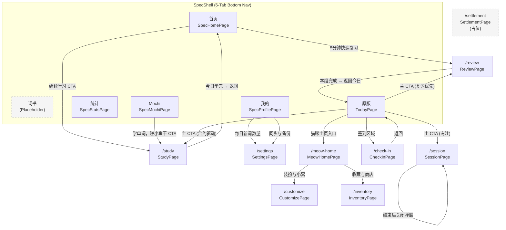

# 背单词喵喵 App UI SPEC v0.2.0

- **Version:** v0.2.0
- **Date:** 2026-04-08
- **Baseline commit:** bface75
- **Purpose:** 基于代码现状（commit bface75）重写 UI 规格文档，与 v0.1.4 旧文档对账后产出。代码实现为 source of truth；旧文档中未实现的规划项移入 Pending 区。

---

## 1. 变更摘要（vs v0.1.4）

### 架构级变更
- **导航重构**: 旧文档的"今日页单入口"模型已被 `SpecShell` 6-Tab 底部导航架构替代
- **默认首页**: 默认落点从 TodayPage 变为 SpecHomePage；TodayPage 降级为 legacy Tab
- **设计系统**: 新增 SPEC Design Token 体系（SpecBg / SpecText / SpecBrand / SpecTypo / SpecRadius / SpecSpacing / SpecShadow），与 Legacy 和原生 Material 三套并存
- **Feature Guard**: 新增 `P3FeatureGuard` 编译时开关体系（12 个 flag）
- **Local-first 架构**: StudyPage 采用 SQLite 先写 + API 后台 fire-and-forget 同步

### 新增页面
- SpecHomePage（新首页，精简版）
- SpecMochiPage（Mochi 独立 Tab，从旧文档"弱入口"升级）
- SpecStatsPage（统计独立 Tab，旧文档明确不展开，代码已实现 mock 版）
- SpecProfilePage（我的页，旧文档无对应）
- SettingsPage（设置页，旧文档仅提及"弱化的设置入口"）
- MeowHomePage（猫咪主页，旧文档无完整页面稿，代码已完整实现）
- CustomizePage（装扮页，旧文档仅有降级契约附录）
- InventoryPage（商店页，旧文档无对应）

### 关键差异
- **评分按钮**: 旧文档定义三按钮（认识/不认识/稍后复习），代码实现为二按钮（掌握/模糊）；FSRS 四按钮组件已开发未集成——最终方案**暂定**
- **结算浮层**: 旧文档有完整五区域规格，代码为纯占位
- **签到页**: 旧文档含月历和节点奖励列表，代码为精简版
- **主 CTA**: SpecHomePage 为静态跳转；TodayPage(Legacy) 保留合约驱动

### 移入 Pending 的旧文档规划
- 迁移/维护/只读降级态 UI（条件冻结，仅当 Room 1 pin Option A 时生效）
- 首次引导态（各页面高亮提示点）
- 骨架屏 Loading 策略
- 节点奖励展示
- 发音按钮、例句展示
- 统一状态标签组件、统一奖励展示组件

---

## 2. 导航架构

### 2.1 SpecShell 6-Tab 底部导航

应用主壳为 `SpecShell`，采用 6-Tab 底部导航栏。Tab 切换直接替换 Widget，不触发路由栈变化。

| Tab 索引 | 标签 | 对应页面 | 实现状态 |
|----------|------|----------|----------|
| 0 (home) | 首页 | `SpecHomePage` | [已实现] |
| 1 (books) | 词书 | placeholder（"词书页尚未设计"）| [占位·未实现] |
| 2 (mochi) | Mochi | `SpecMochiPage` | [已实现] |
| 3 (stats) | 统计 | `SpecStatsPage` | [已实现]（数据为 mock） |
| 4 (profile) | 我的 | `SpecProfilePage` | [已实现] |
| 5 (legacy) | 原版 | `TodayPage`（含 debug-only 警告 banner）| [开发参考] |

- Tab Bar 高度: 64px（含 safe area）
- 无 badge，无红点
- Legacy tab 标签始终 `#B4A89A` 色，选中时底部加下划线

### 2.2 命名路由表

| 路由 | 页面 Widget | 文件路径 | 用途 |
|------|-------------|----------|------|
| `/` (today) | `TodayPage` | `features/today/today_page.dart` | Legacy 今日概览 |
| `/study` | `StudyPage` | `features/study/study_page.dart` | 新词学习 |
| `/review` | `ReviewPage` | `features/review/review_page.dart` | 复习 |
| `/session` | `SessionPage` | `features/session/session_page.dart` | 专注 Session |
| `/check-in` | `CheckInPage` | `features/check_in/check_in_page.dart` | 签到 |
| `/settlement` | `SettlementPage` | `features/settlement/settlement_page.dart` | 结算（占位） |
| `/meow-home` | `MeowHomePage` | `features/meow_home/meow_home_page.dart` | Legacy 猫咪主页 |
| `/inventory` | `InventoryPage` | `features/inventory/inventory_page.dart` | 收藏与商店 |
| `/customize` | `CustomizePage` | `features/customize/customize_page.dart` | 装扮与小窝 |
| `/settings` | `SettingsPage` | `features/settings/settings_page.dart` | 设置 |

### 2.3 页面过渡

- 路由生成: `AppRouter.generateRoute` (onGenerateRoute)
- 过渡动画: fade + 轻微上滑（280ms easeOutCubic）

---

## 3. 设计系统

### 3.1 三套 UI 系统并存现状

当前应用存在三套设计系统并行：

| 设计系统 | Token 来源 | 适用页面 |
|----------|-----------|----------|
| **SPEC**（新版） | `SpecBg`, `SpecText`, `SpecTypo`, `SpecRadius`, `SpecSpacing` | SpecHomePage, SpecMochiPage, SpecStatsPage, SpecProfilePage, SpecTabBar |
| **Legacy**（旧版） | `MeowColors`, `MeowTextStyles`, `MeowSpacing`, `MeowRadius` | TodayPage, MeowHomePage, CustomizePage, InventoryPage, SettingsPage |
| **原生 Material**（最简版） | `Theme.of(context)` + Material 默认 | StudyPage, ReviewPage, SessionPage, CheckInPage, SettlementPage |

### 3.2 SPEC Design Tokens

文件: `lib/spec/theme/tokens.dart`

#### 背景色 (SpecBg)

| Token | 色值 | 用途 |
|-------|------|------|
| canvas | `#FDFBF7` | 全局背景（暖米色，非纯白） |
| card | `#F5EFE6` | 主卡片背景 |
| cardDeep | `#ECE0CC` | 强调卡片背景 |
| cardOutline | `#FDFBF7` | 描边卡片背景（同 canvas） |
| mochiWarm | `#FAECE7` | Mochi 暖卡片 |
| heroPurple | `#EEEDFE` | 紫色 Hero 区域 |
| highlightGreen | `#E1F5EE` | 绿色亮点区域 |

#### 文字色 (SpecText)

| Token | 色值 | 用途 |
|-------|------|------|
| primary | `#2C2C2A` | 主文本 |
| secondary | `#888070` | 次要文本 |
| tertiary | `#B4A89A` | 提示文本 |
| purple | `#6B4FA8` | 数字/强调 |
| purpleDeep | `#26215C` | 标题 |
| coral | `#993C1D` | 连续天数/正面强调 |
| mochi | `#4A1B0C` | Mochi 卡片文本 |
| green | `#04342C` | 亮点卡片文本 |

#### 品牌色 (SpecBrand)

| Token | 色值 | 用途 |
|-------|------|------|
| purple | `#6B4FA8` | 主 CTA 紫色 |
| purpleDeep | `#534AB7` | 热力图最深色 |
| mochiRose | `#D4537E` | Mochi 页 CTA |

#### 排版 (SpecTypo)

- **字重**: 仅 400 (regular) 和 500 (medium)，全 App 禁止 600/700
- **最小字号**: 11px
- **字体族**: PingFang SC (iOS) / 系统 sans-serif (Android)
- **预设样式**:

| 样式名 | 字号 | 字重 |
|--------|------|------|
| largeNumber | 37px | w500 |
| pageTitle | 18px | w500 |
| blockNumber | 23px | w500 |
| cardTitle | 15px | w500 |
| cardBody | 14px | w400 |
| cardSmall | 13px | w400 |
| label | 12px | w400 |
| labelSmall | 11px | w400 |
| tiny | 10px | w400 |

#### 圆角 (SpecRadius)

| Token | 值 | 用途 |
|-------|-----|------|
| small / card | 16px | 列表项/标准卡片 |
| large | 20px | 大卡片 |
| cta | 22px | 主 CTA 按钮 |
| pill | 999px | 胶囊 |
| heatmap | 3px | 热力图格 |

#### 间距 (SpecSpacing)

| Token | 值 | 用途 |
|-------|-----|------|
| pageH | 22px | 页面左右边距 |
| cardGap | 16px | 卡片间距 |
| cardPadSm | 13px | 卡片内部小间距 |
| cardPadLg | 20px | 卡片内部大间距 |
| elementGap | 10px | 元素小间距 |
| tabBarHeight | 64px | Tab Bar 高度 |
| minTouch | 44px | 最小触摸区域 |

#### 阴影 (SpecShadow)

- 全 App 零阴影原则
- 唯一例外: `floater`（"+1 新照片" 药丸浮层，offset(0,1) blur 3, black 6%）

### 3.3 组件库

#### 卡片系统

文件: `lib/spec/widgets/spec_cards.dart`

| 组件 | 背景 | 边框 | 圆角 | 用途 |
|------|------|------|------|------|
| `SpecCardFilled` | `#F5EFE6` | 无 | 16px | 默认数据卡片 |
| `SpecCardOutlined` | `#FDFBF7` | 0.5px `#E8DFCF` | 16px | 次要信息卡片 |
| `SpecCardHero` | `#6B4FA8` | 无 | 22px | 主 CTA / 大数字（白色文字，可选猫爪水印） |
| `SpecCardMochiWarm` | `#FAECE7` | 无 | 18px | Mochi 暖卡片 |
| `SpecCardStatsHero` | `#EEEDFE` | 无 | 22px | 统计 Hero 卡片（浅紫色，可选猫爪水印） |

#### Tab Bar

文件: `lib/spec/widgets/spec_tab_bar.dart`

- 6 个 tab，自定义 SVG 图标（`lib/spec/icons/tab_icons.dart`）
- 底部 0.5px `#ECE3D2` 边线
- 选中态: 文字 `#2C2C2A` w500 + 图标变化
- 未选中态: 文字 `#888070` w400

#### 设置列表

文件: `lib/spec/widgets/spec_settings_list.dart`

- `SpecSettingsGroupLabel` -- 组标签（11px, tertiary 色）
- `SpecSettingsGroup` -- 描边容器 + 分隔线
- `SpecSettingsRow` -- 单行设置项（label + value + 可选 chevron，min 44px 高度）

#### Mochi 插画

文件: `lib/spec/icons/mochi_illustrations.dart`

- `MochiAvatar` -- 小头像（可指定 size）
- `MochiLarge` -- 大插画（可指定 width）
- 使用 `CustomPainter` 绘制 SVG 风格猫咪

#### FSRS 评分按钮（**暂定**）

文件: `lib/core/memory/widgets/rating_buttons.dart`

组件 `FsrsRatingButtons` 提供 4 级评分按钮横向排列：

| 按钮 | Rating | 标签 | 副标签 | 颜色 | 图标 |
|------|--------|------|--------|------|------|
| 不认识 | again | 不认识 | 重来 | `#E8564A` (暖红) | refresh |
| 模糊 | hard | 模糊 | 有点印象 | `#E8A54A` (暖橙) | cloud |
| 记得 | good | 记得 | 想了一下 | `#6B4FA8` (品牌紫) | check |
| 秒答 | easy | 秒答 | 很简单 | `#3D9970` (沉绿) | bolt |

- 可选 interval 预览: 显示"下次: X天/周/月"
- 色盲友好: 每个按钮同时有图标 + 颜色区分
- **实现状态**: [已开发·未集成] -- StudyPage 和 ReviewPage 均未集成此组件，仍使用旧版 2 按钮

---

## 4. 页面详情

### 4.1 SpecHomePage -- SPEC 首页（Tab: home）

- **文件**: `lib/spec/pages/home_page.dart`
- **实现状态**: [已实现]
- **数据来源**:
  - [云端] `GET /me/today` -> `TodayState`
  - [云端] `GET /me/secondary-summary` -> `SecondarySummary`
- **信息层级**: 问候语 -> Mochi 签到卡 -> 主 CTA -> 数字卡片（本书进度/错词本）-> 5 分钟快速复习入口
- **主要交互**:
  - 下拉刷新 -> 重新加载两个 API
  - Mochi 签到卡片 -> `onTap` 空（由 tab 栏处理跳转到 Mochi tab）
  - **主 CTA "继续学习"** -> `Navigator.pushNamed(context, '/study')`（静态跳转，无状态驱动）
  - 数字卡片（本书进度 / 错词本）-> 纯展示，无跳转
  - **快速复习入口 "5 分钟快速复习"** -> `Navigator.pushNamed(context, '/review')`
  - 用户头像 -> `onTap` 空（由 tab 栏处理跳转到 Profile tab）
- **导航目标**: `/study`, `/review`
- **离线可用性**: 需要网络（两个 API 调用，无本地缓存降级）

### 4.2 SpecMochiPage -- Mochi 页（Tab: mochi）

- **文件**: `lib/spec/pages/mochi_page.dart`
- **实现状态**: [已实现]（4 个次级入口为 debugPrint 占位）
- **数据来源**:
  - [云端] `GET /me/secondary-summary` -> `SecondarySummary`
  - [云端] `GET /me/today` -> `TodayState`
- **信息层级**: 名称+天数+羁绊等级 -> 大插画+对话气泡 -> 进度条 -> 主 CTA -> 4 次级入口 -> 日记预览
- **主要交互**:
  - Mochi 大图 -> 可点击（隐藏新手引导提示，打印交互占位信息）
  - "+1 张新照片" 浮层 -> 点击可关闭
  - **主 CTA "学单词，赚小鱼干"** -> `Navigator.pushNamed(context, '/study')`
  - 4 个次级入口（换装 / 房间 / 零食柜 / 日记）-> 均为 `debugPrint` 占位
  - Mochi 日记预览卡 -> 纯展示
- **导航目标**: `/study`
- **离线可用性**: 需要网络

### 4.3 SpecStatsPage -- 统计页（Tab: stats）

- **文件**: `lib/spec/pages/stats_page.dart`
- **实现状态**: [已实现]（数据为 mock/硬编码，未接入真实数据源）
- **数据来源**:
  - [云端] `GET /me/secondary-summary` -> `SecondarySummary.statsSummary`
  - [云端] `GET /me/today` -> `TodayState`
- **信息层级**: 标题 -> 已掌握 Hero 卡 -> 三指标卡（连续/本周/记忆率）-> 12 周热力图 -> 本周亮点 -> 需要关注 -> Mochi 签名
- **主要交互**:
  - 纯展示页面，无可操作按钮
  - 热力图为 mock 数据（固定种子 Random(42)，3x12 格）
  - "需要关注"列表 -> 有箭头但无实际跳转
- **注意**: 记忆率硬编码为 82%，未接入真实数据
- **导航目标**: 无
- **离线可用性**: 需要网络

### 4.4 SpecProfilePage -- 我的页（Tab: profile）

- **文件**: `lib/spec/pages/profile_page.dart`
- **实现状态**: [已实现]（部分子页跳转为 debugPrint 占位）
- **数据来源**:
  - [云端] `GET /me/secondary-summary` -> `SecondarySummary`
  - [本地端] `SharedPreferences` -> `LocalSettingsService.dailyGoal`
- **信息层级**: 用户身份区 -> 当前词书卡 -> 学习设置组 -> 数据设置组 -> 关于设置组
- **主要交互**:
  - 用户身份区 -> `debugPrint`（个人编辑页未设计）
  - "切换" 词书 -> `debugPrint`（词书切换页未设计）
  - **"每日新词数量"** -> `Navigator.pushNamed(context, '/settings')` + 返回后 reload
  - "复习算法" -> `debugPrint`（子页未设计）
  - "学习提醒" -> `debugPrint`（子页未设计）
  - "发音" -> `debugPrint`（子页未设计）
  - **"同步与备份"** -> `Navigator.pushNamed(context, '/settings')`
  - "导出学习记录" -> `debugPrint`（子页未设计）
  - "帮助与反馈" -> `debugPrint`（子页未设计）
  - "版本 1.0.0" -> 不可点击（无 chevron）
- **导航目标**: `/settings`
- **离线可用性**: 部分可用（dailyGoal 来自本地 SharedPreferences，但 summary 需要网络）

### 4.5 TodayPage -- Legacy 今日页（Tab: legacy / 路由 `/`）

- **文件**: `lib/features/today/today_page.dart`
- **实现状态**: [已实现]（作为 Legacy Tab 保留，含 debug-only 警告 banner）
- **数据来源**:
  - [云端] `GET /me/today` -> `TodayState`
  - [云端] `GET /me/secondary-summary` -> `SecondarySummary`（含 `change_highlights`）
- **主要交互**:
  - AppBar 刷新按钮 -> 重新加载
  - **主 CTA（合约驱动）** -> 根据 `TodayPrimaryActionData` 决定跳转:
    - `continue_review_group` -> `/review`
    - `go_review` -> `/review`
    - `go_session` -> `/session`
    - `go_new_words` / 默认 -> `/study`
  - 今日目标进度（新词/复习组）-> 纯展示
  - 复习深度块 -> 纯展示（含组进度 + 今日复习进度）
  - **签到 + 连续天数区域** -> 含签到按钮跳转到 `/check-in`
  - Session 卡片 -> 跳转到 `/session`
  - 伴侣卡片 -> 展示 `companionResponse` 每日问候 + 学习后反馈 + 连续签到反馈
  - 猫咪主页入口 -> `Navigator.pushNamed(context, '/meow-home')`
  - 结算卡片 -> 纯展示 `lastRewardSettlement`
- **导航目标**: `/study`, `/review`, `/session`, `/check-in`, `/meow-home`
- **离线可用性**: 需要网络

### 4.6 StudyPage -- 新词学习（路由 `/study`）

- **文件**: `lib/features/study/study_page.dart`
- **实现状态**: [已实现]
- **数据来源**:
  - [云端] `GET /me/new-words/next` -> `Word`（通过 `StudyService`）
  - [本地端] SQLite `LocalDatabase` -> 已掌握词 ID、写入学习记录
  - [云端] `POST /me/new-words` -> 后台同步（fire-and-forget）
- **架构**: Local-first（SQLite 先写入，API 后台同步），通过 `StudyService` 协调
- **主要交互**:
  - 单词卡片 -> 展示 wordText + phonetic + meaning
  - **"模糊" 按钮** -> `_submitStudy('forgot')` -> SQLite 先写 -> SnackBar "已标记模糊" -> 加载下一词
  - **"掌握" 按钮** -> `_submitStudy('know')` -> SQLite 先写 -> SnackBar "已掌握" -> 加载下一词
  - 全部学完 -> 展示"今日新词已学完" + **"返回" 按钮** -> `Navigator.pop(context)`
  - 加载失败 -> "重试"按钮
- **评分按钮方案（暂定）**: 当前使用 2 按钮（掌握/模糊）。`FsrsRatingButtons` 4 级评分组件已开发但未集成到本页面。最终采用 2 按钮还是 4 按钮方案待确认。
- **退出路径**: 全部学完 -> `Navigator.pop(context)` 返回上层。无结算浮层跳转（SettlementPage 为占位），无退出确认机制。
- **导航目标**: 返回上层（pop）
- **离线可用性**: 部分可用（写入本地 OK，但获取下一个词需要网络）

### 4.7 ReviewPage -- 复习（路由 `/review`）

- **文件**: `lib/features/review/review_page.dart`
- **实现状态**: [已实现]
- **数据来源**:
  - [云端] `GET /me/review-groups/next` -> `ReviewGroup`
  - [云端] `POST /review-attempts` -> `ReviewAttemptResult`
- **主要交互**:
  - 进度条 -> 展示本组完成数 / 总数
  - 单词卡片 -> 展示 wordText + meaning（纯展示，无选项/输入区）
  - **"忘记" 按钮** -> `_submitReview('incorrect')`
  - **"正确" 按钮** -> `_submitReview('correct')`
  - 本组完成 -> 三层边界提示（组完成 / 今日进度 / 下一组可用性）+ **"返回今日" 按钮** -> `Navigator.pop(context)`
  - 组完成时如有 settlement -> SnackBar 展示奖励状态（用 SnackBar 替代结算浮层）
  - 加载失败 -> "重试"按钮
- **评分按钮方案（暂定）**: 当前使用 2 按钮（正确/忘记）。`FsrsRatingButtons` 4 级评分组件已开发但未集成到本页面。最终采用 2 按钮还是 4 按钮方案待确认。
- **文案合规**: 本组完成时展示三层边界提示，符合旧文档"本组完成 != 今日复习完成"的双层口径要求。
- **导航目标**: 返回上层（pop）
- **离线可用性**: 需要网络（所有操作都走 API）

### 4.8 SessionPage -- 专注 Session（路由 `/session`）

- **文件**: `lib/features/session/session_page.dart`
- **实现状态**: [已实现]
- **数据来源**:
  - [云端] `POST /sessions` -> 创建 session
  - [云端] `POST /sessions/{id}/finish` -> 结束 session
- **三态展示**:
  - **无 session**: "开始 Session" 按钮 -> `_startSession()` -> 创建 session + 启动计时器
  - **session 进行中**: 计时器实时更新（1秒/次）+ 状态 Chip "进行中" + 学习统计卡片（有效学习次数/有效复习次数）+ **"结束 Session" 按钮（红色）** -> `_finishSession()` -> 弹出验证结果对话框
  - **session 已结束**: 验证结果弹窗（valid/invalid/pending + 原因说明）+ **"开始新 Session" 按钮** -> 重置状态
- **验证规则**: >= 15 分钟 + >= 5 次有效学习/复习
- **导航目标**: 无（页面内状态切换）
- **离线可用性**: 需要网络

### 4.9 CheckInPage -- 签到（路由 `/check-in`）

- **文件**: `lib/features/check_in/check_in_page.dart`
- **实现状态**: [已实现]（精简版）
- **数据来源**:
  - [云端] `POST /check-ins` -> `CheckInResult`
- **主要交互**:
  - 未签到时: **"立即签到" 按钮** -> `_checkIn()`
  - 已签到后:
    - 连续签到卡片 -> 展示 `currentStreak` 天数
    - 今日学习卡片 -> 展示 `learningDayToday` 状态
    - 签到说明卡片 -> 明确标注"签到 != 学习日"
    - **"返回" 按钮** -> `Navigator.pop(context)`
- **文案合规**: 签到后展示"签到说明卡片"明确区分签到与学习日，并独立展示 `learningDayToday` 状态，符合旧文档要求。
- **与旧文档差异**: 无月历、无节点奖励列表、无节点奖励预告（这些规划见 Pending 区）
- **导航目标**: 返回上层（pop）
- **离线可用性**: 需要网络

### 4.10 SettlementPage -- 结算（路由 `/settlement`）

- **文件**: `lib/features/settlement/settlement_page.dart`
- **实现状态**: [占位·未实现]
- **数据来源**: 无
- **当前状态**: 纯占位页面，仅显示 "SettlementPage - Phase 1 暂不实现"
- **离线可用性**: 完全可用（无数据依赖）

### 4.11 MeowHomePage -- Legacy 猫咪主页（路由 `/meow-home`）

- **文件**: `lib/features/meow_home/meow_home_page.dart`
- **实现状态**: [已实现]
- **数据来源**:
  - [云端] `GET /me/secondary-summary` -> `SecondarySummary`（含 `catSummary`, `companionResponse`, `equippedPreview`, `statsSummary`, `changeHighlights`）
  - [云端] `GET /me/today` -> `TodayState`
  - [云端] `POST /me/feed` -> `FeedResponse`
- **主要交互**:
  - AppBar 刷新按钮 -> 重新加载
  - **猫咪头像 -> 可点击**（随机互动文案 + 3 秒冷却）
  - **"喂小鱼干" 按钮** -> `_feedCat()`:
    - 成功 -> 随机成功文案 + Mood 变化
    - 升级 -> 升级弹窗
    - 资源不足 -> "小鱼干不够啦"
    - 已喂过 -> "喵喵已经吃过啦~"
  - 资源栏 -> 展示金币 / 小鱼干 / EXP
  - 成长卡片 -> 展示等级 + EXP 进度条
  - 今日亮点区 -> chips（签到/学习/新词/复习/专注/连续天数）
  - 变化亮点区 -> `change_highlights`（最多 3 条）
  - 伴侣区 -> `companionResponse`
  - 装备区 -> 当前装扮 chips
  - 统计摘要区 -> 学习天数/掌握词数/复习组/签到次数
  - **操作按钮区**:
    - "装扮与小窝" -> `Navigator.pushNamed(context, '/customize')`
    - "收藏与商店" -> `Navigator.pushNamed(context, '/inventory')`
- **导航目标**: `/customize`, `/inventory`
- **离线可用性**: 需要网络

### 4.12 CustomizePage -- 装扮与小窝（路由 `/customize`）

- **文件**: `lib/features/customize/customize_page.dart`
- **实现状态**: [已实现]
- **数据来源**:
  - [云端] `GET /shop/catalog` -> `CatalogResponse`
  - [云端] `GET /me/inventory` -> `InventoryStateData`
  - [云端] `GET /me/equipment` -> `EquipmentResponse`
  - [云端] `POST /shop/purchases` -> `PurchaseResponse`
  - [云端] `POST /me/equipment/equip` -> `EquipResponse`
- **主要交互**:
  - AppBar 刷新按钮 -> 重新加载
  - 预览区 -> 展示猫咪 + 装备槽位状态 + 空槽位提示
  - 资源栏 -> 金币余额 + 拥有数/总数 + 已装备槽数/4
  - 攒钱目标提示 -> 自动计算最近可攒到的未拥有物品
  - 已拥有未装备提示（最多 3 件）-> 每件有 **"装备" 按钮** -> `_equip(item)`
  - 3 个 Tab（全部/已拥有/已装备）
  - 物品卡片:
    - 未拥有 -> **"N 购买" 按钮** -> `_purchase(item)` + 比较提示
    - 已拥有未装备 -> **"装备" 按钮** -> `_equip(item)` + 替换/空槽提示
    - 已装备 -> 无操作按钮
  - 4 个装备槽位: head(头饰) / neck(颈饰) / decor(装饰) / floor(地面)
- **导航目标**: 无
- **离线可用性**: 需要网络

### 4.13 InventoryPage -- 收藏与商店（路由 `/inventory`）

- **文件**: `lib/features/inventory/inventory_page.dart`
- **实现状态**: [已实现]
- **数据来源**:
  - [云端] `GET /shop/catalog` -> `CatalogResponse`
  - [云端] `GET /me/inventory` -> `InventoryStateData`
  - [云端] `POST /shop/purchases` -> `PurchaseResponse`
- **主要交互**:
  - AppBar 刷新按钮 -> 重新加载
  - 余额卡片 -> 展示金币余额 + 已拥有数
  - 我的收藏列表 -> 展示已拥有物品
  - 商店列表 -> 展示商品目录
    - 已拥有 -> 显示 "已拥有"
    - 未拥有 -> **"购买" 按钮** -> `_purchase(item)`
      - 成功 -> SnackBar "买到了「XXX」~"
      - 金币不足 -> "金币不够啦，多学几个单词吧~"
      - 已拥有 -> "已经拥有这个啦~"
      - 等级锁定 -> "等级还不够，继续加油~"
- **导航目标**: 无
- **离线可用性**: 需要网络

### 4.14 SettingsPage -- 设置（路由 `/settings`）

- **文件**: `lib/features/settings/settings_page.dart`
- **实现状态**: [已实现]
- **数据来源**:
  - [本地端] `SharedPreferences` -> `LocalSettingsService`（dailyGoal, desiredRetention）
  - [本地端] `LocalDatabase` (SQLite) -> `SnapshotExportService` 导出快照
  - [云端] `BackupUploadService` -> 上传备份到 `/api/v1`
  - [云端] `BackupRestoreService` -> 从云端恢复备份
  - [云端] `PUT /me/settings/daily-goal` -> 同步每日目标到后端
- **主要交互**:
  - **每日学习目标区**（受 `P3FeatureGuard.isDailyGoalSettingEnabled` 守卫，当前 = true）:
    - 点击 -> 弹出输入对话框（范围 1-500）-> 保存到 SharedPreferences + 同步后端
  - **记忆设置区**:
    - "记忆保留率" -> 弹出 Slider 对话框（范围 0.85-0.95，默认 0.90）-> 保存到 SharedPreferences
  - **数据备份区**:
    - 最近备份状态展示
    - **"立即备份" / "重试备份" 按钮** -> 导出本地快照 + 上传到云端
    - 备份失败时显示错误信息
  - **恢复备份区**（受 `P3FeatureGuard.isRestoreEnabled` 守卫，当前 = true）:
    - **"恢复备份" 按钮** -> 预检查 -> 确认弹窗（高风险操作）-> 执行恢复
    - 预检查不通过时: 无备份 / 版本不支持 / 服务不可用
- **导航目标**: 无
- **离线可用性**: 部分可用（设置读写 OK，备份/恢复需要网络）

### 4.15 词书 Tab（占位）

- **实现状态**: [占位·未实现]
- **当前状态**: Tab 栏有"词书"位置，页面显示 "词书页尚未设计"

---

## 5. 本地存储服务

### 5.1 LocalSettingsService（SharedPreferences）

| Key | 类型 | 默认值 | 用途 |
|-----|------|--------|------|
| `settings_daily_goal` | int | 20 | 每日新词数量 |
| `settings_sound_enabled` | bool | true | 声音开关 |
| `settings_theme` | String | 'light' | 主题 |
| `settings_notification_time` | String | '09:00' | 通知时间 |
| `settings_desired_retention` | double | 0.9 | FSRS 记忆保留率 |

### 5.2 LocalDatabase（SQLite via drift）

- 用于 Study local-first 写入（`word_records` 表）
- 用于 FSRS 卡片状态存储（`card_states` 表）
- 用于备份导出快照

### 5.3 FsrsService

- 封装 fsrs pub.dev 库
- UI 层只看到 `ReviewRating` / `CardStateData`
- 默认参数: `desiredRetention=0.9`, `learningSteps=[1min, 10min]`, `relearningSteps=[10min]`
- TODO(待确认): FsrsService 当前是否被 StudyPage/ReviewPage 实际调用。代码中 StudyPage 使用旧版 2 按钮 + `StudyService`，ReviewPage 使用旧版 2 按钮 + 直接 ApiClient

---

## 6. Feature Guards

文件: `lib/core/guards/p3_feature_guard.dart`

`P3FeatureGuard` 包含 12 个编译时静态常量开关：

| Guard Flag | 当前值 | 用途 | UI 使用位置 |
|------------|--------|------|-------------|
| `isStatisticsPageEnabled` | `false` | 统计独立页面（路由/导航/Shell） | -- |
| `isCTADecisionSupportEnabled` | `false` | CTA 决策支持块 | -- |
| `isStreakBasisSwitchEnabled` | `false` | 连续天数基准切换（learning_day 基准） | -- |
| `isReviewReadinessContractEnabled` | `false` | 复习就绪合约 | -- |
| `isStreakExplanationEnabled` | `false` | 连续天数未来规则说明 | -- |
| `isLocalBackupEnabled` | `false` | 本地快照导出 | -- |
| `isCloudBackupEnabled` | `false` | 云端备份上传 | -- |
| `isRestoreEnabled` | **`true`** | 从备份恢复 | `SettingsPage._buildRestoreSection()` |
| `isBackupSettingsEntryEnabled` | `false` | 备份设置入口可见性 | -- |
| `isDailyGoalSettingEnabled` | **`true`** | 每日目标设置 UI | `SettingsPage._buildDailyGoalSection()` |
| `isManualUploadEnabled` | **`true`** | 手动上传 | -- |
| `isDownloadToLocalEnabled` | **`true`** | 下载云端进度到本地 | -- |

**当前已启用**: `isRestoreEnabled`, `isDailyGoalSettingEnabled`, `isManualUploadEnabled`, `isDownloadToLocalEnabled`

---

## 7. Pending（规划中，待开发）

以下为旧文档 v0.1.4 中已定义但代码尚未实现的功能，保留为规划参考。

### 7.1 结算浮层完整实现

旧文档 Section 6 定义了结算浮层的五大区域（标题区/结果摘要区/奖励展示区/成长承接区/操作区）以及多种状态矩阵（正常/空/loading/异常/奖励/部分完成/全部完成/Session 有效无效/升级解锁/同步失败兜底）。当前代码为纯占位。

### 7.2 迁移/维护/只读降级态

旧文档 Section 3.F11、Section 9.6 定义了 `sync_status=delayed` / `read_only=true` / `maintenance=true` / `temporarily_unavailable=true` 四种降级态的 UI 表现及最小可观察结果表。代码中 `sync_status` 在 TodayState 中硬编码为 `'healthy'`，无任何降级态 UI 实现。

> 条件冻结规则：仅当 Room 1 正式 pin Option A 并进入 cutover/maintenance/degraded-state 实施窗口后，才作为强实现要求。

### 7.3 首次引导态

旧文档在每个关键页面（今日页/新词学习页/复习页/签到页/Session 页）都定义了首次引导态（高亮提示点，每页不超过 2 个）。代码无任何首次引导态实现。

### 7.4 骨架屏/Loading 策略

旧文档定义了骨架屏策略（首次进入加载用骨架屏，局部刷新只在对应卡片内 loading）。代码各页面使用简单的 `CircularProgressIndicator` 或条件渲染，无骨架屏组件。

### 7.5 签到月历与节点奖励展示

旧文档 Section 7.D 定义了展开层包含月历/猫爪印式签到记录、节点奖励列表（3/7/14/30 天）、节点奖励预告。代码签到页为精简版，无月历、无节点奖励列表。云端有 streak node 逻辑（连续天数节点 [3,5,7,10,14,21,30,50]），但签到 UI 仅显示当前 streak 天数。

### 7.6 发音按钮

旧文档 Section 4.D2、4.E 定义了新词学习页的发音按钮和播放发音操作。代码 StudyPage 展示 wordText + phonetic + meaning，无发音按钮。

### 7.7 例句展示

旧文档 Section 4.D2 定义了单词主卡区含例句（MVP 可折叠）。代码 StudyPage 仅展示 wordText + phonetic + meaning，无例句。

### 7.8 统一状态标签组件

旧文档 Section 1.5、9.1 定义了统一页面状态语言（未开始/进行中/部分完成/已完成/待校验等 10 种）和统一任务状态标签组件。代码中状态枚举在类型定义中存在（DailyGoalStatus / SessionValidationStatus / RewardSettlementStatus 等），但 UI 层无统一的状态标签组件。各页面独立处理状态展示。

### 7.9 统一奖励展示组件

旧文档 Section 9.2 定义了统一奖励展示组件规格（页面级 `reward_settlement_status` / 奖励项级 `reward_items[].reward_status`）。代码无统一奖励展示组件。

### 7.10 主 CTA 状态机驱动（SpecHomePage）

旧文档 Section 3.D2 定义了主 CTA 根据状态机动态切换（未开始/继续本组复习/先去复习/继续完成/再学一点）。SpecHomePage 当前主 CTA "继续学习" 为硬编码跳转 `/study`，无状态驱动。TodayPage(Legacy) 保留了合约驱动。

### 7.11 旧文档文案边界规则

以下旧文档定义的文案边界规则，代码中已符合的部分已在对应页面标注；其余规则在对应功能实现时仍需遵守：

- "部分完成"不能写成"已完成"
- "奖励展示"不能写成"成长已经生效"
- "签到成功"不能写成"完成有效学习日"
- "本组复习完成"不能写成"今日复习完成"
- `displayed snapshot` 不能写成 `fresh backend truth`
- 主 CTA 的优先级展示必须由后端返回决定；**UI must not infer by itself**

### 7.12 退出确认与中断保护

旧文档 Section 4.C 定义了用户主动退出学习页时需有确认或保存机制。代码 StudyPage 全部学完后直接 `Navigator.pop(context)` 返回，无退出确认。

---

## 8. 导航流程图

---

## 9. 未决事项

### Critical

1. **评分按钮最终方案（暂定）**: StudyPage 和 ReviewPage 当前使用 2 按钮，FSRS 4 按钮组件已开发未集成。最终采用哪种方案待确认。
2. **结算浮层实现**: 当前为纯占位，学习完成后直接 pop 返回，无结算流程。
3. **SpecHomePage 主 CTA 状态驱动**: 当前硬编码跳转 `/study`，需要接入状态机驱动。

### Major

4. **主 CTA winner 仲裁规则**: 旧文档标记为 Pending Decision，代码中 TodayPage(Legacy) 有部分实现，SpecHomePage 无实现。
5. **`review_group` 分组算法细节**: group size / review priority / 题型比例仍未冻结。
6. **统计页数据接入**: SpecStatsPage 已实现 UI 但数据为 mock/硬编码，记忆率 82% 为硬编码。
7. **SPEC 设计系统统一**: 三套设计系统并存，后续需统一迁移至 SPEC 系统。

### Minor

8. **Mochi 页主 CTA 学习跳转**: SpecMochiPage 有"学单词，赚小鱼干"跳转 `/study`，需确认是否违反"副机制不得反向主导主学习流程"原则。
9. **`isStatisticsPageEnabled` 与 Tab 可见性**: Feature guard 为 false 但统计 Tab 在 SpecShell 中可见，两者关系需对齐。
10. **FsrsService 实际调用链**: 需确认 StudyPage/ReviewPage 是否实际调用 FsrsService，还是仍走旧版提交路径。
11. **节点奖励是否进入 RewardLedger**: 云端有 streak node 逻辑但 UI 未展示。
12. **`streak` basis 是否从 `check_in` 改为 `learning_day` 或组合条件**: 不在当前版本冻结。
13. **词书 Tab 页面设计**: 当前为 placeholder。

---

*-- End of UI_SPEC_v0.2.0 --*
