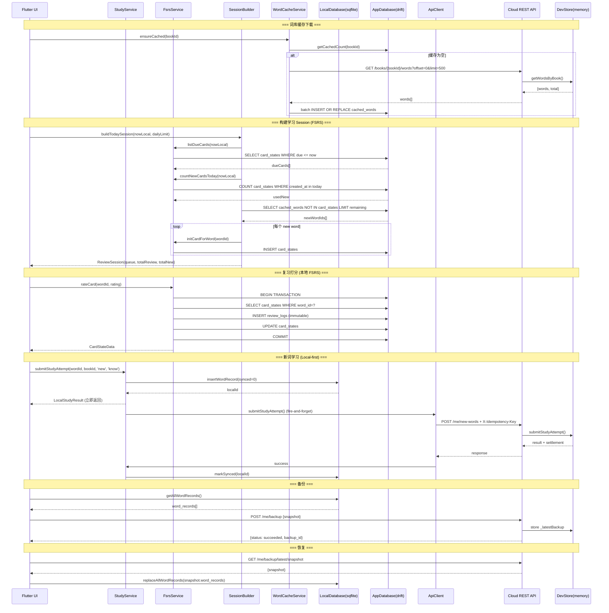
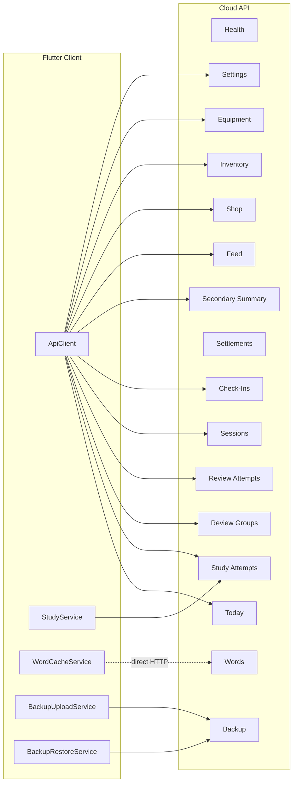
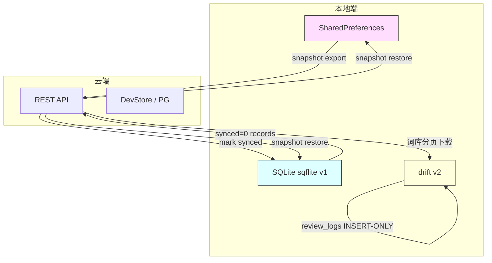

# 背单词喵喵 App API 设计草案 v0.2.0

- **Version:** v0.2.0
- **Date:** 2026-04-08
- **Baseline commit:** bface75
- **Previous version:** v0.1.4
- **Purpose:** 代码-文档对齐（Phase 3 reconciliation）。以代码实际为 truth，消除旧文档与实现之间的所有分歧，补充旧文档未覆盖的本地端 Service 层与同步接口。

---

## 1. 变更摘要（vs v0.1.4）

### 1.1 结构性变更
- 新增 **本地端接口 [本地端]** 章节：8 个 Flutter Service 的完整方法签名与行为描述
- 新增 **同步接口 [同步]** 章节：学习记录同步、备份/恢复、词库缓存下载 3 种同步流程
- 新增 **API 形态综述**：描述云端 REST + 本地 Service + 同步的双端架构
- 新增 Mermaid 数据流图与模块关系图

### 1.2 路径 / 字段 / 响应以代码为准的修正
- `POST /study-attempts` --> `POST /me/new-words`（路径修正）
- `PUT /me/book-settings` --> `PUT /me/settings/daily-goal`（路径与功能缩减）
- `POST /me/backups` --> `POST /me/backup`（单数）
- `GET /me/backups/latest` --> `GET /me/backup/latest`（单数）
- `GET /me/today` 响应从嵌套结构改为扁平结构，新增 `today_primary_action`、`review_summary`
- `daily_goal_status` 枚举移除 `partially_completed`，保留 `not_started`/`in_progress`/`completed`
- 所有响应移除统一信封 `{ok, request_id, data, meta}`，直接返回 data
- 鉴权从 Bearer token 改为无鉴权（dev mode, 硬编码 dev-user-001）
- Base URL 从 `https://api.example.com/v1` 改为 `/api/v1`（NestJS, 端口 3000）

### 1.3 新增端点（代码有、旧文档无）
- `GET /health`（健康检查）
- `GET /check-ins/today`（查询今日签到）
- `GET /me/backup/latest/snapshot`（获取 snapshot 用于 restore）
- `GET /books/:bookId/words`（批量词库下载）
- 降级/维护模式中间件

### 1.4 标记为 Pending 的端点（旧文档有、代码无）
- `POST /auth/guest-sessions`
- `POST /auth/email-sessions`
- `GET /word-books`
- `POST /me/backups/latest/restore-precheck`
- `POST /me/backups/latest/download`
- `POST /me/backups/latest/restore-apply`
- `GET /me/stats/summary`

### 1.5 StudyPage rating buttons 状态
**暂定** -- 当前 UI 使用 2 按钮（know/forgot），FSRS 4 按钮（Again/Hard/Good/Easy）已开发未集成。

---

## 2. API 形态综述

### 2.1 接口类型

| 类型 | 数量 | 位置 | 运行时 |
|------|------|------|--------|
| 云端 REST API | 26 endpoints | `apps/api/src/controllers/` | NestJS (Node.js) |
| 本地端 Service 层 | 8 services | `apps/mobile/lib/core/services/` + `lib/core/memory/` + `lib/core/storage/` | Flutter (Dart) |
| 同步接口 | 3 flows | 跨端: Flutter client --> Cloud REST | 混合 |

### 2.2 调用方向

```
Flutter UI
  |---> ApiClient (HTTP) ------> Cloud REST API (NestJS)
  |---> StudyService (本地 SQLite 优先, 后台同步 API)
  |---> FsrsService (纯本地 drift/SQLite)
  |---> SessionBuilder (纯本地 drift/SQLite)
  |---> WordCacheService (从 Cloud 下载 --> 本地 drift/SQLite)
  |---> LocalSettingsService (SharedPreferences)
  |---> LocalProgressRepository (SharedPreferences)
  |---> BackupUploadService (本地导出 --> Cloud upload)
  '---> BackupRestoreService (Cloud download --> 本地覆写)
```

### 2.3 数据权威源划分

| 数据类型 | 权威源 | 说明 |
|----------|--------|------|
| 词库 (word pool) | 云端 dev-store | Flutter 通过 WordCacheService 缓存到本地 cached_words |
| 新词学习记录 | 本地优先 | SQLite 先写 --> 后台异步同步到 API |
| 复习记录 (FSRS) | 纯本地 | card_states + review_logs 仅存于 drift/SQLite |
| 复习分组 (review_group) | 云端 | 云端生成和持有 review_group，Flutter 调 API |
| 今日状态聚合 | 云端 | GET /me/today 返回聚合数据 |
| 奖励/结算/商店/装备 | 云端 | 所有写操作由 API 处理 |
| 备份/恢复 | 混合 | 本地导出 snapshot --> 上传云端容器 --> 下载恢复 |
| 用户设置 (daily_goal) | 双写 | 本地 SharedPreferences + 云端 PUT /me/settings/daily-goal |
| FSRS 调度参数 | 纯本地 | desired_retention 仅存 SharedPreferences |

---

## 3. 全局约定

### 3.1 Base URL

| 项目 | 值 |
|------|-----|
| Base URL | `/api/v1` (NestJS `setGlobalPrefix`) |
| 默认端口 | 3000 |

### 3.2 CORS

| 项目 | 值 |
|------|-----|
| enabled | true |
| origin | `*` |
| methods | GET, POST, PUT, PATCH, DELETE, OPTIONS |
| Allowed Headers | Content-Type, Authorization, X-Idempotency-Key |

### 3.3 中间件

| 中间件 | 作用 |
|--------|------|
| `loggingMiddleware` | 请求日志 |
| `MaintenanceGuardMiddleware` | 降级/维护模式拦截 |
| `PersistenceFailureFilter` | 持久化失败处理 |
| `errorFilter` | 全局错误格式化 |

### 3.4 降级模式 [已实现]

支持以下环境变量，通过中间件全局拦截返回 503：

| 环境变量 | 效果 |
|----------|------|
| `MAINTENANCE_MODE` | 全面维护，所有请求返回 503 |
| `READ_ONLY_MODE` | 只读模式，写操作返回 503 |
| `TEMPORARILY_UNAVAILABLE` | 临时不可用 |

### 3.5 幂等规则 [已实现]

- 写接口通过 `X-Idempotency-Key` header 实现幂等
- 同一 `user_id + endpoint semantic + X-Idempotency-Key` 只成功写入一次
- 重试时返回同一业务结果，不重复推进状态或重复发奖
- `idempotency_keys` 表存在于 DB 中
- 已实现幂等的端点：study-attempts, review-attempts, sessions, check-ins, feed, purchases, equip, unequip

### 3.6 鉴权 [Pending -- 规划中]

**当前无鉴权。** Dev mode，单用户 `dev-user-001`。所有 API 均无 Authorization header。

> 旧文档设计的 `Authorization: Bearer <token>` 方案尚未实现。认证模块整体待开发。

### 3.7 响应格式

**当前无统一信封。** 直接返回 data 对象。错误通过 HTTP status code + errorFilter 中间件处理。

> 旧文档设计的 `{ok, request_id, data, meta}` 信封尚未实现。

### 3.8 持久化后端

| 模式 | 说明 |
|------|------|
| dev-store (默认) | 纯内存实现，重启丢失所有数据 |
| pg (可选) | 通过 `PERSISTENCE_BACKEND=pg` 环境变量启用 PostgreSQL |

### 3.9 核心状态枚举

#### `daily_goal_status` [已实现]
- `not_started`
- `in_progress`
- `completed`

> 注: 旧文档中的 `partially_completed` 已不存在于代码中。

#### `session_validation_status` [已实现]
- `pending`
- `valid`
- `invalid`

#### `session_status` [已实现]
- `started`
- `ended`

#### `reward_settlement_status` [已实现]
- `pending`
- `settling`
- `succeeded`
- `failed`
- `compensated`

#### `submit_status` [已实现]
- `accepted`
- `rejected`

---

## 4. 云端 API [云端]

### 端点总览表

| # | 方法 | 路径 | 模块 | 幂等 Key | 实现状态 | Controller | ApiClient 方法 |
|---|------|------|------|----------|----------|------------|----------------|
| 1 | GET | /health | 系统 | - | [已实现] | HealthController | - |
| 2 | GET | /me/new-words/next | 学习 | - | [已实现] | StudyAttemptsController | getNextNewWord() |
| 3 | POST | /me/new-words | 学习 | Y | [已实现] | StudyAttemptsController | submitStudyAttempt() |
| 4 | GET | /me/review-groups/next | 复习 | - | [已实现] | ReviewGroupsController | getNextReviewGroup() |
| 5 | POST | /review-attempts | 复习 | Y | [已实现] | ReviewAttemptsController | submitReviewAttempt() |
| 6 | GET | /me/today | 聚合 | - | [已实现] | TodayController | getToday() |
| 7 | POST | /sessions | Session | Y (必填) | [已实现] | SessionsController | startSession() |
| 8 | POST | /sessions/:id/finish | Session | Y (必填) | [已实现] | SessionsController | finishSession() |
| 9 | GET | /sessions/:id | Session | - | [已实现] | SessionsController | getSession() |
| 10 | POST | /check-ins | 签到 | Y (必填) | [已实现] | CheckInsController | checkIn() |
| 11 | GET | /check-ins/today | 签到 | - | [已实现] | CheckInsController | (ApiClient 未封装) |
| 12 | POST | /settlements/learning-rounds | 结算 | Y (必填) | [已实现] | SettlementsController | (ApiClient 未封装) |
| 13 | GET | /settlements/:sourceEventId | 结算 | - | [已实现] | SettlementsController | (ApiClient 未封装) |
| 14 | GET | /me/secondary-summary | 二级激励 | - | [已实现] | SecondarySummaryController | getSecondarySummary() |
| 15 | POST | /me/feed | 喂食 | Y (必填) | [已实现] | FeedController | feedCat() |
| 16 | GET | /shop/catalog | 商店 | - | [已实现] | ShopController | getShopCatalog() |
| 17 | POST | /shop/purchases | 商店 | Y (必填) | [已实现] | ShopController | purchaseItem() |
| 18 | GET | /me/inventory | 背包 | - | [已实现] | InventoryController | getInventory() |
| 19 | GET | /me/equipment | 装备 | - | [已实现] | EquipmentController | getEquipment() |
| 20 | POST | /me/equipment/equip | 装备 | Y (必填) | [已实现] | EquipmentController | equipItem() |
| 21 | POST | /me/equipment/unequip | 装备 | Y (必填) | [已实现] | EquipmentController | (ApiClient 未封装) |
| 22 | PUT | /me/settings/daily-goal | 设置 | - | [已实现] | SettingsController | updateDailyGoal() |
| 23 | POST | /me/backup | 备份 | - | [已实现] | BackupController | (BackupUploadService) |
| 24 | GET | /me/backup/latest | 备份 | - | [已实现] | BackupController | (ApiClient 未封装) |
| 25 | GET | /me/backup/latest/snapshot | 备份 | - | [已实现] | BackupController | (BackupRestoreService) |
| 26 | GET | /books/:bookId/words | 词库 | - | [已实现] | WordsController | (WordCacheService 直接 HTTP) |

---

### 4.1 系统模块

#### API-001 GET /api/v1/health [已实现]

**用途:** 健康检查，返回系统状态与降级状态。

**请求参数:** 无

**响应:**

| 字段 | 类型 | 说明 |
|------|------|------|
| status | string | `ok` / `maintenance` / `read_only` / `temporarily_unavailable` |
| persistence_backend | string | `pg` (default) |
| write_blocked | boolean | 写操作是否被阻止 |
| degraded_state.maintenance | boolean | 是否处于维护模式 |
| degraded_state.read_only | boolean | 是否处于只读模式 |
| degraded_state.temporarily_unavailable | boolean | 是否临时不可用 |
| timestamp | string (ISO 8601) | 当前服务端时间 |

**涉及 DB 表:** 无

**调用者:** 运维/监控

---

### 4.2 学习模块 (New Words)

#### API-002 GET /api/v1/me/new-words/next [已实现]

**用途:** 获取下一个待学新词。

**请求参数:** 无

> 注: 旧文档中的 `session_id` 可选参数在代码中不存在。

**响应:** Word object 或 `{ message: 'No more new words available' }`

| 字段 | 类型 | 说明 |
|------|------|------|
| word_id | string | 单词唯一 ID |
| word_text | string | 单词文本 |
| meaning | string | 中文释义 |
| phonetic | string? | 音标 |
| book_id | string | 所属词书 ID |
| translation | string? | 翻译 |
| definition | string? | 英文定义 |
| difficulty_level | int? | 难度等级 |
| is_core | boolean? | 是否核心词汇 |
| tags | string? | 标签 |
| frequency_rank | int? | 词频排名 |
| word_forms | string? | 词形变化 |

> 注: 旧文档中的 `example_sentence`、`audio_url`、`progress_current`、`progress_target` 在代码中不存在。

**涉及 DB 表:** dev-store 内存词库

**调用者:** `ApiClient.getNextNewWord()` --> `StudyService.getNextWord()`

---

#### API-003 POST /api/v1/me/new-words [已实现]

**用途:** 提交新词学习结果。

> 注: 旧文档路径为 `POST /study-attempts`，代码实际路径为 `POST /me/new-words`。

**幂等:** X-Idempotency-Key

**请求体:**

| 字段 | 类型 | 必填 | 说明 |
|------|------|------|------|
| word_id | string | Y | 单词 ID |
| book_id | string | Y | 词书 ID |
| study_type | `'new'` | Y | 固定值 |
| action_result | `'know'` \| `'forgot'` | Y | 学习结果 |

> 注: 旧文档中的 `session_id` 请求字段在代码中不存在。

**响应:**

| 字段 | 类型 | 说明 |
|------|------|------|
| submit_status | `'accepted'` | 提交状态 |
| today_new_completed | int | 今日已完成新词数 |
| daily_goal_status | string | 今日目标状态 |
| already_exists | boolean | 幂等重放标记 |
| settlement | object? | 当 action_result=know 时触发结算 |
| settlement.source_event_id | string | 来源事件 ID |
| settlement.reward_settlement_status | string | 结算状态 |
| settlement.reward_items | array | `[{reward_type, amount, reward_status}]` |

**副作用:** 当 action_result=know --> 创建 source_event(effective_new_word) --> 创建 settlement --> 更新 learning_day

**涉及 DB 表:** study_attempts, idempotency_keys, reward_source_events, settlements, reward_ledger, check_in (learning_day)

**调用者:** `ApiClient.submitStudyAttempt()` --> `StudyService._syncToApiInBackground()`

---

### 4.3 复习模块 (Review)

#### API-004 GET /api/v1/me/review-groups/next [已实现]

**用途:** 获取或创建当前活跃复习分组。

**请求参数:** 无

> 注: 旧文档中的 `session_id` 可选参数在代码中不存在。

**响应:**

| 字段 | 类型 | 说明 |
|------|------|------|
| review_group_id | string | 复习组 ID |
| group_status | string | 组状态 |
| group_completed | boolean | 是否已完成 |
| remaining_count | int | 未完成项数量 |
| items | array | 复习项列表 |
| items[].word_id | string | 单词 ID |
| items[].word_text | string | 单词文本 |
| items[].meaning | string | 释义 |
| items[].completed | boolean | 是否已完成 |

> 注: 旧文档中的 `group_size_total`、`group_size_completed`、`group_size_remaining`、`review_queue_count`、`review_progress_current/target`、items 中的 `review_item_id`、`question_type`、`options`、`answer_input_schema` 在代码中均不存在。代码为精简版，无题型系统。

**Frozen rules:**
- 后端生成并持有 review_group
- 每用户同时只有一个活跃 group
- group 完成不等于今日复习完成
- 同一 group 可跨 session

**涉及 DB 表:** review_groups, review_group_items (dev-store 内存)

**调用者:** `ApiClient.getNextReviewGroup()`

---

#### API-005 POST /api/v1/review-attempts [已实现]

**用途:** 提交复习答题结果。

**幂等:** X-Idempotency-Key

**请求体:**

| 字段 | 类型 | 必填 | 说明 |
|------|------|------|------|
| review_group_id | string | Y | 复习组 ID |
| word_id | string | Y | 单词 ID |
| action_result | `'correct'` \| `'incorrect'` | Y | 作答结果 |

> 注: 旧文档中的 `review_item_id`、`question_type`、`answer`、`session_id` 在代码中不存在。

**响应:**

| 字段 | 类型 | 说明 |
|------|------|------|
| submit_status | `'accepted'` \| `'rejected'` | 提交状态 |
| group_completed | boolean | 当前组是否完成 |
| group_remaining | int | 组内剩余数量 |
| today_review_completed | int | 今日已复习数量 |
| daily_goal_status | string | 今日目标状态 |
| already_exists | boolean | 幂等重放标记 |
| settlement | object? | 当 group 完成时触发结算 |

**副作用:** 当 group 完成 --> 创建 source_event(review_group_completed) --> 创建 settlement；当 correct --> 更新 learning_day

**涉及 DB 表:** review_attempts, review_groups, idempotency_keys, reward_source_events, settlements, check_in (learning_day)

**调用者:** `ApiClient.submitReviewAttempt()`

---

### 4.4 今日聚合模块

#### API-006 GET /api/v1/me/today [已实现]

**用途:** "今日页" 主聚合接口，返回今日学习/复习/签到/连续/session 全部状态。

**请求参数:** 无

**副作用:** 调用时会 `updateLearningDay(today)`

**响应:**

| 字段 | 类型 | 说明 |
|------|------|------|
| current_book_name | string | 当前词书名称 |
| today_new_target | int | 今日新词目标 |
| today_new_completed | int | 今日已完成新词数 |
| today_review_target | int | 今日复习目标 |
| today_review_pending | int | 待复习数量 |
| today_review_completed | int | 今日已完成复习数 |
| daily_goal_status | string | `not_started` / `in_progress` / `completed` |
| active_review_group_id | string? | 当前活跃复习组 ID |
| active_review_group_status | string? | 当前活跃复习组状态 |
| active_review_group_remaining | int | 活跃复习组剩余数量 |
| sync_status | string | 同步状态 |
| last_reward_settlement | object? | 最近一次结算 |
| has_checked_in_today | boolean | 今日是否已签到 |
| current_streak | int | 当前连续天数 |
| streak_basis_type | string | streak 计算基准 (当前固定 `check_in`) |
| learning_day_today | boolean | 今日是否为学习日 |
| session_started_today | boolean | 今日是否已开始 session |
| session_valid_today | boolean | 今日是否有有效 session |
| today_primary_action | object? | CTA decision-support |
| today_primary_action.action | string | `continue_review_group` / `go_review` / `go_new_words` / `go_session` |
| today_primary_action.reason | string | `active_review_group` / `review_due_priority` / `new_words_remaining` / `session_pending` |
| review_summary | object? | 复习更深层摘要 |

> 注: 旧文档为嵌套结构 (`current_book{}`, `daily_goal{}`, `check_in{}` 等)，代码实际为扁平结构。旧文档中的 `server_time_utc`、`user_timezone`、`user_local_date` 时间三件套在代码中不存在。`today_primary_action` 和 `review_summary` 为代码新增，旧文档无。

**涉及 DB 表:** today_state, check_ins, streaks, learning_days (dev-store 聚合)

**调用者:** `ApiClient.getToday()`

---

### 4.5 Session 模块

#### API-007 POST /api/v1/sessions [已实现]

**用途:** 开始一个新 session。

**幂等:** X-Idempotency-Key (必填)

**请求体:**

| 字段 | 类型 | 必填 | 说明 |
|------|------|------|------|
| session_minutes_target | int | N | 默认 15 分钟 |

> 注: 旧文档中的 `session_type`、`planned_duration_seconds` 在代码中不存在。代码使用分钟为单位的 `session_minutes_target`。

**响应:**

| 字段 | 类型 | 说明 |
|------|------|------|
| session_id | string | Session ID |
| session_status | string | Session 状态 |
| session_validation_status | string | 校验状态 |
| session_minutes_target | int | 目标分钟数 |
| started_at | string (ISO 8601) | 开始时间 |
| already_exists | boolean | 幂等重放标记 |

**Frozen rules:** session_status 和 session_validation_status 分离；started/ended != valid

**涉及 DB 表:** sessions (dev-store)

**调用者:** `ApiClient.startSession()`

**错误码:**
- 409: `SESSION_ALREADY_ACTIVE`

---

#### API-008 POST /api/v1/sessions/:sessionId/finish [已实现]

**用途:** 结束一个 session，进入 validation state chain。

**幂等:** X-Idempotency-Key (必填)

**请求参数:** path param `sessionId`

**响应:**

| 字段 | 类型 | 说明 |
|------|------|------|
| session_id | string | Session ID |
| session_status | string | Session 状态 |
| session_validation_status | string | 校验状态 |
| effective_learning_count | int | 有效学习次数 |
| effective_review_count | int | 有效复习次数 |
| session_minutes_target | int | 目标分钟数 |
| started_at | string (ISO 8601) | 开始时间 |
| ended_at | string (ISO 8601) | 结束时间 |
| already_exists | boolean | 幂等重放标记 |

> 注: 旧文档中的 `effective_attempts_total`、`required_effective_attempts`、`actual_duration_seconds`、`planned_duration_seconds`、`reward_settlement_status`、`jump_targets_available` 在代码中不存在。

**涉及 DB 表:** sessions (dev-store)

**调用者:** `ApiClient.finishSession()`

**错误码:**
- 404: `SESSION_NOT_FOUND`
- 409: `SESSION_NOT_FINISHABLE`

---

#### API-009 GET /api/v1/sessions/:sessionId [已实现]

**用途:** 查询 session 状态。

**请求参数:** path param `sessionId`

**响应:**

| 字段 | 类型 | 说明 |
|------|------|------|
| session_id | string | Session ID |
| session_status | string | Session 状态 |
| session_validation_status | string | 校验状态 |
| session_minutes_target | int | 目标分钟数 |
| started_at | string (ISO 8601) | 开始时间 |
| ended_at | string? (ISO 8601) | 结束时间 (未结束时为 null) |
| effective_learning_count | int | 有效学习次数 |
| effective_review_count | int | 有效复习次数 |

**涉及 DB 表:** sessions (dev-store)

**调用者:** `ApiClient.getSession()`

**错误码:**
- 404: `Session not found: {sessionId}`

---

### 4.6 签到 / 连续模块

#### API-010 POST /api/v1/check-ins [已实现]

**用途:** 执行今日签到。

**幂等:** X-Idempotency-Key (必填)

**请求体:** 无

**响应:**

| 字段 | 类型 | 说明 |
|------|------|------|
| check_in.local_date | string | 签到日期 |
| check_in.check_in_status | string | 签到状态 |
| streak.current_streak | int | 当前连续天数 |
| streak.streak_basis_type | string | streak 基准 (`check_in`) |
| learning_day.learning_day_today | boolean | 今日是否为学习日 |
| already_exists | boolean | 幂等重放标记 |

> 注: 旧文档中的 `check_in_id`、`checked_in_at`、`max_streak`、`streak_extended_today`、`node_reward` 在代码中不存在。代码为精简版。

**涉及 DB 表:** check_ins, streaks, learning_days (dev-store)

**调用者:** `ApiClient.checkIn()`

---

#### API-011 GET /api/v1/check-ins/today [已实现]

**用途:** 查询今日签到状态。

> 注: 此端点为代码新增，旧文档无。签到查询此前通过 `GET /me/today` 间接实现。

**请求参数:** 无

**响应:**

| 字段 | 类型 | 说明 |
|------|------|------|
| check_in | object? | null 表示今日未签到 |
| check_in.local_date | string | 签到日期 |
| check_in.check_in_status | string | 签到状态 |
| streak.current_streak | int | 当前连续天数 |
| streak.streak_basis_type | string | streak 基准 |
| learning_day.learning_day_today | boolean | 今日是否为学习日 |

**涉及 DB 表:** check_ins, streaks, today_state (dev-store)

**调用者:** Flutter 直接调用 (ApiClient 未封装此方法)

---

### 4.7 结算模块 (Settlements / Rewards)

#### API-012 POST /api/v1/settlements/learning-rounds [已实现]

**用途:** 创建奖励结算（学习/复习 round 触发）。

**幂等:** X-Idempotency-Key (必填)

**请求体:**

| 字段 | 类型 | 必填 | 说明 |
|------|------|------|------|
| source_event_type | `'effective_new_word'` \| `'review_group_completed'` | Y | 来源事件类型 |
| source_ref_id | string | Y | 来源引用 ID |

> 注: 旧文档中的 `settlement_source_type` 改为 `source_event_type`；旧文档 5 种枚举缩减为 2 种。

**响应:**

| 字段 | 类型 | 说明 |
|------|------|------|
| settlement_id | string | 结算 ID |
| source_event_id | string | 来源事件 ID |
| source_event_type | string | 来源事件类型 |
| source_ref_id | string | 来源引用 ID |
| reward_settlement_status | string | 结算状态 |
| reward_items | array | `[{reward_item_id, reward_type, amount, reward_status}]` |
| already_exists | boolean | 幂等重放标记 |

> 注: 旧文档中的 `effective_learning_count`、`effective_review_count`、`daily_goal_status`、`session_validation_status`、`cat_growth_summary`、`jump_targets_available` 在代码响应中不存在。

**涉及 DB 表:** reward_source_events, settlements, reward_ledger (dev-store)

**调用者:** 一般由 study-attempts / review-attempts 内部自动触发；也可独立调用 (ApiClient 未封装)

---

#### API-013 GET /api/v1/settlements/:sourceEventId [已实现]

**用途:** 查询指定 source event 的结算详情。

**请求参数:** path param `sourceEventId`

**响应:**

| 字段 | 类型 | 说明 |
|------|------|------|
| settlement_id | string | 结算 ID |
| source_event_id | string | 来源事件 ID |
| source_event_type | string | 来源事件类型 |
| source_ref_id | string | 来源引用 ID |
| reward_settlement_status | string | 结算状态 |
| reward_items | array | `[{reward_item_id, reward_type, amount, reward_status}]` |
| created_at | string (ISO 8601) | 创建时间 |
| updated_at | string (ISO 8601) | 更新时间 |

**涉及 DB 表:** reward_source_events, settlements (dev-store)

**调用者:** ApiClient 未封装此方法

**错误码:**
- 404: `Settlement not found for source event: {sourceEventId}`

---

### 4.8 二级激励模块 (Secondary Motivation)

#### API-014 GET /api/v1/me/secondary-summary [已实现]

**用途:** 获取二级激励聚合（coins/fish_treats/exp/cat/companion/equipped/stats 等）。

**请求参数:** 无

**响应:**

| 字段 | 类型 | 说明 |
|------|------|------|
| coins | int | 金币余额 |
| fish_treats | int | 小鱼干余额 |
| exp | int | 经验值 |
| cat_summary | object | 猫猫摘要 |
| cat_summary.nickname | string | 昵称 |
| cat_summary.mood | int | 心情值 |
| cat_summary.level | int | 等级 |
| cat_summary.exp_to_next_level | int | 升级所需经验 |
| cat_summary.mood_display_text | string | 心情展示文案 |
| companion_response | object? | 陪伴响应 |
| equipped_preview | map\<string, string?\> | slot --> item_id 映射 |
| change_highlights | array | `[{highlight_type, description, ...}]` |
| stats_summary | object? | 统计摘要 |

> 注: 旧文档为嵌套结构（`balances{}`、详细 cat_summary 含 bond/energy、`equipped_preview` 为数组、`motivation_facts{}` 等）。代码实际为扁平结构，cat_summary 字段不同，equipped_preview 为 map，新增 change_highlights 和 stats_summary。

**涉及 DB 表:** balance_snapshot, cat_summary, equipped_snapshot, stats (dev-store 聚合)

**调用者:** `ApiClient.getSecondarySummary()`

---

### 4.9 喂食模块 (Feed)

#### API-015 POST /api/v1/me/feed [已实现]

**用途:** 喂猫。消耗 1 fish_treat。

**幂等:** X-Idempotency-Key (必填)

**请求体:**

| 字段 | 类型 | 必填 | 说明 |
|------|------|------|------|
| feed_item_type | `'fish_treat'` | Y | 当前仅支持此值 |

> 注: 旧文档字段名为 `consumed_item_type`，代码实际为 `feed_item_type`。

**响应 (成功):**

| 字段 | 类型 | 说明 |
|------|------|------|
| feed_result.status | `'succeeded'` | 喂食状态 |
| feed_result.consumed_item | string | 消耗的物品类型 |
| feed_result.consumed_amount | int | 消耗数量 |
| feed_result.mood_delta | int | 心情变化 (+4 当前规则) |
| feed_result.exp_delta | int | 经验变化 (+2 当前规则) |
| feed_result.already_exists | boolean | 幂等重放标记 |
| growth_feedback.leveled_up | boolean | 是否升级 |
| growth_feedback.previous_level | int | 升级前等级 |
| growth_feedback.current_level | int | 升级后等级 |
| secondary_summary | object | 完整 secondary summary (同 API-014 格式) |

**响应 (余额不足):**

| 字段 | 类型 | 说明 |
|------|------|------|
| feed_result.status | `'insufficient_resource'` | 失败状态 |
| feed_result.error_code | `'FISH_TREATS_NOT_ENOUGH'` | 错误码 |
| growth_feedback | null | 无成长反馈 |
| secondary_summary | object | 当前完整 secondary summary |

**Frozen rules:** fish_treats 扣减为后端 truth；幂等 key 防重复扣减；不可扣到负数；前端不可本地预扣

**涉及 DB 表:** feed_records, balance_snapshot, cat_summary (dev-store)

**调用者:** `ApiClient.feedCat()`

---

### 4.10 商店模块 (Shop)

#### API-016 GET /api/v1/shop/catalog [已实现]

**用途:** 获取商店商品目录。

**请求参数:** 无

**响应:**

| 字段 | 类型 | 说明 |
|------|------|------|
| items | array | CatalogItem[] |

**涉及 DB 表:** catalog (dev-store)

**调用者:** `ApiClient.getShopCatalog()`

---

#### API-017 POST /api/v1/shop/purchases [已实现]

**用途:** 购买商品。

**幂等:** X-Idempotency-Key (必填)

**请求体:**

| 字段 | 类型 | 必填 | 说明 |
|------|------|------|------|
| item_id | string | Y | 商品 ID |

> 注: 旧文档字段名为 `item_code`，代码实际为 `item_id`。

**响应 (成功):**

| 字段 | 类型 | 说明 |
|------|------|------|
| purchase_result.status | `'succeeded'` | 购买状态 |
| purchase_result.item_id | string | 商品 ID |
| purchase_result.coins_spent | int | 花费金币 |
| purchase_result.already_exists | boolean | 幂等重放标记 |
| inventory | object | 更新后的完整 inventory |

**响应 (失败):**

| 字段 | 类型 | 说明 |
|------|------|------|
| purchase_result.status | `'failed'` | 失败状态 |
| purchase_result.error_code | string | 错误码 |
| inventory | object | 当前 inventory |

**涉及 DB 表:** owned_items, balance_snapshot, idempotency_keys (dev-store)

**调用者:** `ApiClient.purchaseItem()`

---

### 4.11 背包模块 (Inventory)

#### API-018 GET /api/v1/me/inventory [已实现]

**用途:** 获取用户拥有物品和当前 coins 余额。

**请求参数:** 无

**响应:** InventoryState object (coins, fish_treats, owned_items 等)

**涉及 DB 表:** inventory_state (dev-store)

**调用者:** `ApiClient.getInventory()`

---

### 4.12 装备模块 (Equipment)

#### API-019 GET /api/v1/me/equipment [已实现]

**用途:** 获取当前装备快照。

**请求参数:** 无

**响应:**

| 字段 | 类型 | 说明 |
|------|------|------|
| equipped_snapshot | object | slot --> item 映射 |

**Frozen rules:** 装备状态为后端 truth；只有拥有的物品可装备；每 slot 一件

**涉及 DB 表:** equipped_snapshot (dev-store)

**调用者:** `ApiClient.getEquipment()`

---

#### API-020 POST /api/v1/me/equipment/equip [已实现]

**用途:** 装备一件已拥有的物品（替换同 slot 已有装备）。

**幂等:** X-Idempotency-Key (必填)

**请求体:**

| 字段 | 类型 | 必填 | 说明 |
|------|------|------|------|
| item_id | string | Y | 物品 ID |

**响应 (成功):**

| 字段 | 类型 | 说明 |
|------|------|------|
| equip_result.status | `'succeeded'` | 装备状态 |
| equip_result.item_id | string | 物品 ID |
| equip_result.slot | string | 槽位名 |
| equip_result.item_type | string | 物品类型 |
| equip_result.already_exists | boolean | 幂等重放标记 |
| equipped_snapshot | object | 更新后的装备快照 |

**响应 (失败):**

| 字段 | 类型 | 说明 |
|------|------|------|
| equip_result.status | `'failed'` | 失败状态 |
| equip_result.error_code | string | 错误码 |
| equipped_snapshot | object | 当前装备快照 |

**涉及 DB 表:** equipped_snapshot, owned_items (dev-store)

**调用者:** `ApiClient.equipItem()`

---

#### API-021 POST /api/v1/me/equipment/unequip [已实现]

**用途:** 卸下装备。

**幂等:** X-Idempotency-Key (必填)

**请求体:**

| 字段 | 类型 | 必填 | 说明 |
|------|------|------|------|
| item_id | string | Y | 物品 ID |

**响应 (成功):**

| 字段 | 类型 | 说明 |
|------|------|------|
| unequip_result.status | `'succeeded'` | 卸下状态 |
| unequip_result.item_id | string | 物品 ID |
| unequip_result.already_exists | boolean | 幂等重放标记 |
| equipped_snapshot | object | 更新后的装备快照 |

**响应 (失败):**

| 字段 | 类型 | 说明 |
|------|------|------|
| unequip_result.status | `'failed'` | 失败状态 |
| unequip_result.error_code | string | 错误码 |
| equipped_snapshot | object | 当前装备快照 |

**涉及 DB 表:** equipped_snapshot (dev-store)

**调用者:** ApiClient 未封装此方法

---

### 4.13 设置模块

#### API-022 PUT /api/v1/me/settings/daily-goal [已实现]

**用途:** 更新每日新词目标。

> 注: 旧文档路径为 `PUT /me/book-settings`，支持词书切换 + 每日目标 + 复习目标模式。代码实际路径为 `PUT /me/settings/daily-goal`，仅更新 `daily_new_target`，无词书切换能力，无复习目标模式。

**请求体:**

| 字段 | 类型 | 必填 | 说明 |
|------|------|------|------|
| daily_new_target | int | Y | 服务端 clamp 到 [1, 100] |

**响应:**

| 字段 | 类型 | 说明 |
|------|------|------|
| daily_new_target | int | 实际设置的值 |
| updated | boolean | 是否更新成功 |

**涉及 DB 表:** today_state (dev-store)

**调用者:** `ApiClient.updateDailyGoal()`

---

### 4.14 备份/恢复模块 (Backup)

#### API-023 POST /api/v1/me/backup [已实现]

**用途:** 上传 snapshot 到云端备份容器。

> 注: 旧文档路径为 `POST /me/backups`（复数），代码实际为 `POST /me/backup`（单数）。旧文档中的 `backup_id`、`snapshot_scope`、`checksum_algorithm`、`checksum_value`、`source_device_label` 等字段在代码请求中不存在。

**请求体:**

| 字段 | 类型 | 必填 | 说明 |
|------|------|------|------|
| snapshot | object | Y | 完整 snapshot JSON |
| schema_version | string | N | Schema 版本标识 |

**响应 (成功):**

| 字段 | 类型 | 说明 |
|------|------|------|
| status | `'succeeded'` | 上传状态 |
| backup_id | string | `backup-{timestamp}` 格式 |
| uploaded_at | string (ISO 8601) | 上传时间 |
| schema_version | string | Schema 版本 |

**响应 (失败):**

| 字段 | 类型 | 说明 |
|------|------|------|
| status | `'failed'` | 失败状态 |
| error_code | `'INVALID_PAYLOAD'` | 错误码 |
| message | string | 错误信息 |

**语义边界:** upload success != sync success；这是备份容器，不是同步系统

**涉及 DB 表:** dev-store 内存 `_latestBackup`, `_backupSnapshot`

**调用者:** `BackupUploadService.upload()`

---

#### API-024 GET /api/v1/me/backup/latest [已实现]

**用途:** 获取最近一次备份的元数据。

> 注: 旧文档路径为 `GET /me/backups/latest`（复数），代码实际为 `GET /me/backup/latest`（单数）。

**请求参数:** 无

**响应:**

| 字段 | 类型 | 说明 |
|------|------|------|
| status | `'succeeded'` \| `'no_backup_yet'` | 备份状态 |
| backup_id | string? | 备份 ID (仅 succeeded 时存在) |
| uploaded_at | string? (ISO 8601) | 上传时间 (仅 succeeded 时存在) |
| schema_version | string? | Schema 版本 (仅 succeeded 时存在) |
| snapshot_size | int? | Snapshot 大小 (仅 succeeded 时存在) |

> 注: 旧文档中的 `restorable_hint`、`source_device_label`、`payload_size_bytes`、`checksum_algorithm`、`checksum_value` 在代码中不存在。

**涉及 DB 表:** dev-store 内存 `_latestBackup`

**调用者:** ApiClient 未封装此方法

---

#### API-025 GET /api/v1/me/backup/latest/snapshot [已实现]

**用途:** 获取最近一次备份的完整 snapshot（用于 restore）。

> 注: 此端点为代码新增。旧文档将 snapshot 获取分拆为 download + apply 两个端点，代码合并为单一 GET 端点。

**请求参数:** 无

**响应 (有备份):**

| 字段 | 类型 | 说明 |
|------|------|------|
| status | `'available'` | 可用状态 |
| schema_version | string | Schema 版本 |
| uploaded_at | string (ISO 8601) | 上传时间 |
| snapshot | object | 完整 snapshot JSON |

**响应 (无备份):**

| 字段 | 类型 | 说明 |
|------|------|------|
| status | `'no_backup_found'` | 无备份状态 |
| snapshot | null | 空 |

**涉及 DB 表:** dev-store 内存 `_backupSnapshot`

**调用者:** `BackupRestoreService.preCheck()`, `BackupRestoreService.restore()`

---

### 4.15 词库模块

#### API-026 GET /api/v1/books/:bookId/words [已实现]

**用途:** 批量获取词库单词列表（用于 Flutter 端缓存下载）。

> 注: 此端点为代码新增，旧文档无。

**请求参数:**

| 参数 | 位置 | 类型 | 必填 | 说明 |
|------|------|------|------|------|
| bookId | path | string | Y | 词书 ID |
| offset | query | int | N | 默认 0 |
| limit | query | int | N | 默认 500, 最大 1000 |

**响应:**

| 字段 | 类型 | 说明 |
|------|------|------|
| book_id | string | 词书 ID |
| offset | int | 当前偏移 |
| limit | int | 每页大小 |
| total | int | 该书总词数 |
| words | array | Word[] |

**涉及 DB 表:** dev-store 内存词库 (CET-4 数据)

**调用者:** `WordCacheService.downloadAndCacheBook()` (直接 HTTP，不经 ApiClient)

---

## 5. 本地端接口 [本地端]

### 5.1 StudyService [已实现]

- **文件:** `apps/mobile/lib/core/services/study_service.dart`
- **依赖:** `ApiClient`, `LocalDatabase`
- **模式:** Local-first -- SQLite 先写，后台异步 API 同步

| 方法 | 签名 | 行为 | 读写 |
|------|------|------|------|
| `getNextWord()` | `Future<Word?>` | 调 API `getNextNewWord()`；从本地获取 mastered IDs 做过滤；API 失败返回 null | 读: API + SQLite `word_records` |
| `submitStudyAttempt()` | `Future<LocalStudyResult>` | 1) SQLite `insertWordRecord` 2) 立即返回 `LocalStudyResult` 3) 后台 fire-and-forget 调 API | 写: SQLite `word_records`; 后台写: API |
| `syncPendingAttempts()` | `Future<int>` | 批量同步所有 `synced=0` 的记录到 API；首次失败即停止 | 读: SQLite `word_records(synced=0)`; 写: API + SQLite(markSynced) |
| `dispose()` | `void` | 关闭 HTTP client | - |

**返回类型:** `LocalStudyResult { success, wordId, actionResult, localId }`

---

### 5.2 FsrsService [已开发 -- 未集成]

- **文件:** `apps/mobile/lib/core/memory/fsrs_service.dart`
- **依赖:** `AppDatabase` (drift), `fsrs` pub.dev 库
- **模式:** 纯本地。FSRS library types 不外泄，UI 仅见 `ReviewRating`/`CardStateData`
- **默认参数:** `desiredRetention=0.9`, `learningSteps=[1min, 10min]`, `relearningSteps=[10min]`

| 方法 | 签名 | 行为 | 读写 |
|------|------|------|------|
| `initCardForWord()` | `Future<CardStateData> initCardForWord(String wordId, {DateTime? nowUtc})` | 幂等创建 FSRS card (state=Learning, due=now)；已存在则返回现有 | 读/写: drift `card_states` |
| `rateCard()` | `Future<CardStateData> rateCard(String wordId, ReviewRating rating, {DateTime? nowUtc})` | 原子事务: 读 card --> snapshot --> FSRS compute --> INSERT review_log --> UPDATE card_states | 读/写: drift `card_states`, `review_logs` (INSERT-ONLY) |
| `listDueCards()` | `Future<List<CardStateData>> listDueCards({required DateTime nowLocal, int? limit})` | 查询 due <= now 的所有 card，按 due ASC 排序 | 读: drift `card_states` |
| `countNewCardsToday()` | `Future<int> countNewCardsToday({required DateTime nowLocal})` | 统计今日 created_at 在 [todayStart, todayEnd) 的 card 数量 | 读: drift `card_states` |
| `previewSchedule()` | `Future<Map<ReviewRating, Duration>> previewSchedule(String wordId, {DateTime? nowUtc})` | 对 4 个 rating 分别模拟计算下次复习间隔（不持久化） | 读: drift `card_states` |
| `exportReviewLogsAsJsonl()` | `Future<String>` | 导出 review_logs 为 JSONL 格式（给 fsrs-optimizer 用） | 读: drift `review_logs` |
| `updateDesiredRetention()` | `void updateDesiredRetention(double value)` | 运行时重建 Scheduler | 无 DB 操作 |

**外部 DTO:** `CardStateData { id, wordId, stability, difficulty, dueUtc, lastReviewUtc, state(1/2/3), step, reps, lapses, createdAtUtc }`

**review_logs 表规则:** INSERT-ONLY，永不 update/delete

---

### 5.3 SessionBuilder [已开发 -- 未集成]

- **文件:** `apps/mobile/lib/core/memory/session_builder.dart`
- **依赖:** `FsrsService`, `AppDatabase`
- **模式:** 纯本地。从本地 drift 表构建 study session

| 方法 | 签名 | 行为 | 读写 |
|------|------|------|------|
| `buildTodaySession()` | `Future<ReviewSession> buildTodaySession({required DateTime nowLocal, required int newCardsDailyLimit, int? reviewCardsDailyLimit})` | 1) 收集到期 review cards 2) 计算今日剩余 new card 配额 3) 从 cached_words 找 new word 候选 4) initCardForWord 5) 交叉排列 3:1 | 读: drift `card_states`, `cached_words`; 写: drift `card_states` (init) |

**返回类型:** `ReviewSession { queue: List<SessionItem>, totalReview, totalNew, dailyNewLimit, newCardsRemainingToday }`

**SessionItem:** `{ wordId, isNew }`

**Pinned contract:** newCardsDailyLimit 仅控制 NEW words；review cards 不受此限；initCardForWord 使 word 永久变为 non-new；同日幂等

---

### 5.4 WordCacheService [已实现]

- **文件:** `apps/mobile/lib/core/memory/word_cache_service.dart`
- **依赖:** `AppDatabase`, HTTP (直接，不走 ApiClient)
- **模式:** 从云端下载词库 --> 缓存到本地 drift/SQLite
- **默认 baseUrl:** `http://10.0.2.2:3000/api/v1` (Android 模拟器)

| 方法 | 签名 | 行为 | 读写 |
|------|------|------|------|
| `getCachedCount()` | `Future<int> getCachedCount(String bookId)` | 查询指定 book 的本地缓存词数 | 读: drift `cached_words` |
| `downloadAndCacheBook()` | `Future<int> downloadAndCacheBook(String bookId)` | 分页下载 (pageSize=500) GET `/api/v1/books/{bookId}/words` --> INSERT OR REPLACE 到 `cached_words` | 读: Cloud API; 写: drift `cached_words` |
| `ensureCached()` | `Future<int> ensureCached(String bookId)` | 如果已有缓存则跳过，否则调 `downloadAndCacheBook` | 条件读写 |

---

### 5.5 LocalSettingsService [已实现]

- **文件:** `apps/mobile/lib/core/storage/local_settings_service.dart`
- **依赖:** `SharedPreferences`
- **模式:** 纯本地 key-value 设置

| 属性/方法 | 签名 | 默认值 | 说明 |
|-----------|------|--------|------|
| `dailyGoal` | `int get` / `Future<bool> setDailyGoal(int)` | 20 | 每日新词目标 |
| `soundEnabled` | `bool get` / `Future<bool> setSoundEnabled(bool)` | true | 音效开关 |
| `theme` | `String get` / `Future<bool> setTheme(String)` | `'light'` | 主题 |
| `desiredRetention` | `double get` / `Future<bool> setDesiredRetention(double)` | 0.9 | FSRS 参数, clamp [0.85, 0.95] |
| `notificationTime` | `String get` / `Future<bool> setNotificationTime(String)` | `'09:00'` | 提醒时间 (HH:mm 格式) |
| `clearAll()` | `Future<bool>` | - | 清除所有设置 (debug) |

---

### 5.6 LocalProgressRepository [已实现]

- **文件:** `apps/mobile/lib/core/storage/local_progress_repository.dart`
- **依赖:** `SharedPreferences`
- **模式:** 纯本地 JSON 编码存储

| 方法 | 签名 | 说明 |
|------|------|------|
| `getWordRecords()` | `List<Map<String, dynamic>>` | 获取所有学习记录 |
| `addWordRecord()` | `Future<bool> addWordRecord(Map)` | 追加一条 |
| `setWordRecords()` | `Future<bool> setWordRecords(List<Map>)` | 全量替换 (restore) |
| `getWordbookProgress()` | `Map<String, dynamic>?` | 获取词书进度 |
| `setWordbookProgress()` | `Future<bool>` | 设置词书进度 |
| `getDailyCheckins()` | `List<Map<String, dynamic>>` | 获取签到记录 |
| `addDailyCheckin()` | `Future<bool>` | 追加签到 |
| `setDailyCheckins()` | `Future<bool>` | 全量替换 |
| `getCustomWordbooks()` | `List<Map<String, dynamic>>` | 自定义词书列表 |
| `setCustomWordbooks()` | `Future<bool>` | 全量替换 |
| `getVocabularyNotebook()` | `List<Map<String, dynamic>>` | 生词本 |
| `addVocabularyEntry()` | `Future<bool>` | 追加 |
| `setVocabularyNotebook()` | `Future<bool>` | 全量替换 |
| `hasAnyData` | `bool get` | 是否有任何本地数据 |
| `clearAll()` | `Future<void>` | 清除所有 (debug) |

---

### 5.7 LocalDatabase [已实现]

- **文件:** `apps/mobile/lib/core/storage/local_database.dart`
- **依赖:** `sqflite`
- **数据库文件:** `meow_progress.db`
- **模式:** SQLite-first 学习数据存储 (v1 legacy，现与 drift AppDatabase 共存于同一文件)

| 方法 | 签名 | 说明 |
|------|------|------|
| `initialize()` | `static Future<LocalDatabase>` | 单例初始化 |
| `insertWordRecord()` | `Future<int>` | 插入/更新学习记录 (upsert by word_id + study_type)；synced=0 |
| `getMasteredWordIds()` | `Future<Set<String>>` | action_result='know' AND study_type='new' 的 word_id 集合 |
| `getUnsyncedRecords()` | `Future<List<Map>>` | synced=0 的所有记录 |
| `markSynced()` | `Future<void> markSynced(int id)` | synced=1 |
| `getAllWordRecords()` | `Future<List<Map>>` | 全量导出 (for snapshot) |
| `replaceAllWordRecords()` | `Future<void>` | 事务全量替换 (for restore) |
| `countRows()` | `Future<int>` | 表行数统计 |
| `close()` | `Future<void>` | 关闭数据库 |

**v1 表 (sqflite):** word_records, wordbook_progress, daily_checkins, custom_wordbooks, vocabulary_notebook

---

### 5.8 AppDatabase (drift) [已实现]

- **文件:** `apps/mobile/lib/core/storage/drift/app_database.dart`
- **Schema version:** 2
- **数据库文件:** `meow_progress.db` (与 LocalDatabase 共用)

**v2 新增表 (drift):**

| 表 | 用途 | 主要字段 |
|-----|------|----------|
| `card_states` | FSRS card 调度状态，每 word 一行 | word_id(UNIQUE), stability, difficulty, due(UTC ms), last_review, state(1/2/3), step, reps, lapses, created_at |
| `review_logs` | 复习日志，INSERT-ONLY | card_state_id(FK), word_id, rating(1-4), review_time_utc, elapsed_days, scheduled_days, state_before, stability_before, difficulty_before, client_version |
| `cached_words` | 本地词库缓存 | word_id(PK), book_id, word_text, meaning, phonetic, translation, frequency_rank, sort_order, cached_at |

**v1 legacy 表 (保持不变):** WordRecords, WordbookProgress, DailyCheckins, CustomWordbooks, VocabularyNotebook

---

## 6. 同步接口 [同步]

### 6.1 学习记录同步 [已实现]

- **方向:** Flutter (SQLite) --> Cloud (API)
- **触发方式:** 1) 每次 `submitStudyAttempt` 后后台 fire-and-forget 2) `syncPendingAttempts()` 批量同步（app 启动或手动调用）
- **实现:** `StudyService`

| 步骤 | 详情 |
|------|------|
| 1. 本地写入 | `LocalDatabase.insertWordRecord()` --> synced=0 |
| 2. 立即返回 | UI 立即获得 `LocalStudyResult` 反馈 |
| 3. 后台同步 | `ApiClient.submitStudyAttempt()` + `X-Idempotency-Key` |
| 4. 标记已同步 | 成功后 `LocalDatabase.markSynced(localId)` |
| 5. 失败处理 | synced=0 保留，下次 `syncPendingAttempts()` 重试；或包含在 backup 中 |

**幂等:** 每次同步生成 `study-local-{localId}-{timestamp}` 或 `study-sync-{id}-{timestamp}` 作为 idempotency key

**限制:** 批量同步遇到首个失败即停止 (stop-on-first-failure)

---

### 6.2 备份/恢复 [已实现]

#### 备份流程

- **方向:** Flutter (本地) --> Cloud (备份容器)
- **实现:** `SnapshotExportService` + `BackupUploadService`

| 步骤 | 详情 |
|------|------|
| 1. 导出 snapshot | `SnapshotExportService.export()` -- 读取 SQLite(word_records) + SharedPreferences(settings, progress) --> JSON |
| 2. 上传 | `BackupUploadService.upload()` --> POST /api/v1/me/backup |
| 3. 记录状态 | 本地 SharedPreferences 记录 latest_status, backup_id, uploaded_at |

**Snapshot schema:** `p3_1_snapshot_v2`

**Snapshot 内容:**
- `settings`: daily_goal, sound_enabled, theme, notification_time
- `progress`: word_records (SQLite), wordbook_progress, daily_checkins, custom_wordbooks, vocabulary_notebook (SharedPreferences)

**Upload 状态机:** noBackupYet --> uploadInProgress --> uploadSucceeded / uploadFailed

#### 恢复流程

- **方向:** Cloud (备份容器) --> Flutter (本地)
- **实现:** `BackupRestoreService`

| 步骤 | 详情 |
|------|------|
| 1. Pre-check | GET /api/v1/me/backup/latest/snapshot --> 检查有无备份、schema 版本兼容性 |
| 2. 用户确认 | 高风险操作，必须用户手动确认 |
| 3. 下载 | GET /api/v1/me/backup/latest/snapshot |
| 4. Schema 验证 | 检查 schema_version == `p3_1_snapshot_v2` |
| 5. Apply | 全量覆写 (no merge): settings --> SharedPreferences; word_records --> SQLite + SharedPreferences; other progress --> SharedPreferences |

**Pre-check 状态:** `restorable` / `noBackupFound` / `versionNotSupported` / `temporarilyUnavailable`

**Restore 状态:** `restoreAvailable` / `restoring` / `restoreSucceeded` / `restoreFailed` / `versionNotSupported` / `noBackupFound` / `temporarilyUnavailable`

**语义边界:** restore success = 本设备数据已更新；restore success != 同步成功；restore success != 所有设备一致

---

### 6.3 词库缓存下载 [已实现]

- **方向:** Cloud (API) --> Flutter (本地 drift/SQLite)
- **实现:** `WordCacheService`
- **触发:** app 启动或 book 切换时 `ensureCached(bookId)`

| 步骤 | 详情 |
|------|------|
| 1. 检查缓存 | `getCachedCount(bookId)` -- 已有则跳过 |
| 2. 分页下载 | GET /api/v1/books/{bookId}/words?offset=0&limit=500 循环 |
| 3. 批量写入 | drift batch INSERT OR REPLACE --> `cached_words` 表 |
| 4. 使用 | `SessionBuilder` 从 `cached_words` 查询 new word 候选 |

**分页大小:** 500

**幂等:** INSERT OR REPLACE on word_id PK

**直接 HTTP:** 不走 ApiClient，直接用 `http.Client`

---

## 7. Pending -- 规划中，待开发

以下端点/功能存在于旧文档设计中，但代码尚未实现。

### 7.1 认证模块 [Pending]

#### PD-001 POST /auth/guest-sessions

**旧文档位置:** v0.1.4 Section 10.1

**设计目标:** 支持游客模式快速进入主链路。

**设计请求体:**

| 字段 | 类型 | 必填 | 说明 |
|------|------|------|------|
| device_id | string | Y | 设备标识 |
| timezone | string | Y | 用户时区 |
| locale | string | Y | 语言区域 |

**设计响应:**

| 字段 | 类型 | 说明 |
|------|------|------|
| user_id | string | 用户 ID |
| access_token | string | 访问令牌 |
| account_type | `'guest'` | 账号类型 |
| user_timezone | string | 时区 |

**当前状态:** 认证模块整体未开发。当前使用硬编码 `dev-user-001`。

---

#### PD-002 POST /auth/email-sessions

**旧文档位置:** v0.1.4 Section 10.2

**设计目标:** 为 MVP 留邮箱登录契约入口。

**当前状态:** 未实现。

---

### 7.2 词书管理 [Pending]

#### PD-003 GET /word-books

**旧文档位置:** v0.1.4 Section 11.1

**设计目标:** 返回当前可用词书列表。

**设计响应:**

| 字段 | 类型 | 说明 |
|------|------|------|
| items[].book_id | string | 词书 ID |
| items[].code | string | 词书代码 |
| items[].name | string | 词书名称 |
| items[].difficulty | string | 难度 |
| items[].is_active | boolean | 是否为当前活跃词书 |

**当前状态:** 未实现。词书信息通过 dev-store 内存直接提供，Flutter 端通过 WordCacheService 间接获取。

---

### 7.3 备份恢复三步流程 [Pending]

> 旧文档设计了 precheck/download/restore-apply 三步分层流程，代码实际合并为客户端一步式流程（通过 GET /me/backup/latest/snapshot）。

#### PD-004 POST /me/backups/latest/restore-precheck

**旧文档位置:** v0.1.4 Section 26.3.3

**设计目标:** 在 restore/apply 前返回 warning/readiness/safety 阻塞信息。

**当前状态:** 未实现。安全检查逻辑在客户端 BackupRestoreService 内。

---

#### PD-005 POST /me/backups/latest/download

**旧文档位置:** v0.1.4 Section 26.3.4

**设计目标:** 显式分层 download completed 与 apply success。

**当前状态:** 未实现。下载动作内嵌在 GET /me/backup/latest/snapshot 中。

---

#### PD-006 POST /me/backups/latest/restore-apply

**旧文档位置:** v0.1.4 Section 26.3.5

**设计目标:** 确认把已下载 snapshot apply 到本机。

**当前状态:** 未实现。restore apply 为纯客户端行为（BackupRestoreService）。

---

### 7.4 统计模块 [Pending]

#### PD-007 GET /me/stats/summary

**旧文档位置:** v0.1.4 Section 18.1

**设计目标:** 给统计页 MVP 提供基础汇总。

**设计响应概要:**

| 层级 | 字段 | 说明 |
|------|------|------|
| today | learned_new_count, reviewed_count, valid_session_count, has_learning_day_today | 今日统计 |
| week | learning_days | 本周学习日 |
| all_time | total_learned_words, total_review_count, current_streak, total_learning_days, mastered_word_count | 累计统计 |

**当前状态:** 未实现。统计页完整规格仍未冻结。

---

### 7.5 其他 Pending 项

| 编号 | 功能 | 说明 |
|------|------|------|
| PD-008 | 统一响应信封 | 旧文档设计的 `{ok, request_id, data, meta}` 格式尚未实现 |
| PD-009 | Bearer token 鉴权 | 所有端点的 `Authorization: Bearer <token>` 尚未实现 |
| PD-010 | 时间三件套 | `server_time_utc`, `user_local_date`, `user_timezone` 尚未在响应中返回 |
| PD-011 | 统一错误码体系 | 旧文档定义的 38+ 错误码集中常量尚未实现 |
| PD-012 | 词书切换能力 | `PUT /me/book-settings` 中的词书切换功能尚未实现 |
| PD-013 | 复习目标模式 | `daily_review_target_mode` / `daily_review_target_value` 尚未实现 |

---

## 8. Mermaid 数据流图

### 8.1 主数据流（API 调用流程图）



### 8.2 云端 API 模块关系



### 8.3 数据同步流



---

## 9. 未决事项

| 编号 | 内容 | 位置/来源 |
|------|------|-----------|
| T1 | GET /check-ins/today 是否需要 Flutter 端 ApiClient 封装? | check-ins.controller.ts |
| T2 | GET/POST /settlements/* 的 Flutter 端独立调用场景? ApiClient 未封装 | settlements.controller.ts |
| T3 | POST /me/equipment/unequip 在 ApiClient 中未封装 | equipment.controller.ts |
| T4 | GET /me/backup/latest 的 Flutter 端调用场景? | backup.controller.ts |
| T5 | LocalDatabase (sqflite v1) 与 AppDatabase (drift v2) 共存于同一 `meow_progress.db`，运行时是否可能产生锁冲突? | local_database.dart + app_database.dart |
| T6 | FSRS review_logs 和 card_states 目前无云端同步路径 -- 备份 snapshot 仅含 v1 表数据。需确认 FSRS 数据的持久化/备份策略 | fsrs_service.dart + snapshot_export_service.dart |
| T7 | dev-store 为纯内存，重启丢失 -- 需确认 production 持久化迁移计划 | dev-store.ts |
| T8 | 统一响应信封 `{ok, request_id, data, meta}` 是否计划实施? | 全局 |
| T9 | 统一错误码体系是否在计划内? | 全局 |
| T10 | 时间三件套 (`server_time_utc`, `user_local_date`, `user_timezone`) 是否为后续补齐项? | GET /me/today |
| T11 | `partially_completed` 是否后续加入 `daily_goal_status` 枚举? | 全局 |
| T12 | Local-first 混合架构是否为有意设计决策? (旧文档假设 Backend-truth) | 全局架构 |
| T13 | StudyPage rating buttons: 当前 2 按钮 (know/forgot)，FSRS 4 按钮 (Again/Hard/Good/Easy) 已开发未集成，何时切换? | UI 层 |

---

## 10. Change Log

### v0.2.0 (2026-04-08)
- 代码-文档对齐 (Phase 3 reconciliation)，基于 commit bface75
- 以代码实际为 truth，全面重写所有端点文档
- 新增本地端接口章节 (8 个 Service)
- 新增同步接口章节 (3 种同步流程)
- 新增 API 形态综述与数据权威源划分
- 旧文档有、代码无的端点统一标记为 Pending
- 所有端点/Service 方法标注实现状态 tag
- 新增 Mermaid 数据流图与模块关系图

### v0.1.4 (2026-04-07)
- P3.1 direct-scope delta: backup/restore/daily_goal API contract 回写

### v0.1.3 (2026-04-07)
- P2 secondary mechanism: 副机制最小 API 面回写 (secondary-summary, feed, shop, inventory, equipment)

### v0.1.2 (2026-04-02)
- review_group 升级为稳定对象; check_in/learning_day/streak 三事实分离; streak_basis_type=check_in 冻结

### v0.1.1 (2026-04-02)
- daily_goal_status / session_validation_status 冻结口径; 命名统一; 结算层边界明确

### v0.1 (2026-04-01)
- 首版 API 草案，主机制主链路最小闭环设计
