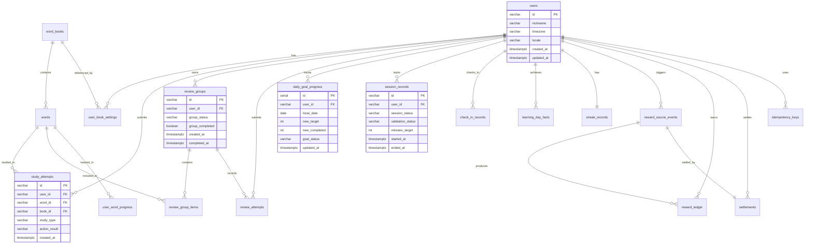
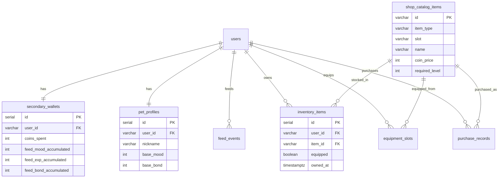
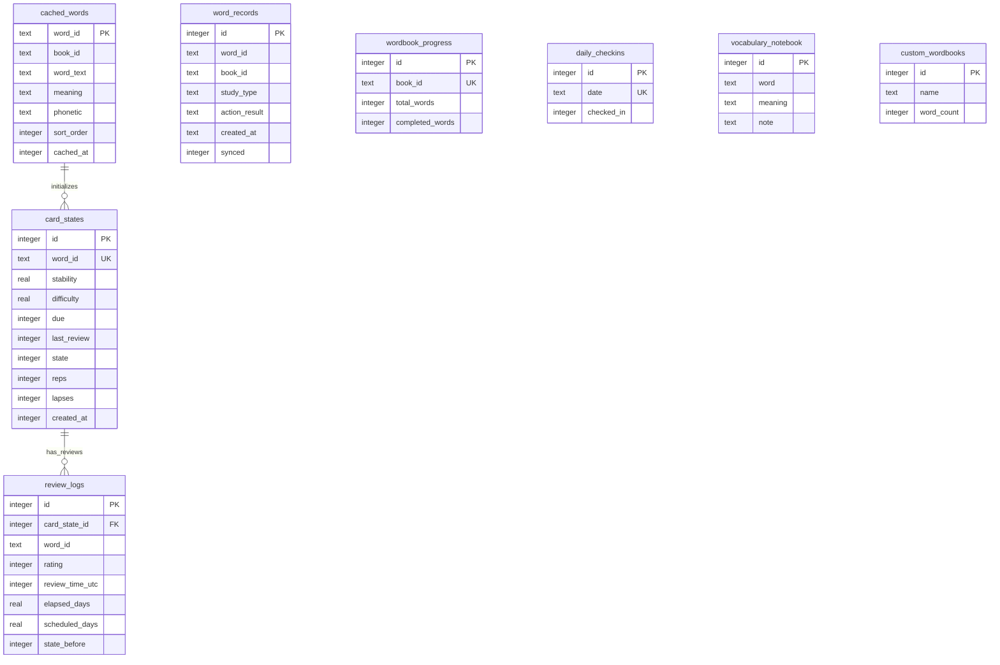

# 背单词喵喵 App DB 设计草案 v0.2.0

- **Owner:** Room 2
- **Project:** 背单词喵喵 App
- **Status:** code-truth consolidated rewrite / ready for Room 1 review
- **Purpose:** 以实际代码为 SSOT（source of truth），完全重写 DB 技术基线。云端 25 张表来自 PostgreSQL migration SQL + DevStore 运行态；本地端 8 张表来自 drift table definitions + legacy sqflite；SharedPreferences 来自 `LocalSettingsService` + `LocalProgressRepository`。旧文档中与代码冲突的字段定义全部被代码覆盖。
- **Scope:** 云端全量表、本地端全量表、SharedPreferences 键值、双端对照、sync metadata、Mermaid ER、Pending section、TODOs。
- **Out of scope:** full sync、real-time sync、background sync、multi-device merge、partial restore、production-grade auth。

---

## 0. SSOT 声明

本稿以下列代码文件为唯一事实来源（code is truth）：

### 云端（PostgreSQL）
- `apps/api/src/infrastructure/postgres/migrations/001_initial_schema.sql`
- `apps/api/src/infrastructure/postgres/migrations/002_word_restructure.sql`
- `apps/api/src/infrastructure/postgres/pg-persistence.ts`
- `apps/api/src/infrastructure/postgres/seed/dev-seed.ts`
- `apps/api/src/domain/types.ts`
- `apps/api/src/domain/dev-store.ts`
- `apps/api/src/domain/persistence.ts`
- `apps/api/src/controllers/*.ts`

### 本地端（Flutter / drift / sqflite）
- `apps/mobile/lib/core/storage/drift/tables/legacy_tables.dart`
- `apps/mobile/lib/core/storage/drift/tables/fsrs_tables.dart`
- `apps/mobile/lib/core/storage/drift/app_database.dart`
- `apps/mobile/lib/core/storage/local_database.dart`
- `apps/mobile/lib/core/storage/local_settings_service.dart`
- `apps/mobile/lib/core/storage/local_progress_repository.dart`
- `apps/mobile/lib/core/memory/fsrs_service.dart`
- `apps/mobile/lib/core/memory/session_builder.dart`
- `apps/mobile/lib/core/memory/word_cache_service.dart`

> 凡旧文档（v0.1.5）字段定义与上述代码冲突的，一律以代码为准。

---

## 1. 设计原则

### 1.1 Fact-first
先记录原子学习事实（study_attempts / review_attempts），再汇总进度与结算。

### 1.2 Main-first
副机制不得绕开主机制发奖；奖励来源必须追到 reward_source_events。

### 1.3 Idempotent-by-design
所有影响奖励、进度、Session、签到的写操作必须可幂等。

### 1.4 Backend-truth（云端）
`daily_goal_status`、`session_validation_status`、`reward_settlement_status` 由服务端产出。

### 1.5 Local-first（本地端）
FSRS card scheduling、review logs、daily_goal setting 以设备侧为 runtime truth，通过 manual backup/restore 与云端交互。

### 1.6 Dual-store
云端 PostgreSQL 与本地 SQLite/drift 各自独立 schema，通过 API 层桥接。当前无实时 sync。

---

## 2. 全局约定

### 2.1 ID 约定
- 云端主键：`VARCHAR(64)` 字符串 ID（非 auto-increment UUID）
- 本地主键：`INTEGER PRIMARY KEY AUTOINCREMENT`（drift/sqflite 标准）
- FSRS 表 word_id 作为逻辑主键（UNIQUE TEXT）

### 2.2 时间约定
- 云端：`TIMESTAMPTZ`（UTC）
- 本地 legacy 表：`TEXT`（ISO 8601 字符串）
- 本地 FSRS 表：`INTEGER`（UTC epoch milliseconds）
- 自然日统计口径：`DATE` / `local_date`（按用户时区折算）

### 2.3 删除策略
- 事实表不可删除
- 配置类表使用 `is_active` 软删
- review_logs 是 INSERT-ONLY，永不 update/delete

### 2.4 状态字段约定
- 小写枚举字符串
- 禁止前端展示文案直接入库

---

## 3. 云端表总览（25 张） [云端]

```text
PostgreSQL — 001_initial_schema.sql + 002_word_restructure.sql

users
 +--< user_book_settings >-- word_books
 +--< study_attempts >-- words
 +--< user_word_progress >-- words
 +--< review_groups
 |    +--< review_group_items >-- words
 +--< review_attempts
 +--< daily_goal_progress
 +--< session_records
 +--< check_in_records
 +--< learning_day_facts
 +--1 streak_records
 +--< reward_source_events
 +--< reward_ledger
 +--< settlements
 +--< feed_events
 +--1 secondary_wallets
 +--1 pet_profiles
 +--< shop_catalog_items (static)
 +--< inventory_items >-- shop_catalog_items
 +--< equipment_slots >-- shop_catalog_items
 +--< purchase_records >-- shop_catalog_items
 +--< idempotency_keys
```

---

## 4. 云端表详细设计

### 4.1 `users` [云端] [已实现]

#### 目标
用户主体，承载时区、语言偏好。

#### 字段
| 字段 | 类型 | 约束 | 说明 |
|---|---|---|---|
| id | VARCHAR(64) | PK | 用户 ID |
| nickname | VARCHAR(100) | NOT NULL DEFAULT 'Learner' | 昵称 |
| timezone | VARCHAR(64) | NOT NULL DEFAULT 'UTC' | 用户时区 |
| locale | VARCHAR(16) | NOT NULL DEFAULT 'zh-CN' | 语言偏好 |
| created_at | TIMESTAMPTZ | NOT NULL DEFAULT NOW() | 创建时间 |
| updated_at | TIMESTAMPTZ | NOT NULL DEFAULT NOW() | 更新时间 |

#### 备注
- seed 数据：`dev-user-001`, nickname='Learner', timezone='UTC', locale='zh-CN'
- 当前单用户开发模式

---

### 4.2 `word_books` [云端] [已实现]

#### 目标
词书/词库定义。

#### 字段
| 字段 | 类型 | 约束 | 说明 |
|---|---|---|---|
| id | VARCHAR(64) | PK | 词书 ID |
| name | VARCHAR(200) | NOT NULL | 词书名 |
| description | TEXT | | 描述 |
| word_count | INT | NOT NULL DEFAULT 0 | 词数 |
| is_active | BOOLEAN | NOT NULL DEFAULT TRUE | 是否启用 |
| created_at | TIMESTAMPTZ | NOT NULL DEFAULT NOW() | 创建时间 |

#### 备注
- seed 数据：`book-001`, name='CET-4', word_count=30

---

### 4.3 `words` [云端] [已实现]

#### 目标
基础词条。002 migration 扩展了 CET-4 CSV 富元数据字段。

#### 字段
| 字段 | 类型 | 约束 | 说明 |
|---|---|---|---|
| id | VARCHAR(64) | PK | 单词 ID |
| book_id | VARCHAR(64) | NOT NULL FK -> word_books.id | 所属词书 |
| word_text | VARCHAR(200) | NOT NULL | 单词文本 |
| meaning | TEXT | NOT NULL | 中文释义 |
| phonetic | VARCHAR(200) | | 音标 |
| word_type | VARCHAR(32) | NOT NULL DEFAULT 'new' | new / review |
| sort_order | INT | NOT NULL DEFAULT 0 | 词书内排序 |
| translation | TEXT | | 完整中文翻译（多词性） |
| definition | TEXT | | 英文释义 |
| difficulty_level | INT | NOT NULL DEFAULT 0 | 难度等级 |
| is_core | BOOLEAN | NOT NULL DEFAULT FALSE | 是否核心词 |
| tags | TEXT | | 标签 |
| frequency_rank | INT | NOT NULL DEFAULT 0 | 词频排名 |
| word_forms | TEXT | | 词形变化 |
| created_at | TIMESTAMPTZ | NOT NULL DEFAULT NOW() | 创建时间 |

#### 索引
- `idx_words_book(book_id)`
- `idx_words_type(word_type)`
- `idx_words_frequency(frequency_rank)` -- 002 migration 新增

#### 备注
- `translation` ~ `word_forms` 7 个字段由 002_word_restructure.sql 通过 ALTER TABLE 添加
- seed 数据包含 20 个 new + 10 个 review 词条
- WordsController 提供 `GET /api/v1/books/:bookId/words?offset=0&limit=500` 分页接口

---

### 4.4 `user_book_settings` [云端] [已实现]

#### 目标
用户当前 active 词书与每日目标设置。

#### 字段
| 字段 | 类型 | 约束 | 说明 |
|---|---|---|---|
| id | SERIAL | PK | 自增主键 |
| user_id | VARCHAR(64) | NOT NULL FK -> users.id | 用户 |
| book_id | VARCHAR(64) | NOT NULL FK -> word_books.id | 当前词书 |
| daily_new_target | INT | NOT NULL DEFAULT 20 | 每日新词目标 |
| is_active | BOOLEAN | NOT NULL DEFAULT TRUE | 是否当前 active |
| created_at | TIMESTAMPTZ | NOT NULL DEFAULT NOW() | 创建时间 |
| updated_at | TIMESTAMPTZ | NOT NULL DEFAULT NOW() | 更新时间 |

#### 索引 / 约束
- `UNIQUE(user_id, book_id)`
- `idx_user_book_settings_user(user_id)`

#### 备注
- SettingsController PUT `/api/v1/me/settings/daily-goal` 更新 daily_new_target（range 1-100）
- seed 数据：daily_new_target=20

---

### 4.5 `study_attempts` [云端] [已实现]

#### 目标
主机制学习事实层；记录新词学习与复习的原子提交。

#### 字段
| 字段 | 类型 | 约束 | 说明 |
|---|---|---|---|
| id | VARCHAR(64) | PK | attempt ID |
| user_id | VARCHAR(64) | NOT NULL FK -> users.id | 用户 |
| word_id | VARCHAR(64) | NOT NULL FK -> words.id | 单词 |
| book_id | VARCHAR(64) | NOT NULL FK -> word_books.id | 词书 |
| study_type | VARCHAR(16) | NOT NULL | 'new' / 'review' |
| action_result | VARCHAR(16) | NOT NULL | 'know' / 'forgot' |
| created_at | TIMESTAMPTZ | NOT NULL DEFAULT NOW() | 创建时间 |

#### 索引
- `idx_study_attempts_user(user_id)`
- `idx_study_attempts_user_word(user_id, word_id)`
- `idx_study_attempts_created(created_at)`

#### 枚举
- `study_type`: `new` | `review`
- `action_result`: `know` | `forgot`（domain types.ts 定义为 StudyActionResult）

---

### 4.6 `user_word_progress` [云端] [已实现]

#### 目标
用户对单词的当前聚合状态。

#### 字段
| 字段 | 类型 | 约束 | 说明 |
|---|---|---|---|
| id | SERIAL | PK | 自增主键 |
| user_id | VARCHAR(64) | NOT NULL FK -> users.id | 用户 |
| word_id | VARCHAR(64) | NOT NULL FK -> words.id | 单词 |
| familiarity | INT | NOT NULL DEFAULT 0 | 熟练度 |
| last_studied_at | TIMESTAMPTZ | | 最近学习时间 |
| next_review_at | TIMESTAMPTZ | | 下次复习时间 |
| created_at | TIMESTAMPTZ | NOT NULL DEFAULT NOW() | 创建时间 |
| updated_at | TIMESTAMPTZ | NOT NULL DEFAULT NOW() | 更新时间 |

#### 索引 / 约束
- `UNIQUE(user_id, word_id)`
- `idx_user_word_progress_user(user_id)`

#### 备注
- 当前 PG migration 已建表，但 DevStore 运行态未直接使用此表
- 熟练度 / 掌握阈值算法仍未冻结（见 Pending section）

---

### 4.7 `review_groups` [云端] [已实现]

#### 目标
后端生成、后端持有的一次有限复习批次对象。

#### 字段
| 字段 | 类型 | 约束 | 说明 |
|---|---|---|---|
| id | VARCHAR(64) | PK | review group ID |
| user_id | VARCHAR(64) | NOT NULL FK -> users.id | 用户 |
| group_status | VARCHAR(16) | NOT NULL DEFAULT 'active' | 'active' / 'completed' |
| group_completed | BOOLEAN | NOT NULL DEFAULT FALSE | 是否完成 |
| created_at | TIMESTAMPTZ | NOT NULL DEFAULT NOW() | 创建时间 |
| completed_at | TIMESTAMPTZ | | 完成时间 |

#### 索引
- `idx_review_groups_user(user_id)`
- `idx_review_groups_status(user_id, group_status)`

#### 冻结规则
- 同一用户同一时刻只允许一个 active group
- 组完成只推进今日复习进度，不自动等于今日复习完成
- 允许同组跨 Session 继续
- 同一 group 不得重复结算/发奖

---

### 4.8 `review_group_items` [云端] [已实现]

#### 目标
review group 内的 item 追踪。

#### 字段
| 字段 | 类型 | 约束 | 说明 |
|---|---|---|---|
| id | SERIAL | PK | 自增主键 |
| review_group_id | VARCHAR(64) | NOT NULL FK -> review_groups.id | 所属组 |
| word_id | VARCHAR(64) | NOT NULL FK -> words.id | 单词 |
| word_text | VARCHAR(200) | NOT NULL | 单词文本（冗余） |
| meaning | TEXT | NOT NULL | 释义（冗余） |
| completed | BOOLEAN | NOT NULL DEFAULT FALSE | 是否完成 |

#### 索引 / 约束
- `UNIQUE(review_group_id, word_id)`
- `idx_review_group_items_group(review_group_id)`

#### 备注
- 无 user_id 列；删除时需通过 parent review_groups.user_id 关联
- pg-persistence.ts 中 clearAsync() 使用子查询删除

---

### 4.9 `review_attempts` [云端] [已实现]

#### 目标
复习答题事实记录。

#### 字段
| 字段 | 类型 | 约束 | 说明 |
|---|---|---|---|
| id | VARCHAR(64) | PK | attempt ID |
| user_id | VARCHAR(64) | NOT NULL FK -> users.id | 用户 |
| review_group_id | VARCHAR(64) | NOT NULL FK -> review_groups.id | 所属复习组 |
| word_id | VARCHAR(64) | NOT NULL FK -> words.id | 单词 |
| action_result | VARCHAR(16) | NOT NULL | 'correct' / 'incorrect' |
| created_at | TIMESTAMPTZ | NOT NULL DEFAULT NOW() | 创建时间 |

#### 索引
- `idx_review_attempts_user(user_id)`
- `idx_review_attempts_group(review_group_id)`

#### 枚举
- `action_result`: `correct` | `incorrect`（domain types.ts ReviewActionResult）

---

### 4.10 `daily_goal_progress` [云端] [已实现]

#### 目标
今日目标进度聚合，输出 `daily_goal_status`。

#### 字段
| 字段 | 类型 | 约束 | 说明 |
|---|---|---|---|
| id | SERIAL | PK | 自增主键 |
| user_id | VARCHAR(64) | NOT NULL FK -> users.id | 用户 |
| local_date | DATE | NOT NULL | 用户自然日 |
| new_target | INT | NOT NULL DEFAULT 20 | 今日新词目标 |
| new_completed | INT | NOT NULL DEFAULT 0 | 已完成新词数 |
| review_target | INT | NOT NULL DEFAULT 0 | 今日复习要求数 |
| review_pending | INT | NOT NULL DEFAULT 0 | 待复习数 |
| review_completed | INT | NOT NULL DEFAULT 0 | 已完成复习数 |
| goal_status | VARCHAR(32) | NOT NULL DEFAULT 'not_started' | 今日目标状态 |
| active_review_group_id | VARCHAR(64) | | 当前 active review group |
| created_at | TIMESTAMPTZ | NOT NULL DEFAULT NOW() | 创建时间 |
| updated_at | TIMESTAMPTZ | NOT NULL DEFAULT NOW() | 更新时间 |

#### 索引 / 约束
- `UNIQUE(user_id, local_date)`
- `idx_daily_goal_user_date(user_id, local_date)`

#### 枚举
- `goal_status`: `not_started` | `in_progress` | `partially_completed` | `completed`

#### 冻结口径
- `goal_status` 只看新词目标与复习要求
- check_in / session valid 不参与 goal_status 判定
- 当日无待复习内容时，复习要求自然满足

---

### 4.11 `session_records` [云端] [已实现]

#### 目标
Session 生命周期：开始 / 结束 / 校验。

#### 字段
| 字段 | 类型 | 约束 | 说明 |
|---|---|---|---|
| id | VARCHAR(64) | PK | session ID |
| user_id | VARCHAR(64) | NOT NULL FK -> users.id | 用户 |
| session_status | VARCHAR(16) | NOT NULL DEFAULT 'started' | 状态 |
| validation_status | VARCHAR(16) | NOT NULL DEFAULT 'pending' | 校验状态 |
| minutes_target | INT | NOT NULL DEFAULT 15 | 目标时长 |
| started_at | TIMESTAMPTZ | NOT NULL | 开始时间 |
| ended_at | TIMESTAMPTZ | | 结束时间 |
| actual_minutes | INT | | 实际时长（分钟） |
| effective_learning_count | INT | NOT NULL DEFAULT 0 | 有效新学数 |
| effective_review_count | INT | NOT NULL DEFAULT 0 | 有效复习数 |
| created_at | TIMESTAMPTZ | NOT NULL DEFAULT NOW() | 创建时间 |

#### 索引
- `idx_sessions_user(user_id)`
- `idx_sessions_status(user_id, session_status)`

#### 枚举
- `session_status`: `started` | `ended` | `validating` | `valid` | `invalid`
- `validation_status`: `pending` | `valid` | `invalid`

#### 冻结阈值
- valid 条件：started + ended + 达到 minutes_target(15) + effective_learning_count + effective_review_count >= 5

---

### 4.12 `check_in_records` [云端] [已实现]

#### 目标
每日签到事实。

#### 字段
| 字段 | 类型 | 约束 | 说明 |
|---|---|---|---|
| id | VARCHAR(64) | PK | check-in ID |
| user_id | VARCHAR(64) | NOT NULL FK -> users.id | 用户 |
| local_date | DATE | NOT NULL | 用户自然日 |
| status | VARCHAR(16) | NOT NULL DEFAULT 'succeeded' | 签到状态 |
| created_at | TIMESTAMPTZ | NOT NULL DEFAULT NOW() | 创建时间 |

#### 索引 / 约束
- `UNIQUE(user_id, local_date)`
- `idx_checkins_user_date(user_id, local_date)`

#### 备注
- 每自然日最多一次签到
- check_in 成功不自动等于 learning_day

---

### 4.13 `learning_day_facts` [云端] [已实现]

#### 目标
记录某自然日是否满足有效学习事实。

#### 字段
| 字段 | 类型 | 约束 | 说明 |
|---|---|---|---|
| id | SERIAL | PK | 自增主键 |
| user_id | VARCHAR(64) | NOT NULL FK -> users.id | 用户 |
| local_date | DATE | NOT NULL | 用户自然日 |
| is_learning_day | BOOLEAN | NOT NULL DEFAULT FALSE | 是否有效学习日 |
| effective_learning_count | INT | NOT NULL DEFAULT 0 | 有效新学数 |
| effective_review_count | INT | NOT NULL DEFAULT 0 | 有效复习数 |
| updated_at | TIMESTAMPTZ | NOT NULL DEFAULT NOW() | 更新时间 |

#### 索引 / 约束
- `UNIQUE(user_id, local_date)`
- `idx_learning_day_user_date(user_id, local_date)`

#### 备注
- learning_day 与 check_in 不互相推出
- 与 streak 当前独立（streak 按 check_in 驱动）

---

### 4.14 `streak_records` [云端] [已实现]

#### 目标
连续签到 streak 当前状态。

#### 字段
| 字段 | 类型 | 约束 | 说明 |
|---|---|---|---|
| id | SERIAL | PK | 自增主键 |
| user_id | VARCHAR(64) | NOT NULL FK -> users.id, UNIQUE | 用户（一对一） |
| current_streak | INT | NOT NULL DEFAULT 0 | 当前连续天数 |
| streak_basis_type | VARCHAR(16) | NOT NULL DEFAULT 'check_in' | 连续口径 |
| last_check_in_date | DATE | | 最近签到日期 |
| updated_at | TIMESTAMPTZ | NOT NULL DEFAULT NOW() | 更新时间 |

#### 冻结规则
- MVP 正式冻结 `streak_basis_type='check_in'`
- check_in / learning_day / streak 三类事实独立

---

### 4.15 `reward_source_events` [云端] [已实现]

#### 目标
统一承接所有可触发奖励结算的主机制来源事件。

#### 字段
| 字段 | 类型 | 约束 | 说明 |
|---|---|---|---|
| id | VARCHAR(64) | PK | source event ID |
| user_id | VARCHAR(64) | NOT NULL FK -> users.id | 用户 |
| event_type | VARCHAR(64) | NOT NULL | 事件类型 |
| source_ref_id | VARCHAR(128) | NOT NULL | 关联业务记录 |
| created_at | TIMESTAMPTZ | NOT NULL DEFAULT NOW() | 创建时间 |

#### 索引 / 约束
- `UNIQUE(event_type, source_ref_id)`
- `idx_reward_source_user(user_id)`

#### 枚举
- `event_type`: `effective_new_word` | `review_group_completed`（domain types.ts SourceEventType）

---

### 4.16 `reward_ledger` [云端] [已实现]

#### 目标
奖励账本：Coins / Fish Treats / EXP 发放记录。

#### 字段
| 字段 | 类型 | 约束 | 说明 |
|---|---|---|---|
| id | VARCHAR(64) | PK | ledger item ID |
| source_event_id | VARCHAR(64) | NOT NULL FK -> reward_source_events.id | 来源事件 |
| user_id | VARCHAR(64) | NOT NULL FK -> users.id | 用户 |
| reward_type | VARCHAR(32) | NOT NULL | 奖励类型 |
| amount | INT | NOT NULL | 数量 |
| reward_status | VARCHAR(16) | NOT NULL DEFAULT 'succeeded' | 到账状态 |
| created_at | TIMESTAMPTZ | NOT NULL DEFAULT NOW() | 创建时间 |

#### 索引
- `idx_reward_ledger_user(user_id)`
- `idx_reward_ledger_source(source_event_id)`
- `idx_reward_ledger_type(user_id, reward_type)`

#### 枚举
- `reward_type`: `coins` | `fish_treats` | `exp`（domain types.ts RewardType）
- `reward_status`: `pending` | `succeeded` | `failed`（domain types.ts RewardStatus）

---

### 4.17 `settlements` [云端] [已实现]

#### 目标
结算记录，关联 source event 与 reward ledger。

#### 字段
| 字段 | 类型 | 约束 | 说明 |
|---|---|---|---|
| id | VARCHAR(64) | PK | settlement ID |
| source_event_id | VARCHAR(64) | NOT NULL FK -> reward_source_events.id, UNIQUE | 来源事件 |
| user_id | VARCHAR(64) | NOT NULL FK -> users.id | 用户 |
| settlement_status | VARCHAR(16) | NOT NULL DEFAULT 'succeeded' | 结算状态 |
| created_at | TIMESTAMPTZ | NOT NULL DEFAULT NOW() | 创建时间 |
| updated_at | TIMESTAMPTZ | NOT NULL DEFAULT NOW() | 更新时间 |

#### 索引
- `idx_settlements_user(user_id)`

#### 枚举
- `settlement_status`: `pending` | `settling` | `succeeded` | `failed` | `claimed`（domain types.ts RewardSettlementStatus）

---

### 4.18 `idempotency_keys` [云端] [已实现]

#### 目标
API 请求幂等键存储。

#### 字段
| 字段 | 类型 | 约束 | 说明 |
|---|---|---|---|
| key | VARCHAR(255) | PK | 幂等键 |
| user_id | VARCHAR(64) | NOT NULL FK -> users.id | 用户 |
| path | VARCHAR(255) | NOT NULL | 请求路径 |
| response | JSONB | NOT NULL DEFAULT '{}' | 缓存响应 |
| created_at | TIMESTAMPTZ | NOT NULL DEFAULT NOW() | 创建时间 |

#### 索引
- `idx_idempotency_user(user_id)`

---

### 4.19 `secondary_wallets` [云端] [已实现]

#### 目标
副机制余额真相层：coins_spent + feed 累计值。

#### 字段
| 字段 | 类型 | 约束 | 说明 |
|---|---|---|---|
| id | SERIAL | PK | 自增主键 |
| user_id | VARCHAR(64) | NOT NULL FK -> users.id, UNIQUE | 用户 |
| coins_spent | INT | NOT NULL DEFAULT 0 | 已消耗金币 |
| feed_mood_accumulated | INT | NOT NULL DEFAULT 0 | 累计喂食心情增量 |
| feed_exp_accumulated | INT | NOT NULL DEFAULT 0 | 累计喂食经验增量 |
| feed_bond_accumulated | INT | NOT NULL DEFAULT 0 | 累计喂食亲密度增量 |
| updated_at | TIMESTAMPTZ | NOT NULL DEFAULT NOW() | 更新时间 |

#### 备注
- 当前余额 = SUM(succeeded reward_ledger coins) - coins_spent
- seed 默认全部为 0

---

### 4.20 `pet_profiles` [云端] [已实现]

#### 目标
Pet-facing 持久状态，支撑 cat_summary。

#### 字段
| 字段 | 类型 | 约束 | 说明 |
|---|---|---|---|
| id | SERIAL | PK | 自增主键 |
| user_id | VARCHAR(64) | NOT NULL FK -> users.id, UNIQUE | 用户 |
| nickname | VARCHAR(100) | NOT NULL DEFAULT 'Mimi' | 猫猫昵称 |
| base_mood | INT | NOT NULL DEFAULT 60 | 基础心情值 |
| base_bond | INT | NOT NULL DEFAULT 0 | 基础亲密度 |
| created_at | TIMESTAMPTZ | NOT NULL DEFAULT NOW() | 创建时间 |
| updated_at | TIMESTAMPTZ | NOT NULL DEFAULT NOW() | 更新时间 |

#### 备注
- level 由 EXP 实时计算（DevStore.computeLevelFromExp），不持久化在 pet_profiles 中
- LEVEL_THRESHOLDS: Lv1=0, Lv2=20, Lv3=50, Lv4=90, Lv5=145, Lv6=215, Lv7=305, Lv8=420, Lv9=565, Lv10=745

---

### 4.21 `feed_events` [云端] [已实现]

#### 目标
喂食行为事实记录。

#### 字段
| 字段 | 类型 | 约束 | 说明 |
|---|---|---|---|
| id | VARCHAR(64) | PK | feed event ID |
| user_id | VARCHAR(64) | NOT NULL FK -> users.id | 用户 |
| feed_item_type | VARCHAR(32) | NOT NULL | 喂食物品类型 |
| consumed_amount | INT | NOT NULL DEFAULT 1 | 消耗数量 |
| mood_delta | INT | NOT NULL DEFAULT 0 | 心情变化 |
| exp_delta | INT | NOT NULL DEFAULT 0 | EXP 变化 |
| bond_delta | INT | NOT NULL DEFAULT 0 | 亲密度变化 |
| local_date | DATE | NOT NULL | 用户自然日 |
| created_at | TIMESTAMPTZ | NOT NULL DEFAULT NOW() | 创建时间 |

#### 索引
- `idx_feed_events_user(user_id)`
- `idx_feed_events_date(user_id, local_date)`

#### 枚举
- `feed_item_type`: `fish_treat`（domain types.ts FeedItemType）

---

### 4.22 `shop_catalog_items` [云端] [已实现]

#### 目标
商店目录（静态 seed 数据）。

#### 字段
| 字段 | 类型 | 约束 | 说明 |
|---|---|---|---|
| id | VARCHAR(64) | PK | catalog item ID |
| item_type | VARCHAR(32) | NOT NULL | 'outfit' / 'room_item' |
| slot | VARCHAR(32) | NOT NULL | 槽位：head / neck / decor / floor |
| name | VARCHAR(200) | NOT NULL | 展示名 |
| coin_price | INT | NOT NULL | 金币价格 |
| required_level | INT | NOT NULL DEFAULT 1 | 等级门槛 |
| is_active | BOOLEAN | NOT NULL DEFAULT TRUE | 是否上架 |
| created_at | TIMESTAMPTZ | NOT NULL DEFAULT NOW() | 创建时间 |

#### 备注
- seed 数据含 10 个 catalog items（5 outfit + 5 room_item）
- 价格/等级均为 dev rules，不冻结

---

### 4.23 `inventory_items` [云端] [已实现]

#### 目标
用户已拥有物品。

#### 字段
| 字段 | 类型 | 约束 | 说明 |
|---|---|---|---|
| id | SERIAL | PK | 自增主键 |
| user_id | VARCHAR(64) | NOT NULL FK -> users.id | 用户 |
| item_id | VARCHAR(64) | NOT NULL FK -> shop_catalog_items.id | 物品 |
| item_type | VARCHAR(32) | NOT NULL | 物品类型 |
| slot | VARCHAR(32) | NOT NULL | 槽位 |
| equipped | BOOLEAN | NOT NULL DEFAULT FALSE | 是否装备中 |
| owned_at | TIMESTAMPTZ | NOT NULL DEFAULT NOW() | 获得时间 |

#### 索引 / 约束
- `UNIQUE(user_id, item_id)`
- `idx_inventory_user(user_id)`

---

### 4.24 `equipment_slots` [云端] [已实现]

#### 目标
已装备真相层。

#### 字段
| 字段 | 类型 | 约束 | 说明 |
|---|---|---|---|
| id | SERIAL | PK | 自增主键 |
| user_id | VARCHAR(64) | NOT NULL FK -> users.id | 用户 |
| slot | VARCHAR(32) | NOT NULL | 装备槽位 |
| item_type | VARCHAR(32) | NOT NULL | 'outfit' / 'room_item' |
| item_id | VARCHAR(64) | FK -> shop_catalog_items.id | 当前装备物品 |
| updated_at | TIMESTAMPTZ | NOT NULL DEFAULT NOW() | 更新时间 |

#### 索引 / 约束
- `UNIQUE(user_id, slot, item_type)`
- `idx_equipment_user(user_id)`

---

### 4.25 `purchase_records` [云端] [已实现]

#### 目标
购买行为审计记录。

#### 字段
| 字段 | 类型 | 约束 | 说明 |
|---|---|---|---|
| id | SERIAL | PK | 自增主键 |
| user_id | VARCHAR(64) | NOT NULL FK -> users.id | 用户 |
| item_id | VARCHAR(64) | NOT NULL FK -> shop_catalog_items.id | 物品 |
| coins_spent | INT | NOT NULL | 消耗金币 |
| idempotency_key | VARCHAR(255) | | 幂等键 |
| created_at | TIMESTAMPTZ | NOT NULL DEFAULT NOW() | 创建时间 |

#### 索引
- `idx_purchases_user(user_id)`

---

## 5. 本地端表总览（8 张） [本地端]

```text
SQLite (drift) — meow_progress.db

Schema v1 (legacy sqflite):
  word_records         -- 学习记录
  wordbook_progress    -- 词书进度
  daily_checkins       -- 签到记录
  custom_wordbooks     -- 自定义词书
  vocabulary_notebook  -- 生词本

Schema v2 (drift new):
  card_states          -- FSRS 卡片调度状态
  review_logs          -- FSRS 复习历史（INSERT-ONLY）
  cached_words         -- 离线词库缓存
```

---

## 6. 本地端表详细设计

### 6.1 `word_records` [本地端] [已实现]

#### 目标
学习记录核心事实层。

#### 字段
| 字段 | 类型 | 约束 | 说明 |
|---|---|---|---|
| id | INTEGER | PK AUTOINCREMENT | 自增主键 |
| word_id | TEXT | NOT NULL | 单词 ID |
| book_id | TEXT | NOT NULL | 词书 ID |
| study_type | TEXT | DEFAULT 'new' | 'new' / 'review' |
| action_result | TEXT | NOT NULL | 学习结果 |
| created_at | TEXT | NOT NULL | ISO 8601 时间戳 |
| synced | INTEGER | DEFAULT 0 | 0=未同步, 1=已同步 |

#### 索引
- `idx_wr_word_id(word_id)`
- `idx_wr_synced(synced)`

#### 备注
- LocalDatabase 中同一 word_id + study_type 的记录会被 update（forgot -> know 升级）
- snapshot export 读取全量 word_records

---

### 6.2 `wordbook_progress` [本地端] [已实现]

#### 目标
词书进度状态。

#### 字段
| 字段 | 类型 | 约束 | 说明 |
|---|---|---|---|
| id | INTEGER | PK AUTOINCREMENT | 自增主键 |
| book_id | TEXT | NOT NULL UNIQUE | 词书 ID |
| total_words | INTEGER | DEFAULT 0 | 总词数 |
| completed_words | INTEGER | DEFAULT 0 | 已完成词数 |
| updated_at | TEXT | NOT NULL | 更新时间 |

---

### 6.3 `daily_checkins` [本地端] [已实现]

#### 目标
本地签到记录。

#### 字段
| 字段 | 类型 | 约束 | 说明 |
|---|---|---|---|
| id | INTEGER | PK AUTOINCREMENT | 自增主键 |
| date | TEXT | NOT NULL UNIQUE | 签到日期 |
| checked_in | INTEGER | DEFAULT 1 | 1=已签到 |
| created_at | TEXT | NOT NULL | 创建时间 |

---

### 6.4 `custom_wordbooks` [本地端] [已实现]

#### 目标
用户自建词书。

#### 字段
| 字段 | 类型 | 约束 | 说明 |
|---|---|---|---|
| id | INTEGER | PK AUTOINCREMENT | 自增主键 |
| name | TEXT | NOT NULL | 词书名 |
| word_count | INTEGER | DEFAULT 0 | 词数 |
| created_at | TEXT | NOT NULL | 创建时间 |

---

### 6.5 `vocabulary_notebook` [本地端] [已实现]

#### 目标
生词本。

#### 字段
| 字段 | 类型 | 约束 | 说明 |
|---|---|---|---|
| id | INTEGER | PK AUTOINCREMENT | 自增主键 |
| word | TEXT | NOT NULL | 单词 |
| meaning | TEXT | NULLABLE | 释义 |
| note | TEXT | NULLABLE | 笔记 |
| created_at | TEXT | NOT NULL | 创建时间 |

---

### 6.6 `card_states` [本地端] [已开发·未集成]

#### 目标
FSRS 卡片调度状态。每个 word 一行。

#### 字段
| 字段 | 类型 | 约束 | 说明 |
|---|---|---|---|
| id | INTEGER | PK AUTOINCREMENT | 自增主键 |
| word_id | TEXT | NOT NULL UNIQUE | 单词 ID |
| stability | REAL | NULLABLE | FSRS stability |
| difficulty | REAL | NULLABLE | FSRS difficulty |
| due | INTEGER | NOT NULL | 下次到期时间（UTC epoch ms） |
| last_review | INTEGER | NULLABLE | 最近复习时间（UTC epoch ms） |
| state | INTEGER | DEFAULT 1 | 1=Learning, 2=Review, 3=Relearning |
| step | INTEGER | NULLABLE | Learning/Relearning step index |
| reps | INTEGER | DEFAULT 0 | 连续正确次数 |
| lapses | INTEGER | DEFAULT 0 | 遗忘次数 |
| created_at | INTEGER | NOT NULL | 创建时间（UTC epoch ms） |

#### 索引
- `idx_card_states_due(due)`
- `idx_card_states_state(state)`

#### 备注
- FsrsService.initCardForWord() 创建新卡
- FsrsService.rateCard() 更新卡片状态
- countNewCardsToday() 按 created_at 统计今日新卡数

---

### 6.7 `review_logs` [本地端] [已开发·未集成]

#### 目标
FSRS 复习历史，INSERT-ONLY，永不 update/delete。用于 fsrs-optimizer。

#### 字段
| 字段 | 类型 | 约束 | 说明 |
|---|---|---|---|
| id | INTEGER | PK AUTOINCREMENT | 自增主键 |
| card_state_id | INTEGER | NOT NULL FK -> card_states.id | 关联卡片 |
| word_id | TEXT | NOT NULL | 单词 ID（冗余便于查询） |
| rating | INTEGER | NOT NULL | 1=Again, 2=Hard, 3=Good, 4=Easy |
| review_time_utc | INTEGER | NOT NULL | 复习时间（UTC epoch ms） |
| elapsed_days | REAL | NOT NULL | 距上次复习天数 |
| scheduled_days | REAL | NOT NULL | FSRS 之前安排的间隔天数 |
| state_before | INTEGER | NOT NULL | 复习前状态（1/2/3） |
| stability_before | REAL | NULLABLE | 复习前 stability |
| difficulty_before | REAL | NULLABLE | 复习前 difficulty |
| client_version | TEXT | NULLABLE | App 版本号 |

#### 索引
- `idx_review_logs_word_id(word_id)`
- `idx_review_logs_review_time(review_time_utc)`

#### 备注
- Sacred data: INSERT-ONLY，绝不 update/delete
- exportReviewLogsAsJsonl() 导出为 JSONL 格式供 fsrs-optimizer 使用

---

### 6.8 `cached_words` [本地端] [已开发·未集成]

#### 目标
离线词库缓存。从后端下载到本地，供 SessionBuilder 选新词候选。

#### 字段
| 字段 | 类型 | 约束 | 说明 |
|---|---|---|---|
| word_id | TEXT | PK | 单词 ID |
| book_id | TEXT | NOT NULL | 词书 ID |
| word_text | TEXT | NOT NULL | 单词文本 |
| meaning | TEXT | NOT NULL | 释义 |
| phonetic | TEXT | NULLABLE | 音标 |
| translation | TEXT | NULLABLE | 完整中文翻译 |
| frequency_rank | INTEGER | DEFAULT 0 | 词频排名 |
| sort_order | INTEGER | DEFAULT 0 | 学习顺序 |
| cached_at | INTEGER | NOT NULL | 缓存时间（UTC epoch ms） |

#### 备注
- WordCacheService.downloadAndCacheBook() 分页下载并 INSERT OR REPLACE
- SessionBuilder 查询: `WHERE word_id NOT IN (SELECT word_id FROM card_states) ORDER BY sort_order LIMIT ?`

---

## 7. SharedPreferences 键值 [本地端]

### 7.1 LocalSettingsService [已实现]

| Key | 类型 | 默认值 | 说明 |
|---|---|---|---|
| `settings_daily_goal` | int | 20 | 每日新词目标 |
| `settings_sound_enabled` | bool | true | 声音开关 |
| `settings_theme` | String | 'light' | 主题 |
| `settings_notification_time` | String | '09:00' | 提醒时间（HH:mm） |
| `settings_desired_retention` | double | 0.9 | FSRS 目标保留率 [0.85, 0.95] |

### 7.2 LocalProgressRepository [已实现]

| Key | 类型 | 默认值 | 说明 |
|---|---|---|---|
| `progress_word_records` | JSON String (List) | [] | 学习记录（legacy，与 SQLite 并存） |
| `progress_wordbook_progress` | JSON String (Map) | null | 词书进度 |
| `progress_daily_checkins` | JSON String (List) | [] | 签到记录 |
| `progress_custom_wordbooks` | JSON String (List) | [] | 自定义词书 |
| `progress_vocabulary_notebook` | JSON String (List) | [] | 生词本 |

#### 备注
- LocalProgressRepository 是 legacy 层，数据与 SQLite word_records 并存
- snapshot export 同时读取 SQLite word_records 与 SharedPreferences progress

---

## 8. 双端对照表

| 数据域 | 云端表 | 本地存储 | 当前状态 |
|---|---|---|---|
| 用户 | users | -- | 云端仅 |
| 词书 | word_books | -- | 云端仅 |
| 词条 | words | cached_words | 云端 -> 下载到本地缓存 |
| 用户词书设置 | user_book_settings | settings_daily_goal (SP) | 云端 API + 本地 SP 并存 |
| 学习记录 | study_attempts | word_records (SQLite) | 双写，本地有 synced 标记 |
| 单词进度 | user_word_progress | card_states (drift) | 云端为聚合、本地为 FSRS |
| 复习组 | review_groups / review_group_items | -- | 云端仅 |
| 复习答题 | review_attempts | review_logs (drift) | 云端为 group-based、本地为 FSRS-based |
| 每日目标 | daily_goal_progress | -- | 云端仅 |
| Session | session_records | -- | 云端仅 |
| 签到 | check_in_records | daily_checkins (SQLite) | 双写 |
| 学习日 | learning_day_facts | -- | 云端仅 |
| Streak | streak_records | -- | 云端仅 |
| 奖励来源 | reward_source_events | -- | 云端仅 |
| 奖励账本 | reward_ledger | -- | 云端仅 |
| 结算 | settlements | -- | 云端仅 |
| 幂等键 | idempotency_keys | -- | 云端仅 |
| 副机制钱包 | secondary_wallets | -- | 云端仅 |
| 宠物状态 | pet_profiles | -- | 云端仅 |
| 喂食记录 | feed_events | -- | 云端仅 |
| 商店目录 | shop_catalog_items | -- | 云端仅（静态） |
| 持有物品 | inventory_items | -- | 云端仅 |
| 装备 | equipment_slots | -- | 云端仅 |
| 购买记录 | purchase_records | -- | 云端仅 |
| 词书进度 | -- | wordbook_progress (SQLite) | 本地仅 |
| 自定义词书 | -- | custom_wordbooks (SQLite) | 本地仅 |
| 生词本 | -- | vocabulary_notebook (SQLite) | 本地仅 |
| 设置 | -- | SharedPreferences | 本地仅，backup 时上传 |

---

## 9. Sync & Backup Metadata

### 9.1 当前 sync 状态
- **无实时 sync**
- 本地 word_records 有 `synced` 标记（0/1），通过 StudyAttemptsController 提交到云端
- cached_words 通过 WordCacheService 从云端 GET 下载到本地
- daily_goal 通过 SettingsController PUT 上传、SharedPreferences 为 local runtime truth

### 9.2 Backup 通道
- SnapshotExportService 从 SQLite + SharedPreferences 构建 full snapshot JSON
- BackupController POST `/api/v1/me/backup` 上传 snapshot
- BackupController GET `/api/v1/me/backup/latest` 获取最新 backup metadata
- BackupController GET `/api/v1/me/backup/latest/snapshot` 下载 snapshot for restore
- snapshot schema_version: `p3_1_snapshot_v2`

### 9.3 Backup snapshot 结构
```json
{
  "schema_version": "p3_1_snapshot_v2",
  "exported_at": "2026-04-08T12:00:00Z",
  "export_format": "full_snapshot_json",
  "settings": {
    "daily_goal": 20,
    "sound_enabled": true,
    "theme": "light",
    "notification_time": "09:00"
  },
  "progress": {
    "word_records": [...],
    "wordbook_progress": {...},
    "daily_checkins": [...],
    "custom_wordbooks": [...],
    "vocabulary_notebook": [...]
  }
}
```

---

## 10. 状态机

### 10.1 daily_goal_status
```
not_started -> in_progress -> partially_completed -> completed
```

### 10.2 session 状态
```
session_status:     started -> ended -> validating -> valid / invalid
validation_status:  pending -> valid / invalid
```

### 10.3 review_group 状态
```
active -> completed
```
（code 中 ReviewGroupStatus = 'active' | 'completed'，无 expired / abandoned）

### 10.4 reward 结算状态
```
settlement:   pending -> settling -> succeeded / failed / claimed
reward_item:  pending -> succeeded / failed
```

### 10.5 check_in 状态
```
succeeded / failed
```

### 10.6 FSRS card state (本地)
```
1 (Learning) -> 2 (Review) -> 3 (Relearning) -> 2 (Review)
```

### 10.7 FSRS rating (本地)
```
1=Again, 2=Hard, 3=Good, 4=Easy
```

---

## 11. Mermaid ER 图

### 11.1 云端核心 ER



### 11.2 云端副机制 ER



### 11.3 本地端 ER



---

## 12. 幂等与去重策略

### 12.1 云端幂等
| 场景 | 表 | 约束 | 说明 |
|---|---|---|---|
| 学习提交 | study_attempts | PK(id) + ON CONFLICT DO NOTHING | 同一 attempt ID 不重复写入 |
| 复习组 | review_groups | PK(id) | 同一 group ID 不重复创建 |
| 复习组内 item | review_group_items | UNIQUE(review_group_id, word_id) | 同组同词不重复 |
| 签到 | check_in_records | UNIQUE(user_id, local_date) | 每日一次 |
| learning day | learning_day_facts | UNIQUE(user_id, local_date) | 每日一次 |
| 奖励来源 | reward_source_events | UNIQUE(event_type, source_ref_id) | 同事件不重复 |
| API 级幂等 | idempotency_keys | PK(key) | 通用请求幂等 |
| 每日目标 | daily_goal_progress | UNIQUE(user_id, local_date) | ON CONFLICT DO UPDATE |
| 物品购买 | purchase_records | -- | idempotency_key 应用层检查 |

### 12.2 本地幂等
| 场景 | 表 | 机制 | 说明 |
|---|---|---|---|
| FSRS 卡片初始化 | card_states | UNIQUE(word_id) + 代码检查 | initCardForWord 幂等 |
| 词库缓存 | cached_words | INSERT OR REPLACE | PK(word_id) |

---

## 13. UI / API / DB 字段映射

| UI 使用名 | API 字段 | DB 来源 |
|---|---|---|
| `daily_goal_status` | `daily_goal_status` | `daily_goal_progress.goal_status` |
| `today_new_target` | `today_new_target` | `daily_goal_progress.new_target` |
| `today_new_completed` | `today_new_completed` | `daily_goal_progress.new_completed` |
| `today_review_target` | `today_review_target` | `daily_goal_progress.review_target` |
| `today_review_pending` | `today_review_pending` | `daily_goal_progress.review_pending` |
| `today_review_completed` | `today_review_completed` | `daily_goal_progress.review_completed` |
| `review_group_id` | `active_review_group_id` | `daily_goal_progress.active_review_group_id` |
| `session_validation_status` | `validation_status` | `session_records.validation_status` |
| `session_status` | `session_status` | `session_records.session_status` |
| `reward_settlement_status` | `settlement_status` | `settlements.settlement_status` |
| `reward_status` | `reward_status` | `reward_ledger.reward_status` |
| `has_checked_in_today` | `has_checked_in_today` | `check_in_records` 聚合 |
| `learning_day_today` | `learning_day_today` | `learning_day_facts` 聚合 |
| `current_streak` | `current_streak` | `streak_records.current_streak` |
| `streak_basis_type` | `streak_basis_type` | `streak_records.streak_basis_type` |
| `coins` | `balances.coins` | `reward_ledger` SUM - `secondary_wallets.coins_spent` |
| `fish_treats` | `balances.fish_treats` | `reward_ledger` SUM(fish_treats) |
| `exp` | `balances.exp` | `reward_ledger` SUM(exp) |

---

## 14. Pending Section

以下事项在代码中标记为 `Assumption (temporary, not frozen)` 或尚未冻结，本稿显式保留为 Pending。

### PD-DB-001 熟练度 / 掌握阈值
- **现状：** `user_word_progress` 表已建，但 DevStore 运行态未直接使用
- **保留字段：** `familiarity`, `last_studied_at`, `next_review_at`
- **不冻结：** mastery_score / mastery_level / is_mastered 算法

### PD-DB-002 完整 SRS / review_group 分组算法
- **现状：** 云端 review_group 为后端持有的有限批次；本地 FSRS 为独立 card scheduling
- **不冻结：** 组大小、分组算法、题型比例、云端 SRS 与本地 FSRS 的融合策略
- **当前处理：** 云端 review_groups + review_group_items 提供容器；本地 card_states + review_logs + SessionBuilder 提供 FSRS 调度

### PD-DB-003 今日页主 CTA winner rule
- **现状：** TodayPrimaryAction 类型已定义（domain types.ts），但胜出逻辑未冻结
- **不冻结：** action priority / blocking_condition 具体规则

### PD-DB-004 feed / level / catalog 数值
- **现状：** LEVEL_THRESHOLDS、feed delta (+4 mood / +2 exp / +1 bond)、catalog prices 均在 DevStore 中硬编码
- **不冻结：** 具体数值，当前为 dev rules

### PD-DB-005 云端与本地 FSRS 融合
- **现状：** 云端无 FSRS 表；本地有完整 FSRS 三表（card_states / review_logs / cached_words）
- **不冻结：** 是否将 FSRS 状态同步到云端、如何合并多端 FSRS 状态

### PD-DB-006 Backup / Restore 云端表
- **现状：** BackupController 以 devStore 内存属性 (`_latestBackup`, `_backupSnapshot`) 存储
- **不冻结：** v0.1.5 设计的 `user_backup_snapshots` / `backup_restore_operations` 尚未落 migration
- **下一步：** 待 production backup 需求确认后落表

### PD-DB-007 review_queue 表
- **现状：** v0.1.5 中设计的 `review_queue` 表未在代码中实现
- **不冻结：** 是否需要独立 review queue 表，或由 FSRS card_states.due 替代

### PD-DB-008 learning_stat_daily 表
- **现状：** v0.1.5 中设计的 `learning_stat_daily` 表未在代码中实现
- **不冻结：** 统计页规格

### PD-DB-009 SessionBuilder day boundary
- **现状：** 当前 local midnight 00:00 为日界线
- **代码 TODO：** configurable 4:00 AM day boundary

### PD-DB-010 desired_retention sync
- **现状：** `settings_desired_retention` 仅存 SharedPreferences，云端无对应字段
- **不冻结：** 是否需要云端持久化 FSRS 参数

---

## 15. TODOs

### 代码层 TODO
1. [ ] `user_word_progress` 表已建但 DevStore 运行态未使用 -- 考虑是否迁移到直接 PG 查询或保持为聚合投影
2. [ ] `purchase_records` 在 pg-persistence saveAsync 中 DELETE 但不 INSERT -- 购买审计丢失风险
3. [ ] `review_queue` v0.1.5 设计未实现 -- 确认是否由本地 FSRS 替代
4. [ ] `learning_stat_daily` v0.1.5 设计未实现 -- 确认统计页需求
5. [ ] backup 云端存储目前为 devStore 内存属性 -- 需落 migration 表
6. [ ] SessionBuilder day boundary 可配置化（4:00 AM）
7. [ ] desired_retention 云端持久化 / backup-restore 通道
8. [ ] word_records synced 标记实际 sync 通道未完整实现

### 架构层 TODO
1. [ ] DevStore in-memory + PG persistence 模式 -> 直接 PG repository 模式迁移
2. [ ] 本地 FSRS 三表与云端 review_groups 的融合策略
3. [ ] LocalProgressRepository (SharedPreferences) 数据迁移到 SQLite/drift
4. [ ] multi-device sync 方案设计
5. [ ] production auth / multi-user support

---

## 16. Migration 文件清单

| 文件 | 状态 | 内容 |
|---|---|---|
| `001_initial_schema.sql` | [已实现] | 25 张云端表 full bootstrap |
| `002_word_restructure.sql` | [已实现] | words 表增加 7 个 CET-4 富元数据列 + frequency index |

### 本地 migration
| 版本 | 状态 | 内容 |
|---|---|---|
| v1 (sqflite) | [已实现] | 5 张 legacy 表：word_records, wordbook_progress, daily_checkins, custom_wordbooks, vocabulary_notebook |
| v2 (drift) | [已实现] | 新增 3 张 FSRS 表：card_states, review_logs, cached_words；v1->v2 升级只创建新表 |

---

## 17. 版本历史

| 版本 | 日期 | 变更 |
|---|---|---|
| v0.1.0 ~ v0.1.2 | -- | 主机制初始设计 |
| v0.1.3 | -- | review_group 最小业务合同 + check_in/learning_day/streak 三类独立事实 |
| v0.1.4 | -- | P2 secondary mechanism write-back: secondary_wallets, pet_profiles, feed, shop, inventory, equipment |
| v0.1.5 | -- | P3.1 direct-scope delta: backup/restore 设计（未落 migration）+ daily_goal setting 边界说明 |
| **v0.2.0** | 2026-04-08 | **Code-truth consolidated rewrite**: 以实际代码为 SSOT 完全重写。云端 25 表、本地 8 表 + SharedPreferences 完整记录。新增 FSRS 三表设计、双端对照、Mermaid ER、实现状态标记。Pending section 统一归口。 |

---

## 18. 结论

本稿以代码为唯一事实来源，完成了 DB 技术基线的 consolidated rewrite：

**云端 PostgreSQL（25 张表）：**
- 主机制事实层：users, word_books, words, user_book_settings, study_attempts, user_word_progress, review_groups, review_group_items, review_attempts
- 进度与生命周期层：daily_goal_progress, session_records, check_in_records, learning_day_facts, streak_records
- 奖励结算层：reward_source_events, reward_ledger, settlements
- 副机制层：secondary_wallets, pet_profiles, feed_events, shop_catalog_items, inventory_items, equipment_slots, purchase_records
- 基础设施：idempotency_keys

**本地端 SQLite/drift（8 张表）：**
- Legacy 层（v1）：word_records, wordbook_progress, daily_checkins, custom_wordbooks, vocabulary_notebook
- FSRS 层（v2）：card_states, review_logs, cached_words

**SharedPreferences（10 个 key）：**
- Settings: daily_goal, sound_enabled, theme, notification_time, desired_retention
- Progress (legacy): word_records, wordbook_progress, daily_checkins, custom_wordbooks, vocabulary_notebook

**实现状态：**
- [已实现] 全部 25 张云端表（migration + DevStore + controllers）
- [已实现] 5 张 legacy 本地表
- [已开发·未集成] 3 张 FSRS 本地表（drift 定义完成，FsrsService / SessionBuilder / WordCacheService 已开发）
- [Pending] backup 云端表、review_queue、learning_stat_daily（设计存在于 v0.1.5，代码未实现）
